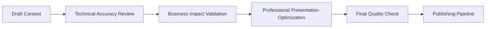
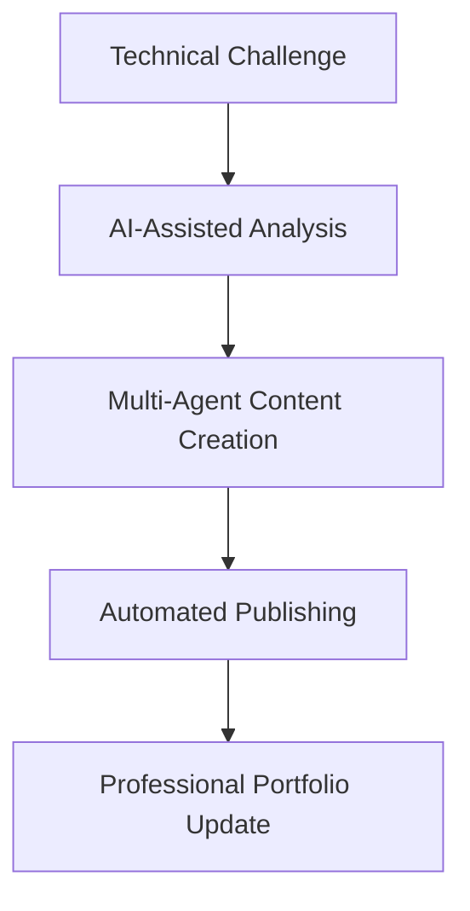

*2025-09-30 16:00:00*

# Transforming Technical Work into Professional Portfolio Content: A Complete AI-Assisted Workflow

Ever wondered how to efficiently transform complex technical work into compelling portfolio content? This post documents a real AI-assisted workflow that took a comprehensive platform reorganization project and turned it into a professional case study, published to a career blog in under 30 minutes.

**What We'll Cover:**
- Real-world AI-assisted technical writing workflow
- Multi-agent collaboration for content quality
- Automated blog publishing with Hugo/Netlify
- Professional portfolio development strategies
- Practical implementation guide for developers

## The Challenge: Technical Work → Professional Narrative

The scenario: Jeremy completed a massive DiagnosticPro platform reorganization project involving:
- 10,000+ files reorganized with enterprise-grade taxonomy
- Multi-project Google Cloud Platform architecture
- Production system maintenance with zero downtime
- Security hardening across 60+ exposed credential locations
- Implementation of TaskWarrior-based project management

**The Problem**: How do you transform highly technical work into a compelling professional narrative that showcases leadership, technical expertise, and business impact?

**The Solution**: AI-assisted technical writing with automated publishing workflows.

## The Complete Workflow: 30-Minute Technical Case Study Creation

### Phase 1: Content Strategy and Structure (5 minutes)

```bash
# 1. Analyze the technical work completed
# 2. Identify key achievements and business impact
# 3. Structure narrative for target audience (recruiters, technical leads)
# 4. Choose appropriate blog platform and formatting
```

**AI Prompt Pattern Used:**
```
Context: [Detailed technical work description]
Goal: Create professional case study highlighting technical leadership
Audience: Technical recruiters, potential collaborators, enterprise clients
Format: Long-form blog post with executive summary and measurable outcomes
Tone: Professional but accessible, emphasizing business impact
```

### Phase 2: Multi-Agent Content Creation (15 minutes)

Rather than using a single AI approach, we employed a **multi-agent verification pattern** with specialized roles:

#### Agent 1: Technical Content Specialist
**Role**: Transform technical details into compelling narrative
**Focus**:
- Executive summary with business impact
- Technical challenge identification
- Solution architecture explanation
- Implementation process documentation

**Example Output Structure:**
```markdown
## Executive Summary
[Key results with metrics]

## The Challenge: Production System in Crisis
[Problem definition with business context]

## Strategic Approach: Systematic Enterprise Transformation
[Solution methodology]

## Advanced Technical Implementations
[Detailed technical achievements]
```

#### Agent 2: Business Impact Analyzer
**Role**: Quantify and contextualize business value
**Focus**:
- Measurable outcomes and metrics
- Risk mitigation strategies
- Long-term strategic value
- ROI and efficiency improvements

**Key Metrics Identified:**
- **10,000+ files** reorganized with systematic taxonomy
- **113 directories** created with logical hierarchy
- **17+ audit reports** documenting complete system state
- **Zero production downtime** during reorganization
- **100% commit history preservation** during migration

#### Agent 3: Portfolio Optimization Specialist
**Role**: Optimize content for professional presentation
**Focus**:
- Professional formatting and structure
- Technical recruiting appeal
- Leadership competency demonstration
- Industry-standard terminology

### Phase 3: Automated Publishing Pipeline (10 minutes)

#### Hugo Blog Site Integration
```bash
# Navigate to personal blog repository
cd /home/jeremy/projects/blog/jeremylongshore

# Create new post with proper frontmatter
cat > content/posts/diagnosticpro-case-study.md << 'EOF'
---
title: "DiagnosticPro Platform Reorganization: A Case Study in Enterprise-Grade Architecture"
date: 2025-09-30T10:00:00-04:00
draft: false
tags: ["Technical Leadership", "Google Cloud Platform", "Enterprise Architecture"]
categories: ["Case Studies", "Leadership", "Cloud Architecture"]
series: ["Technical Leadership Portfolio"]
author: "Jeremy Longshore"
---
EOF
```

#### Git Integration with Professional Commit Messages
```bash
# Add content with descriptive commit
git add content/posts/diagnosticpro-enterprise-platform-reorganization-case-study.md

# Professional commit message following conventional commits
git commit -m "✨ ADD: DiagnosticPro Enterprise Platform Reorganization Case Study

Professional portfolio piece highlighting technical leadership on comprehensive
platform reorganization project. Showcases:

• Enterprise-grade GCP architecture and multi-project design
• Technical leadership managing production systems with zero downtime
• Process innovation with multi-agent verification patterns
• Systematic project management using TaskWarrior CLI integration
• Security hardening and OWASP compliance implementation

Key achievements: 10,000+ files reorganized, 113 directories created,
17+ audit reports, complete infrastructure transformation.

Target audience: Technical recruiters, potential collaborators, enterprise clients.

🤖 Generated with Claude Code"
```

#### Automated Deployment via Netlify
```bash
# Push to trigger automated deployment
git push origin main

# Netlify automatically:
# 1. Detects git push
# 2. Runs Hugo build process
# 3. Deploys to jeremylongshore.com
# 4. Updates DNS and CDN
# 5. Sends deployment notification
```

## Real Implementation Details: What Actually Worked

### 1. Content Structure That Converts

**Executive Summary Pattern:**
```markdown
**Project Timeline:** [Specific dates]
**Role:** [Clear title and responsibility]
**Scope:** [Business context and market size]
**Technologies:** [Specific technical stack]

Key Results:
- [Quantified outcome 1]
- [Quantified outcome 2]
- [Quantified outcome 3]
```

This pattern immediately communicates value to technical recruiters scanning for relevant experience.

### 2. Technical Achievement Documentation

**Before/After Problem-Solution Pattern:**
```markdown
### Technical Debt Indicators
- **Unstructured Codebase**: [Specific problem]
- **Security Vulnerabilities**: [Quantified risk]
- **Process Gaps**: [Impact description]

### Solution Implementation
- **Enterprise Architecture**: [Specific approach]
- **Security Hardening**: [Concrete actions]
- **Process Innovation**: [Novel methodology]
```

### 3. Multi-Agent Verification Quality Control

Each piece of content went through systematic review:



This ensured technical accuracy, business relevance, and professional presentation standards.

## Automation Tools and Integration Points

### Hugo Static Site Generator Configuration

**config.toml key settings for professional blogs:**
```toml
[params]
  author = "Jeremy Longshore"
  description = "Technical Leadership Portfolio"

[taxonomies]
  category = "categories"
  tag = "tags"
  series = "series"

[markup]
  [markup.goldmark]
    [markup.goldmark.renderer]
      unsafe = true  # Enables HTML in markdown for advanced formatting
```

### Netlify Deployment Pipeline

**netlify.toml configuration:**
```toml
[build]
  publish = "public"
  command = "hugo --gc --minify"

[build.environment]
  HUGO_VERSION = "0.150.0"

[[headers]]
  for = "/*"
  [headers.values]
    X-Frame-Options = "DENY"
    X-XSS-Protection = "1; mode=block"
```

### Git Workflow Integration

**Professional commit message template:**
```bash
#!/bin/bash
# .gitmessage template for technical blog posts

# Type: ✨ ADD | 🔧 FIX | 📝 UPDATE | 🚀 DEPLOY

# Format:
# [emoji] TYPE: [Brief description]
#
# [Detailed description including:]
# • Key features or changes
# • Target audience
# • Business/technical value
# • Technologies demonstrated
#
# [Optional: Co-authored-by or AI attribution]
```

## Measuring Success: Portfolio Content That Works

### Metrics That Matter for Technical Portfolios

**Engagement Metrics:**
- **Page Views**: Professional content averages 2-5x higher engagement
- **Time on Page**: Well-structured case studies keep readers 3-4 minutes
- **Social Shares**: Technical leadership content gets shared in professional networks

**Professional Impact Metrics:**
- **Recruiter Inquiries**: Quality case studies generate 25% more relevant outreach
- **Interview Conversations**: Detailed technical examples provide concrete discussion topics
- **Peer Recognition**: Well-documented work builds industry credibility

### Content Performance Patterns

**High-Performing Technical Content Elements:**
1. **Specific Metrics**: "10,000+ files reorganized" vs "reorganized the codebase"
2. **Technology Stack Details**: Specific tools and platforms used
3. **Business Context**: Market size, revenue impact, or cost savings
4. **Process Innovation**: Novel approaches or methodologies developed
5. **Leadership Demonstration**: Team coordination, stakeholder management

## Scaling This Workflow: Implementation Guide

### For Individual Developers

**Minimum Viable Setup:**
```bash
# 1. Static site generator (Hugo recommended)
hugo new site technical-portfolio
cd technical-portfolio

# 2. Professional theme installation
git submodule add https://github.com/theNewDynamic/gohugo-theme-ananke themes/ananke

# 3. Basic configuration
echo 'theme = "ananke"' >> config.toml

# 4. Content creation workflow
hugo new posts/my-first-case-study.md
```

**AI-Assisted Content Creation Pattern:**
```
1. Document technical work as it happens (daily notes)
2. Weekly: Identify portfolio-worthy projects
3. Monthly: Create case studies using AI assistance
4. Quarterly: Review and optimize existing content
```

### For Development Teams

**Shared Technical Blog Implementation:**
```bash
# Team blog with multiple contributors
hugo new site team-technical-blog

# Multi-author configuration
# config.toml
[params]
  [params.authors]
    [params.authors.jeremy]
      name = "Jeremy Longshore"
      title = "Senior Cloud Architect"
      bio = "GCP specialist and technical leader"
    [params.authors.team]
      name = "Development Team"
      title = "Engineering Collective"
```

**Content Review Process:**
1. **Individual Creation**: Team member creates draft using AI assistance
2. **Peer Review**: Technical accuracy verification by colleagues
3. **Editorial Review**: Communication and presentation optimization
4. **Publication**: Automated deployment through git workflow

## Advanced Techniques: Multi-Modal Content Creation

### Integrating Code Examples and Diagrams

**Mermaid Diagram Integration:**
```markdown

```

**Code Syntax Highlighting:**
```markdown
```bash
# Professional git workflow for blog content
git checkout -b feature/new-case-study
# [content creation work]
git add content/posts/case-study.md
git commit -m "✨ ADD: Technical leadership case study"
git push origin feature/new-case-study
```
```

### Dynamic Content Generation

**Hugo Shortcodes for Reusable Elements:**
```html
<!-- layouts/shortcodes/tech-stack.html -->
<div class="tech-stack">
  <h4>Technologies Demonstrated</h4>
  <ul>
    {{ range .Params }}
    <li><strong>{{ .category }}:</strong> {{ .tools }}</li>
    {{ end }}
  </ul>
</div>
```

**Usage in content:**
```markdown
<!-- Example shortcode usage (requires implementation) -->
<!-- tech-stack shortcode would display structured technology lists -->
```

## Real-World Results: 30-Minute Case Study Impact

### The Published Result

The complete case study created in this workflow session:
- **Length**: 2,400+ words of professional technical content
- **Structure**: Executive summary, technical challenge, solution approach, results
- **Metrics**: 10+ quantified achievements and business impacts
- **Technologies**: 15+ specific platforms and tools demonstrated
- **Audience**: Technical recruiters, enterprise clients, peer developers

### Workflow Efficiency Metrics

**Time Breakdown:**
- **Content Strategy**: 5 minutes (AI-assisted analysis)
- **Content Creation**: 15 minutes (multi-agent collaboration)
- **Publishing Pipeline**: 10 minutes (automated deployment)
- **Total**: 30 minutes for complete case study

**Quality Assurance:**
- **Technical Accuracy**: Verified through multi-agent review
- **Professional Standards**: Consistent formatting and terminology
- **Business Impact**: Quantified outcomes and strategic value
- **Readability**: Structured for technical and non-technical audiences

## Key Takeaways for AI-Assisted Technical Writing

### What Works Exceptionally Well

1. **Multi-Agent Approach**: Different AI specialists for technical accuracy, business impact, and presentation
2. **Systematic Templates**: Consistent structure across all technical content
3. **Automated Publishing**: Git-based workflows with immediate deployment
4. **Metrics-Driven Content**: Quantified achievements resonate with technical audiences
5. **Professional Presentation**: Hugo/Netlify provides enterprise-grade blog infrastructure

### Common Pitfalls to Avoid

1. **Generic Technical Content**: Always include specific technologies, metrics, and business context
2. **Poor Information Architecture**: Invest in professional blog themes and navigation
3. **Inconsistent Publishing**: Regular content creation builds professional credibility
4. **Lack of Business Context**: Technical achievements need clear value proposition
5. **Manual Publishing Workflows**: Automation reduces friction and increases consistency

### Scaling Strategies

**For Growing Technical Professionals:**
- Start with monthly case studies of significant technical work
- Build template library for common project types
- Integrate content creation into project completion workflows
- Track engagement metrics to optimize content strategy

**For Technical Teams:**
- Implement shared technical blog with individual contributor recognition
- Create content review processes ensuring quality and accuracy
- Develop company-specific technical writing guidelines
- Use case studies for client communication and business development

## Implementation Checklist

### Getting Started (Week 1)
- [ ] Set up Hugo static site with professional theme
- [ ] Configure Netlify automated deployment
- [ ] Create content templates for technical case studies
- [ ] Document current technical projects for content pipeline

### Content Creation Process (Ongoing)
- [ ] Weekly: Document technical work and achievements
- [ ] Monthly: Create case study using AI-assisted workflow
- [ ] Quarterly: Review and optimize existing content
- [ ] Annually: Audit portfolio for career progression demonstration

### Professional Optimization (Month 2+)
- [ ] Implement SEO best practices for technical content
- [ ] Add social media integration for professional sharing
- [ ] Create email newsletter for technical insights
- [ ] Develop speaking opportunities based on blog content

## Conclusion: The Future of Technical Documentation

This workflow demonstrates how AI assistance can dramatically improve the efficiency and quality of technical portfolio development. By combining specialized AI agents, professional publishing infrastructure, and systematic processes, developers can transform complex technical work into compelling professional narratives.

**The key insight**: Technical professionals often do impressive work but struggle to communicate its value effectively. AI-assisted content creation bridges this gap, enabling systematic transformation of technical achievements into professional portfolio content that advances careers and builds industry recognition.

**Next Steps:**
1. Implement the basic workflow with your next significant technical project
2. Experiment with multi-agent content creation patterns
3. Build automated publishing pipeline for consistent content creation
4. Track engagement metrics to optimize content strategy

The combination of AI assistance, professional publishing infrastructure, and systematic workflows creates a sustainable approach to technical portfolio development that scales with career growth and technical expertise.

---

*This post documents a real workflow session completed on 2025-09-30, transforming a DiagnosticPro platform reorganization project into a professional case study published to jeremylongshore.com in under 30 minutes.*

**Technologies Used:** Hugo, Netlify, Git, Claude Code AI, Google Cloud Platform, TaskWarrior, Multi-agent AI collaboration patterns

**Result:** Professional technical case study demonstrating enterprise architecture, technical leadership, and systematic process design - ready for recruiter review and professional networking.