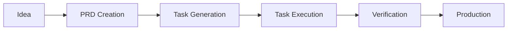

# AI-Assisted Development: From PRD to Production

Modern AI assistants like Claude can dramatically accelerate development, but only with the right workflow. This guide presents a battle-tested system that transforms vague ideas into production code through structured, verifiable steps.

## The Core Workflow



## Step 1: Product Requirements Document (PRD)

### What Makes a Good PRD?

A PRD transforms ideas into specifications. Key components:

1. **Problem Statement**: What are we solving?
2. **User Stories**: Who benefits and how?
3. **Technical Requirements**: Constraints and dependencies
4. **Success Criteria**: How do we measure completion?

### Using AI for PRD Creation

```markdown
Use @ai-dev-tasks-master/create-prd.md

Feature: User authentication system with OAuth
Requirements:
- Support Google and GitHub OAuth
- Session management with JWT
- Role-based access control
- Password reset flow
```

### PRD Template Structure

```yaml
---
title: "Feature Name"
version: 1.0
date: 2025-09-14
status: draft
---

## Executive Summary
Brief description of the feature

## Problem Statement
What problem does this solve?

## User Stories
- As a [user type], I want [feature] so that [benefit]

## Technical Requirements
### Must Have
- Core functionality

### Nice to Have
- Additional features

## Success Criteria
- [ ] Measurable outcome 1
- [ ] Measurable outcome 2

## Timeline
- Design: 2 days
- Implementation: 5 days
- Testing: 2 days
```

## Step 2: Task Generation

### Breaking Down the PRD

Once your PRD is complete, generate granular tasks:

```markdown
Use @ai-dev-tasks-master/generate-tasks.md
Reference: @tasks/prd-authentication.md
```

### Task Hierarchy

Good task lists follow this structure:

```
1. Setup & Configuration
   1.1 Initialize project structure
   1.2 Install dependencies
   1.3 Configure environment variables

2. Core Implementation
   2.1 Create database schema
   2.2 Implement authentication logic
   2.3 Build API endpoints

3. Testing & Verification
   3.1 Write unit tests
   3.2 Integration testing
   3.3 Security audit

4. Documentation & Deployment
   4.1 API documentation
   4.2 Deployment configuration
   4.3 Production checklist
```

### Task Sizing Guidelines

- **Atomic**: Each task should be completable in one session
- **Verifiable**: Clear completion criteria
- **Independent**: Minimize inter-task dependencies
- **Estimated**: Include time estimates

## Step 3: Systematic Execution

### The Task Processing Loop

```markdown
Use @ai-dev-tasks-master/process-task-list.md
Start with task 1.1
```

The AI will:
1. Complete the task
2. Show you the result
3. Wait for verification
4. Mark complete and proceed

### Verification Checkpoints

After each task, verify:
- ✅ Code compiles/runs
- ✅ Tests pass
- ✅ No regressions
- ✅ Follows project standards

### Handling Blockers

When stuck:
1. **Provide context**: Share error messages completely
2. **Clarify requirements**: Ambiguity causes issues
3. **Break down further**: Complex tasks need subdivision
4. **Skip and return**: Some tasks have dependencies

## Real-World Example: API Development

### Initial Request
"Build a REST API for user management"

### Generated PRD (excerpt)
```markdown
## Technical Requirements
- RESTful endpoints for CRUD operations
- PostgreSQL database with migrations
- JWT authentication
- Rate limiting
- OpenAPI documentation
```

### Generated Tasks (excerpt)
```
1. Database Setup
   1.1 Create PostgreSQL schema
   1.2 Write migration scripts
   1.3 Set up connection pooling

2. API Implementation
   2.1 Create Express server
   2.2 Implement /users endpoints
   2.3 Add authentication middleware
   2.4 Implement rate limiting

3. Testing Suite
   3.1 Unit tests for models
   3.2 Integration tests for endpoints
   3.3 Load testing setup
```

### Execution Timeline
- **PRD Creation**: 15 minutes
- **Task Generation**: 5 minutes
- **Implementation**: 2 hours
- **Testing**: 30 minutes
- **Total**: ~3 hours (vs. 8+ hours manual)

## Advanced Patterns

### Database-Driven Development

For database-heavy features:

```markdown
Use @ai-dev-tasks-master/setup-postgres-mcp.md
Reference: @tasks/prd-feature.md
```

This assesses if you need:
- Schema design assistance
- Migration generation
- Query optimization
- Connection management

### Multi-Agent Collaboration

Complex features benefit from specialized agents:

```markdown
# Frontend specialist
Use Task with ui-developer agent
Create React components for user dashboard

# Backend specialist
Use Task with backend-architect agent
Design API architecture for dashboard data

# Database specialist
Use Task with database-optimizer agent
Optimize queries for dashboard metrics
```

### Continuous Integration

Integrate with CI/CD:

```yaml
# .github/workflows/ai-tasks.yml
on:
  pull_request:
    types: [opened]

jobs:
  generate-tasks:
    steps:
      - name: Generate task list from PR description
      - name: Comment tasks on PR
      - name: Create project board items
```

## Quality Assurance

### Pre-Implementation Checklist

- [ ] PRD reviewed and approved
- [ ] Task list covers all requirements
- [ ] Dependencies identified
- [ ] Test criteria defined
- [ ] Documentation planned

### Post-Implementation Verification

- [ ] All tasks marked complete
- [ ] Tests passing
- [ ] Documentation updated
- [ ] Code reviewed
- [ ] Performance acceptable

## Common Pitfalls & Solutions

### Pitfall 1: Vague Requirements
**Problem**: "Build a dashboard"
**Solution**: Specify metrics, update frequency, user roles

### Pitfall 2: Giant Tasks
**Problem**: "Implement authentication system"
**Solution**: Break into setup, implementation, testing phases

### Pitfall 3: Missing Context
**Problem**: AI doesn't understand project structure
**Solution**: Create comprehensive CLAUDE.md files

### Pitfall 4: Skipping Verification
**Problem**: Assuming AI output is correct
**Solution**: Test after every task completion

## Metrics & Improvements

### Tracking Success

Monitor these metrics:
- **Task completion rate**: Target >90%
- **Rework rate**: Target <10%
- **Time saved**: Compare to manual estimates
- **Bug density**: Bugs per feature

### Continuous Improvement

1. **Refine templates**: Update based on project needs
2. **Document patterns**: Capture successful approaches
3. **Share learnings**: Team knowledge base
4. **Iterate process**: Regular retrospectives

## Integration with Tools

### VS Code / Cursor
```json
{
  "ai.templates": "./ai-dev-tasks-master/",
  "ai.defaultPRDPath": "./tasks/",
  "ai.autoVerify": true
}
```

### Git Workflow
```bash
# Feature branch per PRD
git checkout -b feature/prd-authentication

# Commit per task completion
git commit -m "feat: Complete task 2.1 - Create database schema"

# PR includes task checklist
```

### Project Management
- **Linear/Jira**: Auto-create issues from tasks
- **GitHub Projects**: Task list as project board
- **Notion**: PRD database with status tracking

## Advanced Techniques

### Parallel Task Execution

For independent tasks:
```markdown
Execute tasks 2.1, 2.2, and 2.3 in parallel
Use multiple terminal sessions
```

### Task Templates

Create reusable patterns:
```markdown
Template: API Endpoint
1. Define route
2. Create controller
3. Add validation
4. Write tests
5. Document endpoint
```

### Learning Loop

After each project:
1. Review what worked
2. Update templates
3. Document edge cases
4. Share with team

## Related Resources

- [Developer Workspace Organization](/docs/architecture/developer-workspace-organization)
- [Git Workflow Best Practices](/docs/security/git-workflow)
- [Testing Strategies](/docs/architecture/testing-strategies)
- [Documentation Standards](/docs/architecture/documentation-standards)

## Conclusion

AI-assisted development isn't about replacing developers—it's about amplifying their capabilities. The PRD-to-production workflow provides structure that helps AI assistants deliver consistent, high-quality results.

Key takeaways:
- **Structure enables speed**: Templates guide AI effectively
- **Verification ensures quality**: Never skip the checks
- **Iteration improves results**: Refine your process continuously

Start with your next feature request. Create a PRD, generate tasks, and experience 3-10x productivity gains.

---

*Part of our [AI Development](/learning/) series. See also: [Prompt Engineering Patterns](/docs/ai-ml/prompt-engineering) and [AI Tool Selection Guide](/library/ai-tools-comparison).*