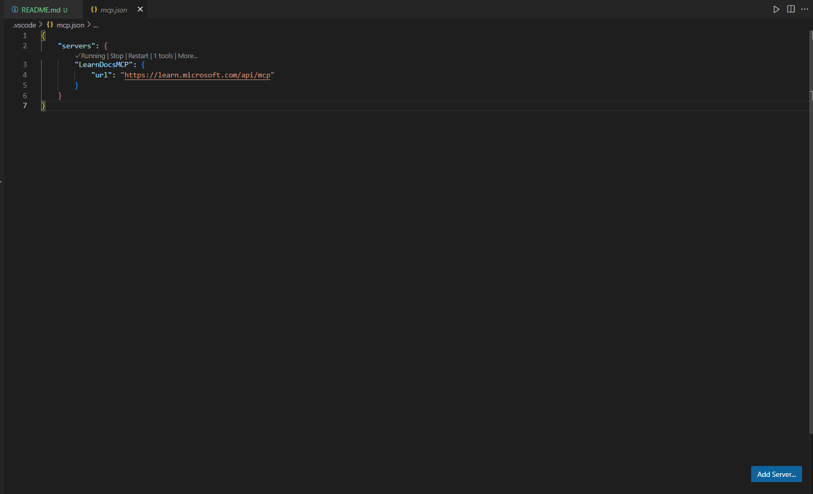
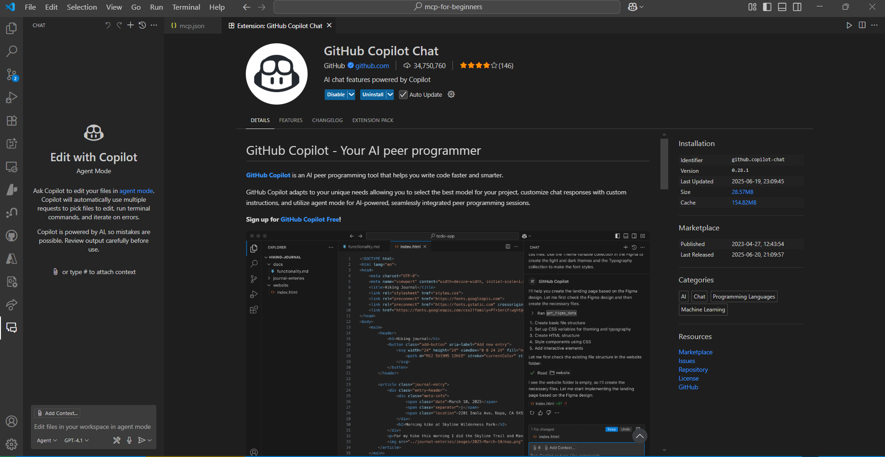
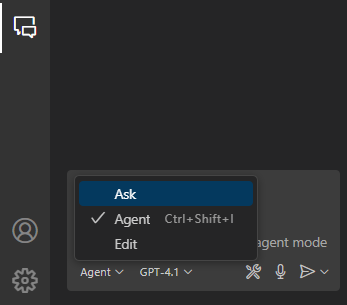
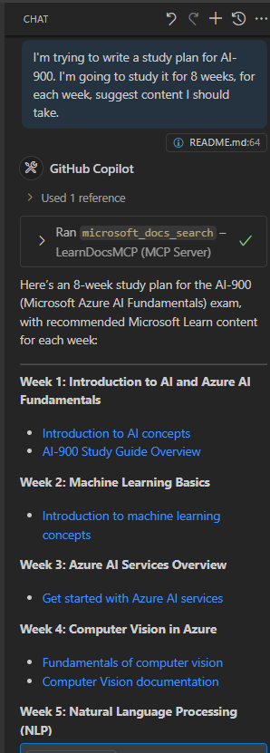

# Scenario 3: In-Editor Docs with MCP Server in VS Code

## Overview

In this scenario, you will learn how to bring Microsoft Learn Docs directly into your Visual Studio Code environment using the MCP server. Instead of constantly switching browser tabs to search for documentation, you can access, search, and reference official docs right inside your editor. This approach streamlines your workflow, keeps you focused, and enables seamless integration with tools like GitHub Copilot.

- Search and read docs inside VS Code without leaving your coding environment.
- Reference documentation and insert links directly into your README or course files.
- Use GitHub Copilot and MCP together for a seamless, AI-powered documentation workflow.

## Learning Objectives

By the end of this chapter, you will understand how to set up and use the MCP server within VS Code to enhance your documentation and development workflow. You will be able to:

- Configure your workspace to use the MCP server for documentation lookup.
- Search and insert documentation directly from within VS Code.
- Combine the power of GitHub Copilot and MCP for a more productive, AI-augmented workflow.

These skills will help you stay focused, improve documentation quality, and boost your productivity as a developer or technical writer.

## Solution

To achieve in-editor documentation access, you will follow a series of steps that integrate the MCP server with VS Code and GitHub Copilot. This solution is ideal for course authors, documentation writers, and developers who want to keep their focus in the editor while working with docs and Copilot.

- Quickly add reference links to a README while writing a course or project documentation.
- Use Copilot to generate code and MCP to instantly find and cite relevant docs.
- Stay focused in your editor and boost productivity.

### Step-by-Step Guide

To get started, follow these steps. For each step, you can add a screenshot from the assets folder to visually illustrate the process.

1. **Add the MCP configuration:**
   In your project root, create a `.vscode/mcp.json` file and add the following configuration:
   ```json
   {
     "servers": {
       "LearnDocsMCP": {
         "url": "https://learn.microsoft.com/api/mcp"
       }
     }
   }
   ```
   This configuration tells VS Code how to connect to the [`Microsoft Learn Docs MCP server`](https://github.com/MicrosoftDocs/mcp).
   
   
    
2. **Open the GitHub Copilot Chat panel:**
   If you do not already have the GitHub Copilot extension installed, go to the Extensions view in VS Code and install it. You can download it directly from the [Visual Studio Code Marketplace](https://marketplace.visualstudio.com/items?itemName=GitHub.copilot-chat). Then, open the Copilot Chat panel from the sidebar.

   

3. **Enable agent mode and verify tools:**
   In the Copilot Chat panel, enable agent mode.

   

   After enabling agent mode, verify that the MCP server is listed as one of the available tools. This ensures that the Copilot agent can access the documentation server to fetch relevant information.
   
   
4. **Start a new chat and prompt the agent:**
   Open a new chat in the Copilot Chat panel. You can now prompt the agent with your documentation queries. The agent will use the MCP server to fetch and display relevant Microsoft Learn documentation directly in your editor.

   - *"I'm trying to write a study plan for topic X. I'm going to study it for 8 weeks, for each week, suggest content I should take."*

   

5. **Live Query:**

   > Let's take a live query from the [#get-help](https://discord.gg/D6cRhjHWSC) section in Azure AI Foundry Discord ([view original message](https://discord.com/channels/1113626258182504448/1385498306720829572)):
   
   *"I am seeking answers on how to deploy a multi-agent solution with AI agents developed on the Azure AI Foundry. I see that there is no direct deployment method, such as Copilot Studio channels. So, what are the different ways to do this deployment for enterprise users to interact and get the job done?
There are numerous articles/blogs available who says we can use Azure Bot service to do this job which can act as a bridge between MS teams and Azure AI Foundry Agents, well is this going to work if I setup an Azure bot which connects to the Orchestrator Agent on Azure AI foundry via Azure function to perform the orchestration or I need to create Azure function for each of the AI agents part of multi agent solution to do the orchestration at the Bot framework? Any other suggestions are most welcome.
"*

   

   The agent will respond with relevant documentation links and summaries, which you can then insert directly into your markdown files or use as references in your code.
   
### Sample Queries

Here are some example queries you can try. These queries will demonstrate how the MCP server and Copilot can work together to provide instant, context-aware documentation and references without leaving VS Code:

- "Show me how to use Azure Functions triggers."
- "Insert a link to the official documentation for Azure Key Vault."
- "What are the best practices for securing Azure resources?"
- "Find a quickstart for Azure AI services."

These queries will demonstrate how the MCP server and Copilot can work together to provide instant, context-aware documentation and references without leaving VS Code.

---
