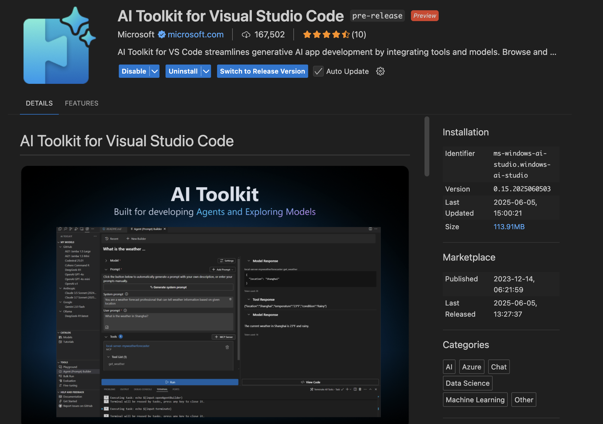
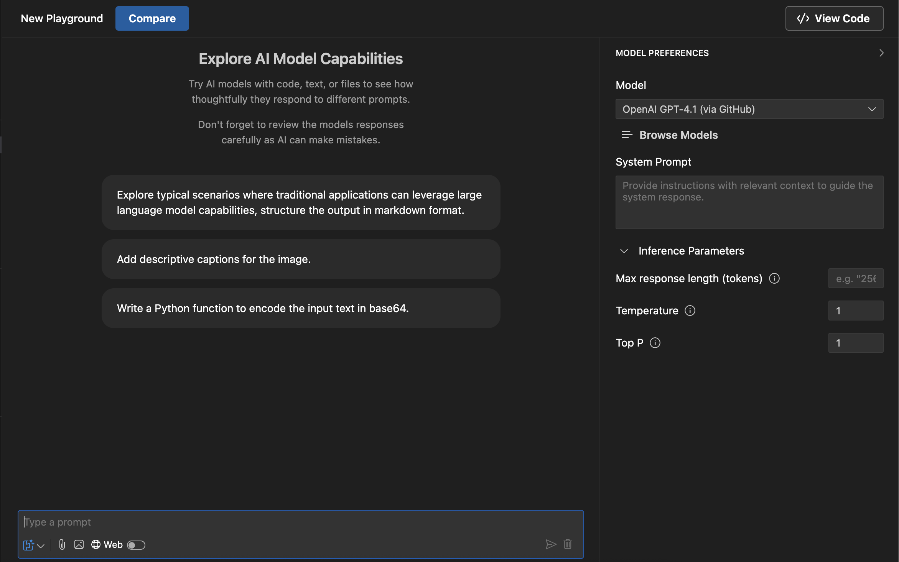
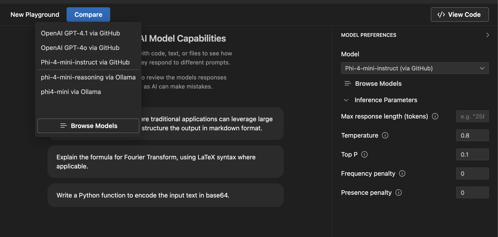
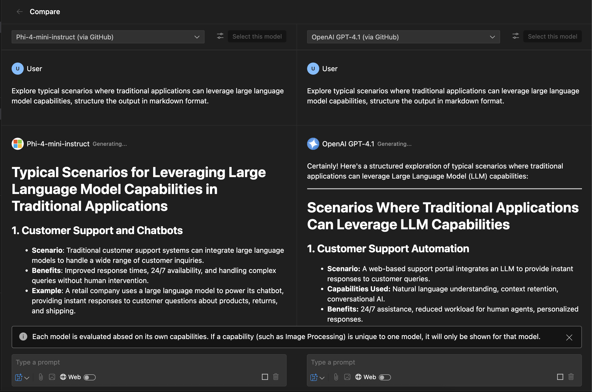

# 🚀 Module 1: AI Toolkit Fundamentals

[]()
[]()
[]()

## 📋 Learning Objectives

By the end of this module, you will be able to:
- ✅ Install and configure AI Toolkit for Visual Studio Code
- ✅ Navigate the Model Catalog and understand different model sources
- ✅ Use the Playground for model testing and experimentation
- ✅ Create custom AI agents using Agent Builder
- ✅ Compare model performance across different providers
- ✅ Apply best practices for prompt engineering

## 🧠 Introduction to AI Toolkit (AITK)

The **AI Toolkit for Visual Studio Code** is Microsoft's flagship extension that transforms VS Code into a comprehensive AI development environment. It bridges the gap between AI research and practical application development, making generative AI accessible to developers of all skill levels.

### 🌟 Key Capabilities

| Feature | Description | Use Case |
|---------|-------------|----------|
| **🗂️ Model Catalog** | Access 100+ models from GitHub, ONNX, OpenAI, Anthropic, Google | Model discovery and selection |
| **🔌 BYOM Support** | Integrate your own models (local/remote) | Custom model deployment |
| **🎮 Interactive Playground** | Real-time model testing with chat interface | Rapid prototyping and testing |
| **📎 Multi-Modal Support** | Handle text, images, and attachments | Complex AI applications |
| **⚡ Batch Processing** | Run multiple prompts simultaneously | Efficient testing workflows |
| **📊 Model Evaluation** | Built-in metrics (F1, relevance, similarity, coherence) | Performance assessment |

### 🎯 Why AI Toolkit Matters

- **🚀 Accelerated Development**: From idea to prototype in minutes
- **🔄 Unified Workflow**: One interface for multiple AI providers
- **🧪 Easy Experimentation**: Compare models without complex setup
- **📈 Production Ready**: Seamless transition from prototype to deployment

## 🛠️ Prerequisites & Setup

### 📦 Install AI Toolkit Extension

**Step 1: Access Extensions Marketplace**
1. Open Visual Studio Code
2. Navigate to the Extensions view (`Ctrl+Shift+X` or `Cmd+Shift+X`)
3. Search for "AI Toolkit"

**Step 2: Choose Your Version**
- **🟢 Release**: Recommended for production use
- **🔶 Pre-release**: Early access to cutting-edge features

**Step 3: Install and Activate**



### ✅ Verification Checklist
- [ ] AI Toolkit icon appears in the VS Code sidebar
- [ ] Extension is enabled and activated
- [ ] No installation errors in the output panel

## 🧪 Hands-on Exercise 1: Exploring GitHub Models

**🎯 Objective**: Master the Model Catalog and test your first AI model

### 📊 Step 1: Navigate the Model Catalog

The Model Catalog is your gateway to the AI ecosystem. It aggregates models from multiple providers, making it easy to discover and compare options.

**🔍 Navigation Guide:**

Click on **MODELS - Catalog** in the AI Toolkit sidebar


**💡 Pro Tip**: Look for models with specific capabilities that match your use case (e.g., code generation, creative writing, analysis).

**⚠️ Note**: GitHub-hosted models (i.e. GitHub Models) are free to use but are subject to rate limits on requests and tokens. If you want to access non-GitHub models (that is, external models hosted via Azure AI or other endpoints), you'll need to supply the appropriate API key or authentication.

### 🚀 Step 2: Add and Configure Your First Model

**Model Selection Strategy:**
- **GPT-4.1**: Best for complex reasoning and analysis
- **Phi-4-mini**: Lightweight, fast responses for simple tasks

**🔧 Configuration Process:**
1. Select **OpenAI GPT-4.1** from the catalog
2. Click **Add to My Models** - this registers the model for use
3. Choose **Try in Playground** to launch the testing environment
4. Wait for model initialization (first-time setup may take a moment)



**⚙️ Understanding Model Parameters:**
- **Temperature**: Controls creativity (0 = deterministic, 1 = creative)
- **Max Tokens**: Maximum response length
- **Top-p**: Nucleus sampling for response diversity

### 🎯 Step 3: Master the Playground Interface

The Playground is your AI experimentation lab. Here's how to maximize its potential:

**🎨 Prompt Engineering Best Practices:**
1. **Be Specific**: Clear, detailed instructions yield better results
2. **Provide Context**: Include relevant background information
3. **Use Examples**: Show the model what you want with examples
4. **Iterate**: Refine prompts based on initial results

**🧪 Testing Scenarios:**
```markdown
# Example 1: Code Generation
"Write a Python function that calculates the factorial of a number using recursion. Include error handling and docstrings."

# Example 2: Creative Writing
"Write a professional email to a client explaining a project delay, maintaining a positive tone while being transparent about challenges."

# Example 3: Data Analysis
"Analyze this sales data and provide insights: [paste your data]. Focus on trends, anomalies, and actionable recommendations."
```


### 🏆 Challenge Exercise: Model Performance Comparison

**🎯 Goal**: Compare different models using identical prompts to understand their strengths

**📋 Instructions:**
1. Add **Phi-4-mini** to your workspace
2. Use the same prompt for both GPT-4.1 and Phi-4-mini



3. Compare response quality, speed, and accuracy
4. Document your findings in the results section



**💡 Key Insights to Discover:**
- When to use LLM vs SLM
- Cost vs. performance trade-offs
- Specialized capabilities of different models

## 🤖 Hands-on Exercise 2: Building Custom Agents with Agent Builder

**🎯 Objective**: Create specialized AI agents tailored for specific tasks and workflows

### 🏗️ Step 1: Understanding Agent Builder

Agent Builder is where AI Toolkit truly shines. It allows you to create purpose-built AI assistants that combine the power of large language models with custom instructions, specific parameters, and specialized knowledge.

**🧠 Agent Architecture Components:**
- **Core Model**: The foundation LLM (GPT-4, Groks, Phi, etc.)
- **System Prompt**: Defines agent personality and behavior
- **Parameters**: Fine-tuned settings for optimal performance
- **Tools Integration**: Connect to external APIs and MCP services
- **Memory**: Conversation context and session persistence


### ⚙️ Step 2: Agent Configuration Deep Dive

**🎨 Creating Effective System Prompts:**
```markdown
# Template Structure:
## Role Definition
You are a [specific role] with expertise in [domain].

## Capabilities
- List specific abilities
- Define scope of knowledge
- Clarify limitations

## Behavior Guidelines
- Response style (formal, casual, technical)
- Output format preferences
- Error handling approach

## Examples
Provide 2-3 examples of ideal interactions
```

*Of course, you can also use Generate System Prompt to use AI to help you generate and optimize prompts*

**🔧 Parameter Optimization:**
| Parameter | Recommended Range | Use Case |
|-----------|------------------|----------|
| **Temperature** | 0.1-0.3 | Technical/factual responses |
| **Temperature** | 0.7-0.9 | Creative/brainstorming tasks |
| **Max Tokens** | 500-1000 | Concise responses |
| **Max Tokens** | 2000-4000 | Detailed explanations |

### 🐍 Step 3: Practical Exercise - Python Programming Agent

**🎯 Mission**: Create a specialized Python coding assistant

**📋 Configuration Steps:**

1. **Model Selection**: Choose **Claude 3.5 Sonnet** (excellent for code)

2. **System Prompt Design**:
```markdown
# Python Programming Expert Agent

## Role
You are a senior Python developer with 10+ years of experience. You excel at writing clean, efficient, and well-documented Python code.

## Capabilities
- Write production-ready Python code
- Debug complex issues
- Explain code concepts clearly
- Suggest best practices and optimizations
- Provide complete working examples

## Response Format
- Always include docstrings
- Add inline comments for complex logic
- Suggest testing approaches
- Mention relevant libraries when applicable

## Code Quality Standards
- Follow PEP 8 style guidelines
- Use type hints where appropriate
- Handle exceptions gracefully
- Write readable, maintainable code
```

3. **Parameter Configuration**:
   - Temperature: 0.2 (for consistent, reliable code)
   - Max Tokens: 2000 (detailed explanations)
   - Top-p: 0.9 (balanced creativity)


### 🧪 Step 4: Testing Your Python Agent

**Test Scenarios:**
1. **Basic Function**: "Create a function to find prime numbers"
2. **Complex Algorithm**: "Implement a binary search tree with insert, delete, and search methods"
3. **Real-world Problem**: "Build a web scraper that handles rate limiting and retries"
4. **Debugging**: "Fix this code [paste buggy code]"

**🏆 Success Criteria:**
- ✅ Code runs without errors
- ✅ Includes proper documentation
- ✅ Follows Python best practices
- ✅ Provides clear explanations
- ✅ Suggests improvements

## 🎓 Module 1 Wrap-Up & Next Steps

### 📊 Knowledge Check

Test your understanding:
- [ ] Can you explain the difference between models in the catalog?
- [ ] Have you successfully created and tested a custom agent?
- [ ] Do you understand how to optimize parameters for different use cases?
- [ ] Can you design effective system prompts?

### 📚 Additional Resources

- **AI Toolkit Documentation**: [Official Microsoft Docs](https://github.com/microsoft/vscode-ai-toolkit)
- **Prompt Engineering Guide**: [Best Practices](https://platform.openai.com/docs/guides/prompt-engineering)
- **Models in AI Toolkit**: [Models in Develpment](https://github.com/microsoft/vscode-ai-toolkit/blob/main/doc/models.md)

**🎉 Congratulations!** You've mastered the fundamentals of AI Toolkit and are ready to build more advanced AI applications!

### 🔜 Continue to Next Module

Ready for more advanced capabilities? Continue to **[Module 2: MCP with AI Toolkit Fundamentals](../lab2/README.md)** where you'll learn how to:
- Connect your agents to external tools using Model Context Protocol (MCP)
- Build browser automation agents with Playwright
- Integrate MCP servers with your AI Toolkit agents
- Supercharge your agents with external data and capabilities

