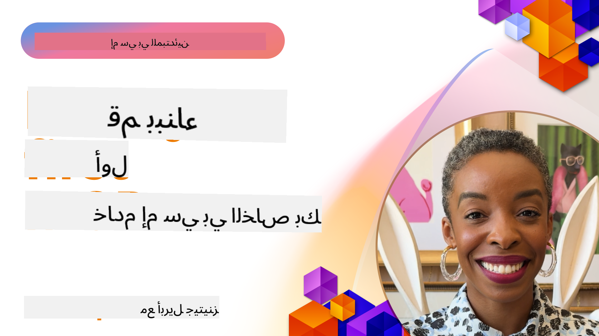

<!--
CO_OP_TRANSLATOR_METADATA:
{
  "original_hash": "f400d87053221363769113c24f117248",
  "translation_date": "2025-10-06T22:04:11+00:00",
  "source_file": "03-GettingStarted/README.md",
  "language_code": "ar"
}
-->
## البدء  

_(انقر على الصورة أعلاه لمشاهدة فيديو الدرس)_

تتكون هذه القسم من عدة دروس:

- **1 أول خادم لك**، في هذا الدرس الأول، ستتعلم كيفية إنشاء أول خادم لك واستخدام أداة الفحص لتجربته وتصحيحه، وهي طريقة قيمة لاختبار وتصحيح الخادم الخاص بك، [إلى الدرس](01-first-server/README.md)

- **2 العميل**، في هذا الدرس، ستتعلم كيفية كتابة عميل يمكنه الاتصال بالخادم الخاص بك، [إلى الدرس](02-client/README.md)

- **3 العميل مع LLM**، طريقة أفضل لكتابة عميل هي بإضافة LLM إليه ليتمكن من "التفاوض" مع الخادم الخاص بك حول ما يجب القيام به، [إلى الدرس](03-llm-client/README.md)

- **4 استهلاك خادم في وضع GitHub Copilot Agent في Visual Studio Code**. هنا، سنستعرض تشغيل خادم MCP الخاص بنا من داخل Visual Studio Code، [إلى الدرس](04-vscode/README.md)

- **5 خادم النقل عبر stdio** النقل عبر stdio هو المعيار الموصى به للتواصل بين خادم MCP والعميل في المواصفات الحالية، حيث يوفر اتصالاً آمناً يعتمد على العمليات الفرعية، [إلى الدرس](05-stdio-server/README.md)

- **6 البث عبر HTTP مع MCP (HTTP القابل للبث)**. تعرف على البث الحديث عبر HTTP، إشعارات التقدم، وكيفية تنفيذ خوادم وعملاء MCP قابلة للتوسع في الوقت الحقيقي باستخدام HTTP القابل للبث، [إلى الدرس](06-http-streaming/README.md)

- **7 استخدام أدوات الذكاء الاصطناعي لـ VSCode** لاستهلاك واختبار عملاء وخوادم MCP الخاصة بك، [إلى الدرس](07-aitk/README.md)

- **8 الاختبار**. هنا سنركز بشكل خاص على كيفية اختبار الخادم والعميل بطرق مختلفة، [إلى الدرس](08-testing/README.md)

- **9 النشر**. هذا الفصل سيستعرض طرق مختلفة لنشر حلول MCP الخاصة بك، [إلى الدرس](09-deployment/README.md)

- **10 استخدام الخادم المتقدم**. يغطي هذا الفصل استخدام الخادم المتقدم، [إلى الدرس](./10-advanced/README.md)

- **11 المصادقة**. يغطي هذا الفصل كيفية إضافة مصادقة بسيطة، من المصادقة الأساسية إلى استخدام JWT وRBAC. يُشجعك على البدء هنا ثم النظر في المواضيع المتقدمة في الفصل الخامس وإجراء تعزيز إضافي للأمان عبر التوصيات في الفصل الثاني، [إلى الدرس](./11-simple-auth/README.md)

بروتوكول سياق النموذج (MCP) هو بروتوكول مفتوح يحدد كيفية توفير التطبيقات للسياق لـ LLMs. فكر في MCP كأنه منفذ USB-C لتطبيقات الذكاء الاصطناعي - يوفر طريقة موحدة لتوصيل نماذج الذكاء الاصطناعي بمصادر البيانات والأدوات المختلفة.

## أهداف التعلم

بنهاية هذا الدرس، ستكون قادرًا على:

- إعداد بيئات التطوير لـ MCP باستخدام C#، Java، Python، TypeScript، وJavaScript
- بناء ونشر خوادم MCP الأساسية مع ميزات مخصصة (الموارد، المطالبات، والأدوات)
- إنشاء تطبيقات مضيفة تتصل بخوادم MCP
- اختبار وتصحيح تنفيذات MCP
- فهم تحديات الإعداد الشائعة وحلولها
- توصيل تنفيذات MCP الخاصة بك بخدمات LLM الشهيرة

## إعداد بيئة MCP الخاصة بك

قبل البدء في العمل مع MCP، من المهم إعداد بيئة التطوير الخاصة بك وفهم سير العمل الأساسي. ستوجهك هذه القسم خلال خطوات الإعداد الأولية لضمان بداية سلسة مع MCP.

### المتطلبات الأساسية

قبل الغوص في تطوير MCP، تأكد من توفر:

- **بيئة التطوير**: للغة التي اخترتها (C#، Java، Python، TypeScript، أو JavaScript)
- **IDE/المحرر**: Visual Studio، Visual Studio Code، IntelliJ، Eclipse، PyCharm، أو أي محرر حديث
- **مديري الحزم**: NuGet، Maven/Gradle، pip، أو npm/yarn
- **مفاتيح API**: لأي خدمات ذكاء اصطناعي تخطط لاستخدامها في تطبيقاتك المضيفة

### SDKs الرسمية

في الفصول القادمة، سترى حلولًا مبنية باستخدام Python، TypeScript، Java و.NET. هنا جميع SDKs المدعومة رسميًا.

يوفر MCP SDKs رسمية لعدة لغات:
- [C# SDK](https://github.com/modelcontextprotocol/csharp-sdk) - يتم صيانته بالتعاون مع Microsoft
- [Java SDK](https://github.com/modelcontextprotocol/java-sdk) - يتم صيانته بالتعاون مع Spring AI
- [TypeScript SDK](https://github.com/modelcontextprotocol/typescript-sdk) - التنفيذ الرسمي لـ TypeScript
- [Python SDK](https://github.com/modelcontextprotocol/python-sdk) - التنفيذ الرسمي لـ Python
- [Kotlin SDK](https://github.com/modelcontextprotocol/kotlin-sdk) - التنفيذ الرسمي لـ Kotlin
- [Swift SDK](https://github.com/modelcontextprotocol/swift-sdk) - يتم صيانته بالتعاون مع Loopwork AI
- [Rust SDK](https://github.com/modelcontextprotocol/rust-sdk) - التنفيذ الرسمي لـ Rust

## النقاط الرئيسية

- إعداد بيئة تطوير MCP أمر بسيط باستخدام SDKs الخاصة بكل لغة
- بناء خوادم MCP يتطلب إنشاء وتسجيل أدوات ذات مخططات واضحة
- عملاء MCP يتصلون بالخوادم والنماذج للاستفادة من القدرات الموسعة
- الاختبار والتصحيح ضروريان لتنفيذات MCP الموثوقة
- خيارات النشر تتراوح بين التطوير المحلي والحلول السحابية

## الممارسة

لدينا مجموعة من العينات التي تكمل التمارين التي ستراها في جميع الفصول في هذا القسم. بالإضافة إلى ذلك، يحتوي كل فصل أيضًا على تمارينه ومهامه الخاصة.

- [Java Calculator](./samples/java/calculator/README.md)
- [.Net Calculator](../../../03-GettingStarted/samples/csharp)
- [JavaScript Calculator](./samples/javascript/README.md)
- [TypeScript Calculator](./samples/typescript/README.md)
- [Python Calculator](../../../03-GettingStarted/samples/python)

## موارد إضافية

- [إنشاء وكلاء باستخدام بروتوكول سياق النموذج على Azure](https://learn.microsoft.com/azure/developer/ai/intro-agents-mcp)
- [MCP عن بُعد مع تطبيقات Azure Container (Node.js/TypeScript/JavaScript)](https://learn.microsoft.com/samples/azure-samples/mcp-container-ts/mcp-container-ts/)
- [.NET OpenAI MCP Agent](https://learn.microsoft.com/samples/azure-samples/openai-mcp-agent-dotnet/openai-mcp-agent-dotnet/)

## ما التالي

التالي: [إنشاء أول خادم MCP الخاص بك](01-first-server/README.md)

---

**إخلاء المسؤولية**:  
تم ترجمة هذا المستند باستخدام خدمة الترجمة بالذكاء الاصطناعي [Co-op Translator](https://github.com/Azure/co-op-translator). بينما نسعى لتحقيق الدقة، يرجى العلم أن الترجمات الآلية قد تحتوي على أخطاء أو عدم دقة. يجب اعتبار المستند الأصلي بلغته الأصلية المصدر الرسمي. للحصول على معلومات حاسمة، يُوصى بالترجمة البشرية الاحترافية. نحن غير مسؤولين عن أي سوء فهم أو تفسيرات خاطئة تنشأ عن استخدام هذه الترجمة.