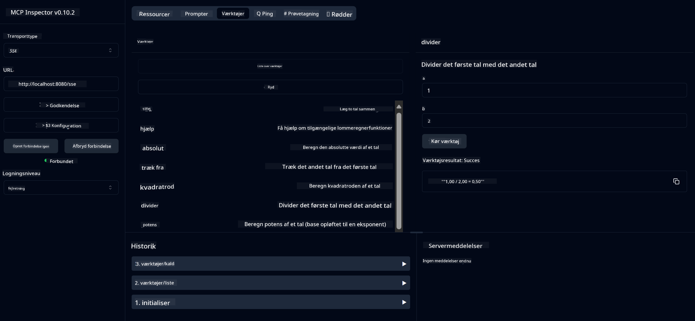

<!--
CO_OP_TRANSLATOR_METADATA:
{
  "original_hash": "13231e9951b68efd9df8c56bd5cdb27e",
  "translation_date": "2025-07-13T22:27:43+00:00",
  "source_file": "03-GettingStarted/samples/java/calculator/README.md",
  "language_code": "da"
}
-->
# Basic Calculator MCP Service

Denne service tilbyder grundlæggende lommeregnerfunktioner via Model Context Protocol (MCP) ved brug af Spring Boot med WebFlux transport. Den er designet som et simpelt eksempel for begyndere, der vil lære om MCP-implementeringer.

For mere information, se reference-dokumentationen for [MCP Server Boot Starter](https://docs.spring.io/spring-ai/reference/api/mcp/mcp-server-boot-starter-docs.html).

## Oversigt

Servicen demonstrerer:
- Understøttelse af SSE (Server-Sent Events)
- Automatisk værktøjsregistrering ved hjælp af Spring AI’s `@Tool` annotation
- Grundlæggende lommeregnerfunktioner:
  - Addition, subtraktion, multiplikation, division
  - Potensberegning og kvadratrod
  - Modulus (rest) og absolut værdi
  - Hjælpefunktion til beskrivelse af operationer

## Funktioner

Denne lommeregner-service tilbyder følgende muligheder:

1. **Grundlæggende aritmetiske operationer**:
   - Addition af to tal
   - Subtraktion af et tal fra et andet
   - Multiplikation af to tal
   - Division af et tal med et andet (med kontrol for division med nul)

2. **Avancerede operationer**:
   - Potensberegning (at hæve en base til en eksponent)
   - Kvadratrodsberegning (med kontrol for negative tal)
   - Modulus (rest) beregning
   - Beregning af absolut værdi

3. **Hjælpesystem**:
   - Indbygget hjælpefunktion, der forklarer alle tilgængelige operationer

## Brug af servicen

Servicen eksponerer følgende API-endpoints via MCP-protokollen:

- `add(a, b)`: Læg to tal sammen
- `subtract(a, b)`: Træk det andet tal fra det første
- `multiply(a, b)`: Gange to tal
- `divide(a, b)`: Divider det første tal med det andet (med nul-kontrol)
- `power(base, exponent)`: Beregn potens af et tal
- `squareRoot(number)`: Beregn kvadratrod (med kontrol for negative tal)
- `modulus(a, b)`: Beregn resten ved division
- `absolute(number)`: Beregn absolut værdi
- `help()`: Få information om tilgængelige operationer

## Testklient

En simpel testklient er inkluderet i pakken `com.microsoft.mcp.sample.client`. Klassen `SampleCalculatorClient` demonstrerer de tilgængelige operationer i lommeregner-servicen.

## Brug af LangChain4j-klienten

Projektet inkluderer et eksempel på en LangChain4j-klient i `com.microsoft.mcp.sample.client.LangChain4jClient`, som viser, hvordan man integrerer lommeregner-servicen med LangChain4j og GitHub-modeller:

### Forudsætninger

1. **Opsætning af GitHub-token**:
   
   For at bruge GitHubs AI-modeller (som phi-4) skal du have et personligt adgangstoken til GitHub:

   a. Gå til dine GitHub-kontoindstillinger: https://github.com/settings/tokens
   
   b. Klik på "Generate new token" → "Generate new token (classic)"
   
   c. Giv dit token et beskrivende navn
   
   d. Vælg følgende scopes:
      - `repo` (Fuld kontrol over private repositories)
      - `read:org` (Læs organisation og teammedlemskab, læs organisationsprojekter)
      - `gist` (Opret gists)
      - `user:email` (Adgang til brugerens e-mailadresser (read-only))
   
   e. Klik på "Generate token" og kopier dit nye token
   
   f. Sæt det som en miljøvariabel:
      
      På Windows:
      ```
      set GITHUB_TOKEN=your-github-token
      ```
      
      På macOS/Linux:
      ```bash
      export GITHUB_TOKEN=your-github-token
      ```

   g. For permanent opsætning, tilføj det til dine miljøvariabler via systemindstillinger

2. Tilføj LangChain4j GitHub-afhængigheden til dit projekt (allerede inkluderet i pom.xml):
   ```xml
   <dependency>
       <groupId>dev.langchain4j</groupId>
       <artifactId>langchain4j-github</artifactId>
       <version>${langchain4j.version}</version>
   </dependency>
   ```

3. Sørg for, at lommeregner-serveren kører på `localhost:8080`

### Kørsel af LangChain4j-klienten

Dette eksempel demonstrerer:
- Forbindelse til lommeregner MCP-serveren via SSE-transport
- Brug af LangChain4j til at oprette en chatbot, der benytter lommeregnerfunktioner
- Integration med GitHub AI-modeller (nu med phi-4 modellen)

Klienten sender følgende eksempler på forespørgsler for at demonstrere funktionaliteten:
1. Beregning af summen af to tal
2. Udregning af kvadratroden af et tal
3. Få hjælp til tilgængelige lommeregneroperationer

Kør eksemplet og tjek konsoloutputtet for at se, hvordan AI-modellen bruger lommeregner-værktøjerne til at besvare forespørgsler.

### GitHub Modelkonfiguration

LangChain4j-klienten er konfigureret til at bruge GitHubs phi-4 model med følgende indstillinger:

```java
ChatLanguageModel model = GitHubChatModel.builder()
    .apiKey(System.getenv("GITHUB_TOKEN"))
    .timeout(Duration.ofSeconds(60))
    .modelName("phi-4")
    .logRequests(true)
    .logResponses(true)
    .build();
```

For at bruge andre GitHub-modeller, ændr blot `modelName` parameteren til en anden understøttet model (f.eks. "claude-3-haiku-20240307", "llama-3-70b-8192" osv.).

## Afhængigheder

Projektet kræver følgende nøgleafhængigheder:

```xml
<!-- For MCP Server -->
<dependency>
    <groupId>org.springframework.ai</groupId>
    <artifactId>spring-ai-starter-mcp-server-webflux</artifactId>
</dependency>

<!-- For LangChain4j integration -->
<dependency>
    <groupId>dev.langchain4j</groupId>
    <artifactId>langchain4j-mcp</artifactId>
    <version>${langchain4j.version}</version>
</dependency>

<!-- For GitHub models support -->
<dependency>
    <groupId>dev.langchain4j</groupId>
    <artifactId>langchain4j-github</artifactId>
    <version>${langchain4j.version}</version>
</dependency>
```

## Byg projektet

Byg projektet med Maven:
```bash
./mvnw clean install -DskipTests
```

## Kør serveren

### Brug af Java

```bash
java -jar target/calculator-server-0.0.1-SNAPSHOT.jar
```

### Brug af MCP Inspector

MCP Inspector er et nyttigt værktøj til at interagere med MCP-services. For at bruge det med denne lommeregner-service:

1. **Installer og kør MCP Inspector** i et nyt terminalvindue:
   ```bash
   npx @modelcontextprotocol/inspector
   ```

2. **Åbn web-UI** ved at klikke på den URL, som appen viser (typisk http://localhost:6274)

3. **Konfigurer forbindelsen**:
   - Sæt transporttypen til "SSE"
   - Sæt URL’en til din kørende servers SSE-endpoint: `http://localhost:8080/sse`
   - Klik på "Connect"

4. **Brug værktøjerne**:
   - Klik på "List Tools" for at se tilgængelige lommeregneroperationer
   - Vælg et værktøj og klik på "Run Tool" for at udføre en operation



### Brug af Docker

Projektet inkluderer en Dockerfile til containeriseret udrulning:

1. **Byg Docker-billedet**:
   ```bash
   docker build -t calculator-mcp-service .
   ```

2. **Kør Docker-containeren**:
   ```bash
   docker run -p 8080:8080 calculator-mcp-service
   ```

Dette vil:
- Bygge et multi-stage Docker-billede med Maven 3.9.9 og Eclipse Temurin 24 JDK
- Oprette et optimeret containerbillede
- Eksponere servicen på port 8080
- Starte MCP lommeregner-servicen inde i containeren

Du kan tilgå servicen på `http://localhost:8080`, når containeren kører.

## Fejlfinding

### Almindelige problemer med GitHub-token

1. **Token-tilladelsesproblemer**: Hvis du får en 403 Forbidden-fejl, så tjek, at dit token har de korrekte tilladelser som beskrevet i forudsætningerne.

2. **Token ikke fundet**: Hvis du får en "No API key found"-fejl, så sørg for, at miljøvariablen GITHUB_TOKEN er korrekt sat.

3. **Ratebegrænsning**: GitHub API har ratebegrænsninger. Hvis du støder på en ratebegrænsningsfejl (statuskode 429), vent et par minutter, før du prøver igen.

4. **Token-udløb**: GitHub-tokens kan udløbe. Hvis du modtager autentificeringsfejl efter noget tid, generer et nyt token og opdater din miljøvariabel.

Hvis du har brug for yderligere hjælp, se [LangChain4j dokumentationen](https://github.com/langchain4j/langchain4j) eller [GitHub API dokumentationen](https://docs.github.com/en/rest).

**Ansvarsfraskrivelse**:  
Dette dokument er blevet oversat ved hjælp af AI-oversættelsestjenesten [Co-op Translator](https://github.com/Azure/co-op-translator). Selvom vi bestræber os på nøjagtighed, bedes du være opmærksom på, at automatiserede oversættelser kan indeholde fejl eller unøjagtigheder. Det oprindelige dokument på dets oprindelige sprog bør betragtes som den autoritative kilde. For kritisk information anbefales professionel menneskelig oversættelse. Vi påtager os intet ansvar for misforståelser eller fejltolkninger, der opstår som følge af brugen af denne oversættelse.