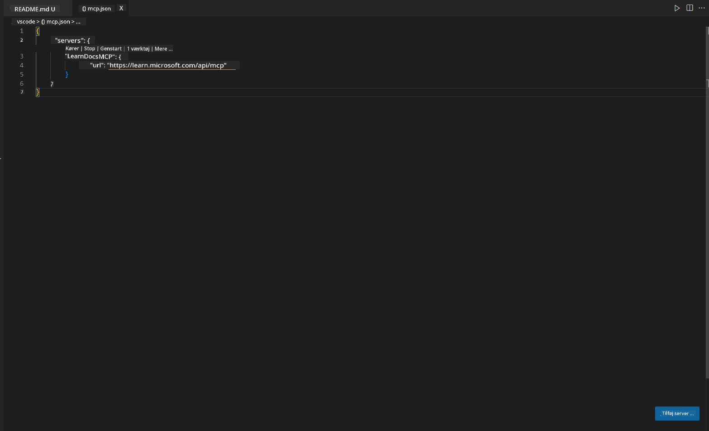
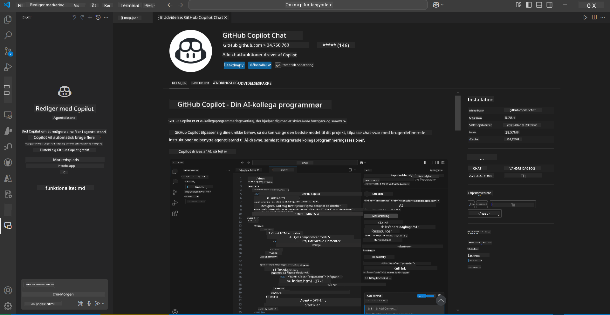
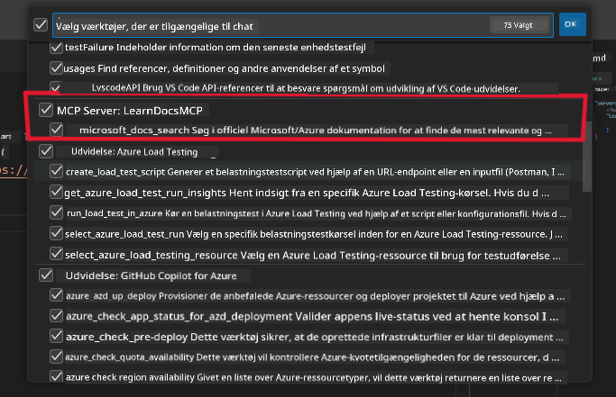
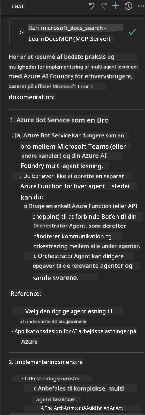

<!--
CO_OP_TRANSLATOR_METADATA:
{
  "original_hash": "db532b1ec386c9ce38c791653dc3c881",
  "translation_date": "2025-07-14T06:52:27+00:00",
  "source_file": "09-CaseStudy/docs-mcp/solution/scenario3/README.md",
  "language_code": "da"
}
-->
# Scenario 3: In-Editor Docs med MCP Server i VS Code

## Oversigt

I dette scenarie vil du lære, hvordan du bringer Microsoft Learn Docs direkte ind i dit Visual Studio Code-miljø ved hjælp af MCP-serveren. I stedet for konstant at skifte browserfaner for at søge efter dokumentation, kan du få adgang til, søge i og referere til officielle docs direkte i din editor. Denne tilgang effektiviserer din arbejdsproces, holder dig fokuseret og muliggør problemfri integration med værktøjer som GitHub Copilot.

- Søg og læs dokumentation i VS Code uden at forlade dit kode-miljø.
- Referer til dokumentation og indsæt links direkte i dine README- eller kursusfiler.
- Brug GitHub Copilot og MCP sammen for en problemfri, AI-drevet dokumentationsarbejdsgang.

## Læringsmål

Når du er færdig med dette kapitel, vil du forstå, hvordan du opsætter og bruger MCP-serveren i VS Code for at forbedre din dokumentations- og udviklingsarbejdsgang. Du vil kunne:

- Konfigurere dit workspace til at bruge MCP-serveren til dokumentationsopslag.
- Søge og indsætte dokumentation direkte fra VS Code.
- Kombinere kraften fra GitHub Copilot og MCP for en mere produktiv, AI-forstærket arbejdsgang.

Disse færdigheder vil hjælpe dig med at holde fokus, forbedre dokumentationskvaliteten og øge din produktivitet som udvikler eller teknisk skribent.

## Løsning

For at opnå adgang til dokumentation direkte i editoren, følger du en række trin, der integrerer MCP-serveren med VS Code og GitHub Copilot. Denne løsning er ideel for kursusforfattere, dokumentationsskrivere og udviklere, der ønsker at bevare fokus i editoren, mens de arbejder med docs og Copilot.

- Tilføj hurtigt referencelinks til en README, mens du skriver kursus- eller projekt-dokumentation.
- Brug Copilot til at generere kode og MCP til øjeblikkeligt at finde og citere relevant dokumentation.
- Bevar fokus i din editor og øg produktiviteten.

### Trin-for-trin Guide

For at komme i gang, følg disse trin. For hvert trin kan du tilføje et screenshot fra assets-mappen for visuelt at illustrere processen.

1. **Tilføj MCP-konfigurationen:**
   I dit projektrod, opret en `.vscode/mcp.json` fil og tilføj følgende konfiguration:
   ```json
   {
     "servers": {
       "LearnDocsMCP": {
         "url": "https://learn.microsoft.com/api/mcp"
       }
     }
   }
   ```
   Denne konfiguration fortæller VS Code, hvordan den skal forbinde til [`Microsoft Learn Docs MCP server`](https://github.com/MicrosoftDocs/mcp).
   
   
    
2. **Åbn GitHub Copilot Chat-panelet:**
   Hvis du ikke allerede har installeret GitHub Copilot-udvidelsen, gå til Extensions-visningen i VS Code og installer den. Du kan downloade den direkte fra [Visual Studio Code Marketplace](https://marketplace.visualstudio.com/items?itemName=GitHub.copilot-chat). Åbn derefter Copilot Chat-panelet fra sidebjælken.

   

3. **Aktivér agent-tilstand og verificer værktøjer:**
   I Copilot Chat-panelet, aktivér agent-tilstand.

   

   Efter aktivering af agent-tilstand, bekræft at MCP-serveren er listet som et af de tilgængelige værktøjer. Dette sikrer, at Copilot-agenten kan få adgang til dokumentationsserveren for at hente relevant information.
   
   
4. **Start en ny chat og stil agenten spørgsmål:**
   Åbn en ny chat i Copilot Chat-panelet. Du kan nu stille agenten dine dokumentationsspørgsmål. Agenten vil bruge MCP-serveren til at hente og vise relevant Microsoft Learn-dokumentation direkte i din editor.

   - *"Jeg prøver at skrive en studieplan for emne X. Jeg vil studere det i 8 uger, for hver uge, foreslå indhold jeg bør tage."*

   

5. **Live Query:**

   > Lad os tage en live forespørgsel fra [#get-help](https://discord.gg/D6cRhjHWSC) sektionen i Azure AI Foundry Discord ([se original besked](https://discord.com/channels/1113626258182504448/1385498306720829572)):
   
   *"Jeg søger svar på, hvordan man deployerer en multi-agent løsning med AI-agenter udviklet på Azure AI Foundry. Jeg kan se, at der ikke findes en direkte deployeringsmetode, som Copilot Studio-kanaler. Så, hvad er de forskellige måder at udføre denne deployering på, så enterprise-brugere kan interagere og få arbejdet gjort?
Der findes mange artikler/blogs, der siger, at vi kan bruge Azure Bot service til dette, som kan fungere som en bro mellem MS Teams og Azure AI Foundry Agents, men vil det fungere, hvis jeg opsætter en Azure bot, der forbinder til Orchestrator Agent på Azure AI Foundry via Azure function for at udføre orkestreringen, eller skal jeg lave en Azure function for hver af AI-agenterne i multi-agent løsningen for at udføre orkestreringen i Bot framework? Andre forslag modtages gerne."*

   

   Agenten vil svare med relevante dokumentationslinks og opsummeringer, som du derefter kan indsætte direkte i dine markdown-filer eller bruge som referencer i din kode.
   
### Eksempelspørgsmål

Her er nogle eksempler på forespørgsler, du kan prøve. Disse forespørgsler vil demonstrere, hvordan MCP-serveren og Copilot kan arbejde sammen for at levere øjeblikkelig, kontekstbevidst dokumentation og referencer uden at forlade VS Code:

- "Vis mig, hvordan man bruger Azure Functions triggers."
- "Indsæt et link til den officielle dokumentation for Azure Key Vault."
- "Hvad er bedste praksis for at sikre Azure-ressourcer?"
- "Find en quickstart for Azure AI services."

Disse forespørgsler vil demonstrere, hvordan MCP-serveren og Copilot kan arbejde sammen for at levere øjeblikkelig, kontekstbevidst dokumentation og referencer uden at forlade VS Code.

---

**Ansvarsfraskrivelse**:  
Dette dokument er blevet oversat ved hjælp af AI-oversættelsestjenesten [Co-op Translator](https://github.com/Azure/co-op-translator). Selvom vi bestræber os på nøjagtighed, bedes du være opmærksom på, at automatiserede oversættelser kan indeholde fejl eller unøjagtigheder. Det oprindelige dokument på dets oprindelige sprog bør betragtes som den autoritative kilde. For kritisk information anbefales professionel menneskelig oversættelse. Vi påtager os intet ansvar for misforståelser eller fejltolkninger, der opstår som følge af brugen af denne oversættelse.