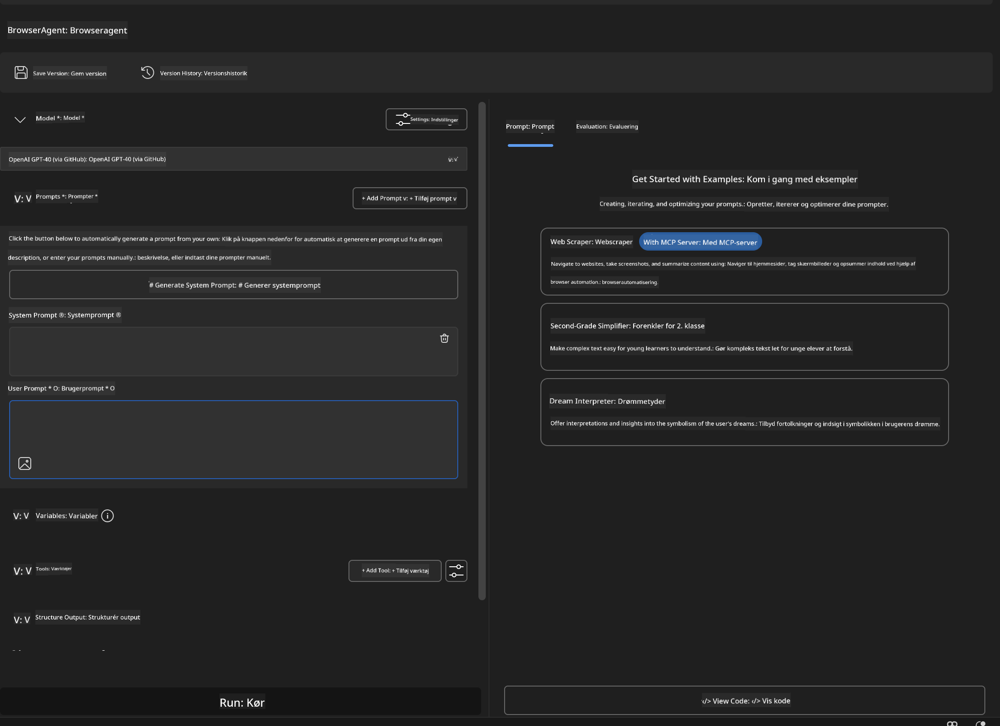
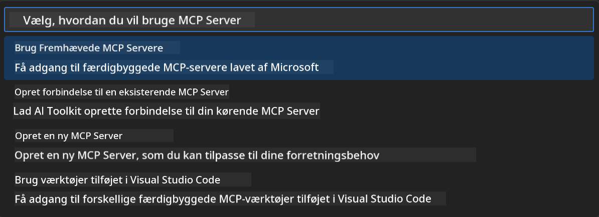
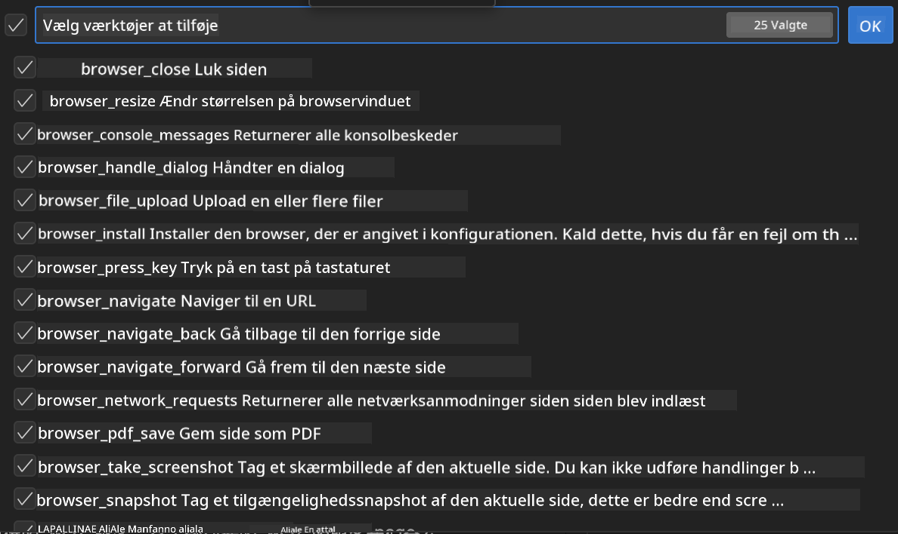
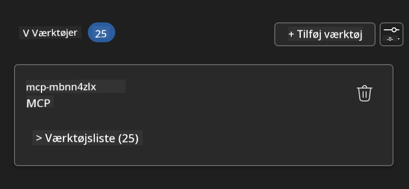
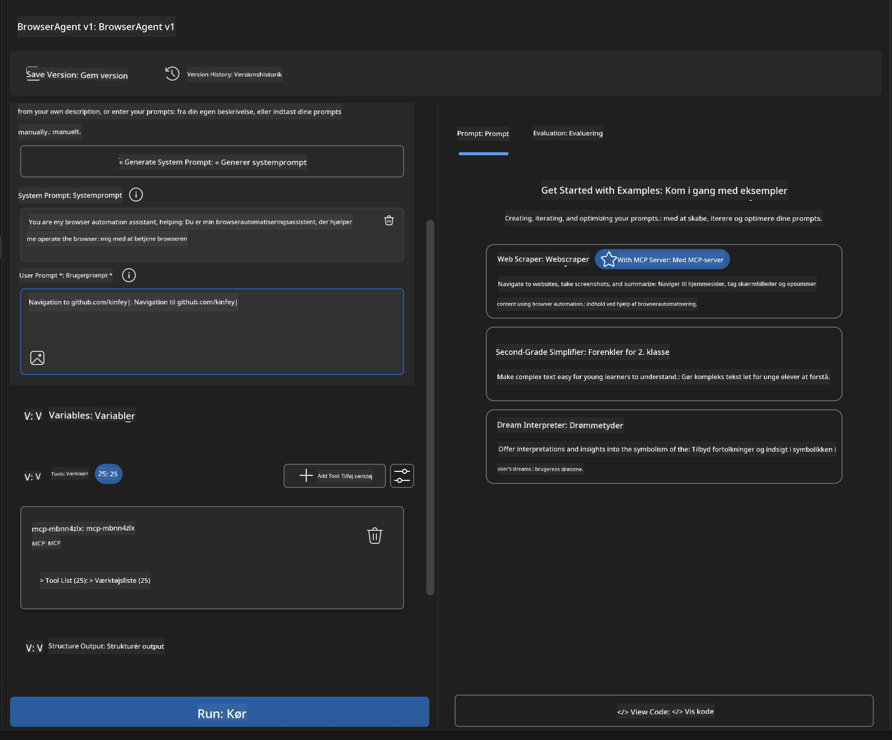
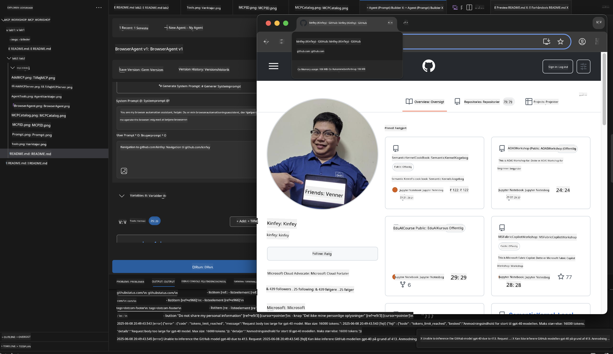
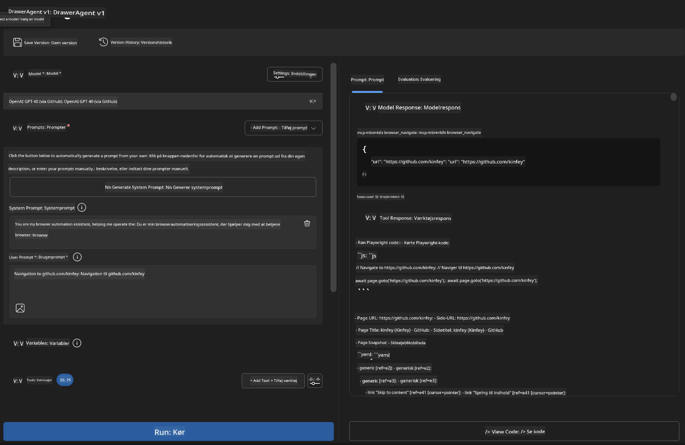
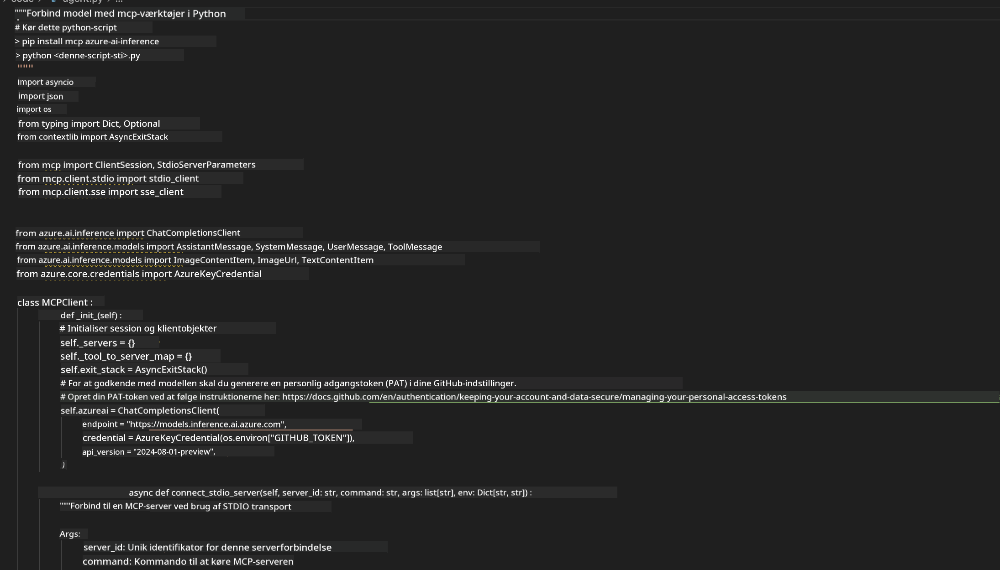

<!--
CO_OP_TRANSLATOR_METADATA:
{
  "original_hash": "a22b7dd11cd7690f99f9195877cafdc3",
  "translation_date": "2025-07-14T07:54:24+00:00",
  "source_file": "10-StreamliningAIWorkflowsBuildingAnMCPServerWithAIToolkit/lab2/README.md",
  "language_code": "da"
}
-->
# 🌐 Modul 2: MCP med AI Toolkit Grundlæggende

[]()
[]()
[]()

## 📋 Læringsmål

Når du er færdig med dette modul, vil du kunne:
- ✅ Forstå Model Context Protocol (MCP) arkitektur og fordele
- ✅ Udforske Microsofts MCP server-økosystem
- ✅ Integrere MCP servere med AI Toolkit Agent Builder
- ✅ Bygge en funktionel browserautomationsagent ved hjælp af Playwright MCP
- ✅ Konfigurere og teste MCP-værktøjer i dine agenter
- ✅ Eksportere og implementere MCP-drevne agenter til produktion

## 🎯 Bygger videre på Modul 1

I Modul 1 mestrede vi AI Toolkit grundlæggende og skabte vores første Python Agent. Nu vil vi **supercharge** dine agenter ved at forbinde dem til eksterne værktøjer og tjenester gennem den banebrydende **Model Context Protocol (MCP)**.

Tænk på det som en opgradering fra en simpel lommeregner til en fuld computer – dine AI-agenter får nu evnen til at:
- 🌐 Gennemse og interagere med hjemmesider
- 📁 Tilgå og manipulere filer
- 🔧 Integrere med virksomhedssystemer
- 📊 Behandle realtidsdata fra API’er

## 🧠 Forståelse af Model Context Protocol (MCP)

### 🔍 Hvad er MCP?

Model Context Protocol (MCP) er **"USB-C for AI-applikationer"** – en revolutionerende åben standard, der forbinder store sprogmodeller (LLMs) med eksterne værktøjer, datakilder og tjenester. Ligesom USB-C fjernede kabelrod ved at tilbyde en universel stikforbindelse, fjerner MCP kompleksiteten ved AI-integration med én standardiseret protokol.

### 🎯 Problemet MCP Løser

**Før MCP:**
- 🔧 Tilpassede integrationer for hvert værktøj
- 🔄 Leverandørlås med proprietære løsninger  
- 🔒 Sikkerhedsrisici ved ad hoc-forbindelser
- ⏱️ Måneder til udvikling af basale integrationer

**Med MCP:**
- ⚡ Plug-and-play værktøjsintegration
- 🔄 Leverandøruafhængig arkitektur
- 🛡️ Indbyggede sikkerhedspraksisser
- 🚀 Minutter til at tilføje nye funktioner

### 🏗️ MCP Arkitektur i Dybdemodel

MCP følger en **client-server arkitektur**, der skaber et sikkert og skalerbart økosystem:

```mermaid
graph TB
    A[AI Application/Agent] --> B[MCP Client]
    B --> C[MCP Server 1: Files]
    B --> D[MCP Server 2: Web APIs]
    B --> E[MCP Server 3: Database]
    B --> F[MCP Server N: Custom Tools]
    
    C --> G[Local File System]
    D --> H[External APIs]
    E --> I[Database Systems]
    F --> J[Enterprise Systems]
```

**🔧 Kernekomponenter:**

| Komponent | Rolle | Eksempler |
|-----------|-------|-----------|
| **MCP Hosts** | Applikationer, der bruger MCP-tjenester | Claude Desktop, VS Code, AI Toolkit |
| **MCP Clients** | Protokolhåndterere (1:1 med servere) | Indbygget i host-applikationer |
| **MCP Servers** | Eksponerer funktioner via standardprotokol | Playwright, Files, Azure, GitHub |
| **Transportlag** | Kommunikationsmetoder | stdio, HTTP, WebSockets |

## 🏢 Microsofts MCP Server-Økosystem

Microsoft leder MCP-økosystemet med en omfattende suite af enterprise-grade servere, der løser virkelige forretningsbehov.

### 🌟 Udvalgte Microsoft MCP Servere

#### 1. ☁️ Azure MCP Server  
**🔗 Repository**: [azure/azure-mcp](https://github.com/azure/azure-mcp)  
**🎯 Formål**: Omfattende Azure ressourcestyring med AI-integration

**✨ Nøglefunktioner:**
- Deklarativ infrastrukturprovisionering
- Realtidsressourceovervågning
- Anbefalinger til omkostningsoptimering
- Sikkerhedsoverholdelseskontrol

**🚀 Anvendelsestilfælde:**
- Infrastruktur-som-kode med AI-assistance
- Automatisk ressource-skalering
- Optimering af cloud-omkostninger
- Automatisering af DevOps workflows

#### 2. 📊 Microsoft Dataverse MCP  
**📚 Dokumentation**: [Microsoft Dataverse Integration](https://go.microsoft.com/fwlink/?linkid=2320176)  
**🎯 Formål**: Naturligt sproginterface til forretningsdata

**✨ Nøglefunktioner:**
- Naturlige sprogforespørgsler til databaser
- Forståelse af forretningskontekst
- Tilpassede promptskabeloner
- Enterprise data governance

**🚀 Anvendelsestilfælde:**
- Business intelligence rapportering
- Analyse af kundedata
- Indsigter i salgspipeline
- Overholdelsesforespørgsler

#### 3. 🌐 Playwright MCP Server  
**🔗 Repository**: [microsoft/playwright-mcp](https://github.com/microsoft/playwright-mcp)  
**🎯 Formål**: Browserautomatisering og webinteraktionsfunktioner

**✨ Nøglefunktioner:**
- Cross-browser automatisering (Chrome, Firefox, Safari)
- Intelligent elementgenkendelse
- Skærmbilleder og PDF-generering
- Netværkstrafikovervågning

**🚀 Anvendelsestilfælde:**
- Automatiserede test-workflows
- Web scraping og dataudtræk
- UI/UX overvågning
- Automatisering af konkurrentanalyse

#### 4. 📁 Files MCP Server  
**🔗 Repository**: [microsoft/files-mcp-server](https://github.com/microsoft/files-mcp-server)  
**🎯 Formål**: Intelligent filsystemhåndtering

**✨ Nøglefunktioner:**
- Deklarativ filhåndtering
- Indholdssynkronisering
- Versionskontrolintegration
- Metadataudtræk

**🚀 Anvendelsestilfælde:**
- Dokumentationsstyring
- Organisering af kode-repositorier
- Workflow for indholdspublicering
- Filhåndtering i datapipelines

#### 5. 📝 MarkItDown MCP Server  
**🔗 Repository**: [microsoft/markitdown](https://github.com/microsoft/markitdown)  
**🎯 Formål**: Avanceret Markdown-behandling og manipulation

**✨ Nøglefunktioner:**
- Omfattende Markdown-parsing
- Formatkonvertering (MD ↔ HTML ↔ PDF)
- Analyse af indholdsstruktur
- Skabelonbehandling

**🚀 Anvendelsestilfælde:**
- Tekniske dokumentations-workflows
- Content management systemer
- Rapportgenerering
- Automatisering af vidensbaser

#### 6. 📈 Clarity MCP Server  
**📦 Pakke**: [@microsoft/clarity-mcp-server](https://www.npmjs.com/package/@microsoft/clarity-mcp-server)  
**🎯 Formål**: Webanalyse og brugeradfærdsindsigt

**✨ Nøglefunktioner:**
- Heatmap-dataanalyse
- Optagelser af brugersessioner
- Performance-målinger
- Analyse af konverteringstragte

**🚀 Anvendelsestilfælde:**
- Optimering af hjemmesider
- Brugeroplevelsesforskning
- A/B test-analyse
- Business intelligence dashboards

### 🌍 Community-økosystem

Udover Microsofts servere inkluderer MCP-økosystemet:  
- **🐙 GitHub MCP**: Repositoriehåndtering og kodeanalyse  
- **🗄️ Database MCP’er**: PostgreSQL, MySQL, MongoDB integrationer  
- **☁️ Cloud Provider MCP’er**: AWS, GCP, Digital Ocean værktøjer  
- **📧 Kommunikations MCP’er**: Slack, Teams, Email integrationer  

## 🛠️ Hands-On Lab: Byg en Browserautomationsagent

**🎯 Projektmål**: Skab en intelligent browserautomationsagent ved hjælp af Playwright MCP-server, der kan navigere på hjemmesider, udtrække information og udføre komplekse webinteraktioner.

### 🚀 Fase 1: Agent Grundopsætning

#### Trin 1: Initialiser din Agent  
1. **Åbn AI Toolkit Agent Builder**  
2. **Opret Ny Agent** med følgende konfiguration:  
   - **Navn**: `BrowserAgent`  
   - **Model**: Vælg GPT-4o  



### 🔧 Fase 2: MCP Integrationsworkflow

#### Trin 3: Tilføj MCP Server Integration  
1. **Gå til Værktøjssektionen** i Agent Builder  
2. **Klik på "Add Tool"** for at åbne integrationsmenuen  
3. **Vælg "MCP Server"** blandt de tilgængelige muligheder  


**🔍 Forstå værktøjstyper:**  
- **Indbyggede værktøjer**: Forudkonfigurerede AI Toolkit-funktioner  
- **MCP Servere**: Eksterne serviceintegrationer  
- **Custom APIs**: Egne serviceendpoints  
- **Function Calling**: Direkte funktionsadgang i modellen  

#### Trin 4: MCP Servervalg  
1. **Vælg "MCP Server"** for at fortsætte  


2. **Gennemse MCP-kataloget** for at udforske tilgængelige integrationer  


### 🎮 Fase 3: Playwright MCP Konfiguration

#### Trin 5: Vælg og Konfigurer Playwright  
1. **Klik på "Use Featured MCP Servers"** for at få adgang til Microsofts verificerede servere  
2. **Vælg "Playwright"** fra den fremhævede liste  
3. **Accepter standard MCP ID** eller tilpas til dit miljø  


#### Trin 6: Aktiver Playwright Funktioner  
**🔑 Kritisk trin**: Vælg **ALLE** tilgængelige Playwright-metoder for maksimal funktionalitet  



**🛠️ Vigtige Playwright-værktøjer:**  
- **Navigation**: `goto`, `goBack`, `goForward`, `reload`  
- **Interaktion**: `click`, `fill`, `press`, `hover`, `drag`  
- **Udtræk**: `textContent`, `innerHTML`, `getAttribute`  
- **Validering**: `isVisible`, `isEnabled`, `waitForSelector`  
- **Optagelse**: `screenshot`, `pdf`, `video`  
- **Netværk**: `setExtraHTTPHeaders`, `route`, `waitForResponse`  

#### Trin 7: Bekræft Integrationssucces  
**✅ Succesindikatorer:**  
- Alle værktøjer vises i Agent Builder interfacet  
- Ingen fejlmeddelelser i integrationspanelet  
- Playwright serverstatus viser "Connected"  



**🔧 Fejlfinding af almindelige problemer:**  
- **Forbindelse mislykkedes**: Tjek internetforbindelse og firewall-indstillinger  
- **Manglende værktøjer**: Sørg for at alle funktioner blev valgt under opsætning  
- **Tilladelsesfejl**: Bekræft at VS Code har nødvendige systemtilladelser  

### 🎯 Fase 4: Avanceret Prompt Engineering

#### Trin 8: Design intelligente systemprompter  
Skab avancerede prompter, der udnytter Playwrights fulde funktionalitet:  

```markdown
# Web Automation Expert System Prompt

## Core Identity
You are an advanced web automation specialist with deep expertise in browser automation, web scraping, and user experience analysis. You have access to Playwright tools for comprehensive browser control.

## Capabilities & Approach
### Navigation Strategy
- Always start with screenshots to understand page layout
- Use semantic selectors (text content, labels) when possible
- Implement wait strategies for dynamic content
- Handle single-page applications (SPAs) effectively

### Error Handling
- Retry failed operations with exponential backoff
- Provide clear error descriptions and solutions
- Suggest alternative approaches when primary methods fail
- Always capture diagnostic screenshots on errors

### Data Extraction
- Extract structured data in JSON format when possible
- Provide confidence scores for extracted information
- Validate data completeness and accuracy
- Handle pagination and infinite scroll scenarios

### Reporting
- Include step-by-step execution logs
- Provide before/after screenshots for verification
- Suggest optimizations and alternative approaches
- Document any limitations or edge cases encountered

## Ethical Guidelines
- Respect robots.txt and rate limiting
- Avoid overloading target servers
- Only extract publicly available information
- Follow website terms of service
```

#### Trin 9: Opret dynamiske brugerprompter  
Design prompter, der demonstrerer forskellige funktioner:  

**🌐 Webanalyse-eksempel:**  
```markdown
Navigate to github.com/kinfey and provide a comprehensive analysis including:
1. Repository structure and organization
2. Recent activity and contribution patterns  
3. Documentation quality assessment
4. Technology stack identification
5. Community engagement metrics
6. Notable projects and their purposes

Include screenshots at key steps and provide actionable insights.
```



### 🚀 Fase 5: Udførelse og Test

#### Trin 10: Kør din første automation  
1. **Klik på "Run"** for at starte automatiseringssekvensen  
2. **Overvåg realtidsudførelse**:  
   - Chrome-browser åbnes automatisk  
   - Agent navigerer til målwebsted  
   - Skærmbilleder tages ved hvert vigtigt trin  
   - Analyse-resultater streames i realtid  



#### Trin 11: Analyser resultater og indsigter  
Gennemgå omfattende analyser i Agent Builder interfacet:  



### 🌟 Fase 6: Avancerede funktioner og implementering

#### Trin 12: Eksport og produktionsimplementering  
Agent Builder understøtter flere implementeringsmuligheder:  



## 🎓 Modul 2 Opsummering & Næste Skridt

### 🏆 Opnåelse Låst Op: MCP Integrationsmester

**✅ Færdigheder mestret:**  
- [ ] Forståelse af MCP arkitektur og fordele  
- [ ] Navigering i Microsofts MCP server-økosystem  
- [ ] Integration af Playwright MCP med AI Toolkit  
- [ ] Opbygning af avancerede browserautomationsagenter  
- [ ] Avanceret prompt engineering til webautomation  

### 📚 Yderligere Ressourcer

- **🔗 MCP Specifikation**: [Officiel Protokoldokumentation](https://modelcontextprotocol.io/)  
- **🛠️ Playwright API**: [Komplet Metodereference](https://playwright.dev/docs/api/class-playwright)  
- **🏢 Microsoft MCP Servere**: [Enterprise Integrationsguide](https://github.com/microsoft/mcp-servers)  
- **🌍 Community Eksempler**: [MCP Server Galleri](https://github.com/modelcontextprotocol/servers)  

**🎉 Tillykke!** Du har nu mestret MCP integration og kan bygge produktionsklare AI-agenter med eksterne værktøjsfunktioner!

### 🔜 Fortsæt til Næste Modul

Klar til at tage dine MCP-færdigheder til næste niveau? Fortsæt til **[Modul 3: Avanceret MCP Udvikling med AI Toolkit](../lab3/README.md)**, hvor du vil lære at:  
- Oprette dine egne tilpassede MCP servere  
- Konfigurere og bruge den nyeste MCP Python SDK  
- Sætte MCP Inspector op til fejlfinding  
- Mestre avancerede MCP serverudviklings-workflows
- Byg en Weather MCP-server fra bunden

**Ansvarsfraskrivelse**:  
Dette dokument er blevet oversat ved hjælp af AI-oversættelsestjenesten [Co-op Translator](https://github.com/Azure/co-op-translator). Selvom vi bestræber os på nøjagtighed, bedes du være opmærksom på, at automatiserede oversættelser kan indeholde fejl eller unøjagtigheder. Det oprindelige dokument på dets oprindelige sprog bør betragtes som den autoritative kilde. For kritisk information anbefales professionel menneskelig oversættelse. Vi påtager os intet ansvar for misforståelser eller fejltolkninger, der opstår som følge af brugen af denne oversættelse.