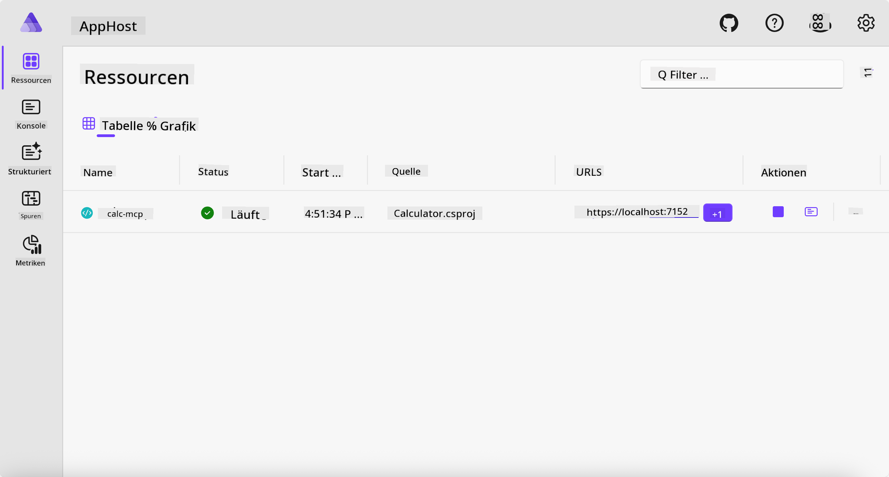

<!--
CO_OP_TRANSLATOR_METADATA:
{
  "original_hash": "0bc7bd48f55f1565f1d95ccb2c16f728",
  "translation_date": "2025-07-13T23:03:26+00:00",
  "source_file": "04-PracticalImplementation/samples/csharp/README.md",
  "language_code": "de"
}
-->
# Beispiel

Das vorherige Beispiel zeigt, wie man ein lokales .NET-Projekt mit dem `stdio`-Typ verwendet und wie man den Server lokal in einem Container ausführt. Das ist in vielen Situationen eine gute Lösung. Es kann jedoch nützlich sein, den Server remote laufen zu lassen, zum Beispiel in einer Cloud-Umgebung. Hier kommt der `http`-Typ ins Spiel.

Wenn man sich die Lösung im Ordner `04-PracticalImplementation` anschaut, wirkt sie vielleicht viel komplexer als die vorherige. In Wirklichkeit ist das aber nicht so. Wenn man genau auf das Projekt `src/Calculator` schaut, sieht man, dass es größtenteils derselbe Code wie im vorherigen Beispiel ist. Der einzige Unterschied ist, dass wir eine andere Bibliothek `ModelContextProtocol.AspNetCore` verwenden, um die HTTP-Anfragen zu verarbeiten. Außerdem ändern wir die Methode `IsPrime` so, dass sie privat ist, nur um zu zeigen, dass man private Methoden im Code haben kann. Der Rest des Codes ist wie zuvor.

Die anderen Projekte stammen von [.NET Aspire](https://learn.microsoft.com/dotnet/aspire/get-started/aspire-overview). Die Integration von .NET Aspire in die Lösung verbessert die Entwicklererfahrung beim Entwickeln und Testen und unterstützt die Beobachtbarkeit. Es ist nicht erforderlich, um den Server auszuführen, aber es ist eine gute Praxis, es in der Lösung zu haben.

## Server lokal starten

1. Navigiere in VS Code (mit der C# DevKit-Erweiterung) in das Verzeichnis `04-PracticalImplementation/samples/csharp`.
1. Führe den folgenden Befehl aus, um den Server zu starten:

   ```bash
    dotnet watch run --project ./src/AppHost
   ```

1. Wenn ein Webbrowser das .NET Aspire Dashboard öffnet, merke dir die `http`-URL. Sie sollte etwa so aussehen: `http://localhost:5058/`.

   

## Streamable HTTP mit dem MCP Inspector testen

Wenn du Node.js 22.7.5 oder höher hast, kannst du den MCP Inspector verwenden, um deinen Server zu testen.

Starte den Server und führe im Terminal den folgenden Befehl aus:

```bash
npx @modelcontextprotocol/inspector http://localhost:5058
```


- Wähle als Transporttyp `Streamable HTTP`.
- Gib im Url-Feld die zuvor notierte Server-URL ein und hänge `/mcp` an. Es sollte `http` (nicht `https`) sein, also etwa `http://localhost:5058/mcp`.
- Klicke auf die Schaltfläche Connect.

Das Schöne am Inspector ist, dass er eine gute Übersicht darüber bietet, was gerade passiert.

- Versuche, die verfügbaren Tools aufzulisten.
- Probiere einige davon aus, sie sollten wie zuvor funktionieren.

## MCP Server mit GitHub Copilot Chat in VS Code testen

Um den Streamable HTTP Transport mit GitHub Copilot Chat zu verwenden, ändere die Konfiguration des zuvor erstellten `calc-mcp` Servers wie folgt:

```jsonc
// .vscode/mcp.json
{
  "servers": {
    "calc-mcp": {
      "type": "http",
      "url": "http://localhost:5058/mcp"
    }
  }
}
```

Führe einige Tests durch:

- Frage nach „3 Primzahlen nach 6780“. Beachte, wie Copilot die neuen Tools `NextFivePrimeNumbers` verwendet und nur die ersten 3 Primzahlen zurückgibt.
- Frage nach „7 Primzahlen nach 111“, um zu sehen, was passiert.
- Frage „John hat 24 Lutscher und möchte sie alle auf seine 3 Kinder verteilen. Wie viele Lutscher bekommt jedes Kind?“, um zu sehen, was passiert.

## Server zu Azure bereitstellen

Lass uns den Server zu Azure bereitstellen, damit mehr Leute ihn nutzen können.

Navigiere im Terminal in den Ordner `04-PracticalImplementation/samples/csharp` und führe den folgenden Befehl aus:

```bash
azd up
```

Nach Abschluss der Bereitstellung solltest du eine Meldung wie diese sehen:


Nimm die URL und verwende sie im MCP Inspector und im GitHub Copilot Chat.

```jsonc
// .vscode/mcp.json
{
  "servers": {
    "calc-mcp": {
      "type": "http",
      "url": "https://calc-mcp.gentleriver-3977fbcf.australiaeast.azurecontainerapps.io/mcp"
    }
  }
}
```

## Was kommt als Nächstes?

Wir haben verschiedene Transporttypen und Testwerkzeuge ausprobiert. Außerdem haben wir deinen MCP Server zu Azure bereitgestellt. Aber was, wenn unser Server Zugriff auf private Ressourcen benötigt? Zum Beispiel eine Datenbank oder eine private API? Im nächsten Kapitel sehen wir, wie wir die Sicherheit unseres Servers verbessern können.

**Haftungsausschluss**:  
Dieses Dokument wurde mit dem KI-Übersetzungsdienst [Co-op Translator](https://github.com/Azure/co-op-translator) übersetzt. Obwohl wir uns um Genauigkeit bemühen, beachten Sie bitte, dass automatisierte Übersetzungen Fehler oder Ungenauigkeiten enthalten können. Das Originaldokument in seiner Ursprungssprache gilt als maßgebliche Quelle. Für wichtige Informationen wird eine professionelle menschliche Übersetzung empfohlen. Wir übernehmen keine Haftung für Missverständnisse oder Fehlinterpretationen, die aus der Nutzung dieser Übersetzung entstehen.