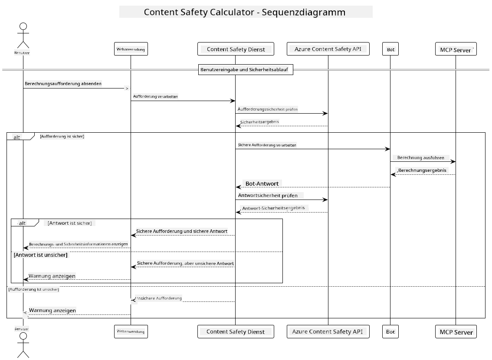

<!--
CO_OP_TRANSLATOR_METADATA:
{
  "original_hash": "e5ea5e7582f70008ea9bec3b3820f20a",
  "translation_date": "2025-07-13T23:11:37+00:00",
  "source_file": "04-PracticalImplementation/samples/java/containerapp/README.md",
  "language_code": "de"
}
-->
## Systemarchitektur

Dieses Projekt zeigt eine Webanwendung, die eine Inhaltsprüfung durchführt, bevor Benutzereingaben über das Model Context Protocol (MCP) an einen Rechnerdienst weitergeleitet werden.



### Funktionsweise

1. **Benutzereingabe**: Der Nutzer gibt eine Berechnungsanfrage in der Weboberfläche ein  
2. **Inhaltsprüfung (Eingabe)**: Die Eingabe wird von der Azure Content Safety API analysiert  
3. **Sicherheitsentscheidung (Eingabe)**:  
   - Wenn der Inhalt sicher ist (Schweregrad < 2 in allen Kategorien), wird er an den Rechner weitergeleitet  
   - Wenn der Inhalt als potenziell schädlich eingestuft wird, wird der Vorgang abgebrochen und eine Warnung ausgegeben  
4. **Integration des Rechners**: Sichere Inhalte werden von LangChain4j verarbeitet, das mit dem MCP-Rechnerserver kommuniziert  
5. **Inhaltsprüfung (Ausgabe)**: Die Antwort des Bots wird von der Azure Content Safety API analysiert  
6. **Sicherheitsentscheidung (Ausgabe)**:  
   - Wenn die Bot-Antwort sicher ist, wird sie dem Nutzer angezeigt  
   - Wenn die Bot-Antwort als potenziell schädlich eingestuft wird, wird sie durch eine Warnung ersetzt  
7. **Antwort**: Ergebnisse (sofern sicher) werden dem Nutzer zusammen mit beiden Sicherheitsanalysen angezeigt

## Verwendung des Model Context Protocol (MCP) mit Rechnerdiensten

Dieses Projekt zeigt, wie man das Model Context Protocol (MCP) verwendet, um Rechnerdienste über MCP von LangChain4j aufzurufen. Die Implementierung nutzt einen lokalen MCP-Server auf Port 8080, der Rechenoperationen bereitstellt.

### Einrichtung des Azure Content Safety Service

Bevor Sie die Inhaltsprüfungsfunktionen nutzen, müssen Sie eine Azure Content Safety Service-Ressource erstellen:

1. Melden Sie sich im [Azure Portal](https://portal.azure.com) an  
2. Klicken Sie auf „Ressource erstellen“ und suchen Sie nach „Content Safety“  
3. Wählen Sie „Content Safety“ aus und klicken Sie auf „Erstellen“  
4. Geben Sie einen eindeutigen Namen für Ihre Ressource ein  
5. Wählen Sie Ihr Abonnement und Ihre Ressourcengruppe aus (oder erstellen Sie eine neue)  
6. Wählen Sie eine unterstützte Region (Details siehe [Region-Verfügbarkeit](https://azure.microsoft.com/en-us/global-infrastructure/services/?products=cognitive-services))  
7. Wählen Sie eine passende Preiskategorie  
8. Klicken Sie auf „Erstellen“, um die Ressource bereitzustellen  
9. Nach Abschluss der Bereitstellung klicken Sie auf „Zur Ressource“  
10. Wählen Sie im linken Menü unter „Ressourcenverwaltung“ den Punkt „Schlüssel und Endpunkt“ aus  
11. Kopieren Sie einen der Schlüssel und die Endpunkt-URL für den nächsten Schritt

### Konfiguration der Umgebungsvariablen

Setzen Sie die Umgebungsvariable `GITHUB_TOKEN` für die Authentifizierung der GitHub-Modelle:  
```sh
export GITHUB_TOKEN=<your_github_token>
```

Für die Inhaltsprüfungsfunktionen setzen Sie:  
```sh
export CONTENT_SAFETY_ENDPOINT=<your_content_safety_endpoint>
export CONTENT_SAFETY_KEY=<your_content_safety_key>
```

Diese Umgebungsvariablen werden von der Anwendung verwendet, um sich beim Azure Content Safety Service zu authentifizieren. Wenn diese Variablen nicht gesetzt sind, verwendet die Anwendung Platzhalterwerte zu Demonstrationszwecken, aber die Inhaltsprüfungsfunktionen funktionieren dann nicht korrekt.

### Starten des Calculator MCP Servers

Bevor Sie den Client starten, müssen Sie den Calculator MCP Server im SSE-Modus auf localhost:8080 starten.

## Projektbeschreibung

Dieses Projekt demonstriert die Integration des Model Context Protocol (MCP) mit LangChain4j zum Aufruf von Rechnerdiensten. Wichtige Merkmale sind:

- Verwendung von MCP zur Verbindung mit einem Rechnerdienst für grundlegende mathematische Operationen  
- Zweistufige Inhaltsprüfung sowohl bei Benutzereingaben als auch bei Bot-Antworten  
- Integration des GitHub-Modells gpt-4.1-nano über LangChain4j  
- Nutzung von Server-Sent Events (SSE) als MCP-Transport

## Integration der Inhaltsprüfung

Das Projekt beinhaltet umfassende Inhaltsprüfungsfunktionen, um sicherzustellen, dass sowohl Benutzereingaben als auch Systemantworten frei von schädlichen Inhalten sind:

1. **Eingabeprüfung**: Alle Benutzereingaben werden vor der Verarbeitung auf schädliche Inhalte wie Hassrede, Gewalt, Selbstverletzung und sexuelle Inhalte analysiert.  

2. **Ausgabeprüfung**: Selbst bei Verwendung potenziell unzensierter Modelle werden alle generierten Antworten vor der Anzeige an den Nutzer durch dieselben Inhaltsprüfungsfilter geprüft.

Dieser zweistufige Ansatz gewährleistet, dass das System unabhängig vom eingesetzten KI-Modell sicher bleibt und Nutzer sowohl vor schädlichen Eingaben als auch vor problematischen KI-generierten Ausgaben geschützt werden.

## Web-Client

Die Anwendung enthält eine benutzerfreundliche Weboberfläche, die es Nutzern ermöglicht, mit dem Content Safety Calculator System zu interagieren:

### Funktionen der Weboberfläche

- Einfaches, intuitives Formular zur Eingabe von Berechnungsanfragen  
- Zweistufige Inhaltsprüfung (Eingabe und Ausgabe)  
- Echtzeit-Feedback zur Sicherheit von Eingabe und Antwort  
- Farblich codierte Sicherheitsindikatoren für eine einfache Interpretation  
- Sauberes, responsives Design, das auf verschiedenen Geräten funktioniert  
- Beispielhafte sichere Eingaben zur Orientierung der Nutzer

### Verwendung des Web-Clients

1. Starten Sie die Anwendung:  
   ```sh
   mvn spring-boot:run
   ```

2. Öffnen Sie Ihren Browser und navigieren Sie zu `http://localhost:8087`

3. Geben Sie eine Berechnungsanfrage in das bereitgestellte Textfeld ein (z. B. „Berechne die Summe von 24,5 und 17,3“)

4. Klicken Sie auf „Absenden“, um Ihre Anfrage zu verarbeiten

5. Sehen Sie die Ergebnisse ein, die Folgendes enthalten:  
   - Inhaltsprüfung Ihrer Eingabe  
   - Das berechnete Ergebnis (wenn die Eingabe sicher war)  
   - Inhaltsprüfung der Bot-Antwort  
   - Sicherheitswarnungen, falls Eingabe oder Ausgabe als problematisch eingestuft wurden

Der Web-Client übernimmt automatisch beide Inhaltsprüfungsprozesse und stellt sicher, dass alle Interaktionen sicher und angemessen sind, unabhängig davon, welches KI-Modell verwendet wird.

**Haftungsausschluss**:  
Dieses Dokument wurde mit dem KI-Übersetzungsdienst [Co-op Translator](https://github.com/Azure/co-op-translator) übersetzt. Obwohl wir uns um Genauigkeit bemühen, beachten Sie bitte, dass automatisierte Übersetzungen Fehler oder Ungenauigkeiten enthalten können. Das Originaldokument in seiner Ursprungssprache ist als maßgebliche Quelle zu betrachten. Für wichtige Informationen wird eine professionelle menschliche Übersetzung empfohlen. Wir übernehmen keine Haftung für Missverständnisse oder Fehlinterpretationen, die aus der Nutzung dieser Übersetzung entstehen.