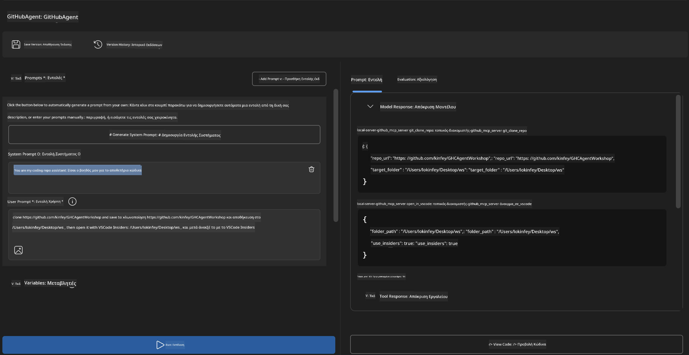
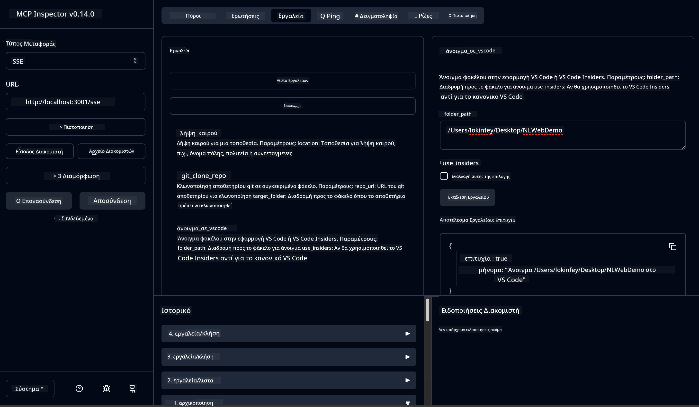

<!--
CO_OP_TRANSLATOR_METADATA:
{
  "original_hash": "f83bc722dc758efffd68667d6a1db470",
  "translation_date": "2025-07-14T08:42:14+00:00",
  "source_file": "10-StreamliningAIWorkflowsBuildingAnMCPServerWithAIToolkit/lab4/README.md",
  "language_code": "el"
}
-->
# 🐙 Ενότητα 4: Πρακτική Ανάπτυξη MCP - Προσαρμοσμένος Διακομιστής Κλωνοποίησης GitHub


> **⚡ Γρήγορη Εκκίνηση:** Δημιουργήστε έναν παραγωγικό MCP διακομιστή που αυτοματοποιεί την κλωνοποίηση αποθετηρίων GitHub και την ενσωμάτωση με το VS Code σε μόλις 30 λεπτά!

## 🎯 Στόχοι Μάθησης

Στο τέλος αυτού του εργαστηρίου, θα μπορείτε να:

- ✅ Δημιουργήσετε έναν προσαρμοσμένο MCP διακομιστή για ρεαλιστικές ροές εργασίας ανάπτυξης
- ✅ Υλοποιήσετε λειτουργία κλωνοποίησης αποθετηρίων GitHub μέσω MCP
- ✅ Ενσωματώσετε προσαρμοσμένους MCP διακομιστές με το VS Code και τον Agent Builder
- ✅ Χρησιμοποιήσετε το GitHub Copilot Agent Mode με προσαρμοσμένα εργαλεία MCP
- ✅ Δοκιμάσετε και αναπτύξετε προσαρμοσμένους MCP διακομιστές σε παραγωγικά περιβάλλοντα

## 📋 Προαπαιτούμενα

- Ολοκλήρωση των Εργαστηρίων 1-3 (θεμελιώδη και προχωρημένη ανάπτυξη MCP)
- Συνδρομή στο GitHub Copilot ([διαθέσιμη δωρεάν εγγραφή](https://github.com/github-copilot/signup))
- VS Code με τις επεκτάσεις AI Toolkit και GitHub Copilot
- Εγκατεστημένο και ρυθμισμένο Git CLI

## 🏗️ Επισκόπηση Έργου

### **Πραγματική Πρόκληση Ανάπτυξης**
Ως προγραμματιστές, χρησιμοποιούμε συχνά το GitHub για να κλωνοποιούμε αποθετήρια και να τα ανοίγουμε στο VS Code ή VS Code Insiders. Αυτή η χειροκίνητη διαδικασία περιλαμβάνει:
1. Άνοιγμα τερματικού/γραμμής εντολών
2. Πλοήγηση στον επιθυμητό φάκελο
3. Εκτέλεση της εντολής `git clone`
4. Άνοιγμα του VS Code στον κλωνοποιημένο φάκελο

**Η λύση MCP που προσφέρουμε απλοποιεί όλα αυτά σε μία μόνο έξυπνη εντολή!**

### **Τι θα Δημιουργήσετε**
Έναν **GitHub Clone MCP Server** (`git_mcp_server`) που προσφέρει:

| Χαρακτηριστικό | Περιγραφή | Όφελος |
|----------------|-----------|--------|
| 🔄 **Έξυπνη Κλωνοποίηση Αποθετηρίων** | Κλωνοποίηση αποθετηρίων GitHub με έλεγχο εγκυρότητας | Αυτόματος έλεγχος σφαλμάτων |
| 📁 **Έξυπνη Διαχείριση Φακέλων** | Έλεγχος και ασφαλής δημιουργία φακέλων | Αποφυγή αντικατάστασης αρχείων |
| 🚀 **Διαλειτουργική Ενσωμάτωση με VS Code** | Άνοιγμα έργων σε VS Code/Insiders | Ομαλή μετάβαση στη ροή εργασίας |
| 🛡️ **Αξιόπιστη Διαχείριση Σφαλμάτων** | Αντιμετώπιση προβλημάτων δικτύου, δικαιωμάτων και διαδρομών | Αξιοπιστία για παραγωγικά περιβάλλοντα |

---

## 📖 Βήμα-βήμα Υλοποίηση

### Βήμα 1: Δημιουργία GitHub Agent στον Agent Builder

1. **Εκκινήστε τον Agent Builder** μέσω της επέκτασης AI Toolkit
2. **Δημιουργήστε νέο agent** με την παρακάτω διαμόρφωση:
   ```
   Agent Name: GitHubAgent
   ```

3. **Αρχικοποιήστε τον προσαρμοσμένο MCP διακομιστή:**
   - Μεταβείτε σε **Εργαλεία** → **Προσθήκη Εργαλείου** → **MCP Server**
   - Επιλέξτε **"Create A new MCP Server"**
   - Επιλέξτε **Python template** για μέγιστη ευελιξία
   - **Όνομα Διακομιστή:** `git_mcp_server`

### Βήμα 2: Ρύθμιση GitHub Copilot Agent Mode

1. **Ανοίξτε το GitHub Copilot** στο VS Code (Ctrl/Cmd + Shift + P → "GitHub Copilot: Open")
2. **Επιλέξτε Agent Model** στην διεπαφή του Copilot
3. **Επιλέξτε το μοντέλο Claude 3.7** για βελτιωμένες δυνατότητες συλλογισμού
4. **Ενεργοποιήστε την ενσωμάτωση MCP** για πρόσβαση σε εργαλεία

> **💡 Επαγγελματική Συμβουλή:** Το Claude 3.7 προσφέρει ανώτερη κατανόηση ροών εργασίας ανάπτυξης και προτύπων διαχείρισης σφαλμάτων.

### Βήμα 3: Υλοποίηση Βασικής Λειτουργικότητας MCP Server

**Χρησιμοποιήστε την παρακάτω λεπτομερή εντολή με το GitHub Copilot Agent Mode:**

```
Create two MCP tools with the following comprehensive requirements:

🔧 TOOL A: clone_repository
Requirements:
- Clone any GitHub repository to a specified local folder
- Return the absolute path of the successfully cloned project
- Implement comprehensive validation:
  ✓ Check if target directory already exists (return error if exists)
  ✓ Validate GitHub URL format (https://github.com/user/repo)
  ✓ Verify git command availability (prompt installation if missing)
  ✓ Handle network connectivity issues
  ✓ Provide clear error messages for all failure scenarios

🚀 TOOL B: open_in_vscode
Requirements:
- Open specified folder in VS Code or VS Code Insiders
- Cross-platform compatibility (Windows/Linux/macOS)
- Use direct application launch (not terminal commands)
- Auto-detect available VS Code installations
- Handle cases where VS Code is not installed
- Provide user-friendly error messages

Additional Requirements:
- Follow MCP 1.9.3 best practices
- Include proper type hints and documentation
- Implement logging for debugging purposes
- Add input validation for all parameters
- Include comprehensive error handling
```

### Βήμα 4: Δοκιμή του MCP Server σας

#### 4α. Δοκιμή στον Agent Builder

1. **Εκκινήστε τη ρύθμιση αποσφαλμάτωσης** για τον Agent Builder
2. **Διαμορφώστε τον agent σας με το παρακάτω σύστημα prompt:**

```
SYSTEM_PROMPT:
You are my intelligent coding repository assistant. You help developers efficiently clone GitHub repositories and set up their development environment. Always provide clear feedback about operations and handle errors gracefully.
```

3. **Δοκιμάστε με ρεαλιστικά σενάρια χρήστη:**

```
USER_PROMPT EXAMPLES:

Scenario : Basic Clone and Open
"Clone {Your GitHub Repo link such as https://github.com/kinfey/GHCAgentWorkshop
 } and save to {The global path you specify}, then open it with VS Code Insiders"
```



**Αναμενόμενα Αποτελέσματα:**
- ✅ Επιτυχής κλωνοποίηση με επιβεβαίωση διαδρομής
- ✅ Αυτόματη εκκίνηση VS Code
- ✅ Καθαρά μηνύματα σφάλματος για μη έγκυρα σενάρια
- ✅ Σωστή διαχείριση ακραίων περιπτώσεων

#### 4β. Δοκιμή στον MCP Inspector



---

**🎉 Συγχαρητήρια!** Δημιουργήσατε με επιτυχία έναν πρακτικό, παραγωγικό MCP διακομιστή που επιλύει πραγματικές προκλήσεις ροών εργασίας ανάπτυξης. Ο προσαρμοσμένος διακομιστής κλωνοποίησης GitHub αποδεικνύει τη δύναμη του MCP για αυτοματοποίηση και βελτίωση της παραγωγικότητας των προγραμματιστών.

### 🏆 Επιτεύγματα:
- ✅ **MCP Developer** - Δημιουργία προσαρμοσμένου MCP διακομιστή
- ✅ **Workflow Automator** - Απλοποίηση διαδικασιών ανάπτυξης  
- ✅ **Integration Expert** - Σύνδεση πολλαπλών εργαλείων ανάπτυξης
- ✅ **Production Ready** - Κατασκευή λύσεων έτοιμων για ανάπτυξη

---

## 🎓 Ολοκλήρωση Εργαστηρίου: Το Ταξίδι σας με το Model Context Protocol

**Αγαπητέ συμμετέχοντα,**

Συγχαρητήρια για την ολοκλήρωση και των τεσσάρων ενοτήτων του εργαστηρίου Model Context Protocol! Έχετε διανύσει μεγάλη απόσταση, από την κατανόηση βασικών εννοιών του AI Toolkit μέχρι τη δημιουργία παραγωγικών MCP διακομιστών που επιλύουν πραγματικές προκλήσεις ανάπτυξης.

### 🚀 Ανακεφαλαίωση της Διαδρομής Μάθησης:

**[Ενότητα 1](../lab1/README.md)**: Ξεκινήσατε εξερευνώντας τα θεμέλια του AI Toolkit, τη δοκιμή μοντέλων και τη δημιουργία του πρώτου σας AI agent.

**[Ενότητα 2](../lab2/README.md)**: Μάθατε την αρχιτεκτονική MCP, ενσωματώσατε το Playwright MCP και δημιουργήσατε τον πρώτο σας agent αυτοματισμού browser.

**[Ενότητα 3](../lab3/README.md)**: Προχωρήσατε στην ανάπτυξη προσαρμοσμένων MCP διακομιστών με τον Weather MCP server και μάθατε εργαλεία αποσφαλμάτωσης.

**[Ενότητα 4](../lab4/README.md)**: Εφαρμόσατε όλα όσα μάθατε για να δημιουργήσετε ένα πρακτικό εργαλείο αυτοματοποίησης ροής εργασίας αποθετηρίων GitHub.

### 🌟 Τι Έχετε Κατακτήσει:

- ✅ **Οικοσύστημα AI Toolkit**: Μοντέλα, agents και πρότυπα ενσωμάτωσης
- ✅ **Αρχιτεκτονική MCP**: Σχεδίαση client-server, πρωτόκολλα μεταφοράς και ασφάλεια
- ✅ **Εργαλεία Ανάπτυξης**: Από το Playground στον Inspector και στην παραγωγική ανάπτυξη
- ✅ **Προσαρμοσμένη Ανάπτυξη**: Δημιουργία, δοκιμή και ανάπτυξη δικών σας MCP διακομιστών
- ✅ **Πρακτικές Εφαρμογές**: Επίλυση πραγματικών προκλήσεων ροών εργασίας με AI

### 🔮 Τα Επόμενα Βήματά σας:

1. **Δημιουργήστε τον δικό σας MCP Server**: Εφαρμόστε αυτές τις δεξιότητες για να αυτοματοποιήσετε τις δικές σας μοναδικές ροές εργασίας
2. **Ενταχθείτε στην Κοινότητα MCP**: Μοιραστείτε τις δημιουργίες σας και μάθετε από άλλους
3. **Εξερευνήστε Προχωρημένη Ενσωμάτωση**: Συνδέστε MCP διακομιστές με συστήματα επιχειρήσεων
4. **Συνεισφέρετε σε Open Source**: Βοηθήστε στη βελτίωση των εργαλείων και της τεκμηρίωσης MCP

Να θυμάστε, αυτό το εργαστήριο είναι μόνο η αρχή. Το οικοσύστημα Model Context Protocol εξελίσσεται γρήγορα και τώρα είστε έτοιμοι να βρίσκεστε στην πρώτη γραμμή των εργαλείων ανάπτυξης με τεχνητή νοημοσύνη.

**Σας ευχαριστούμε για τη συμμετοχή και την αφοσίωσή σας στη μάθηση!**

Ελπίζουμε αυτό το εργαστήριο να σας έδωσε ιδέες που θα μεταμορφώσουν τον τρόπο που δημιουργείτε και αλληλεπιδράτε με εργαλεία AI στην πορεία σας ως προγραμματιστής.

**Καλή κωδικοποίηση!**

---

**Αποποίηση ευθυνών**:  
Αυτό το έγγραφο έχει μεταφραστεί χρησιμοποιώντας την υπηρεσία αυτόματης μετάφρασης AI [Co-op Translator](https://github.com/Azure/co-op-translator). Παρόλο που επιδιώκουμε την ακρίβεια, παρακαλούμε να γνωρίζετε ότι οι αυτόματες μεταφράσεις ενδέχεται να περιέχουν λάθη ή ανακρίβειες. Το πρωτότυπο έγγραφο στη μητρική του γλώσσα πρέπει να θεωρείται η αυθεντική πηγή. Για κρίσιμες πληροφορίες, συνιστάται επαγγελματική ανθρώπινη μετάφραση. Δεν φέρουμε ευθύνη για τυχόν παρεξηγήσεις ή λανθασμένες ερμηνείες που προκύπτουν από τη χρήση αυτής της μετάφρασης.