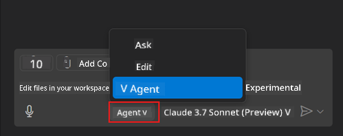
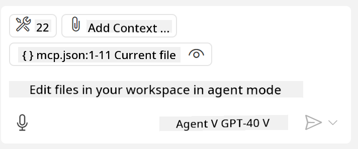
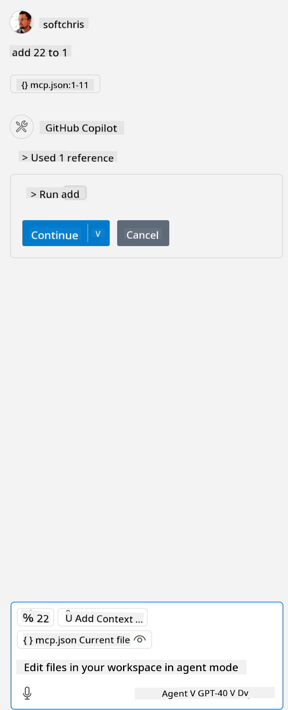

<!--
CO_OP_TRANSLATOR_METADATA:
{
  "original_hash": "d940b5e0af75e3a3a4d1c3179120d1d9",
  "translation_date": "2025-08-26T17:00:17+00:00",
  "source_file": "03-GettingStarted/04-vscode/README.md",
  "language_code": "en"
}
-->
# Consuming a server from GitHub Copilot Agent mode

Visual Studio Code and GitHub Copilot can act as a client to consume an MCP Server. Why would you want to do that? Well, it means that any features provided by the MCP Server can now be accessed directly from your IDE. For example, if you add GitHub's MCP server, you could control GitHub using prompts instead of typing specific commands in the terminal. Or imagine any other functionality that could enhance your development experience, all managed through natural language. Sounds like a win, right?

## Overview

This lesson explains how to use Visual Studio Code and GitHub Copilot's Agent mode as a client for your MCP Server.

## Learning Objectives

By the end of this lesson, you will be able to:

- Use Visual Studio Code to consume an MCP Server.
- Run tools and capabilities via GitHub Copilot.
- Configure Visual Studio Code to locate and manage your MCP Server.

## Usage

You can control your MCP server in two ways:

- Through the user interface, which will be explained later in this chapter.
- Through the terminal, where you can use the `code` executable to manage the server:

  To add an MCP server to your user profile, use the `--add-mcp` command line option and provide the JSON server configuration in the format {\"name\":\"server-name\",\"command\":...}.

  ```
  code --add-mcp "{\"name\":\"my-server\",\"command\": \"uvx\",\"args\": [\"mcp-server-fetch\"]}"
  ```

### Screenshots




We'll discuss how to use the visual interface in the following sections.

## Approach

Here’s the high-level approach:

- Configure a file to locate your MCP Server.
- Start or connect to the server to list its capabilities.
- Use those capabilities through the GitHub Copilot Chat interface.

Now that we understand the process, let’s try using an MCP Server in Visual Studio Code with an exercise.

## Exercise: Consuming a server

In this exercise, we’ll configure Visual Studio Code to locate your MCP server so it can be used via the GitHub Copilot Chat interface.

### -0- Prestep: Enable MCP Server discovery

You may need to enable MCP Server discovery.

1. Go to `File -> Preferences -> Settings` in Visual Studio Code.

1. Search for "MCP" and enable `chat.mcp.discovery.enabled` in the settings.json file.

### -1- Create a config file

Start by creating a configuration file in your project root. You’ll need to create a file called `MCP.json` and place it in a folder named `.vscode`. It should look like this:

```text
.vscode
|-- mcp.json
```

Next, let’s add a server entry.

### -2- Configure a server

Add the following content to *mcp.json*:

```json
{
    "inputs": [],
    "servers": {
       "hello-mcp": {
           "command": "node",
           "args": [
               "build/index.js"
           ]
       }
    }
}
```

The example above shows how to start a server written in Node.js. For other runtimes, specify the appropriate command to start the server using `command` and `args`.

### -3- Start the server

Now that you’ve added an entry, let’s start the server:

1. Locate your entry in *mcp.json* and find the "play" icon:

    

1. Click the "play" icon. You should see the tools icon in the GitHub Copilot Chat interface show an increased number of available tools. If you click the tools icon, you’ll see a list of registered tools. You can check or uncheck each tool depending on whether you want GitHub Copilot to use them as context:

  

1. To run a tool, type a prompt that matches the description of one of your tools. For example, a prompt like "add 22 to 1":

  

  You should see a response of 23.

## Assignment

Try adding a server entry to your *mcp.json* file. Ensure you can start and stop the server. Also, verify that you can interact with the tools on your server via the GitHub Copilot Chat interface.

## Solution

[Solution](./solution/README.md)

## Key Takeaways

Here are the key takeaways from this chapter:

- Visual Studio Code is an excellent client for consuming multiple MCP Servers and their tools.
- The GitHub Copilot Chat interface is used to interact with the servers.
- You can prompt users for inputs, such as API keys, which can be passed to the MCP Server when configuring the server entry in the *mcp.json* file.

## Samples

- [Java Calculator](../samples/java/calculator/README.md)
- [.Net Calculator](../../../../03-GettingStarted/samples/csharp)
- [JavaScript Calculator](../samples/javascript/README.md)
- [TypeScript Calculator](../samples/typescript/README.md)
- [Python Calculator](../../../../03-GettingStarted/samples/python)

## Additional Resources

- [Visual Studio docs](https://code.visualstudio.com/docs/copilot/chat/mcp-servers)

## What's Next

- Next: [Creating a stdio Server](../05-stdio-server/README.md)

---

**Disclaimer**:  
This document has been translated using the AI translation service [Co-op Translator](https://github.com/Azure/co-op-translator). While we aim for accuracy, please note that automated translations may include errors or inaccuracies. The original document in its native language should be regarded as the authoritative source. For critical information, professional human translation is advised. We are not responsible for any misunderstandings or misinterpretations resulting from the use of this translation.