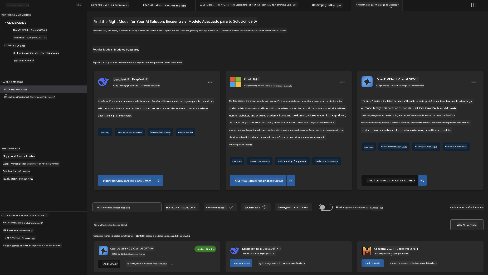
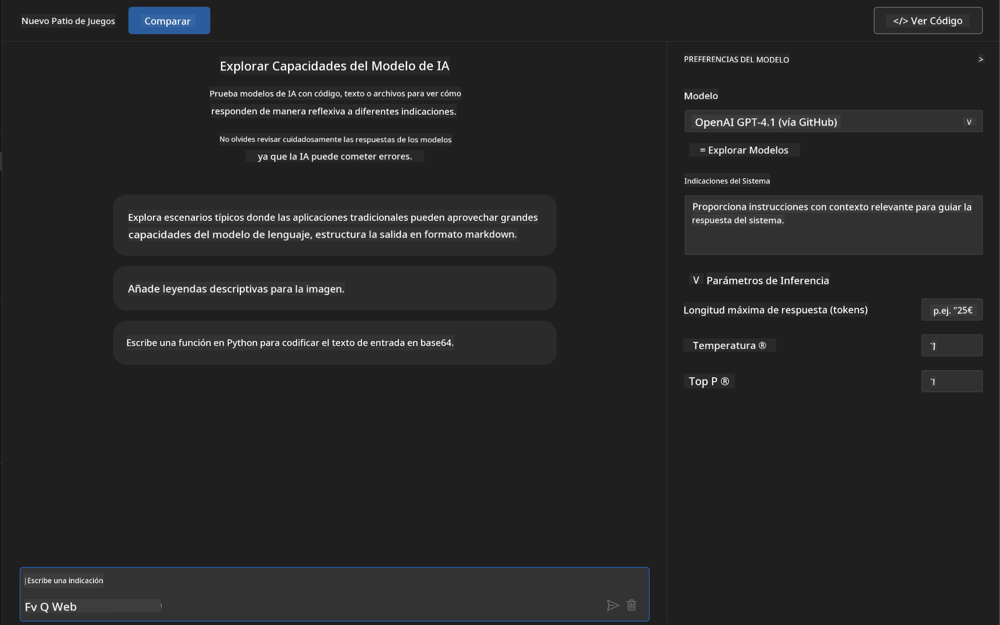
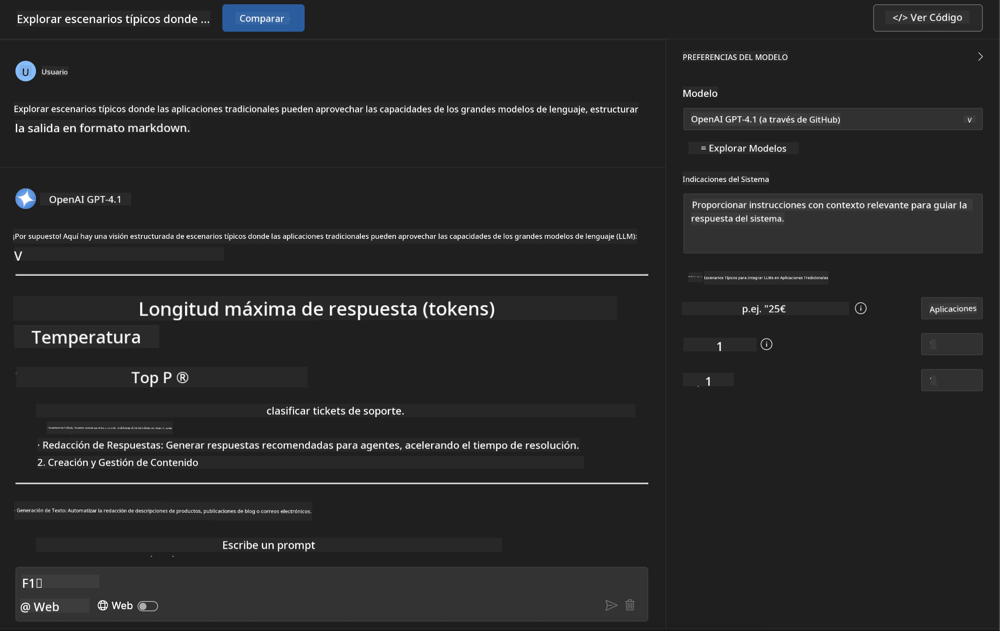
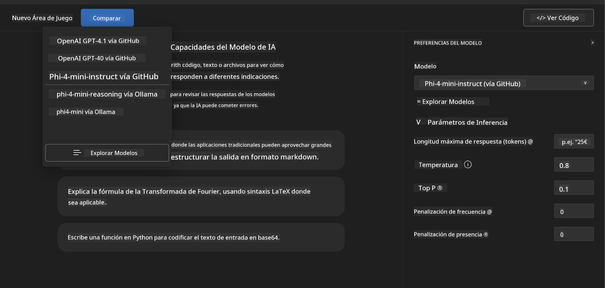
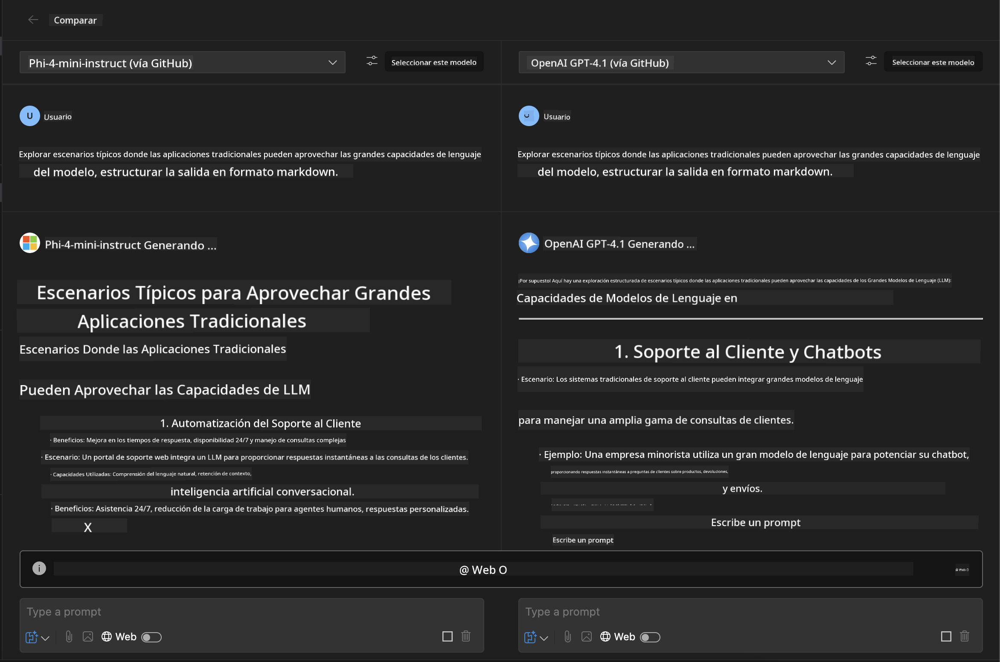
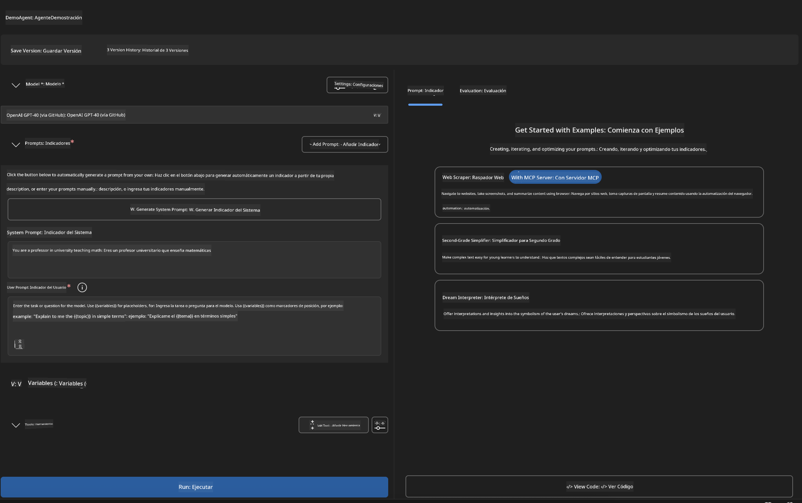
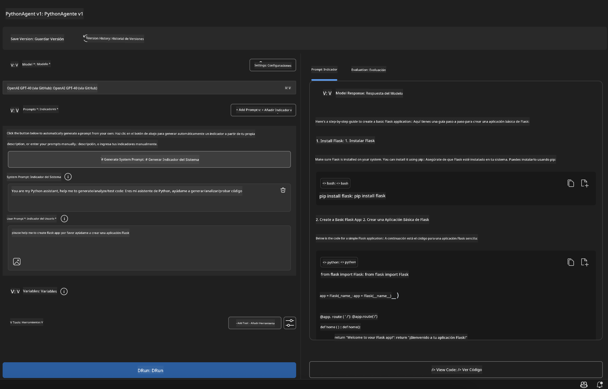

<!--
CO_OP_TRANSLATOR_METADATA:
{
  "original_hash": "2aa9dbc165e104764fa57e8a0d3f1c73",
  "translation_date": "2025-07-14T07:17:49+00:00",
  "source_file": "10-StreamliningAIWorkflowsBuildingAnMCPServerWithAIToolkit/lab1/README.md",
  "language_code": "es"
}
-->
# 🚀 Módulo 1: Fundamentos de AI Toolkit

[]()
[]()
[]()

## 📋 Objetivos de Aprendizaje

Al finalizar este módulo, podrás:
- ✅ Instalar y configurar AI Toolkit para Visual Studio Code
- ✅ Navegar por el Catálogo de Modelos y entender las diferentes fuentes de modelos
- ✅ Usar el Playground para probar y experimentar con modelos
- ✅ Crear agentes de IA personalizados usando Agent Builder
- ✅ Comparar el rendimiento de modelos entre distintos proveedores
- ✅ Aplicar buenas prácticas en ingeniería de prompts

## 🧠 Introducción a AI Toolkit (AITK)

El **AI Toolkit para Visual Studio Code** es la extensión principal de Microsoft que convierte VS Code en un entorno completo para desarrollo de IA. Cierra la brecha entre la investigación en IA y el desarrollo práctico, haciendo la IA generativa accesible para desarrolladores de todos los niveles.

### 🌟 Capacidades Clave

| Funcionalidad | Descripción | Caso de Uso |
|---------------|-------------|-------------|
| **🗂️ Catálogo de Modelos** | Acceso a más de 100 modelos de GitHub, ONNX, OpenAI, Anthropic, Google | Descubrimiento y selección de modelos |
| **🔌 Soporte BYOM** | Integra tus propios modelos (locales o remotos) | Despliegue de modelos personalizados |
| **🎮 Playground Interactivo** | Pruebas en tiempo real con interfaz de chat | Prototipado y pruebas rápidas |
| **📎 Soporte Multimodal** | Maneja texto, imágenes y archivos adjuntos | Aplicaciones de IA complejas |
| **⚡ Procesamiento por Lotes** | Ejecuta múltiples prompts simultáneamente | Flujos de trabajo de prueba eficientes |
| **📊 Evaluación de Modelos** | Métricas integradas (F1, relevancia, similitud, coherencia) | Evaluación de rendimiento |

### 🎯 Por qué AI Toolkit es Importante

- **🚀 Desarrollo Acelerado**: De la idea al prototipo en minutos
- **🔄 Flujo de Trabajo Unificado**: Una sola interfaz para múltiples proveedores de IA
- **🧪 Experimentación Fácil**: Compara modelos sin configuraciones complejas
- **📈 Listo para Producción**: Transición fluida de prototipo a despliegue

## 🛠️ Requisitos Previos y Configuración

### 📦 Instalar la Extensión AI Toolkit

**Paso 1: Acceder al Marketplace de Extensiones**
1. Abre Visual Studio Code
2. Ve a la vista de Extensiones (`Ctrl+Shift+X` o `Cmd+Shift+X`)
3. Busca "AI Toolkit"

**Paso 2: Elige tu Versión**
- **🟢 Versión Estable**: Recomendado para uso en producción
- **🔶 Pre-lanzamiento**: Acceso anticipado a funciones innovadoras

**Paso 3: Instalar y Activar**


### ✅ Lista de Verificación para Verificación
- [ ] El ícono de AI Toolkit aparece en la barra lateral de VS Code
- [ ] La extensión está habilitada y activada
- [ ] No hay errores de instalación en el panel de salida

## 🧪 Ejercicio Práctico 1: Explorando Modelos de GitHub

**🎯 Objetivo**: Dominar el Catálogo de Modelos y probar tu primer modelo de IA

### 📊 Paso 1: Navegar por el Catálogo de Modelos

El Catálogo de Modelos es tu puerta de entrada al ecosistema de IA. Agrega modelos de múltiples proveedores, facilitando su descubrimiento y comparación.

**🔍 Guía de Navegación:**

Haz clic en **MODELS - Catalog** en la barra lateral de AI Toolkit



**💡 Consejo Profesional**: Busca modelos con capacidades específicas que se ajusten a tu caso de uso (por ejemplo, generación de código, escritura creativa, análisis).

**⚠️ Nota**: Los modelos alojados en GitHub (es decir, GitHub Models) son gratuitos pero están sujetos a límites de tasa en solicitudes y tokens. Si quieres acceder a modelos externos (por ejemplo, alojados en Azure AI u otros endpoints), necesitarás proporcionar la clave API o autenticación correspondiente.

### 🚀 Paso 2: Añadir y Configurar tu Primer Modelo

**Estrategia de Selección de Modelo:**
- **GPT-4.1**: Ideal para razonamiento complejo y análisis
- **Phi-4-mini**: Ligero y rápido para tareas simples

**🔧 Proceso de Configuración:**
1. Selecciona **OpenAI GPT-4.1** del catálogo
2. Haz clic en **Add to My Models** para registrar el modelo
3. Elige **Try in Playground** para abrir el entorno de pruebas
4. Espera la inicialización del modelo (la primera vez puede tardar un poco)



**⚙️ Entendiendo los Parámetros del Modelo:**
- **Temperature**: Controla la creatividad (0 = determinista, 1 = creativo)
- **Max Tokens**: Longitud máxima de la respuesta
- **Top-p**: Muestreo núcleo para diversidad en la respuesta

### 🎯 Paso 3: Domina la Interfaz del Playground

El Playground es tu laboratorio de experimentación con IA. Así puedes sacarle el máximo provecho:

**🎨 Buenas Prácticas en Ingeniería de Prompts:**
1. **Sé Específico**: Instrucciones claras y detalladas dan mejores resultados
2. **Proporciona Contexto**: Incluye información relevante de fondo
3. **Usa Ejemplos**: Muestra al modelo lo que quieres con ejemplos
4. **Itera**: Refina los prompts según los resultados iniciales

**🧪 Escenarios de Prueba:**
```markdown
# Example 1: Code Generation
"Write a Python function that calculates the factorial of a number using recursion. Include error handling and docstrings."

# Example 2: Creative Writing
"Write a professional email to a client explaining a project delay, maintaining a positive tone while being transparent about challenges."

# Example 3: Data Analysis
"Analyze this sales data and provide insights: [paste your data]. Focus on trends, anomalies, and actionable recommendations."
```



### 🏆 Ejercicio Desafío: Comparación de Rendimiento de Modelos

**🎯 Meta**: Compara diferentes modelos usando los mismos prompts para entender sus fortalezas

**📋 Instrucciones:**
1. Añade **Phi-4-mini** a tu espacio de trabajo
2. Usa el mismo prompt para GPT-4.1 y Phi-4-mini



3. Compara calidad, velocidad y precisión de las respuestas
4. Documenta tus hallazgos en la sección de resultados



**💡 Ideas Clave para Descubrir:**
- Cuándo usar LLM vs SLM
- Compensación entre costo y rendimiento
- Capacidades especializadas de diferentes modelos

## 🤖 Ejercicio Práctico 2: Creando Agentes Personalizados con Agent Builder

**🎯 Objetivo**: Crear agentes de IA especializados para tareas y flujos de trabajo específicos

### 🏗️ Paso 1: Entendiendo Agent Builder

Agent Builder es donde AI Toolkit realmente destaca. Te permite crear asistentes de IA a medida que combinan el poder de grandes modelos de lenguaje con instrucciones personalizadas, parámetros específicos y conocimiento especializado.

**🧠 Componentes de la Arquitectura del Agente:**
- **Modelo Base**: El LLM fundamental (GPT-4, Groks, Phi, etc.)
- **System Prompt**: Define la personalidad y comportamiento del agente
- **Parámetros**: Configuraciones ajustadas para un rendimiento óptimo
- **Integración de Herramientas**: Conexión a APIs externas y servicios MCP
- **Memoria**: Contexto de conversación y persistencia de sesión



### ⚙️ Paso 2: Profundizando en la Configuración del Agente

**🎨 Creando System Prompts Efectivos:**
```markdown
# Template Structure:
## Role Definition
You are a [specific role] with expertise in [domain].

## Capabilities
- List specific abilities
- Define scope of knowledge
- Clarify limitations

## Behavior Guidelines
- Response style (formal, casual, technical)
- Output format preferences
- Error handling approach

## Examples
Provide 2-3 examples of ideal interactions
```

*Por supuesto, también puedes usar Generate System Prompt para que la IA te ayude a generar y optimizar prompts*

**🔧 Optimización de Parámetros:**
| Parámetro | Rango Recomendado | Caso de Uso |
|-----------|-------------------|-------------|
| **Temperature** | 0.1-0.3 | Respuestas técnicas/factuales |
| **Temperature** | 0.7-0.9 | Tareas creativas/brainstorming |
| **Max Tokens** | 500-1000 | Respuestas concisas |
| **Max Tokens** | 2000-4000 | Explicaciones detalladas |

### 🐍 Paso 3: Ejercicio Práctico - Agente de Programación en Python

**🎯 Misión**: Crear un asistente especializado en codificación Python

**📋 Pasos de Configuración:**

1. **Selección de Modelo**: Elige **Claude 3.5 Sonnet** (excelente para código)

2. **Diseño del System Prompt**:
```markdown
# Python Programming Expert Agent

## Role
You are a senior Python developer with 10+ years of experience. You excel at writing clean, efficient, and well-documented Python code.

## Capabilities
- Write production-ready Python code
- Debug complex issues
- Explain code concepts clearly
- Suggest best practices and optimizations
- Provide complete working examples

## Response Format
- Always include docstrings
- Add inline comments for complex logic
- Suggest testing approaches
- Mention relevant libraries when applicable

## Code Quality Standards
- Follow PEP 8 style guidelines
- Use type hints where appropriate
- Handle exceptions gracefully
- Write readable, maintainable code
```

3. **Configuración de Parámetros**:
   - Temperature: 0.2 (para código consistente y confiable)
   - Max Tokens: 2000 (explicaciones detalladas)
   - Top-p: 0.9 (creatividad equilibrada)



### 🧪 Paso 4: Prueba de tu Agente Python

**Escenarios de Prueba:**
1. **Función Básica**: "Crea una función para encontrar números primos"
2. **Algoritmo Complejo**: "Implementa un árbol binario de búsqueda con métodos de inserción, eliminación y búsqueda"
3. **Problema Real**: "Construye un scraper web que maneje limitación de tasa y reintentos"
4. **Depuración**: "Corrige este código [pega código con errores]"

**🏆 Criterios de Éxito:**
- ✅ El código se ejecuta sin errores
- ✅ Incluye documentación adecuada
- ✅ Sigue las mejores prácticas de Python
- ✅ Proporciona explicaciones claras
- ✅ Sugiere mejoras

## 🎓 Cierre del Módulo 1 y Próximos Pasos

### 📊 Verificación de Conocimientos

Pon a prueba lo aprendido:
- [ ] ¿Puedes explicar la diferencia entre los modelos del catálogo?
- [ ] ¿Has creado y probado con éxito un agente personalizado?
- [ ] ¿Entiendes cómo optimizar parámetros para distintos casos de uso?
- [ ] ¿Puedes diseñar system prompts efectivos?

### 📚 Recursos Adicionales

- **Documentación de AI Toolkit**: [Documentación Oficial de Microsoft](https://github.com/microsoft/vscode-ai-toolkit)
- **Guía de Ingeniería de Prompts**: [Mejores Prácticas](https://platform.openai.com/docs/guides/prompt-engineering)
- **Modelos en AI Toolkit**: [Modelos en Desarrollo](https://github.com/microsoft/vscode-ai-toolkit/blob/main/doc/models.md)

**🎉 ¡Felicidades!** Has dominado los fundamentos de AI Toolkit y estás listo para crear aplicaciones de IA más avanzadas.

### 🔜 Continúa con el Siguiente Módulo

¿Listo para capacidades más avanzadas? Continúa con **[Módulo 2: Fundamentos de MCP con AI Toolkit](../lab2/README.md)** donde aprenderás a:
- Conectar tus agentes con herramientas externas usando Model Context Protocol (MCP)
- Construir agentes de automatización de navegador con Playwright
- Integrar servidores MCP con tus agentes AI Toolkit
- Potenciar tus agentes con datos y capacidades externas

**Aviso legal**:  
Este documento ha sido traducido utilizando el servicio de traducción automática [Co-op Translator](https://github.com/Azure/co-op-translator). Aunque nos esforzamos por la precisión, tenga en cuenta que las traducciones automáticas pueden contener errores o inexactitudes. El documento original en su idioma nativo debe considerarse la fuente autorizada. Para información crítica, se recomienda la traducción profesional realizada por humanos. No nos hacemos responsables de malentendidos o interpretaciones erróneas derivadas del uso de esta traducción.