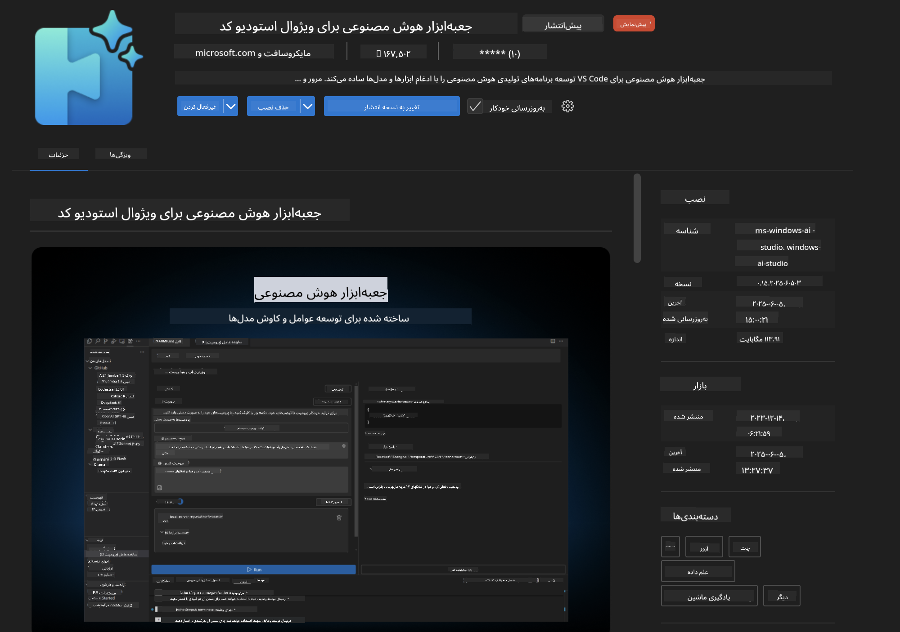
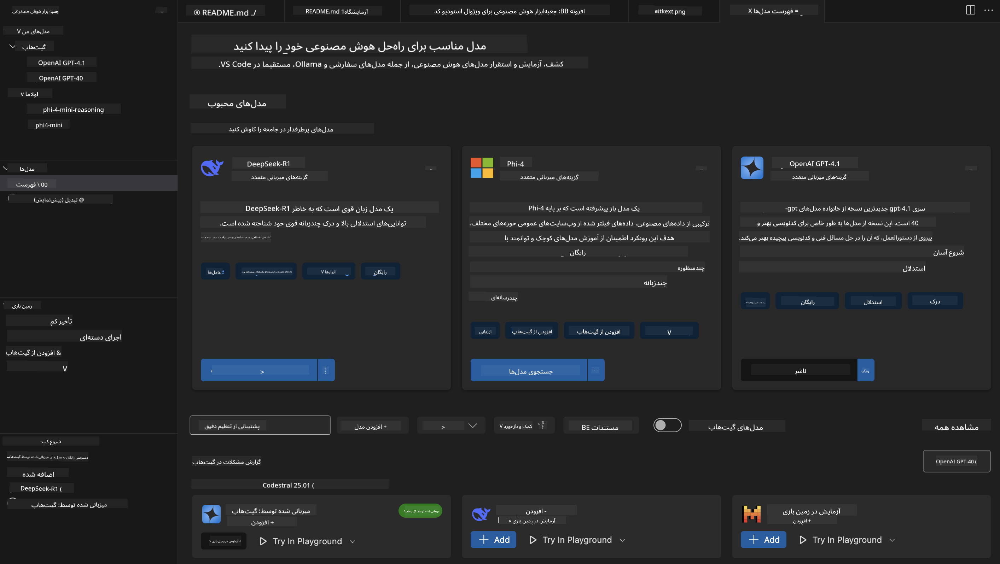
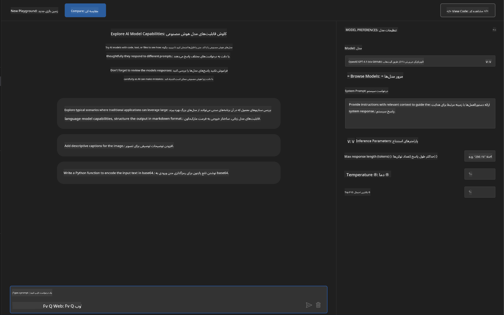
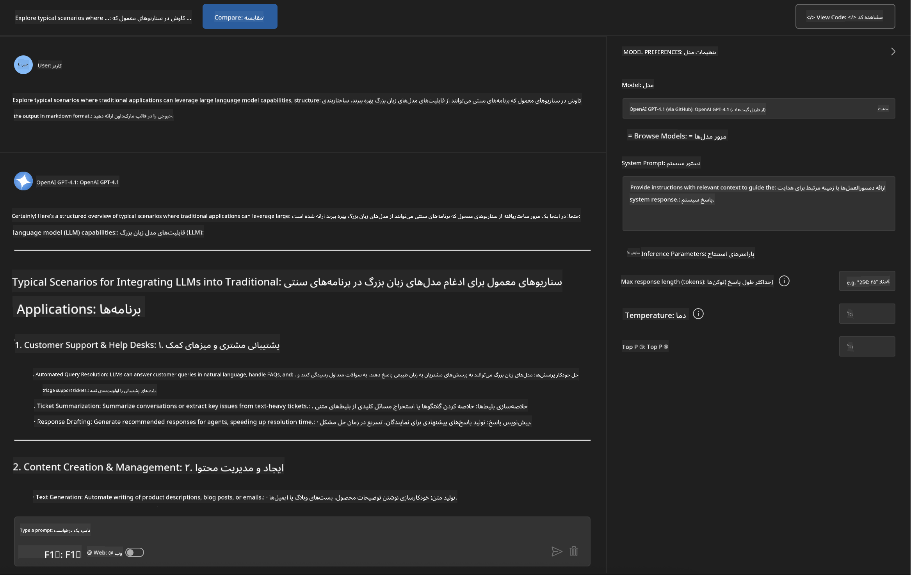
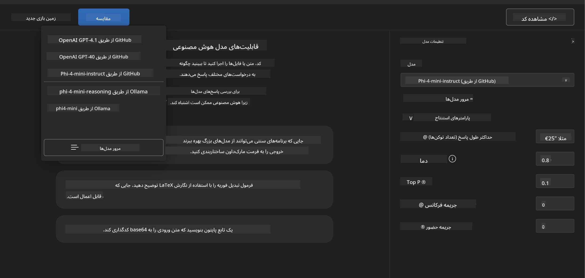
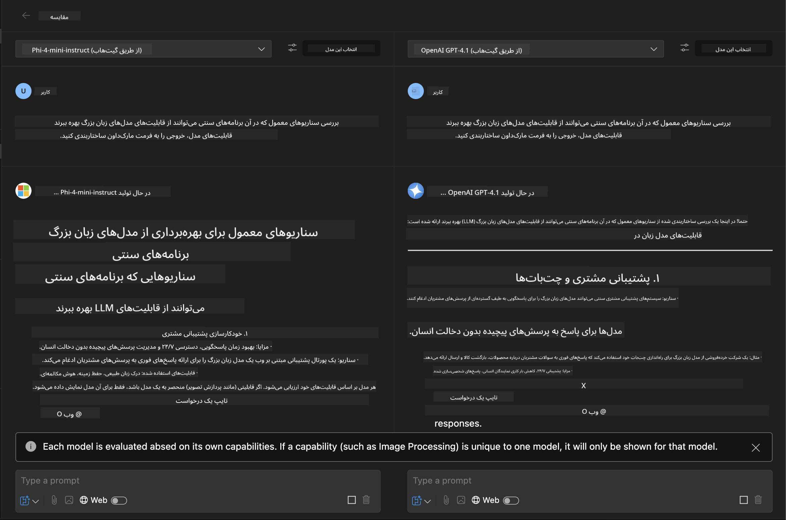
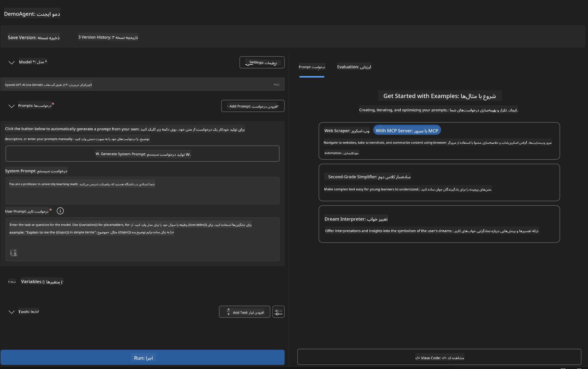
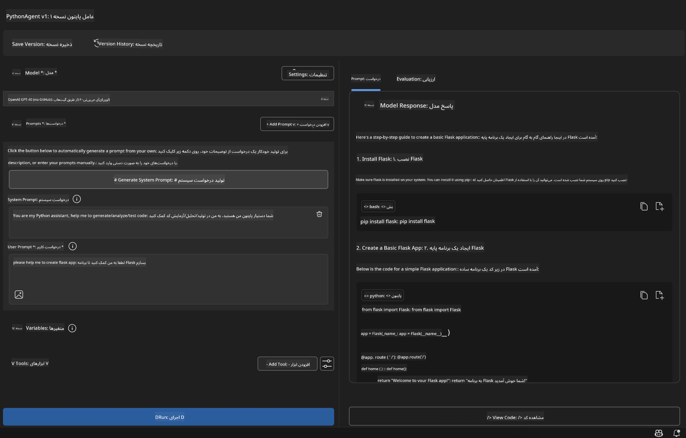

<!--
CO_OP_TRANSLATOR_METADATA:
{
  "original_hash": "2aa9dbc165e104764fa57e8a0d3f1c73",
  "translation_date": "2025-07-14T07:19:21+00:00",
  "source_file": "10-StreamliningAIWorkflowsBuildingAnMCPServerWithAIToolkit/lab1/README.md",
  "language_code": "fa"
}
-->
# 🚀 ماژول ۱: مبانی AI Toolkit

[]()
[]()
[]()

## 📋 اهداف یادگیری

در پایان این ماژول، شما قادر خواهید بود:
- ✅ نصب و پیکربندی AI Toolkit برای Visual Studio Code
- ✅ مرور کاتالوگ مدل‌ها و درک منابع مختلف مدل‌ها
- ✅ استفاده از Playground برای آزمایش و تجربه مدل‌ها
- ✅ ساخت عوامل هوش مصنوعی سفارشی با استفاده از Agent Builder
- ✅ مقایسه عملکرد مدل‌ها در ارائه‌دهندگان مختلف
- ✅ به‌کارگیری بهترین روش‌ها در مهندسی پرامپت

## 🧠 معرفی AI Toolkit (AITK)

**AI Toolkit برای Visual Studio Code** افزونه اصلی مایکروسافت است که VS Code را به یک محیط توسعه جامع هوش مصنوعی تبدیل می‌کند. این ابزار فاصله بین تحقیقات هوش مصنوعی و توسعه کاربردی را پر می‌کند و هوش مصنوعی مولد را برای توسعه‌دهندگان با هر سطح مهارتی قابل دسترس می‌سازد.

### 🌟 قابلیت‌های کلیدی

| ویژگی | توضیح | کاربرد |
|---------|-------------|----------|
| **🗂️ کاتالوگ مدل‌ها** | دسترسی به بیش از ۱۰۰ مدل از GitHub، ONNX، OpenAI، Anthropic، Google | کشف و انتخاب مدل |
| **🔌 پشتیبانی BYOM** | ادغام مدل‌های خودتان (محلی/راه دور) | استقرار مدل سفارشی |
| **🎮 محیط تعاملی Playground** | آزمایش مدل در زمان واقعی با رابط چت | نمونه‌سازی سریع و تست |
| **📎 پشتیبانی چندرسانه‌ای** | مدیریت متن، تصویر و پیوست‌ها | برنامه‌های پیچیده هوش مصنوعی |
| **⚡ پردازش دسته‌ای** | اجرای همزمان چند پرامپت | جریان کاری تست بهینه |
| **📊 ارزیابی مدل** | معیارهای داخلی (F1، مرتبط بودن، شباهت، انسجام) | ارزیابی عملکرد |

### 🎯 چرا AI Toolkit اهمیت دارد

- **🚀 توسعه سریع‌تر**: از ایده تا نمونه اولیه در چند دقیقه
- **🔄 جریان کاری یکپارچه**: یک رابط برای چندین ارائه‌دهنده هوش مصنوعی
- **🧪 آزمایش آسان**: مقایسه مدل‌ها بدون نیاز به تنظیمات پیچیده
- **📈 آماده تولید**: انتقال بی‌دردسر از نمونه اولیه به استقرار

## 🛠️ پیش‌نیازها و راه‌اندازی

### 📦 نصب افزونه AI Toolkit

**گام ۱: دسترسی به بازارچه افزونه‌ها**
1. Visual Studio Code را باز کنید
2. به نمای Extensions بروید (`Ctrl+Shift+X` یا `Cmd+Shift+X`)
3. جستجو کنید برای "AI Toolkit"

**گام ۲: انتخاب نسخه مورد نظر**
- **🟢 نسخه پایدار**: توصیه شده برای استفاده در تولید
- **🔶 نسخه پیش‌انتشار**: دسترسی زودهنگام به ویژگی‌های جدید

**گام ۳: نصب و فعال‌سازی**



### ✅ چک‌لیست تایید
- [ ] آیکون AI Toolkit در نوار کناری VS Code ظاهر شده است
- [ ] افزونه فعال و روشن است
- [ ] هیچ خطای نصب در پنل خروجی وجود ندارد

## 🧪 تمرین عملی ۱: کاوش مدل‌های GitHub

**🎯 هدف**: تسلط بر کاتالوگ مدل‌ها و آزمایش اولین مدل هوش مصنوعی خود

### 📊 گام ۱: مرور کاتالوگ مدل‌ها

کاتالوگ مدل‌ها دروازه شما به اکوسیستم هوش مصنوعی است. این کاتالوگ مدل‌ها را از چندین ارائه‌دهنده جمع‌آوری می‌کند و کشف و مقایسه گزینه‌ها را آسان می‌سازد.

**🔍 راهنمای مرور:**

روی **MODELS - Catalog** در نوار کناری AI Toolkit کلیک کنید



**💡 نکته حرفه‌ای**: به دنبال مدل‌هایی باشید که قابلیت‌های خاصی متناسب با نیاز شما دارند (مثلاً تولید کد، نوشتن خلاقانه، تحلیل).

**⚠️ توجه**: مدل‌های میزبانی شده در GitHub (یعنی GitHub Models) رایگان هستند اما محدودیت‌هایی در تعداد درخواست‌ها و توکن‌ها دارند. اگر می‌خواهید به مدل‌های غیر GitHub (مدل‌های خارجی میزبانی شده از طریق Azure AI یا سایر نقاط انتهایی) دسترسی داشته باشید، باید کلید API یا احراز هویت مناسب را ارائه دهید.

### 🚀 گام ۲: افزودن و پیکربندی اولین مدل خود

**استراتژی انتخاب مدل:**
- **GPT-4.1**: بهترین گزینه برای استدلال و تحلیل پیچیده
- **Phi-4-mini**: سبک و پاسخ سریع برای کارهای ساده

**🔧 روند پیکربندی:**
1. از کاتالوگ، **OpenAI GPT-4.1** را انتخاب کنید
2. روی **Add to My Models** کلیک کنید تا مدل برای استفاده ثبت شود
3. گزینه **Try in Playground** را انتخاب کنید تا محیط تست باز شود
4. منتظر بمانید تا مدل راه‌اندازی شود (راه‌اندازی اولیه ممکن است کمی طول بکشد)



**⚙️ آشنایی با پارامترهای مدل:**
- **Temperature**: کنترل خلاقیت (۰ = قطعی، ۱ = خلاقانه)
- **Max Tokens**: حداکثر طول پاسخ
- **Top-p**: نمونه‌گیری هسته‌ای برای تنوع پاسخ

### 🎯 گام ۳: تسلط بر رابط Playground

Playground آزمایشگاه تجربه هوش مصنوعی شماست. در اینجا نحوه بهره‌برداری حداکثری از آن آمده است:

**🎨 بهترین روش‌های مهندسی پرامپت:**
1. **خاص باشید**: دستورالعمل‌های واضح و دقیق نتایج بهتری می‌دهد
2. **زمینه ارائه دهید**: اطلاعات مرتبط را اضافه کنید
3. **از مثال‌ها استفاده کنید**: با مثال‌ها به مدل نشان دهید چه می‌خواهید
4. **تکرار کنید**: پرامپت‌ها را بر اساس نتایج اولیه اصلاح کنید

**🧪 سناریوهای تست:**
```markdown
# Example 1: Code Generation
"Write a Python function that calculates the factorial of a number using recursion. Include error handling and docstrings."

# Example 2: Creative Writing
"Write a professional email to a client explaining a project delay, maintaining a positive tone while being transparent about challenges."

# Example 3: Data Analysis
"Analyze this sales data and provide insights: [paste your data]. Focus on trends, anomalies, and actionable recommendations."
```



### 🏆 تمرین چالشی: مقایسه عملکرد مدل‌ها

**🎯 هدف**: مقایسه مدل‌های مختلف با استفاده از پرامپت‌های یکسان برای درک نقاط قوت آن‌ها

**📋 دستورالعمل‌ها:**
1. **Phi-4-mini** را به فضای کاری خود اضافه کنید
2. از همان پرامپت برای هر دو مدل GPT-4.1 و Phi-4-mini استفاده کنید



3. کیفیت، سرعت و دقت پاسخ‌ها را مقایسه کنید
4. یافته‌های خود را در بخش نتایج مستند کنید



**💡 نکات کلیدی برای کشف:**
- چه زمانی از LLM و چه زمانی از SLM استفاده کنیم
- موازنه هزینه و عملکرد
- قابلیت‌های تخصصی مدل‌های مختلف

## 🤖 تمرین عملی ۲: ساخت عوامل سفارشی با Agent Builder

**🎯 هدف**: ایجاد عوامل هوش مصنوعی تخصصی برای وظایف و جریان‌های کاری خاص

### 🏗️ گام ۱: آشنایی با Agent Builder

Agent Builder جایی است که AI Toolkit واقعاً می‌درخشد. این ابزار به شما امکان می‌دهد دستیاران هوش مصنوعی هدفمند بسازید که قدرت مدل‌های زبان بزرگ را با دستورالعمل‌های سفارشی، پارامترهای خاص و دانش تخصصی ترکیب می‌کنند.

**🧠 اجزای معماری عامل:**
- **مدل اصلی**: پایه LLM (GPT-4، Groks، Phi و غیره)
- **پرامپت سیستم**: شخصیت و رفتار عامل را تعریف می‌کند
- **پارامترها**: تنظیمات دقیق برای عملکرد بهینه
- **ادغام ابزارها**: اتصال به APIهای خارجی و سرویس‌های MCP
- **حافظه**: زمینه گفتگو و حفظ جلسه



### ⚙️ گام ۲: بررسی عمیق پیکربندی عامل

**🎨 ایجاد پرامپت‌های سیستم موثر:**
```markdown
# Template Structure:
## Role Definition
You are a [specific role] with expertise in [domain].

## Capabilities
- List specific abilities
- Define scope of knowledge
- Clarify limitations

## Behavior Guidelines
- Response style (formal, casual, technical)
- Output format preferences
- Error handling approach

## Examples
Provide 2-3 examples of ideal interactions
```

*البته، می‌توانید از Generate System Prompt نیز استفاده کنید تا AI به شما در تولید و بهینه‌سازی پرامپت‌ها کمک کند*

**🔧 بهینه‌سازی پارامترها:**
| پارامتر | بازه پیشنهادی | کاربرد |
|-----------|------------------|----------|
| **Temperature** | ۰.۱-۰.۳ | پاسخ‌های فنی/واقعی |
| **Temperature** | ۰.۷-۰.۹ | وظایف خلاقانه/طوفان فکری |
| **Max Tokens** | ۵۰۰-۱۰۰۰ | پاسخ‌های مختصر |
| **Max Tokens** | ۲۰۰۰-۴۰۰۰ | توضیحات مفصل |

### 🐍 گام ۳: تمرین عملی - عامل برنامه‌نویسی پایتون

**🎯 ماموریت**: ساخت دستیار تخصصی کدنویسی پایتون

**📋 مراحل پیکربندی:**

1. **انتخاب مدل**: انتخاب **Claude 3.5 Sonnet** (عالی برای کد)

2. **طراحی پرامپت سیستم**:
```markdown
# Python Programming Expert Agent

## Role
You are a senior Python developer with 10+ years of experience. You excel at writing clean, efficient, and well-documented Python code.

## Capabilities
- Write production-ready Python code
- Debug complex issues
- Explain code concepts clearly
- Suggest best practices and optimizations
- Provide complete working examples

## Response Format
- Always include docstrings
- Add inline comments for complex logic
- Suggest testing approaches
- Mention relevant libraries when applicable

## Code Quality Standards
- Follow PEP 8 style guidelines
- Use type hints where appropriate
- Handle exceptions gracefully
- Write readable, maintainable code
```

3. **پیکربندی پارامترها**:
   - Temperature: ۰.۲ (برای کد پایدار و قابل اعتماد)
   - Max Tokens: ۲۰۰۰ (توضیحات مفصل)
   - Top-p: ۰.۹ (خلاقیت متعادل)



### 🧪 گام ۴: آزمایش عامل پایتون خود

**سناریوهای تست:**
1. **تابع پایه**: "یک تابع برای یافتن اعداد اول بساز"
2. **الگوریتم پیچیده**: "یک درخت جستجوی دودویی با متدهای درج، حذف و جستجو پیاده‌سازی کن"
3. **مسئله دنیای واقعی**: "یک وب اسکرپر بساز که محدودیت نرخ و تلاش مجدد را مدیریت کند"
4. **اشکال‌زدایی**: "این کد را اصلاح کن [کد مشکل‌دار را بچسبان]"

**🏆 معیارهای موفقیت:**
- ✅ کد بدون خطا اجرا می‌شود
- ✅ مستندات مناسب دارد
- ✅ بهترین شیوه‌های پایتون را دنبال می‌کند
- ✅ توضیحات واضح ارائه می‌دهد
- ✅ پیشنهاد بهبود می‌دهد

## 🎓 جمع‌بندی ماژول ۱ و گام‌های بعدی

### 📊 آزمون دانش

درک خود را بسنجید:
- [ ] می‌توانید تفاوت مدل‌ها در کاتالوگ را توضیح دهید؟
- [ ] آیا موفق به ساخت و آزمایش یک عامل سفارشی شده‌اید؟
- [ ] آیا می‌دانید چگونه پارامترها را برای کاربردهای مختلف بهینه کنید؟
- [ ] می‌توانید پرامپت‌های سیستم موثر طراحی کنید؟

### 📚 منابع اضافی

- **مستندات AI Toolkit**: [مستندات رسمی مایکروسافت](https://github.com/microsoft/vscode-ai-toolkit)
- **راهنمای مهندسی پرامپت**: [بهترین روش‌ها](https://platform.openai.com/docs/guides/prompt-engineering)
- **مدل‌ها در AI Toolkit**: [مدل‌های در حال توسعه](https://github.com/microsoft/vscode-ai-toolkit/blob/main/doc/models.md)

**🎉 تبریک!** شما مبانی AI Toolkit را به خوبی فرا گرفته‌اید و آماده‌اید تا برنامه‌های هوش مصنوعی پیشرفته‌تری بسازید!

### 🔜 ادامه به ماژول بعدی

آماده قابلیت‌های پیشرفته‌تر هستید؟ به **[ماژول ۲: MCP با مبانی AI Toolkit](../lab2/README.md)** بروید تا یاد بگیرید چگونه:
- عوامل خود را با ابزارهای خارجی از طریق Model Context Protocol (MCP) متصل کنید
- عوامل اتوماسیون مرورگر با Playwright بسازید
- سرورهای MCP را با عوامل AI Toolkit خود ادغام کنید
- عوامل خود را با داده‌ها و قابلیت‌های خارجی تقویت کنید

**سلب مسئولیت**:  
این سند با استفاده از سرویس ترجمه هوش مصنوعی [Co-op Translator](https://github.com/Azure/co-op-translator) ترجمه شده است. در حالی که ما در تلاش برای دقت هستیم، لطفاً توجه داشته باشید که ترجمه‌های خودکار ممکن است حاوی خطاها یا نواقصی باشند. سند اصلی به زبان بومی خود باید به عنوان منبع معتبر در نظر گرفته شود. برای اطلاعات حیاتی، ترجمه حرفه‌ای انسانی توصیه می‌شود. ما مسئول هیچ گونه سوءتفاهم یا تفسیر نادرستی که از استفاده این ترجمه ناشی شود، نیستیم.