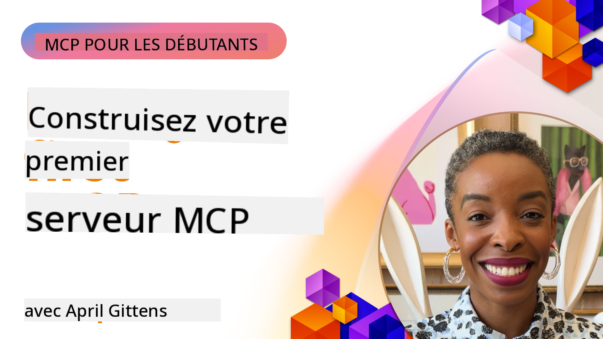

<!--
CO_OP_TRANSLATOR_METADATA:
{
  "original_hash": "f400d87053221363769113c24f117248",
  "translation_date": "2025-10-06T21:53:25+00:00",
  "source_file": "03-GettingStarted/README.md",
  "language_code": "fr"
}
-->
## Premiers Pas  

_(Cliquez sur l'image ci-dessus pour visionner la vidéo de cette leçon)_

Cette section comprend plusieurs leçons :

- **1 Votre premier serveur**, dans cette première leçon, vous apprendrez à créer votre premier serveur et à l'inspecter avec l'outil d'inspection, un moyen précieux pour tester et déboguer votre serveur, [vers la leçon](01-first-server/README.md)

- **2 Client**, dans cette leçon, vous apprendrez à écrire un client capable de se connecter à votre serveur, [vers la leçon](02-client/README.md)

- **3 Client avec LLM**, une méthode encore meilleure pour écrire un client consiste à y ajouter un LLM afin qu'il puisse "négocier" avec votre serveur sur les actions à effectuer, [vers la leçon](03-llm-client/README.md)

- **4 Consommer un serveur en mode Agent GitHub Copilot dans Visual Studio Code**. Ici, nous examinons l'exécution de notre serveur MCP depuis Visual Studio Code, [vers la leçon](04-vscode/README.md)

- **5 Serveur de transport stdio**. Le transport stdio est la norme recommandée pour la communication serveur-client MCP dans la spécification actuelle, offrant une communication sécurisée basée sur des sous-processus, [vers la leçon](05-stdio-server/README.md)

- **6 Streaming HTTP avec MCP (HTTP Streamable)**. Découvrez le streaming HTTP moderne, les notifications de progression, et comment implémenter des serveurs et clients MCP évolutifs en temps réel en utilisant HTTP Streamable, [vers la leçon](06-http-streaming/README.md)

- **7 Utilisation de l'AI Toolkit pour VSCode** pour consommer et tester vos clients et serveurs MCP, [vers la leçon](07-aitk/README.md)

- **8 Tests**. Ici, nous nous concentrerons sur les différentes façons de tester votre serveur et votre client, [vers la leçon](08-testing/README.md)

- **9 Déploiement**. Ce chapitre examinera les différentes façons de déployer vos solutions MCP, [vers la leçon](09-deployment/README.md)

- **10 Utilisation avancée du serveur**. Ce chapitre couvre l'utilisation avancée du serveur, [vers la leçon](./10-advanced/README.md)

- **11 Authentification**. Ce chapitre explique comment ajouter une authentification simple, allant de l'authentification de base à l'utilisation de JWT et RBAC. Il est conseillé de commencer ici, puis de consulter les sujets avancés du chapitre 5 et de renforcer la sécurité via les recommandations du chapitre 2, [vers la leçon](./11-simple-auth/README.md)

Le protocole Model Context Protocol (MCP) est un protocole ouvert qui standardise la manière dont les applications fournissent un contexte aux LLMs. Pensez au MCP comme à un port USB-C pour les applications d'IA - il offre une méthode standardisée pour connecter des modèles d'IA à différentes sources de données et outils.

## Objectifs d'apprentissage

À la fin de cette leçon, vous serez capable de :

- Configurer des environnements de développement pour MCP en C#, Java, Python, TypeScript et JavaScript
- Construire et déployer des serveurs MCP basiques avec des fonctionnalités personnalisées (ressources, invites et outils)
- Créer des applications hôtes qui se connectent aux serveurs MCP
- Tester et déboguer les implémentations MCP
- Comprendre les défis courants de configuration et leurs solutions
- Connecter vos implémentations MCP à des services LLM populaires

## Configuration de votre environnement MCP

Avant de commencer à travailler avec MCP, il est important de préparer votre environnement de développement et de comprendre le flux de travail de base. Cette section vous guidera à travers les étapes initiales pour garantir un démarrage fluide avec MCP.

### Prérequis

Avant de vous lancer dans le développement MCP, assurez-vous d'avoir :

- **Environnement de développement** : Pour le langage de votre choix (C#, Java, Python, TypeScript ou JavaScript)
- **IDE/Éditeur** : Visual Studio, Visual Studio Code, IntelliJ, Eclipse, PyCharm ou tout éditeur de code moderne
- **Gestionnaires de paquets** : NuGet, Maven/Gradle, pip ou npm/yarn
- **Clés API** : Pour les services d'IA que vous prévoyez d'utiliser dans vos applications hôtes

### SDKs officiels

Dans les chapitres à venir, vous découvrirez des solutions construites en Python, TypeScript, Java et .NET. Voici tous les SDKs officiellement pris en charge.

MCP propose des SDKs officiels pour plusieurs langages :
- [SDK C#](https://github.com/modelcontextprotocol/csharp-sdk) - Maintenu en collaboration avec Microsoft
- [SDK Java](https://github.com/modelcontextprotocol/java-sdk) - Maintenu en collaboration avec Spring AI
- [SDK TypeScript](https://github.com/modelcontextprotocol/typescript-sdk) - L'implémentation officielle en TypeScript
- [SDK Python](https://github.com/modelcontextprotocol/python-sdk) - L'implémentation officielle en Python
- [SDK Kotlin](https://github.com/modelcontextprotocol/kotlin-sdk) - L'implémentation officielle en Kotlin
- [SDK Swift](https://github.com/modelcontextprotocol/swift-sdk) - Maintenu en collaboration avec Loopwork AI
- [SDK Rust](https://github.com/modelcontextprotocol/rust-sdk) - L'implémentation officielle en Rust

## Points clés

- Configurer un environnement de développement MCP est simple grâce aux SDKs spécifiques à chaque langage
- Construire des serveurs MCP implique de créer et d'enregistrer des outils avec des schémas clairs
- Les clients MCP se connectent aux serveurs et modèles pour exploiter des capacités étendues
- Les tests et le débogage sont essentiels pour des implémentations MCP fiables
- Les options de déploiement vont du développement local aux solutions basées sur le cloud

## Pratique

Nous avons un ensemble d'exemples qui complètent les exercices que vous verrez dans tous les chapitres de cette section. De plus, chaque chapitre propose ses propres exercices et devoirs.

- [Calculatrice Java](./samples/java/calculator/README.md)
- [Calculatrice .Net](../../../03-GettingStarted/samples/csharp)
- [Calculatrice JavaScript](./samples/javascript/README.md)
- [Calculatrice TypeScript](./samples/typescript/README.md)
- [Calculatrice Python](../../../03-GettingStarted/samples/python)

## Ressources supplémentaires

- [Créer des agents en utilisant le Model Context Protocol sur Azure](https://learn.microsoft.com/azure/developer/ai/intro-agents-mcp)
- [MCP à distance avec Azure Container Apps (Node.js/TypeScript/JavaScript)](https://learn.microsoft.com/samples/azure-samples/mcp-container-ts/mcp-container-ts/)
- [Agent MCP OpenAI .NET](https://learn.microsoft.com/samples/azure-samples/openai-mcp-agent-dotnet/openai-mcp-agent-dotnet/)

## Et après ?

Suivant : [Créer votre premier serveur MCP](01-first-server/README.md)

---

**Avertissement** :  
Ce document a été traduit à l'aide du service de traduction automatique [Co-op Translator](https://github.com/Azure/co-op-translator). Bien que nous nous efforcions d'assurer l'exactitude, veuillez noter que les traductions automatisées peuvent contenir des erreurs ou des inexactitudes. Le document original dans sa langue d'origine doit être considéré comme la source faisant autorité. Pour des informations critiques, il est recommandé de recourir à une traduction humaine professionnelle. Nous déclinons toute responsabilité en cas de malentendus ou d'interprétations erronées résultant de l'utilisation de cette traduction.