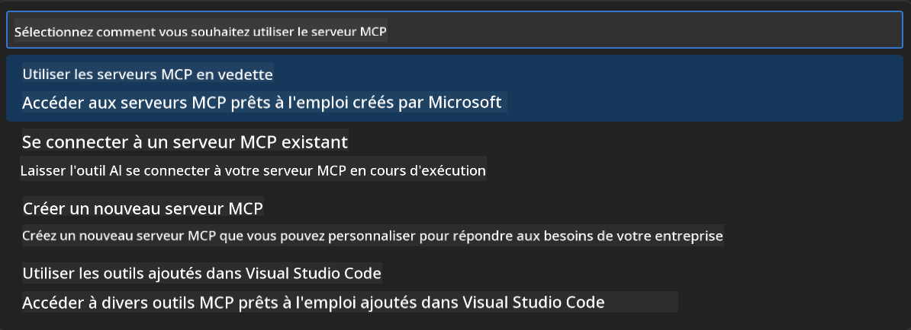
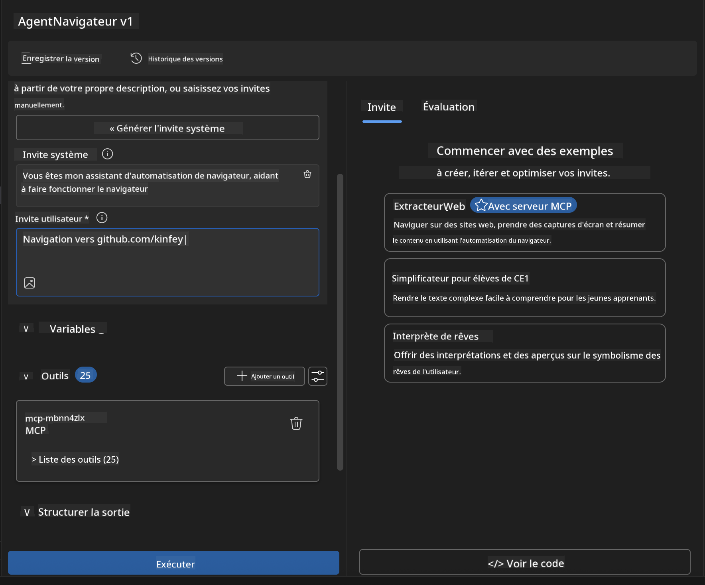
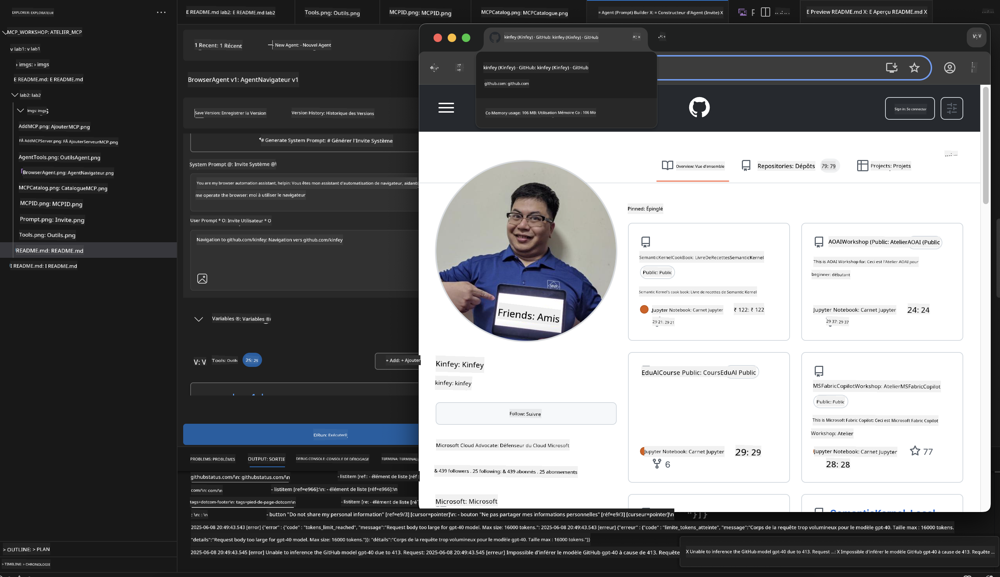
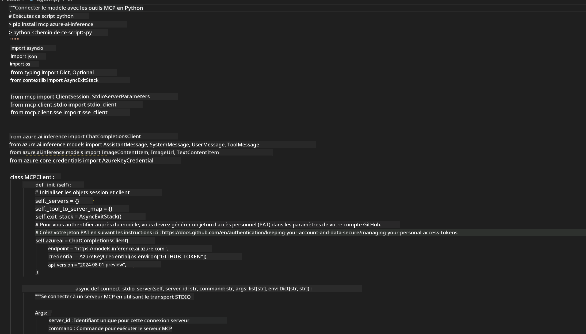

<!--
CO_OP_TRANSLATOR_METADATA:
{
  "original_hash": "a22b7dd11cd7690f99f9195877cafdc3",
  "translation_date": "2025-07-14T07:38:55+00:00",
  "source_file": "10-StreamliningAIWorkflowsBuildingAnMCPServerWithAIToolkit/lab2/README.md",
  "language_code": "fr"
}
-->
# 🌐 Module 2 : Fondamentaux du MCP avec AI Toolkit

[]()
[]()
[]()

## 📋 Objectifs d'apprentissage

À la fin de ce module, vous serez capable de :
- ✅ Comprendre l’architecture et les avantages du Model Context Protocol (MCP)
- ✅ Explorer l’écosystème des serveurs MCP de Microsoft
- ✅ Intégrer les serveurs MCP avec AI Toolkit Agent Builder
- ✅ Construire un agent d’automatisation de navigateur fonctionnel avec Playwright MCP
- ✅ Configurer et tester les outils MCP dans vos agents
- ✅ Exporter et déployer des agents propulsés par MCP en production

## 🎯 Bâtir sur le Module 1

Dans le Module 1, nous avons maîtrisé les bases d’AI Toolkit et créé notre premier agent Python. Maintenant, nous allons **booster** vos agents en les connectant à des outils et services externes grâce au révolutionnaire **Model Context Protocol (MCP)**.

Pensez à cela comme passer d’une simple calculatrice à un véritable ordinateur — vos agents IA pourront désormais :
- 🌐 Naviguer et interagir avec des sites web
- 📁 Accéder et manipuler des fichiers
- 🔧 S’intégrer aux systèmes d’entreprise
- 📊 Traiter des données en temps réel via des API

## 🧠 Comprendre le Model Context Protocol (MCP)

### 🔍 Qu’est-ce que le MCP ?

Le Model Context Protocol (MCP) est le **« USB-C des applications IA »** — une norme ouverte révolutionnaire qui connecte les grands modèles de langage (LLM) à des outils, sources de données et services externes. Tout comme l’USB-C a mis fin au chaos des câbles en proposant un connecteur universel, le MCP simplifie l’intégration IA avec un protocole standardisé unique.

### 🎯 Le problème que résout le MCP

**Avant le MCP :**
- 🔧 Intégrations personnalisées pour chaque outil
- 🔄 Verrouillage fournisseur avec des solutions propriétaires  
- 🔒 Vulnérabilités de sécurité dues à des connexions ad hoc
- ⏱️ Des mois de développement pour des intégrations basiques

**Avec le MCP :**
- ⚡ Intégration d’outils en plug-and-play
- 🔄 Architecture indépendante des fournisseurs
- 🛡️ Meilleures pratiques de sécurité intégrées
- 🚀 Ajout de nouvelles fonctionnalités en quelques minutes

### 🏗️ Plongée dans l’architecture MCP

Le MCP suit une **architecture client-serveur** qui crée un écosystème sécurisé et évolutif :

```mermaid
graph TB
    A[AI Application/Agent] --> B[MCP Client]
    B --> C[MCP Server 1: Files]
    B --> D[MCP Server 2: Web APIs]
    B --> E[MCP Server 3: Database]
    B --> F[MCP Server N: Custom Tools]
    
    C --> G[Local File System]
    D --> H[External APIs]
    E --> I[Database Systems]
    F --> J[Enterprise Systems]
```

**🔧 Composants clés :**

| Composant | Rôle | Exemples |
|-----------|------|----------|
| **MCP Hosts** | Applications consommant les services MCP | Claude Desktop, VS Code, AI Toolkit |
| **MCP Clients** | Gestionnaires de protocole (1:1 avec serveurs) | Intégrés dans les applications hôtes |
| **MCP Servers** | Exposent des fonctionnalités via un protocole standard | Playwright, Files, Azure, GitHub |
| **Couche de transport** | Méthodes de communication | stdio, HTTP, WebSockets |

## 🏢 L’écosystème des serveurs MCP de Microsoft

Microsoft est à la pointe de l’écosystème MCP avec une suite complète de serveurs de niveau entreprise répondant à des besoins métiers concrets.

### 🌟 Serveurs MCP Microsoft phares

#### 1. ☁️ Azure MCP Server  
**🔗 Dépôt** : [azure/azure-mcp](https://github.com/azure/azure-mcp)  
**🎯 Objectif** : Gestion complète des ressources Azure avec intégration IA

**✨ Fonctionnalités clés :**  
- Provisionnement d’infrastructure déclaratif  
- Surveillance des ressources en temps réel  
- Recommandations d’optimisation des coûts  
- Vérification de conformité sécurité

**🚀 Cas d’usage :**  
- Infrastructure-as-Code assistée par IA  
- Mise à l’échelle automatique des ressources  
- Optimisation des coûts cloud  
- Automatisation des workflows DevOps

#### 2. 📊 Microsoft Dataverse MCP  
**📚 Documentation** : [Microsoft Dataverse Integration](https://go.microsoft.com/fwlink/?linkid=2320176)  
**🎯 Objectif** : Interface en langage naturel pour les données métiers

**✨ Fonctionnalités clés :**  
- Requêtes en langage naturel sur bases de données  
- Compréhension du contexte métier  
- Modèles de prompt personnalisés  
- Gouvernance des données d’entreprise

**🚀 Cas d’usage :**  
- Reporting business intelligence  
- Analyse des données clients  
- Insights sur le pipeline commercial  
- Requêtes de conformité

#### 3. 🌐 Playwright MCP Server  
**🔗 Dépôt** : [microsoft/playwright-mcp](https://github.com/microsoft/playwright-mcp)  
**🎯 Objectif** : Automatisation de navigateur et interaction web

**✨ Fonctionnalités clés :**  
- Automatisation multi-navigateurs (Chrome, Firefox, Safari)  
- Détection intelligente d’éléments  
- Capture d’écran et génération PDF  
- Surveillance du trafic réseau

**🚀 Cas d’usage :**  
- Tests automatisés  
- Web scraping et extraction de données  
- Monitoring UI/UX  
- Analyse concurrentielle automatisée

#### 4. 📁 Files MCP Server  
**🔗 Dépôt** : [microsoft/files-mcp-server](https://github.com/microsoft/files-mcp-server)  
**🎯 Objectif** : Opérations intelligentes sur système de fichiers

**✨ Fonctionnalités clés :**  
- Gestion déclarative des fichiers  
- Synchronisation de contenu  
- Intégration contrôle de version  
- Extraction de métadonnées

**🚀 Cas d’usage :**  
- Gestion documentaire  
- Organisation de dépôts de code  
- Workflows de publication de contenu  
- Gestion des fichiers dans les pipelines de données

#### 5. 📝 MarkItDown MCP Server  
**🔗 Dépôt** : [microsoft/markitdown](https://github.com/microsoft/markitdown)  
**🎯 Objectif** : Traitement avancé et manipulation de Markdown

**✨ Fonctionnalités clés :**  
- Parsing riche de Markdown  
- Conversion de formats (MD ↔ HTML ↔ PDF)  
- Analyse de la structure du contenu  
- Traitement de templates

**🚀 Cas d’usage :**  
- Workflows de documentation technique  
- Systèmes de gestion de contenu  
- Génération de rapports  
- Automatisation de bases de connaissances

#### 6. 📈 Clarity MCP Server  
**📦 Package** : [@microsoft/clarity-mcp-server](https://www.npmjs.com/package/@microsoft/clarity-mcp-server)  
**🎯 Objectif** : Analyse web et compréhension du comportement utilisateur

**✨ Fonctionnalités clés :**  
- Analyse de cartes de chaleur  
- Enregistrements de sessions utilisateur  
- Mesures de performance  
- Analyse des tunnels de conversion

**🚀 Cas d’usage :**  
- Optimisation de sites web  
- Recherche UX  
- Analyse A/B testing  
- Tableaux de bord business intelligence

### 🌍 Écosystème communautaire

Au-delà des serveurs Microsoft, l’écosystème MCP comprend :  
- **🐙 GitHub MCP** : gestion de dépôts et analyse de code  
- **🗄️ MCP Bases de données** : intégrations PostgreSQL, MySQL, MongoDB  
- **☁️ MCP Fournisseurs Cloud** : outils AWS, GCP, Digital Ocean  
- **📧 MCP Communication** : intégrations Slack, Teams, Email

## 🛠️ Atelier pratique : Construire un agent d’automatisation de navigateur

**🎯 Objectif du projet** : Créer un agent intelligent d’automatisation de navigateur utilisant le serveur Playwright MCP capable de naviguer sur des sites, extraire des informations et réaliser des interactions web complexes.

### 🚀 Phase 1 : Mise en place de la base de l’agent

#### Étape 1 : Initialiser votre agent  
1. **Ouvrez AI Toolkit Agent Builder**  
2. **Créez un nouvel agent** avec la configuration suivante :  
   - **Nom** : `BrowserAgent`  
   - **Modèle** : Choisissez GPT-4o  


### 🔧 Phase 2 : Workflow d’intégration MCP

#### Étape 3 : Ajouter une intégration de serveur MCP  
1. **Allez dans la section Outils** de Agent Builder  
2. **Cliquez sur "Add Tool"** pour ouvrir le menu d’intégration  
3. **Sélectionnez "MCP Server"** parmi les options disponibles  


**🔍 Comprendre les types d’outils :**  
- **Outils intégrés** : fonctions AI Toolkit préconfigurées  
- **Serveurs MCP** : intégrations de services externes  
- **APIs personnalisées** : vos propres points de service  
- **Appels de fonctions** : accès direct aux fonctions du modèle

#### Étape 4 : Sélection du serveur MCP  
1. **Choisissez l’option "MCP Server"** pour continuer  


2. **Parcourez le catalogue MCP** pour explorer les intégrations disponibles  


### 🎮 Phase 3 : Configuration Playwright MCP

#### Étape 5 : Sélectionner et configurer Playwright  
1. **Cliquez sur "Use Featured MCP Servers"** pour accéder aux serveurs vérifiés par Microsoft  
2. **Sélectionnez "Playwright"** dans la liste mise en avant  
3. **Acceptez l’ID MCP par défaut** ou personnalisez-le pour votre environnement  


#### Étape 6 : Activer les capacités Playwright  
**🔑 Étape cruciale** : Sélectionnez **TOUTES** les méthodes Playwright disponibles pour une fonctionnalité maximale  


**🛠️ Outils Playwright essentiels :**  
- **Navigation** : `goto`, `goBack`, `goForward`, `reload`  
- **Interaction** : `click`, `fill`, `press`, `hover`, `drag`  
- **Extraction** : `textContent`, `innerHTML`, `getAttribute`  
- **Validation** : `isVisible`, `isEnabled`, `waitForSelector`  
- **Capture** : `screenshot`, `pdf`, `video`  
- **Réseau** : `setExtraHTTPHeaders`, `route`, `waitForResponse`

#### Étape 7 : Vérifier la réussite de l’intégration  
**✅ Indicateurs de succès :**  
- Tous les outils apparaissent dans l’interface Agent Builder  
- Aucun message d’erreur dans le panneau d’intégration  
- Le statut du serveur Playwright affiche "Connected"  


**🔧 Résolution des problèmes courants :**  
- **Connexion échouée** : Vérifiez la connexion internet et les paramètres du pare-feu  
- **Outils manquants** : Assurez-vous que toutes les capacités ont été sélectionnées lors de la configuration  
- **Erreurs de permission** : Vérifiez que VS Code dispose des autorisations système nécessaires

### 🎯 Phase 4 : Ingénierie avancée des prompts

#### Étape 8 : Concevoir des prompts système intelligents  
Créez des prompts sophistiqués exploitant pleinement les capacités de Playwright :

```markdown
# Web Automation Expert System Prompt

## Core Identity
You are an advanced web automation specialist with deep expertise in browser automation, web scraping, and user experience analysis. You have access to Playwright tools for comprehensive browser control.

## Capabilities & Approach
### Navigation Strategy
- Always start with screenshots to understand page layout
- Use semantic selectors (text content, labels) when possible
- Implement wait strategies for dynamic content
- Handle single-page applications (SPAs) effectively

### Error Handling
- Retry failed operations with exponential backoff
- Provide clear error descriptions and solutions
- Suggest alternative approaches when primary methods fail
- Always capture diagnostic screenshots on errors

### Data Extraction
- Extract structured data in JSON format when possible
- Provide confidence scores for extracted information
- Validate data completeness and accuracy
- Handle pagination and infinite scroll scenarios

### Reporting
- Include step-by-step execution logs
- Provide before/after screenshots for verification
- Suggest optimizations and alternative approaches
- Document any limitations or edge cases encountered

## Ethical Guidelines
- Respect robots.txt and rate limiting
- Avoid overloading target servers
- Only extract publicly available information
- Follow website terms of service
```

#### Étape 9 : Créer des prompts utilisateurs dynamiques  
Concevez des prompts démontrant diverses fonctionnalités :

**🌐 Exemple d’analyse web :**  
```markdown
Navigate to github.com/kinfey and provide a comprehensive analysis including:
1. Repository structure and organization
2. Recent activity and contribution patterns  
3. Documentation quality assessment
4. Technology stack identification
5. Community engagement metrics
6. Notable projects and their purposes

Include screenshots at key steps and provide actionable insights.
```



### 🚀 Phase 5 : Exécution et tests

#### Étape 10 : Exécuter votre première automatisation  
1. **Cliquez sur "Run"** pour lancer la séquence d’automatisation  
2. **Surveillez l’exécution en temps réel** :  
   - Le navigateur Chrome se lance automatiquement  
   - L’agent navigue vers le site cible  
   - Des captures d’écran sont prises à chaque étape majeure  
   - Les résultats d’analyse s’affichent en temps réel  



#### Étape 11 : Analyser les résultats et insights  
Consultez l’analyse complète dans l’interface Agent Builder :


### 🌟 Phase 6 : Capacités avancées et déploiement

#### Étape 12 : Exporter et déployer en production  
Agent Builder prend en charge plusieurs options de déploiement :



## 🎓 Résumé du Module 2 & prochaines étapes

### 🏆 Succès débloqué : Maîtrise de l’intégration MCP

**✅ Compétences acquises :**  
- [ ] Compréhension de l’architecture et des avantages du MCP  
- [ ] Navigation dans l’écosystème des serveurs MCP Microsoft  
- [ ] Intégration de Playwright MCP avec AI Toolkit  
- [ ] Construction d’agents d’automatisation de navigateur sophistiqués  
- [ ] Ingénierie avancée des prompts pour l’automatisation web

### 📚 Ressources supplémentaires

- **🔗 Spécification MCP** : [Documentation officielle du protocole](https://modelcontextprotocol.io/)  
- **🛠️ API Playwright** : [Référence complète des méthodes](https://playwright.dev/docs/api/class-playwright)  
- **🏢 Serveurs MCP Microsoft** : [Guide d’intégration entreprise](https://github.com/microsoft/mcp-servers)  
- **🌍 Exemples communautaires** : [Galerie des serveurs MCP](https://github.com/modelcontextprotocol/servers)

**🎉 Félicitations !** Vous avez maîtrisé l’intégration MCP et pouvez désormais créer des agents IA prêts pour la production avec des capacités d’outils externes !

### 🔜 Poursuivez avec le module suivant

Prêt à passer au niveau supérieur avec MCP ? Rendez-vous dans **[Module 3 : Développement avancé MCP avec AI Toolkit](../lab3/README.md)** où vous apprendrez à :  
- Créer vos propres serveurs MCP personnalisés  
- Configurer et utiliser le dernier SDK MCP Python  
- Mettre en place MCP Inspector pour le débogage  
- Maîtriser les workflows avancés de développement de serveurs MCP
- Construire un serveur Weather MCP de zéro

**Avertissement** :  
Ce document a été traduit à l’aide du service de traduction automatique [Co-op Translator](https://github.com/Azure/co-op-translator). Bien que nous nous efforcions d’assurer l’exactitude, veuillez noter que les traductions automatiques peuvent contenir des erreurs ou des inexactitudes. Le document original dans sa langue d’origine doit être considéré comme la source faisant foi. Pour les informations critiques, une traduction professionnelle réalisée par un humain est recommandée. Nous déclinons toute responsabilité en cas de malentendus ou de mauvaises interprétations résultant de l’utilisation de cette traduction.