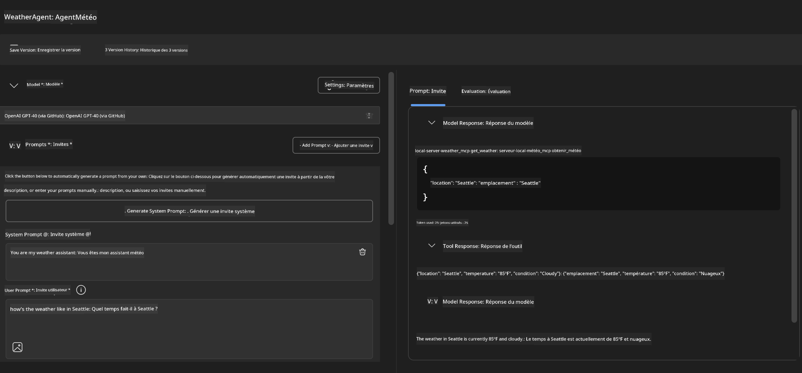
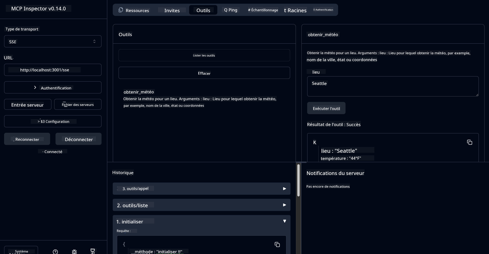

<!--
CO_OP_TRANSLATOR_METADATA:
{
  "original_hash": "dd8da3f75addcef453fe11f02a270217",
  "translation_date": "2025-07-14T08:06:16+00:00",
  "source_file": "10-StreamliningAIWorkflowsBuildingAnMCPServerWithAIToolkit/lab3/README.md",
  "language_code": "fr"
}
-->
# 🔧 Module 3 : Développement avancé MCP avec AI Toolkit


## 🎯 Objectifs d’apprentissage

À la fin de ce laboratoire, vous serez capable de :

- ✅ Créer des serveurs MCP personnalisés en utilisant AI Toolkit
- ✅ Configurer et utiliser le dernier MCP Python SDK (v1.9.3)
- ✅ Installer et exploiter MCP Inspector pour le débogage
- ✅ Déboguer des serveurs MCP dans les environnements Agent Builder et Inspector
- ✅ Comprendre les workflows avancés de développement de serveurs MCP

## 📋 Prérequis

- Avoir terminé le Lab 2 (Fondamentaux MCP)
- VS Code avec l’extension AI Toolkit installée
- Environnement Python 3.10+
- Node.js et npm pour la configuration de l’Inspector

## 🏗️ Ce que vous allez construire

Dans ce laboratoire, vous allez créer un **serveur MCP météo** qui illustre :
- L’implémentation d’un serveur MCP personnalisé
- L’intégration avec AI Toolkit Agent Builder
- Des workflows professionnels de débogage
- Les bonnes pratiques d’utilisation du SDK MCP moderne

---

## 🔧 Présentation des composants principaux

### 🐍 MCP Python SDK  
Le SDK Python du Model Context Protocol fournit la base pour construire des serveurs MCP personnalisés. Vous utiliserez la version 1.9.3 avec des capacités de débogage améliorées.

### 🔍 MCP Inspector  
Un outil puissant de débogage offrant :  
- Une surveillance en temps réel du serveur  
- La visualisation de l’exécution des outils  
- L’inspection des requêtes/réponses réseau  
- Un environnement de test interactif  

---

## 📖 Mise en œuvre étape par étape

### Étape 1 : Créer un WeatherAgent dans Agent Builder

1. **Lancez Agent Builder** dans VS Code via l’extension AI Toolkit  
2. **Créez un nouvel agent** avec la configuration suivante :  
   - Nom de l’agent : `WeatherAgent`


### Étape 2 : Initialiser le projet MCP Server

1. **Allez dans Tools** → **Add Tool** dans Agent Builder  
2. **Sélectionnez "MCP Server"** parmi les options disponibles  
3. **Choisissez "Create A new MCP Server"**  
4. **Sélectionnez le template `python-weather`**  
5. **Nommez votre serveur :** `weather_mcp`


### Étape 3 : Ouvrir et examiner le projet

1. **Ouvrez le projet généré** dans VS Code  
2. **Passez en revue la structure du projet :**  
   ```
   weather_mcp/
   ├── src/
   │   ├── __init__.py
   │   └── server.py
   ├── inspector/
   │   ├── package.json
   │   └── package-lock.json
   ├── .vscode/
   │   ├── launch.json
   │   └── tasks.json
   ├── pyproject.toml
   └── README.md
   ```

### Étape 4 : Mettre à jour vers la dernière version du MCP SDK

> **🔍 Pourquoi mettre à jour ?** Nous souhaitons utiliser la dernière version du MCP SDK (v1.9.3) et du service Inspector (0.14.0) pour bénéficier de fonctionnalités avancées et d’un meilleur débogage.

#### 4a. Mettre à jour les dépendances Python

**Modifiez `pyproject.toml` :** mettez à jour [./code/weather_mcp/pyproject.toml](../../../../10-StreamliningAIWorkflowsBuildingAnMCPServerWithAIToolkit/lab3/code/weather_mcp/pyproject.toml)

#### 4b. Mettre à jour la configuration de l’Inspector

**Modifiez `inspector/package.json` :** mettez à jour [./code/weather_mcp/inspector/package.json](../../../../10-StreamliningAIWorkflowsBuildingAnMCPServerWithAIToolkit/lab3/code/weather_mcp/inspector/package.json)

#### 4c. Mettre à jour les dépendances de l’Inspector

**Modifiez `inspector/package-lock.json` :** mettez à jour [./code/weather_mcp/inspector/package-lock.json](../../../../10-StreamliningAIWorkflowsBuildingAnMCPServerWithAIToolkit/lab3/code/weather_mcp/inspector/package-lock.json)

> **📝 Note :** Ce fichier contient une définition étendue des dépendances. Ci-dessous la structure essentielle – le contenu complet garantit une résolution correcte des dépendances.

> **⚡ Package Lock complet :** Le fichier package-lock.json complet contient environ 3000 lignes de définitions de dépendances. Ce qui est montré ci-dessus correspond à la structure clé – utilisez le fichier fourni pour une résolution complète.

### Étape 5 : Configurer le débogage dans VS Code

*Note : Veuillez copier le fichier dans le chemin spécifié pour remplacer le fichier local correspondant*

#### 5a. Mettre à jour la configuration de lancement

**Modifiez `.vscode/launch.json` :**

```json
{
  "version": "0.2.0",
  "configurations": [
    {
      "name": "Attach to Local MCP",
      "type": "debugpy",
      "request": "attach",
      "connect": {
        "host": "localhost",
        "port": 5678
      },
      "presentation": {
        "hidden": true
      },
      "internalConsoleOptions": "neverOpen",
      "postDebugTask": "Terminate All Tasks"
    },
    {
      "name": "Launch Inspector (Edge)",
      "type": "msedge",
      "request": "launch",
      "url": "http://localhost:6274?timeout=60000&serverUrl=http://localhost:3001/sse#tools",
      "cascadeTerminateToConfigurations": [
        "Attach to Local MCP"
      ],
      "presentation": {
        "hidden": true
      },
      "internalConsoleOptions": "neverOpen"
    },
    {
      "name": "Launch Inspector (Chrome)",
      "type": "chrome",
      "request": "launch",
      "url": "http://localhost:6274?timeout=60000&serverUrl=http://localhost:3001/sse#tools",
      "cascadeTerminateToConfigurations": [
        "Attach to Local MCP"
      ],
      "presentation": {
        "hidden": true
      },
      "internalConsoleOptions": "neverOpen"
    }
  ],
  "compounds": [
    {
      "name": "Debug in Agent Builder",
      "configurations": [
        "Attach to Local MCP"
      ],
      "preLaunchTask": "Open Agent Builder",
    },
    {
      "name": "Debug in Inspector (Edge)",
      "configurations": [
        "Launch Inspector (Edge)",
        "Attach to Local MCP"
      ],
      "preLaunchTask": "Start MCP Inspector",
      "stopAll": true
    },
    {
      "name": "Debug in Inspector (Chrome)",
      "configurations": [
        "Launch Inspector (Chrome)",
        "Attach to Local MCP"
      ],
      "preLaunchTask": "Start MCP Inspector",
      "stopAll": true
    }
  ]
}
```

**Modifiez `.vscode/tasks.json` :**

```
{
  "version": "2.0.0",
  "tasks": [
    {
      "label": "Start MCP Server",
      "type": "shell",
      "command": "python -m debugpy --listen 127.0.0.1:5678 src/__init__.py sse",
      "isBackground": true,
      "options": {
        "cwd": "${workspaceFolder}",
        "env": {
          "PORT": "3001"
        }
      },
      "problemMatcher": {
        "pattern": [
          {
            "regexp": "^.*$",
            "file": 0,
            "location": 1,
            "message": 2
          }
        ],
        "background": {
          "activeOnStart": true,
          "beginsPattern": ".*",
          "endsPattern": "Application startup complete|running"
        }
      }
    },
    {
      "label": "Start MCP Inspector",
      "type": "shell",
      "command": "npm run dev:inspector",
      "isBackground": true,
      "options": {
        "cwd": "${workspaceFolder}/inspector",
        "env": {
          "CLIENT_PORT": "6274",
          "SERVER_PORT": "6277",
        }
      },
      "problemMatcher": {
        "pattern": [
          {
            "regexp": "^.*$",
            "file": 0,
            "location": 1,
            "message": 2
          }
        ],
        "background": {
          "activeOnStart": true,
          "beginsPattern": "Starting MCP inspector",
          "endsPattern": "Proxy server listening on port"
        }
      },
      "dependsOn": [
        "Start MCP Server"
      ]
    },
    {
      "label": "Open Agent Builder",
      "type": "shell",
      "command": "echo ${input:openAgentBuilder}",
      "presentation": {
        "reveal": "never"
      },
      "dependsOn": [
        "Start MCP Server"
      ],
    },
    {
      "label": "Terminate All Tasks",
      "command": "echo ${input:terminate}",
      "type": "shell",
      "problemMatcher": []
    }
  ],
  "inputs": [
    {
      "id": "openAgentBuilder",
      "type": "command",
      "command": "ai-mlstudio.agentBuilder",
      "args": {
        "initialMCPs": [ "local-server-weather_mcp" ],
        "triggeredFrom": "vsc-tasks"
      }
    },
    {
      "id": "terminate",
      "type": "command",
      "command": "workbench.action.tasks.terminate",
      "args": "terminateAll"
    }
  ]
}
```

---

## 🚀 Lancer et tester votre serveur MCP

### Étape 6 : Installer les dépendances

Après avoir effectué les modifications de configuration, exécutez les commandes suivantes :

**Installer les dépendances Python :**  
```bash
uv sync
```

**Installer les dépendances de l’Inspector :**  
```bash
cd inspector
npm install
```

### Étape 7 : Déboguer avec Agent Builder

1. **Appuyez sur F5** ou utilisez la configuration **"Debug in Agent Builder"**  
2. **Sélectionnez la configuration compound** dans le panneau de débogage  
3. **Attendez le démarrage du serveur** et l’ouverture d’Agent Builder  
4. **Testez votre serveur MCP météo** avec des requêtes en langage naturel

Saisissez une invite comme celle-ci

SYSTEM_PROMPT

```
You are my weather assistant
```

USER_PROMPT

```
How's the weather like in Seattle
```



### Étape 8 : Déboguer avec MCP Inspector

1. **Utilisez la configuration "Debug in Inspector"** (Edge ou Chrome)  
2. **Ouvrez l’interface Inspector** à l’adresse `http://localhost:6274`  
3. **Explorez l’environnement de test interactif :**  
   - Visualisez les outils disponibles  
   - Testez l’exécution des outils  
   - Surveillez les requêtes réseau  
   - Déboguez les réponses du serveur  



---

## 🎯 Résultats clés de l’apprentissage

En complétant ce laboratoire, vous avez :

- [x] **Créé un serveur MCP personnalisé** en utilisant les templates AI Toolkit  
- [x] **Mis à jour vers le dernier MCP SDK** (v1.9.3) pour des fonctionnalités améliorées  
- [x] **Configuré des workflows professionnels de débogage** pour Agent Builder et Inspector  
- [x] **Installé MCP Inspector** pour des tests interactifs du serveur  
- [x] **Maîtrisé les configurations de débogage VS Code** pour le développement MCP  

## 🔧 Fonctionnalités avancées explorées

| Fonctionnalité               | Description                      | Cas d’utilisation               |
|-----------------------------|--------------------------------|--------------------------------|
| **MCP Python SDK v1.9.3**   | Dernière implémentation du protocole | Développement serveur moderne   |
| **MCP Inspector 0.14.0**    | Outil de débogage interactif   | Tests serveur en temps réel     |
| **Débogage VS Code**        | Environnement de développement intégré | Workflow professionnel de débogage |
| **Intégration Agent Builder** | Connexion directe à AI Toolkit | Tests complets d’agents         |

## 📚 Ressources supplémentaires

- [Documentation MCP Python SDK](https://modelcontextprotocol.io/docs/sdk/python)  
- [Guide de l’extension AI Toolkit](https://code.visualstudio.com/docs/ai/ai-toolkit)  
- [Documentation du débogage VS Code](https://code.visualstudio.com/docs/editor/debugging)  
- [Spécification Model Context Protocol](https://modelcontextprotocol.io/docs/concepts/architecture)  

---

**🎉 Félicitations !** Vous avez terminé avec succès le Lab 3 et pouvez désormais créer, déboguer et déployer des serveurs MCP personnalisés en suivant des workflows professionnels de développement.

### 🔜 Poursuivez avec le module suivant

Prêt à appliquer vos compétences MCP dans un workflow de développement concret ? Continuez vers **[Module 4 : Développement pratique MCP - Serveur personnalisé de clonage GitHub](../lab4/README.md)** où vous allez :  
- Construire un serveur MCP prêt pour la production qui automatise les opérations sur les dépôts GitHub  
- Implémenter la fonctionnalité de clonage de dépôts GitHub via MCP  
- Intégrer des serveurs MCP personnalisés avec VS Code et GitHub Copilot Agent Mode  
- Tester et déployer des serveurs MCP personnalisés en environnement de production  
- Apprendre l’automatisation pratique des workflows pour les développeurs

**Avertissement** :  
Ce document a été traduit à l’aide du service de traduction automatique [Co-op Translator](https://github.com/Azure/co-op-translator). Bien que nous nous efforcions d’assurer l’exactitude, veuillez noter que les traductions automatiques peuvent contenir des erreurs ou des inexactitudes. Le document original dans sa langue d’origine doit être considéré comme la source faisant foi. Pour les informations critiques, une traduction professionnelle réalisée par un humain est recommandée. Nous déclinons toute responsabilité en cas de malentendus ou de mauvaises interprétations résultant de l’utilisation de cette traduction.