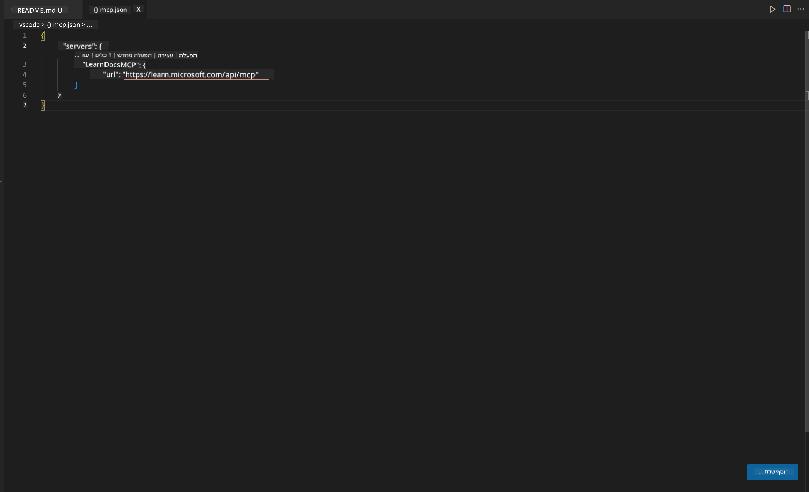
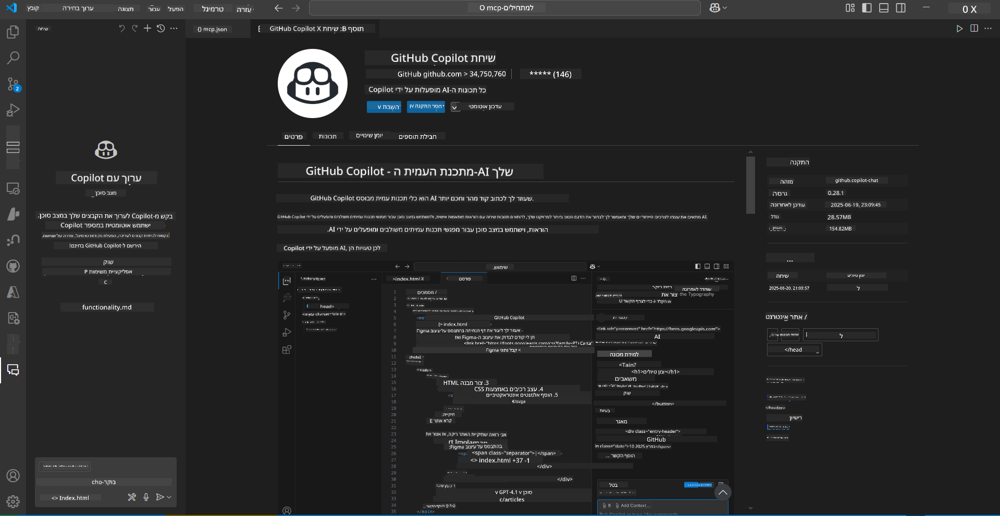
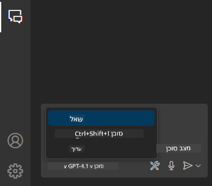
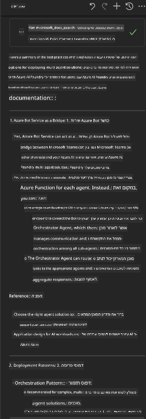

<!--
CO_OP_TRANSLATOR_METADATA:
{
  "original_hash": "db532b1ec386c9ce38c791653dc3c881",
  "translation_date": "2025-07-14T06:53:24+00:00",
  "source_file": "09-CaseStudy/docs-mcp/solution/scenario3/README.md",
  "language_code": "he"
}
-->
# תרחיש 3: תיעוד בתוך העורך עם שרת MCP ב-VS Code

## סקירה כללית

בתרחיש זה תלמד כיצד להביא את Microsoft Learn Docs ישירות לסביבת Visual Studio Code שלך באמצעות שרת MCP. במקום לעבור כל הזמן בין לשוניות בדפדפן כדי לחפש תיעוד, תוכל לגשת, לחפש ולהתייחס לתיעוד הרשמי ישירות בתוך העורך שלך. גישה זו מפשטת את זרימת העבודה שלך, שומרת על הריכוז ומאפשרת אינטגרציה חלקה עם כלים כמו GitHub Copilot.

- חפש וקרא תיעוד בתוך VS Code מבלי לעזוב את סביבת הקידוד שלך.
- התייחס לתיעוד והכנס קישורים ישירות לקבצי README או לקורסים שלך.
- השתמש ב-GitHub Copilot וב-MCP יחד לזרימת עבודה חלקה ומונעת בינה מלאכותית.

## מטרות הלמידה

בסיום פרק זה, תבין כיצד להגדיר ולהשתמש בשרת MCP בתוך VS Code כדי לשפר את זרימת העבודה שלך בתיעוד ופיתוח. תוכל:

- להגדיר את סביבת העבודה שלך לשימוש בשרת MCP לחיפוש תיעוד.
- לחפש ולהכניס תיעוד ישירות מתוך VS Code.
- לשלב את הכוח של GitHub Copilot ו-MCP לזרימת עבודה פרודוקטיבית ומוגברת בבינה מלאכותית.

כישורים אלה יעזרו לך לשמור על ריכוז, לשפר את איכות התיעוד ולהגביר את הפרודוקטיביות שלך כמפתח או ככותב טכני.

## פתרון

כדי להשיג גישה לתיעוד בתוך העורך, תעקוב אחרי סדרת צעדים שמשלבים את שרת MCP עם VS Code ו-GitHub Copilot. פתרון זה אידיאלי למחברי קורסים, כותבי תיעוד ומפתחים שרוצים לשמור על הריכוז בעורך בזמן העבודה עם תיעוד ו-Copilot.

- הוסף במהירות קישורי התייחסות ל-README בזמן כתיבת קורס או תיעוד לפרויקט.
- השתמש ב-Copilot ליצירת קוד וב-MCP למציאת תיעוד רלוונטי וציטוט מיידי.
- שמור על ריכוז בעורך והגבר את הפרודוקטיביות.

### מדריך שלב-אחר-שלב

כדי להתחיל, עקוב אחרי הצעדים הבאים. עבור כל שלב, תוכל להוסיף צילום מסך מתיקיית הנכסים להמחשה ויזואלית של התהליך.

1. **הוסף את קובץ ההגדרות של MCP:**
   בשורש הפרויקט שלך, צור קובץ `.vscode/mcp.json` והוסף את ההגדרות הבאות:
   ```json
   {
     "servers": {
       "LearnDocsMCP": {
         "url": "https://learn.microsoft.com/api/mcp"
       }
     }
   }
   ```
   הגדרה זו מורה ל-VS Code כיצד להתחבר ל-[שרת Microsoft Learn Docs MCP](https://github.com/MicrosoftDocs/mcp).
   
   
    
2. **פתח את לוח השיחות של GitHub Copilot:**
   אם עדיין לא התקנת את תוסף GitHub Copilot, עבור לתצוגת התוספים ב-VS Code והתקן אותו. ניתן להוריד אותו ישירות מ-[Visual Studio Code Marketplace](https://marketplace.visualstudio.com/items?itemName=GitHub.copilot-chat). לאחר מכן, פתח את לוח השיחות של Copilot מהסרגל הצדדי.

   

3. **הפעל את מצב הסוכן ואמת את הכלים:**
   בלוח השיחות של Copilot, הפעל את מצב הסוכן.

   

   לאחר הפעלת מצב הסוכן, ודא ששרת MCP מופיע כאחד הכלים הזמינים. זה מבטיח שסוכן Copilot יכול לגשת לשרת התיעוד כדי להביא מידע רלוונטי.
   
   
4. **התחל שיחה חדשה והנחה את הסוכן:**
   פתח שיחה חדשה בלוח השיחות של Copilot. כעת תוכל להנחות את הסוכן עם שאלות התיעוד שלך. הסוכן ישתמש בשרת MCP כדי להביא ולהציג תיעוד רלוונטי מ-Microsoft Learn ישירות בעורך שלך.

   - *"אני מנסה לכתוב תוכנית לימודים לנושא X. אני מתכנן ללמוד אותו במשך 8 שבועות, עבור כל שבוע, הצע תוכן שעלי ללמוד."*

   

5. **שאילתא חיה:**

   > ניקח שאילתא חיה מתוך [#get-help](https://discord.gg/D6cRhjHWSC) בערוץ Azure AI Foundry ב-Discord ([צפה בהודעה המקורית](https://discord.com/channels/1113626258182504448/1385498306720829572)):
   
   *"אני מחפש תשובות כיצד לפרוס פתרון רב-סוכנים עם סוכני AI שפותחו ב-Azure AI Foundry. אני רואה שאין שיטת פריסה ישירה, כמו בערוצי Copilot Studio. אז, מהם הדרכים השונות לבצע פריסה זו עבור משתמשי ארגון כדי שיוכלו לתקשר ולהשלים את העבודה? קיימים מאמרים ובלוגים רבים שאומרים שניתן להשתמש בשירות Azure Bot כדי לבצע את העבודה הזו, שיכול לשמש כגשר בין MS Teams לסוכני Azure AI Foundry. האם זה יעבוד אם אקים Azure bot שמתחבר ל-Orchestrator Agent ב-Azure AI Foundry דרך Azure function לביצוע האורקסטרציה, או שעלי ליצור Azure function עבור כל אחד מסוכני ה-AI כחלק מפתרון רב-סוכנים כדי לבצע את האורקסטרציה במסגרת Bot framework? כל הצעה נוספת תתקבל בברכה."*

   

   הסוכן יענה עם קישורים לתיעוד רלוונטי וסיכומים, אותם תוכל להכניס ישירות לקבצי markdown שלך או להשתמש בהם כהפניות בקוד.

### שאילתות לדוגמה

הנה כמה שאילתות לדוגמה שתוכל לנסות. שאילתות אלו ימחישו כיצד שרת MCP ו-Copilot יכולים לעבוד יחד כדי לספק תיעוד והפניות מיידיות, מודעות להקשר, מבלי לעזוב את VS Code:

- "הראה לי כיצד להשתמש בטריגרים של Azure Functions."
- "הכנס קישור לתיעוד הרשמי של Azure Key Vault."
- "מהן השיטות הטובות ביותר לאבטחת משאבי Azure?"
- "מצא מדריך התחלה מהירה לשירותי Azure AI."

שאילתות אלו ימחישו כיצד שרת MCP ו-Copilot יכולים לעבוד יחד כדי לספק תיעוד והפניות מיידיות, מודעות להקשר, מבלי לעזוב את VS Code.

---

**כתב ויתור**:  
מסמך זה תורגם באמצעות שירות תרגום מבוסס בינה מלאכותית [Co-op Translator](https://github.com/Azure/co-op-translator). למרות שאנו שואפים לדיוק, יש לקחת בחשבון כי תרגומים אוטומטיים עלולים להכיל שגיאות או אי-דיוקים. המסמך המקורי בשפת המקור שלו נחשב למקור הסמכותי. למידע קריטי מומלץ להשתמש בתרגום מקצועי על ידי מתרגם אנושי. אנו לא נושאים באחריות לכל אי-הבנה או פרשנות שגויה הנובעת משימוש בתרגום זה.