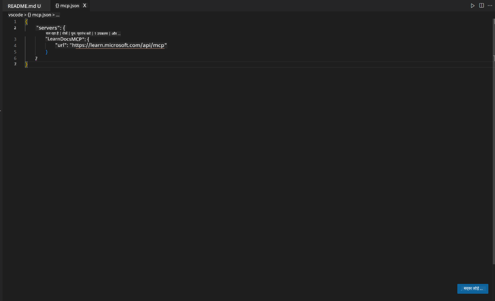
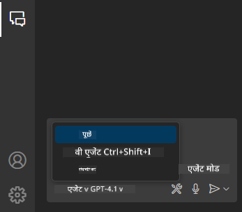
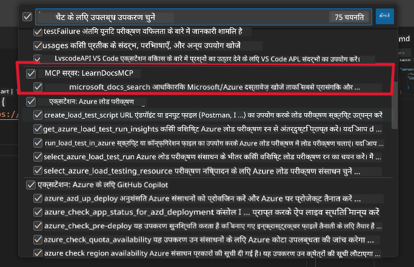
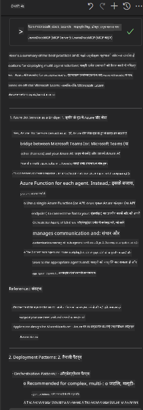

<!--
CO_OP_TRANSLATOR_METADATA:
{
  "original_hash": "db532b1ec386c9ce38c791653dc3c881",
  "translation_date": "2025-07-14T06:48:53+00:00",
  "source_file": "09-CaseStudy/docs-mcp/solution/scenario3/README.md",
  "language_code": "hi"
}
-->
# Scenario 3: VS Code में MCP Server के साथ इन-एडिटर डॉक्यूमेंटेशन

## अवलोकन

इस परिदृश्य में, आप सीखेंगे कि कैसे MCP सर्वर का उपयोग करके Microsoft Learn Docs को सीधे अपने Visual Studio Code वातावरण में लाया जाए। बार-बार ब्राउज़र टैब बदलने के बजाय, आप अपने एडिटर के अंदर ही आधिकारिक दस्तावेज़ों को एक्सेस, खोज और संदर्भित कर सकते हैं। यह तरीका आपके वर्कफ़्लो को सरल बनाता है, आपको केंद्रित रखता है, और GitHub Copilot जैसे टूल्स के साथ सहज एकीकरण सक्षम करता है।

- VS Code के अंदर ही डॉक्यूमेंटेशन खोजें और पढ़ें, बिना कोडिंग वातावरण छोड़े।
- दस्तावेज़ों का संदर्भ लें और सीधे अपने README या कोर्स फाइलों में लिंक डालें।
- GitHub Copilot और MCP को एक साथ उपयोग करें ताकि AI-संचालित डॉक्यूमेंटेशन वर्कफ़्लो सहज हो।

## सीखने के उद्देश्य

इस अध्याय के अंत तक, आप समझ पाएंगे कि VS Code के अंदर MCP सर्वर को कैसे सेटअप और उपयोग किया जाए ताकि आपकी डॉक्यूमेंटेशन और विकास वर्कफ़्लो बेहतर हो सके। आप सक्षम होंगे:

- अपने वर्कस्पेस को MCP सर्वर के लिए कॉन्फ़िगर करना ताकि डॉक्यूमेंटेशन खोजा जा सके।
- VS Code के अंदर से सीधे डॉक्यूमेंटेशन खोजें और डालें।
- GitHub Copilot और MCP की शक्ति को मिलाकर अधिक उत्पादक, AI-सहायक वर्कफ़्लो बनाएं।

ये कौशल आपको केंद्रित रहने, डॉक्यूमेंटेशन की गुणवत्ता सुधारने, और एक डेवलपर या तकनीकी लेखक के रूप में आपकी उत्पादकता बढ़ाने में मदद करेंगे।

## समाधान

इन-एडिटर डॉक्यूमेंटेशन एक्सेस प्राप्त करने के लिए, आप कुछ चरणों का पालन करेंगे जो MCP सर्वर को VS Code और GitHub Copilot के साथ एकीकृत करते हैं। यह समाधान कोर्स लेखक, डॉक्यूमेंटेशन लेखक, और डेवलपर्स के लिए आदर्श है जो एडिटर में ही ध्यान केंद्रित रखना चाहते हैं जबकि वे डॉक्यूमेंट्स और Copilot के साथ काम कर रहे हों।

- कोर्स या प्रोजेक्ट डॉक्यूमेंटेशन लिखते समय README में जल्दी से संदर्भ लिंक जोड़ें।
- कोड जनरेट करने के लिए Copilot का उपयोग करें और MCP से तुरंत संबंधित डॉक्यूमेंट्स खोजें और उद्धृत करें।
- अपने एडिटर में केंद्रित रहें और उत्पादकता बढ़ाएं।

### चरण-दर-चरण मार्गदर्शिका

शुरू करने के लिए, इन चरणों का पालन करें। प्रत्येक चरण के लिए, आप प्रक्रिया को दृश्य रूप से दिखाने के लिए assets फ़ोल्डर से स्क्रीनशॉट जोड़ सकते हैं।

1. **MCP कॉन्फ़िगरेशन जोड़ें:**
   अपने प्रोजेक्ट रूट में `.vscode/mcp.json` फ़ाइल बनाएं और निम्न कॉन्फ़िगरेशन जोड़ें:
   ```json
   {
     "servers": {
       "LearnDocsMCP": {
         "url": "https://learn.microsoft.com/api/mcp"
       }
     }
   }
   ```
   यह कॉन्फ़िगरेशन VS Code को बताता है कि [`Microsoft Learn Docs MCP server`](https://github.com/MicrosoftDocs/mcp) से कैसे कनेक्ट होना है।
   
   
    
2. **GitHub Copilot Chat पैनल खोलें:**
   यदि आपके पास GitHub Copilot एक्सटेंशन पहले से इंस्टॉल नहीं है, तो VS Code में Extensions व्यू पर जाएं और इसे इंस्टॉल करें। आप इसे सीधे [Visual Studio Code Marketplace](https://marketplace.visualstudio.com/items?itemName=GitHub.copilot-chat) से डाउनलोड कर सकते हैं। फिर, साइडबार से Copilot Chat पैनल खोलें।

   

3. **एजेंट मोड सक्षम करें और टूल्स सत्यापित करें:**
   Copilot Chat पैनल में, एजेंट मोड सक्षम करें।

   

   एजेंट मोड सक्षम करने के बाद, सुनिश्चित करें कि MCP सर्वर उपलब्ध टूल्स में सूचीबद्ध है। इससे Copilot एजेंट को डॉक्यूमेंटेशन सर्वर तक पहुंच मिलती है ताकि वह संबंधित जानकारी प्राप्त कर सके।
   
   

4. **नई चैट शुरू करें और एजेंट को प्रॉम्प्ट करें:**
   Copilot Chat पैनल में नई चैट खोलें। अब आप अपने डॉक्यूमेंटेशन प्रश्नों के साथ एजेंट को प्रॉम्प्ट कर सकते हैं। एजेंट MCP सर्वर का उपयोग करके Microsoft Learn की संबंधित डॉक्यूमेंटेशन सीधे आपके एडिटर में लाएगा।

   - *"मैं विषय X के लिए एक अध्ययन योजना लिखने की कोशिश कर रहा हूँ। मैं इसे 8 हफ्तों तक पढ़ने वाला हूँ, हर हफ्ते के लिए सुझाव दें कि मुझे कौन सा कंटेंट लेना चाहिए।"*

   

5. **लाइव क्वेरी:**

   > आइए Azure AI Foundry Discord के [#get-help](https://discord.gg/D6cRhjHWSC) सेक्शन से एक लाइव क्वेरी लेते हैं ([मूल संदेश देखें](https://discord.com/channels/1113626258182504448/1385498306720829572)):
   
   *"मैं Azure AI Foundry पर विकसित AI एजेंट्स के साथ मल्टी-एजेंट समाधान को तैनात करने के तरीकों के बारे में उत्तर खोज रहा हूँ। मुझे पता चला है कि कोई सीधे तैनाती का तरीका नहीं है, जैसे Copilot Studio चैनल। तो, एंटरप्राइज उपयोगकर्ताओं के लिए इस तैनाती को पूरा करने के विभिन्न तरीके क्या हैं ताकि वे इंटरैक्ट कर सकें और काम पूरा कर सकें?
कई लेख/ब्लॉग्स कहते हैं कि हम Azure Bot सेवा का उपयोग कर सकते हैं जो MS Teams और Azure AI Foundry एजेंट्स के बीच एक पुल का काम कर सकता है, क्या यह काम करेगा अगर मैं Azure Bot सेटअप करूं जो Azure AI Foundry के Orchestrator Agent से Azure Function के माध्यम से जुड़ा हो या मुझे मल्टी एजेंट समाधान के प्रत्येक AI एजेंट के लिए Azure Function बनानी होगी ताकि Bot Framework पर ऑर्केस्ट्रेशन हो सके? कोई अन्य सुझाव भी स्वागत योग्य हैं।"*

   

   एजेंट संबंधित डॉक्यूमेंटेशन लिंक और सारांश के साथ जवाब देगा, जिन्हें आप सीधे अपने मार्कडाउन फाइलों में डाल सकते हैं या कोड में संदर्भ के रूप में उपयोग कर सकते हैं।

### नमूना क्वेरीज

यहाँ कुछ उदाहरण क्वेरीज हैं जिन्हें आप आज़मा सकते हैं। ये क्वेरीज दिखाएंगी कि कैसे MCP सर्वर और Copilot मिलकर तुरंत, संदर्भ-समझ वाले डॉक्यूमेंटेशन और संदर्भ प्रदान कर सकते हैं, बिना VS Code छोड़े:

- "मुझे दिखाओ कि Azure Functions ट्रिगर्स का उपयोग कैसे करें।"
- "Azure Key Vault के आधिकारिक डॉक्यूमेंटेशन के लिए लिंक डालो।"
- "Azure संसाधनों को सुरक्षित करने के लिए सर्वोत्तम प्रथाएँ क्या हैं?"
- "Azure AI सेवाओं के लिए क्विकस्टार्ट खोजो।"

ये क्वेरीज दिखाएंगी कि कैसे MCP सर्वर और Copilot मिलकर तुरंत, संदर्भ-समझ वाले डॉक्यूमेंटेशन और संदर्भ प्रदान कर सकते हैं, बिना VS Code छोड़े।

---

**अस्वीकरण**:  
यह दस्तावेज़ AI अनुवाद सेवा [Co-op Translator](https://github.com/Azure/co-op-translator) का उपयोग करके अनुवादित किया गया है। जबकि हम सटीकता के लिए प्रयासरत हैं, कृपया ध्यान दें कि स्वचालित अनुवादों में त्रुटियाँ या अशुद्धियाँ हो सकती हैं। मूल दस्तावेज़ अपनी मूल भाषा में ही अधिकारिक स्रोत माना जाना चाहिए। महत्वपूर्ण जानकारी के लिए, पेशेवर मानव अनुवाद की सलाह दी जाती है। इस अनुवाद के उपयोग से उत्पन्न किसी भी गलतफहमी या गलत व्याख्या के लिए हम जिम्मेदार नहीं हैं।