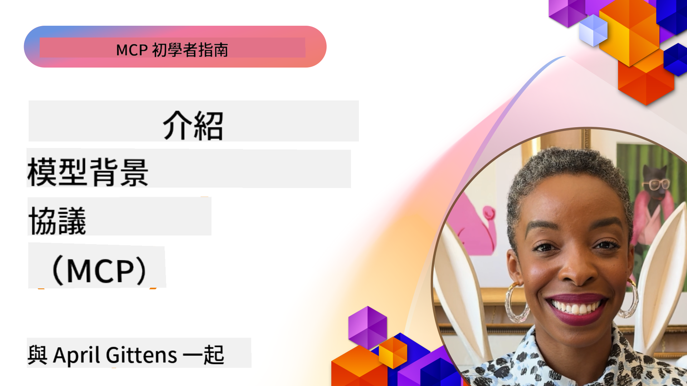

<!--
CO_OP_TRANSLATOR_METADATA:
{
  "original_hash": "9678e0c6945b8e0c23586869b0e26783",
  "translation_date": "2025-10-06T10:53:05+00:00",
  "source_file": "00-Introduction/README.md",
  "language_code": "hk"
}
-->
# Model Context Protocol (MCP) 簡介：為何它對可擴展的 AI 應用至關重要

_（點擊上方圖片觀看本課程影片）_

生成式 AI 應用是一項重大進步，因為它們通常允許用戶使用自然語言提示與應用程式互動。然而，隨著投入更多時間和資源到這類應用中，您需要確保能輕鬆整合功能和資源，使其易於擴展，能支持多個模型的使用，並處理各種模型的複雜性。簡而言之，建立生成式 AI 應用在初期可能很簡單，但隨著應用的增長和複雜化，您需要開始定義架構，並可能需要依賴標準來確保應用以一致的方式構建。這就是 MCP 的作用所在，它能組織事物並提供標準。

---

## **🔍 Model Context Protocol (MCP) 是什麼？**

**Model Context Protocol (MCP)** 是一種**開放且標準化的介面**，允許大型語言模型（LLMs）與外部工具、API 和數據源無縫互動。它提供了一個一致的架構，增強 AI 模型超越其訓練數據的功能，從而實現更智能、更可擴展和更具響應性的 AI 系統。

---

## **🎯 為什麼 AI 標準化很重要**

隨著生成式 AI 應用變得越來越複雜，採用標準以確保**可擴展性、可擴展性、可維護性**以及**避免供應商鎖定**至關重要。MCP 通過以下方式滿足這些需求：

- 統一模型與工具的整合
- 減少脆弱的、一次性定制解決方案
- 允許來自不同供應商的多個模型在同一生態系統中共存

**注意：** 雖然 MCP 自稱為開放標準，但目前沒有計劃通過任何現有標準機構（如 IEEE、IETF、W3C、ISO 或其他標準機構）對 MCP 進行標準化。

---

## **📚 學習目標**

閱讀本文後，您將能夠：

- 定義 **Model Context Protocol (MCP)** 及其使用案例
- 理解 MCP 如何標準化模型與工具的通信
- 識別 MCP 架構的核心組件
- 探索 MCP 在企業和開發環境中的實際應用

---

## **💡 為什麼 Model Context Protocol (MCP) 是一個改變遊戲規則的技術**

### **🔗 MCP 解決了 AI 互動中的碎片化問題**

在 MCP 出現之前，將模型與工具整合需要：

- 每個工具與模型配對的定制代碼
- 每個供應商的非標準化 API
- 因更新而頻繁中斷
- 隨著工具增多而難以擴展

### **✅ MCP 標準化的好處**

| **好處**                  | **描述**                                                                      |
|--------------------------|------------------------------------------------------------------------------|
| 互操作性                 | LLMs 能夠與不同供應商的工具無縫協作                                           |
| 一致性                   | 在平台和工具之間保持統一的行為                                                |
| 可重用性                 | 一次構建的工具可以在不同項目和系統中使用                                       |
| 加速開發                 | 使用標準化的即插即用介面減少開發時間                                           |

---

## **🧱 MCP 高層架構概述**

MCP 遵循**客戶端-伺服器模型**，其中：

- **MCP Hosts** 運行 AI 模型
- **MCP Clients** 發起請求
- **MCP Servers** 提供上下文、工具和功能

### **核心組件：**

- **資源** – 模型的靜態或動態數據  
- **提示** – 用於引導生成的預定義工作流程  
- **工具** – 可執行的功能，例如搜索、計算  
- **採樣** – 通過遞歸互動實現代理行為  

---

## MCP 伺服器如何運作

MCP 伺服器的運作方式如下：

- **請求流程**：
    1. 最終用戶或代表其行動的軟件發起請求。
    2. **MCP Client** 將請求發送到 **MCP Host**，該主機管理 AI 模型的運行時。
    3. **AI 模型** 接收用戶提示，並可能通過一個或多個工具調用請求訪問外部工具或數據。
    4. **MCP Host**（而非模型本身）使用標準化協議與適當的 **MCP Server(s)** 通信。
- **MCP Host 功能**：
    - **工具註冊表**：維護可用工具及其功能的目錄。
    - **身份驗證**：驗證工具訪問的權限。
    - **請求處理器**：處理模型發出的工具請求。
    - **響應格式化器**：將工具輸出結構化為模型可理解的格式。
- **MCP Server 執行**：
    - **MCP Host** 將工具調用路由到一個或多個 **MCP Servers**，每個伺服器都提供專門的功能（例如搜索、計算、數據庫查詢）。
    - **MCP Servers** 執行其各自的操作，並以一致的格式將結果返回給 **MCP Host**。
    - **MCP Host** 格式化並將這些結果傳遞給 **AI 模型**。
- **響應完成**：
    - **AI 模型** 將工具輸出整合到最終響應中。
    - **MCP Host** 將此響應發送回 **MCP Client**，由其交付給最終用戶或調用軟件。

```mermaid
---
title: MCP Architecture and Component Interactions
description: A diagram showing the flows of the components in MCP.
---
graph TD
    Client[MCP Client/Application] -->|Sends Request| H[MCP Host]
    H -->|Invokes| A[AI Model]
    A -->|Tool Call Request| H
    H -->|MCP Protocol| T1[MCP Server Tool 01: Web Search]
    H -->|MCP Protocol| T2[MCP Server Tool 02: Calculator tool]
    H -->|MCP Protocol| T3[MCP Server Tool 03: Database Access tool]
    H -->|MCP Protocol| T4[MCP Server Tool 04: File System tool]
    H -->|Sends Response| Client

    subgraph "MCP Host Components"
        H
        G[Tool Registry]
        I[Authentication]
        J[Request Handler]
        K[Response Formatter]
    end

    H <--> G
    H <--> I
    H <--> J
    H <--> K

    style A fill:#f9d5e5,stroke:#333,stroke-width:2px
    style H fill:#eeeeee,stroke:#333,stroke-width:2px
    style Client fill:#d5e8f9,stroke:#333,stroke-width:2px
    style G fill:#fffbe6,stroke:#333,stroke-width:1px
    style I fill:#fffbe6,stroke:#333,stroke-width:1px
    style J fill:#fffbe6,stroke:#333,stroke-width:1px
    style K fill:#fffbe6,stroke:#333,stroke-width:1px
    style T1 fill:#c2f0c2,stroke:#333,stroke-width:1px
    style T2 fill:#c2f0c2,stroke:#333,stroke-width:1px
    style T3 fill:#c2f0c2,stroke:#333,stroke-width:1px
    style T4 fill:#c2f0c2,stroke:#333,stroke-width:1px
```

## 👨‍💻 如何構建 MCP 伺服器（附示例）

MCP 伺服器允許您通過提供數據和功能來擴展 LLM 的能力。

準備好試試了嗎？以下是基於不同語言/技術棧的 SDK 和示例，展示如何創建簡單的 MCP 伺服器：

- **Python SDK**: https://github.com/modelcontextprotocol/python-sdk

- **TypeScript SDK**: https://github.com/modelcontextprotocol/typescript-sdk

- **Java SDK**: https://github.com/modelcontextprotocol/java-sdk

- **C#/.NET SDK**: https://github.com/modelcontextprotocol/csharp-sdk

## 🌍 MCP 的實際應用案例

MCP 通過擴展 AI 的能力支持多種應用：

| **應用**                   | **描述**                                                                      |
|----------------------------|------------------------------------------------------------------------------|
| 企業數據整合               | 將 LLMs 連接到數據庫、CRM 或內部工具                                          |
| 自主代理系統               | 為代理提供工具訪問和決策工作流程                                              |
| 多模態應用                 | 在單一統一的 AI 應用中結合文本、圖像和音頻工具                                |
| 實時數據整合               | 將實時數據引入 AI 互動中，以提供更準確、最新的輸出                             |

### 🧠 MCP = AI 互動的通用標準

Model Context Protocol (MCP) 就像 USB-C 標準化了設備的物理連接一樣，在 AI 世界中提供了一個一致的介面，使模型（客戶端）能夠與外部工具和數據提供者（伺服器）無縫整合。這消除了每個 API 或數據源需要多樣化、定制協議的需求。

在 MCP 下，MCP 兼容工具（稱為 MCP 伺服器）遵循統一標準。這些伺服器可以列出它們提供的工具或操作，並在 AI 代理請求時執行這些操作。支持 MCP 的 AI 代理平台能夠通過此標準協議發現伺服器提供的工具並調用它們。

### 💡 促進知識訪問

除了提供工具，MCP 還促進了知識的訪問。它使應用能夠通過連接到各種數據源向大型語言模型（LLMs）提供上下文。例如，MCP 伺服器可能代表公司的文檔庫，允許代理按需檢索相關信息。另一個伺服器可能處理特定操作，例如發送電子郵件或更新記錄。從代理的角度來看，這些只是它可以使用的工具——有些工具返回數據（知識上下文），而其他工具執行操作。MCP 高效地管理了這兩者。

代理連接到 MCP 伺服器後，能夠通過標準格式自動了解伺服器的可用功能和可訪問數據。這種標準化使工具的可用性具有動態性。例如，向代理系統添加新的 MCP 伺服器後，其功能立即可用，而無需進一步定制代理的指令。

這種簡化的整合方式與以下圖表中所示的流程一致，伺服器提供工具和知識，確保系統間的無縫協作。

### 👉 示例：可擴展的代理解決方案

```mermaid
---
title: Scalable Agent Solution with MCP
description: A diagram illustrating how a user interacts with an LLM that connects to multiple MCP servers, with each server providing both knowledge and tools, creating a scalable AI system architecture
---
graph TD
    User -->|Prompt| LLM
    LLM -->|Response| User
    LLM -->|MCP| ServerA
    LLM -->|MCP| ServerB
    ServerA -->|Universal connector| ServerB
    ServerA --> KnowledgeA
    ServerA --> ToolsA
    ServerB --> KnowledgeB
    ServerB --> ToolsB

    subgraph Server A
        KnowledgeA[Knowledge]
        ToolsA[Tools]
    end

    subgraph Server B
        KnowledgeB[Knowledge]
        ToolsB[Tools]
    end
```
通用連接器使 MCP 伺服器能夠相互通信並共享功能，允許 ServerA 將任務委派給 ServerB 或訪問其工具和知識。這使工具和數據在伺服器之間得以聯邦化，支持可擴展和模塊化的代理架構。由於 MCP 標準化了工具的暴露，代理可以動態發現並在伺服器之間路由請求，而無需硬編碼的整合。

工具和知識聯邦化：工具和數據可以跨伺服器訪問，支持更可擴展和模塊化的代理架構。

### 🔄 客戶端 LLM 整合的高級 MCP 場景

除了基本的 MCP 架構，還有一些高級場景，其中客戶端和伺服器都包含 LLM，實現更複雜的互動。在以下圖表中，**Client App** 可能是一個 IDE，提供多個 MCP 工具供 LLM 使用：

```mermaid
---
title: Advanced MCP Scenarios with Client-Server LLM Integration
description: A sequence diagram showing the detailed interaction flow between user, client application, client LLM, multiple MCP servers, and server LLM, illustrating tool discovery, user interaction, direct tool calling, and feature negotiation phases
---
sequenceDiagram
    autonumber
    actor User as 👤 User
    participant ClientApp as 🖥️ Client App
    participant ClientLLM as 🧠 Client LLM
    participant Server1 as 🔧 MCP Server 1
    participant Server2 as 📚 MCP Server 2
    participant ServerLLM as 🤖 Server LLM
    
    %% Discovery Phase
    rect rgb(220, 240, 255)
        Note over ClientApp, Server2: TOOL DISCOVERY PHASE
        ClientApp->>+Server1: Request available tools/resources
        Server1-->>-ClientApp: Return tool list (JSON)
        ClientApp->>+Server2: Request available tools/resources
        Server2-->>-ClientApp: Return tool list (JSON)
        Note right of ClientApp: Store combined tool<br/>catalog locally
    end
    
    %% User Interaction
    rect rgb(255, 240, 220)
        Note over User, ClientLLM: USER INTERACTION PHASE
        User->>+ClientApp: Enter natural language prompt
        ClientApp->>+ClientLLM: Forward prompt + tool catalog
        ClientLLM->>-ClientLLM: Analyze prompt & select tools
    end
    
    %% Scenario A: Direct Tool Calling
    alt Direct Tool Calling
        rect rgb(220, 255, 220)
            Note over ClientApp, Server1: SCENARIO A: DIRECT TOOL CALLING
            ClientLLM->>+ClientApp: Request tool execution
            ClientApp->>+Server1: Execute specific tool
            Server1-->>-ClientApp: Return results
            ClientApp->>+ClientLLM: Process results
            ClientLLM-->>-ClientApp: Generate response
            ClientApp-->>-User: Display final answer
        end
    
    %% Scenario B: Feature Negotiation (VS Code style)
    else Feature Negotiation (VS Code style)
        rect rgb(255, 220, 220)
            Note over ClientApp, ServerLLM: SCENARIO B: FEATURE NEGOTIATION
            ClientLLM->>+ClientApp: Identify needed capabilities
            ClientApp->>+Server2: Negotiate features/capabilities
            Server2->>+ServerLLM: Request additional context
            ServerLLM-->>-Server2: Provide context
            Server2-->>-ClientApp: Return available features
            ClientApp->>+Server2: Call negotiated tools
            Server2-->>-ClientApp: Return results
            ClientApp->>+ClientLLM: Process results
            ClientLLM-->>-ClientApp: Generate response
            ClientApp-->>-User: Display final answer
        end
    end
```

## 🔐 MCP 的實際好處

以下是使用 MCP 的實際好處：

- **新鮮度**：模型可以訪問超越其訓練數據的最新信息
- **能力擴展**：模型可以利用專門的工具完成其未訓練的任務
- **減少幻覺**：外部數據源提供事實基礎
- **隱私**：敏感數據可以保留在安全環境中，而不是嵌入到提示中

## 📌 關鍵要點

以下是使用 MCP 的關鍵要點：

- **MCP** 標準化了 AI 模型與工具和數據的互動方式
- 促進**可擴展性、一致性和互操作性**
- MCP 有助於**減少開發時間、提高可靠性並擴展模型能力**
- 客戶端-伺服器架構**支持靈活、可擴展的 AI 應用**

## 🧠 練習

思考您感興趣的 AI 應用。

- 哪些**外部工具或數據**可以增強其功能？
- MCP 如何使整合**更簡單、更可靠**？

## 其他資源

- [MCP GitHub Repository](https://github.com/modelcontextprotocol)

## 下一步

下一章：[第 1 章：核心概念](../01-CoreConcepts/README.md)

---

**免責聲明**：  
本文件已使用人工智能翻譯服務 [Co-op Translator](https://github.com/Azure/co-op-translator) 進行翻譯。雖然我們致力於提供準確的翻譯，但請注意，自動翻譯可能包含錯誤或不準確之處。原始文件的母語版本應被視為權威來源。對於重要信息，建議使用專業人工翻譯。我們對因使用此翻譯而引起的任何誤解或錯誤解釋概不負責。