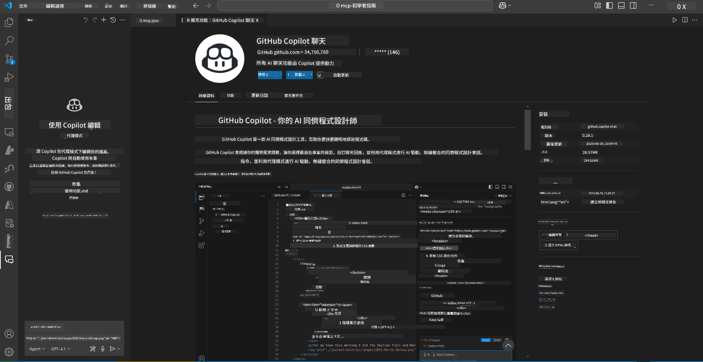
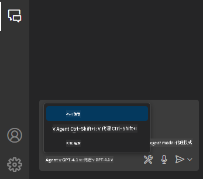
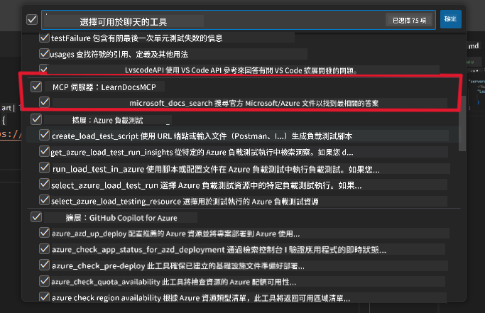
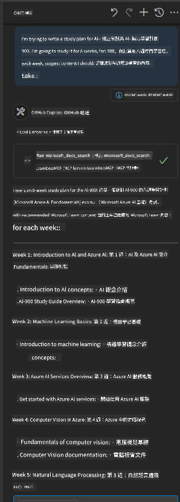
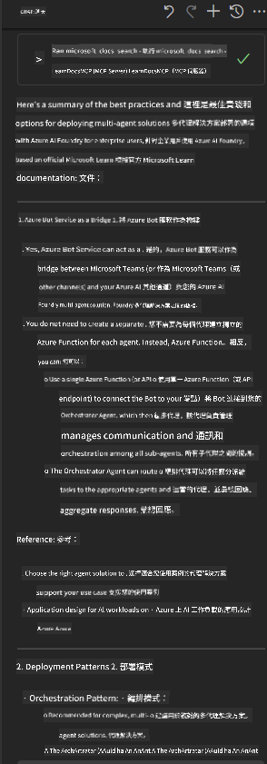

<!--
CO_OP_TRANSLATOR_METADATA:
{
  "original_hash": "db532b1ec386c9ce38c791653dc3c881",
  "translation_date": "2025-07-14T06:47:56+00:00",
  "source_file": "09-CaseStudy/docs-mcp/solution/scenario3/README.md",
  "language_code": "hk"
}
-->
# Scenario 3: 在 VS Code 內使用 MCP Server 的編輯器內文件

## 概覽

在這個情境中，你將學習如何利用 MCP server，將 Microsoft Learn Docs 直接帶入你的 Visual Studio Code 環境。你不需要不斷切換瀏覽器分頁來搜尋文件，而是可以在編輯器內直接存取、搜尋及參考官方文件。這種方式能簡化你的工作流程，讓你保持專注，並且能與 GitHub Copilot 等工具無縫整合。

- 在 VS Code 內搜尋及閱讀文件，無需離開編碼環境。
- 直接在 README 或課程檔案中引用文件並插入連結。
- 結合 GitHub Copilot 與 MCP，打造流暢的 AI 驅動文件工作流程。

## 學習目標

完成本章後，你將了解如何在 VS Code 中設定並使用 MCP server，以提升你的文件與開發工作流程。你將能夠：

- 配置工作區以使用 MCP server 進行文件查詢。
- 在 VS Code 內直接搜尋並插入文件內容。
- 結合 GitHub Copilot 與 MCP 的力量，打造更高效的 AI 輔助工作流程。

這些技能將幫助你保持專注、提升文件品質，並增強你作為開發者或技術寫手的生產力。

## 解決方案

為了實現編輯器內的文件存取，你將依序完成一系列步驟，將 MCP server 與 VS Code 及 GitHub Copilot 整合。此方案非常適合課程作者、文件撰寫者及開發者，讓你在編輯器內專注工作，同時使用文件與 Copilot。

- 在撰寫課程或專案文件時，快速新增 README 的參考連結。
- 使用 Copilot 產生程式碼，並用 MCP 即時查找及引用相關文件。
- 保持在編輯器內專注，提高工作效率。

### 逐步指南

開始前，請依照以下步驟操作。每個步驟你都可以從資源資料夾中加入截圖，幫助視覺說明流程。

1. **新增 MCP 設定：**  
   在專案根目錄下，建立 `.vscode/mcp.json` 檔案，並加入以下設定：  
   ```json
   {
     "servers": {
       "LearnDocsMCP": {
         "url": "https://learn.microsoft.com/api/mcp"
       }
     }
   }
   ```  
   這個設定告訴 VS Code 如何連接到 [`Microsoft Learn Docs MCP server`](https://github.com/MicrosoftDocs/mcp)。

   
    
2. **開啟 GitHub Copilot Chat 面板：**  
   如果你還沒安裝 GitHub Copilot 擴充功能，請到 VS Code 的擴充功能視圖安裝。你也可以直接從 [Visual Studio Code Marketplace](https://marketplace.visualstudio.com/items?itemName=GitHub.copilot-chat) 下載。安裝後，從側邊欄開啟 Copilot Chat 面板。

   

3. **啟用 agent 模式並確認工具：**  
   在 Copilot Chat 面板中，啟用 agent 模式。

   

   啟用後，確認 MCP server 已列為可用工具之一。這確保 Copilot agent 能存取文件伺服器，取得相關資訊。

   

4. **開始新對話並向 agent 提問：**  
   在 Copilot Chat 面板開啟新對話，現在你可以向 agent 提出文件相關問題。agent 會利用 MCP server 直接在編輯器中擷取並顯示相關的 Microsoft Learn 文件。

   - *「我想為主題 X 撰寫學習計畫，計畫為期 8 週，請建議每週應學習的內容。」*

   

5. **即時查詢：**

   > 讓我們來看一則來自 Azure AI Foundry Discord [#get-help](https://discord.gg/D6cRhjHWSC) 頻道的即時查詢（[查看原始訊息](https://discord.com/channels/1113626258182504448/1385498306720829572)）：
   
   *「我想了解如何部署多代理解決方案，這些 AI 代理是在 Azure AI Foundry 上開發的。我發現沒有像 Copilot Studio 頻道那樣的直接部署方式。那麼，企業用戶要如何部署，才能互動並完成工作？  
   有很多文章或部落格說可以用 Azure Bot 服務作為 MS Teams 與 Azure AI Foundry 代理之間的橋樑。如果我設置一個 Azure Bot，透過 Azure Function 連接到 Azure AI Foundry 的 Orchestrator Agent 來執行協調，這樣可行嗎？還是我需要為多代理解決方案中的每個 AI 代理建立 Azure Function，在 Bot framework 端做協調？其他建議也非常歡迎。」*

   

   agent 會回應相關文件連結與摘要，你可以直接插入到 markdown 檔案中，或作為程式碼中的參考。

### 範例查詢

以下是一些你可以嘗試的範例查詢，這些查詢展示 MCP server 與 Copilot 如何協同工作，提供即時且具上下文的文件與參考，無需離開 VS Code：

- 「示範如何使用 Azure Functions 觸發器。」
- 「插入 Azure Key Vault 官方文件的連結。」
- 「Azure 資源安全的最佳實務是什麼？」
- 「找一個 Azure AI 服務的快速入門範例。」

這些查詢將展示 MCP server 與 Copilot 如何協同，提供即時且具上下文的文件與參考，讓你無需離開 VS Code。

**免責聲明**：  
本文件由 AI 翻譯服務 [Co-op Translator](https://github.com/Azure/co-op-translator) 進行翻譯。雖然我們致力於確保準確性，但請注意自動翻譯可能包含錯誤或不準確之處。原始文件的母語版本應被視為權威來源。對於重要資訊，建議採用專業人工翻譯。我們不對因使用本翻譯而引起的任何誤解或誤釋承擔責任。