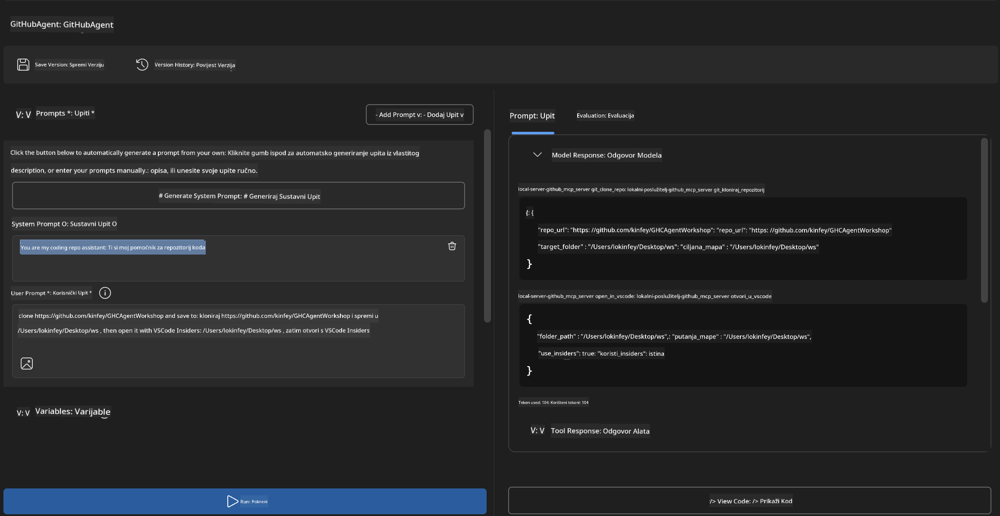
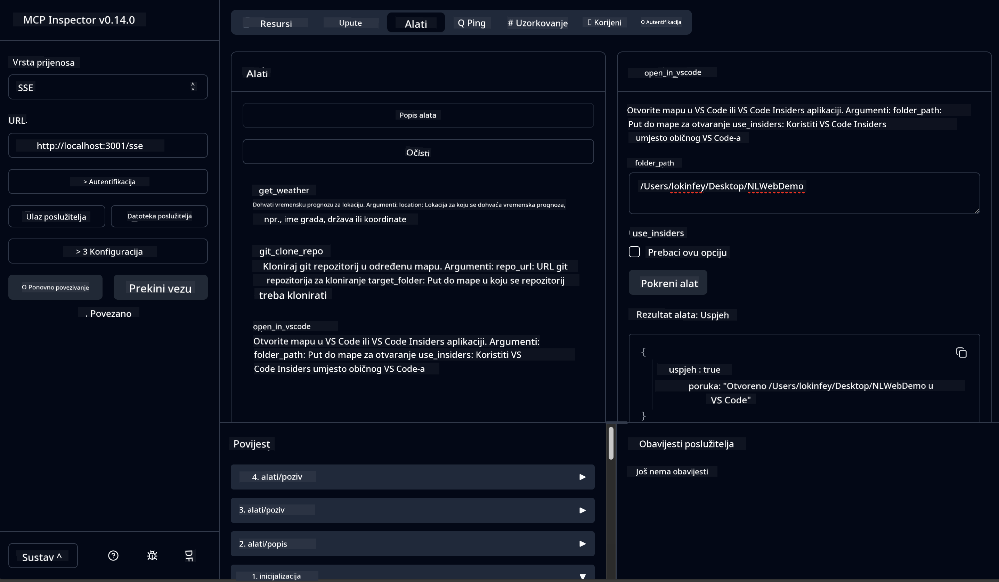

<!--
CO_OP_TRANSLATOR_METADATA:
{
  "original_hash": "f83bc722dc758efffd68667d6a1db470",
  "translation_date": "2025-07-14T08:48:30+00:00",
  "source_file": "10-StreamliningAIWorkflowsBuildingAnMCPServerWithAIToolkit/lab4/README.md",
  "language_code": "hr"
}
-->
# 🐙 Modul 4: Praktični razvoj MCP-a - Prilagođeni GitHub Clone Server


> **⚡ Brzi početak:** Izgradite MCP server spreman za produkciju koji automatizira kloniranje GitHub repozitorija i integraciju s VS Codeom za samo 30 minuta!

## 🎯 Ciljevi učenja

Na kraju ovog laboratorija moći ćete:

- ✅ Kreirati prilagođeni MCP server za stvarne razvojne tokove rada
- ✅ Implementirati funkcionalnost kloniranja GitHub repozitorija putem MCP-a
- ✅ Integrirati prilagođene MCP servere s VS Codeom i Agent Builderom
- ✅ Koristiti GitHub Copilot Agent Mode s prilagođenim MCP alatima
- ✅ Testirati i implementirati prilagođene MCP servere u produkcijskim okruženjima

## 📋 Preduvjeti

- Završeni laboratoriji 1-3 (osnove MCP-a i napredni razvoj)
- Pretplata na GitHub Copilot ([dostupna besplatna registracija](https://github.com/github-copilot/signup))
- VS Code s AI Toolkit i GitHub Copilot ekstenzijama
- Instaliran i konfiguriran Git CLI

## 🏗️ Pregled projekta

### **Izazov stvarnog razvoja**
Kao developeri često koristimo GitHub za kloniranje repozitorija i njihovo otvaranje u VS Codeu ili VS Code Insidersu. Ovaj ručni proces uključuje:
1. Otvaranje terminala/command prompta
2. Navigaciju do željenog direktorija
3. Pokretanje naredbe `git clone`
4. Otvaranje VS Codea u kloniranom direktoriju

**Naše MCP rješenje to pojednostavljuje u jednu pametnu naredbu!**

### **Što ćete izgraditi**
**GitHub Clone MCP Server** (`git_mcp_server`) koji nudi:

| Značajka | Opis | Prednost |
|---------|-------------|---------|
| 🔄 **Pametno kloniranje repozitorija** | Klonira GitHub repozitorije s provjerom valjanosti | Automatska provjera pogrešaka |
| 📁 **Inteligentno upravljanje direktorijima** | Sigurno provjerava i kreira direktorije | Sprječava prepisivanje |
| 🚀 **Višeplatformska integracija s VS Codeom** | Otvara projekte u VS Code/Insiders | Besprijekoran prijelaz u radni tijek |
| 🛡️ **Robusno rukovanje pogreškama** | Rješava mrežne, dozvolne i putne probleme | Pouzdanost spremna za produkciju |

---

## 📖 Korak-po-korak implementacija

### Korak 1: Kreirajte GitHub agenta u Agent Builderu

1. **Pokrenite Agent Builder** kroz AI Toolkit ekstenziju
2. **Kreirajte novog agenta** s ovom konfiguracijom:
   ```
   Agent Name: GitHubAgent
   ```

3. **Inicijalizirajte prilagođeni MCP server:**
   - Idite na **Tools** → **Add Tool** → **MCP Server**
   - Odaberite **"Create A new MCP Server"**
   - Izaberite **Python predložak** za maksimalnu fleksibilnost
   - **Ime servera:** `git_mcp_server`

### Korak 2: Konfigurirajte GitHub Copilot Agent Mode

1. **Otvorite GitHub Copilot** u VS Codeu (Ctrl/Cmd + Shift + P → "GitHub Copilot: Open")
2. **Odaberite Agent Model** u Copilot sučelju
3. **Izaberite Claude 3.7 model** za poboljšane sposobnosti rezoniranja
4. **Omogućite MCP integraciju** za pristup alatima

> **💡 Korisni savjet:** Claude 3.7 pruža izvrsno razumijevanje razvojnih tokova i obrazaca rukovanja pogreškama.

### Korak 3: Implementirajte osnovnu funkcionalnost MCP servera

**Koristite sljedeći detaljni prompt s GitHub Copilot Agent Mode:**

```
Create two MCP tools with the following comprehensive requirements:

🔧 TOOL A: clone_repository
Requirements:
- Clone any GitHub repository to a specified local folder
- Return the absolute path of the successfully cloned project
- Implement comprehensive validation:
  ✓ Check if target directory already exists (return error if exists)
  ✓ Validate GitHub URL format (https://github.com/user/repo)
  ✓ Verify git command availability (prompt installation if missing)
  ✓ Handle network connectivity issues
  ✓ Provide clear error messages for all failure scenarios

🚀 TOOL B: open_in_vscode
Requirements:
- Open specified folder in VS Code or VS Code Insiders
- Cross-platform compatibility (Windows/Linux/macOS)
- Use direct application launch (not terminal commands)
- Auto-detect available VS Code installations
- Handle cases where VS Code is not installed
- Provide user-friendly error messages

Additional Requirements:
- Follow MCP 1.9.3 best practices
- Include proper type hints and documentation
- Implement logging for debugging purposes
- Add input validation for all parameters
- Include comprehensive error handling
```

### Korak 4: Testirajte svoj MCP server

#### 4a. Testiranje u Agent Builderu

1. **Pokrenite debug konfiguraciju** za Agent Builder
2. **Konfigurirajte svog agenta s ovim sistemskim promptom:**

```
SYSTEM_PROMPT:
You are my intelligent coding repository assistant. You help developers efficiently clone GitHub repositories and set up their development environment. Always provide clear feedback about operations and handle errors gracefully.
```

3. **Testirajte s realnim korisničkim scenarijima:**

```
USER_PROMPT EXAMPLES:

Scenario : Basic Clone and Open
"Clone {Your GitHub Repo link such as https://github.com/kinfey/GHCAgentWorkshop
 } and save to {The global path you specify}, then open it with VS Code Insiders"
```



**Očekivani rezultati:**
- ✅ Uspješno kloniranje s potvrdom putanje
- ✅ Automatsko pokretanje VS Codea
- ✅ Jasne poruke o pogreškama za nevažeće scenarije
- ✅ Ispravno rukovanje rubnim slučajevima

#### 4b. Testiranje u MCP Inspectoru



---

**🎉 Čestitamo!** Uspješno ste kreirali praktični MCP server spreman za produkciju koji rješava stvarne izazove u razvojnim tokovima rada. Vaš prilagođeni GitHub clone server pokazuje snagu MCP-a u automatizaciji i povećanju produktivnosti developera.

### 🏆 Postignuća:
- ✅ **MCP Developer** - Kreirali prilagođeni MCP server
- ✅ **Workflow Automator** - Pojednostavili razvojne procese  
- ✅ **Integration Expert** - Povezali više razvojnih alata
- ✅ **Production Ready** - Izgradili rješenja spremna za implementaciju

---

## 🎓 Završetak radionice: Vaše putovanje s Model Context Protocolom

**Dragi sudionice radionice,**

Čestitamo na završetku svih četiri modula radionice Model Context Protocol! Prošli ste dug put od razumijevanja osnovnih pojmova AI Toolkita do izgradnje MCP servera spremnih za produkciju koji rješavaju stvarne razvojne izazove.

### 🚀 Sažetak vašeg puta učenja:

**[Modul 1](../lab1/README.md)**: Počeli ste istraživati osnove AI Toolkita, testiranje modela i kreiranje prvog AI agenta.

**[Modul 2](../lab2/README.md)**: Naučili ste MCP arhitekturu, integrirali Playwright MCP i izgradili prvog agenta za automatizaciju preglednika.

**[Modul 3](../lab3/README.md)**: Napredovali ste u razvoju prilagođenih MCP servera s Weather MCP serverom i savladali alate za otklanjanje pogrešaka.

**[Modul 4](../lab4/README.md)**: Sada ste primijenili sve naučeno za izradu praktičnog alata za automatizaciju GitHub repozitorija.

### 🌟 Što ste savladali:

- ✅ **AI Toolkit ekosustav**: modeli, agenti i obrasci integracije
- ✅ **MCP arhitektura**: dizajn klijent-server, transportni protokoli i sigurnost
- ✅ **Razvojni alati**: od Playgrounda do Inspectora i produkcijske implementacije
- ✅ **Prilagođeni razvoj**: izgradnja, testiranje i implementacija vlastitih MCP servera
- ✅ **Praktične primjene**: rješavanje stvarnih izazova u radnim tokovima pomoću AI-a

### 🔮 Vaši sljedeći koraci:

1. **Izgradite vlastiti MCP server**: Primijenite ove vještine za automatizaciju svojih jedinstvenih tokova rada
2. **Pridružite se MCP zajednici**: Dijelite svoja rješenja i učite od drugih
3. **Istražite naprednu integraciju**: Povežite MCP servere s enterprise sustavima
4. **Doprinesite open sourceu**: Pomozite u poboljšanju MCP alata i dokumentacije

Zapamtite, ova radionica je tek početak. Ekosustav Model Context Protocola brzo se razvija, a vi ste sada opremljeni da budete na čelu AI-pokretanih razvojnih alata.

**Hvala vam na sudjelovanju i predanosti učenju!**

Nadamo se da vam je ova radionica dala ideje koje će promijeniti način na koji gradite i koristite AI alate u svom razvoju.

**Sretno s kodiranjem!**

---

**Odricanje od odgovornosti**:  
Ovaj dokument je preveden korištenjem AI usluge za prevođenje [Co-op Translator](https://github.com/Azure/co-op-translator). Iako težimo točnosti, imajte na umu da automatski prijevodi mogu sadržavati pogreške ili netočnosti. Izvorni dokument na izvornom jeziku treba smatrati autoritativnim izvorom. Za kritične informacije preporučuje se profesionalni ljudski prijevod. Ne snosimo odgovornost za bilo kakva nesporazuma ili pogrešna tumačenja koja proizlaze iz korištenja ovog prijevoda.