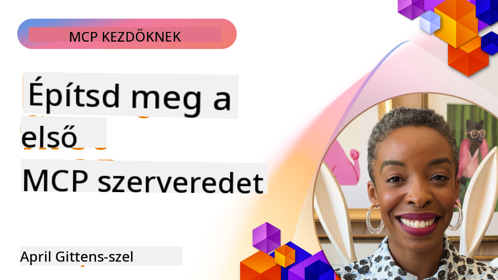

<!--
CO_OP_TRANSLATOR_METADATA:
{
  "original_hash": "f400d87053221363769113c24f117248",
  "translation_date": "2025-10-06T23:50:18+00:00",
  "source_file": "03-GettingStarted/README.md",
  "language_code": "hu"
}
-->
## Első lépések  

_(Kattints a fenti képre a leckéhez tartozó videó megtekintéséhez)_

Ez a szakasz több leckét tartalmaz:

- **1 Az első szervered**: Ebben az első leckében megtanulod, hogyan hozd létre az első szerveredet, és hogyan vizsgáld meg az Inspector eszközzel, amely értékes módja a szerver tesztelésének és hibakeresésének, [a leckéhez](01-first-server/README.md)

- **2 Kliens**: Ebben a leckében megtanulod, hogyan írj egy klienst, amely csatlakozni tud a szerveredhez, [a leckéhez](02-client/README.md)

- **3 Kliens LLM-mel**: Még jobb módja a kliens írásának, ha hozzáadsz egy LLM-et, amely "tárgyalni" tud a szervereddel arról, hogy mit tegyen, [a leckéhez](03-llm-client/README.md)

- **4 Szerver futtatása GitHub Copilot Agent módban a Visual Studio Code-ban**: Itt azt vizsgáljuk, hogyan futtassuk az MCP szerverünket a Visual Studio Code-on belül, [a leckéhez](04-vscode/README.md)

- **5 stdio Transport Server**: A stdio transport az MCP szerver és kliens közötti kommunikáció ajánlott szabványa a jelenlegi specifikációban, amely biztonságos, alfolyamat-alapú kommunikációt biztosít, [a leckéhez](05-stdio-server/README.md)

- **6 HTTP Streaming MCP-vel (Streamable HTTP)**: Ismerd meg a modern HTTP streaminget, a folyamatjelzéseket, és hogyan valósíts meg skálázható, valós idejű MCP szervereket és klienseket Streamable HTTP használatával, [a leckéhez](06-http-streaming/README.md)

- **7 AI Toolkit használata a VSCode-ban**: MCP kliensek és szerverek fogyasztására és tesztelésére, [a leckéhez](07-aitk/README.md)

- **8 Tesztelés**: Itt különösen arra koncentrálunk, hogyan tesztelhetjük a szerverünket és kliensünket különböző módokon, [a leckéhez](08-testing/README.md)

- **9 Telepítés**: Ez a fejezet az MCP megoldások különböző telepítési módjait vizsgálja, [a leckéhez](09-deployment/README.md)

- **10 Haladó szerverhasználat**: Ez a fejezet a haladó szerverhasználatot tárgyalja, [a leckéhez](./10-advanced/README.md)

- **11 Auth**: Ez a fejezet bemutatja, hogyan adjunk hozzá egyszerű hitelesítést, a Basic Auth-tól kezdve a JWT és RBAC használatáig. Javasolt itt kezdeni, majd áttérni az 5. fejezet haladó témáira, és további biztonsági megerősítéseket végezni a 2. fejezet ajánlásai alapján, [a leckéhez](./11-simple-auth/README.md)

A Model Context Protocol (MCP) egy nyílt protokoll, amely szabványosítja, hogyan biztosítsanak az alkalmazások kontextust az LLM-ek számára. Gondolj az MCP-re úgy, mint egy USB-C portra az AI alkalmazások számára - szabványos módot kínál az AI modellek különböző adatforrásokhoz és eszközökhöz való csatlakoztatására.

## Tanulási célok

A lecke végére képes leszel:

- MCP fejlesztési környezetet beállítani C#, Java, Python, TypeScript és JavaScript nyelveken
- Alapvető MCP szervereket építeni és telepíteni egyedi funkciókkal (erőforrások, promptok és eszközök)
- Host alkalmazásokat létrehozni, amelyek csatlakoznak MCP szerverekhez
- MCP implementációkat tesztelni és hibakeresni
- Megérteni a gyakori beállítási kihívásokat és azok megoldásait
- MCP implementációkat népszerű LLM szolgáltatásokhoz csatlakoztatni

## MCP környezet beállítása

Mielőtt elkezdenéd az MCP-vel való munkát, fontos, hogy előkészítsd a fejlesztési környezetedet, és megértsd az alapvető munkafolyamatot. Ez a szakasz végigvezet az első lépések beállításán, hogy zökkenőmentesen kezdhesd az MCP használatát.

### Előfeltételek

Mielőtt belevágnál az MCP fejlesztésbe, győződj meg róla, hogy rendelkezel az alábbiakkal:

- **Fejlesztési környezet**: A választott nyelvhez (C#, Java, Python, TypeScript vagy JavaScript)
- **IDE/Szerkesztő**: Visual Studio, Visual Studio Code, IntelliJ, Eclipse, PyCharm vagy bármely modern kódszerkesztő
- **Csomagkezelők**: NuGet, Maven/Gradle, pip vagy npm/yarn
- **API kulcsok**: Az AI szolgáltatásokhoz, amelyeket a host alkalmazásokban használni tervezel

### Hivatalos SDK-k

A következő fejezetekben Python, TypeScript, Java és .NET alapú megoldásokat fogsz látni. Íme az összes hivatalosan támogatott SDK.

Az MCP több nyelvhez biztosít hivatalos SDK-kat:
- [C# SDK](https://github.com/modelcontextprotocol/csharp-sdk) - Microsofttal együttműködésben karbantartva
- [Java SDK](https://github.com/modelcontextprotocol/java-sdk) - Spring AI-val együttműködésben karbantartva
- [TypeScript SDK](https://github.com/modelcontextprotocol/typescript-sdk) - A hivatalos TypeScript implementáció
- [Python SDK](https://github.com/modelcontextprotocol/python-sdk) - A hivatalos Python implementáció
- [Kotlin SDK](https://github.com/modelcontextprotocol/kotlin-sdk) - A hivatalos Kotlin implementáció
- [Swift SDK](https://github.com/modelcontextprotocol/swift-sdk) - Loopwork AI-val együttműködésben karbantartva
- [Rust SDK](https://github.com/modelcontextprotocol/rust-sdk) - A hivatalos Rust implementáció

## Főbb tanulságok

- Az MCP fejlesztési környezet beállítása egyszerű a nyelvspecifikus SDK-k segítségével
- MCP szerverek építése eszközök létrehozását és regisztrálását igényli egyértelmű sémákkal
- MCP kliensek csatlakoznak szerverekhez és modellekhez, hogy kibővített képességeket használjanak
- A tesztelés és hibakeresés elengedhetetlen a megbízható MCP implementációkhoz
- A telepítési lehetőségek a helyi fejlesztéstől a felhőalapú megoldásokig terjednek

## Gyakorlás

Van egy mintagyűjteményünk, amely kiegészíti az összes fejezetben található gyakorlatokat. Ezen kívül minden fejezet saját gyakorlatokat és feladatokat is tartalmaz.

- [Java Kalkulátor](./samples/java/calculator/README.md)
- [.Net Kalkulátor](../../../03-GettingStarted/samples/csharp)
- [JavaScript Kalkulátor](./samples/javascript/README.md)
- [TypeScript Kalkulátor](./samples/typescript/README.md)
- [Python Kalkulátor](../../../03-GettingStarted/samples/python)

## További források

- [Ügynökök építése Model Context Protocol használatával az Azure-on](https://learn.microsoft.com/azure/developer/ai/intro-agents-mcp)
- [Távoli MCP az Azure Container Apps segítségével (Node.js/TypeScript/JavaScript)](https://learn.microsoft.com/samples/azure-samples/mcp-container-ts/mcp-container-ts/)
- [.NET OpenAI MCP Agent](https://learn.microsoft.com/samples/azure-samples/openai-mcp-agent-dotnet/openai-mcp-agent-dotnet/)

## Mi következik?

Következő: [Az első MCP szerver létrehozása](01-first-server/README.md)

---

**Felelősség kizárása**:  
Ez a dokumentum az [Co-op Translator](https://github.com/Azure/co-op-translator) AI fordítási szolgáltatás segítségével került lefordításra. Bár törekszünk a pontosságra, kérjük, vegye figyelembe, hogy az automatikus fordítások hibákat vagy pontatlanságokat tartalmazhatnak. Az eredeti dokumentum az eredeti nyelvén tekintendő hiteles forrásnak. Kritikus információk esetén javasolt professzionális emberi fordítást igénybe venni. Nem vállalunk felelősséget semmilyen félreértésért vagy téves értelmezésért, amely a fordítás használatából eredhet.