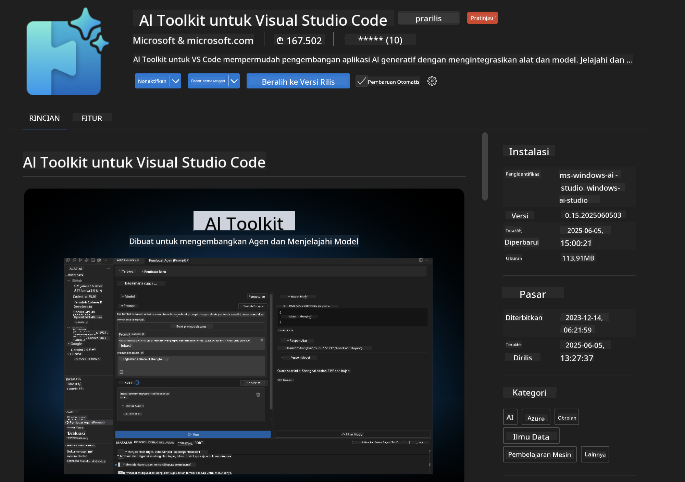
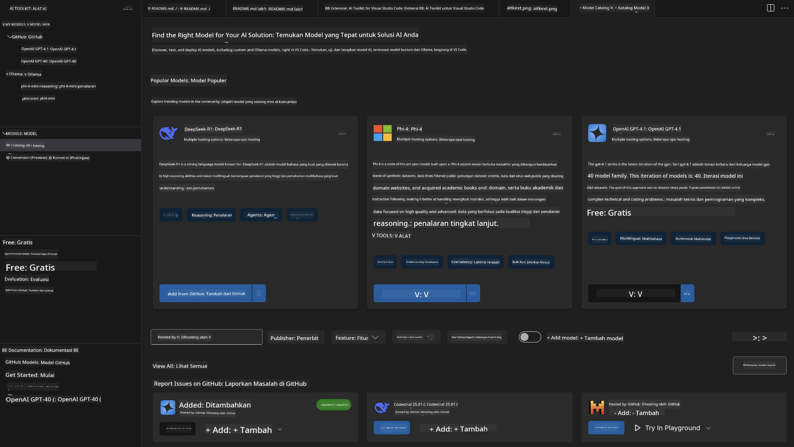
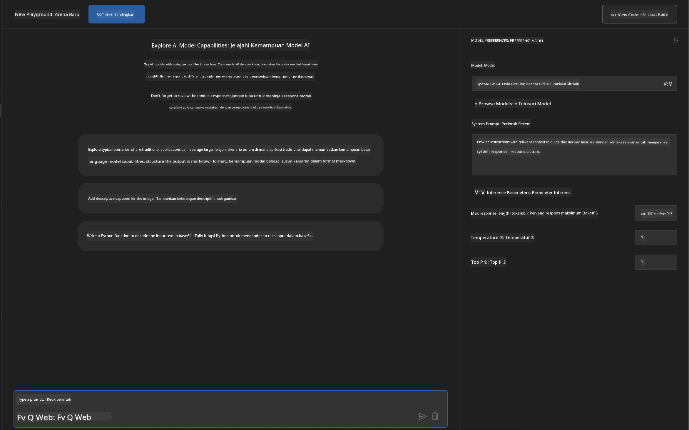
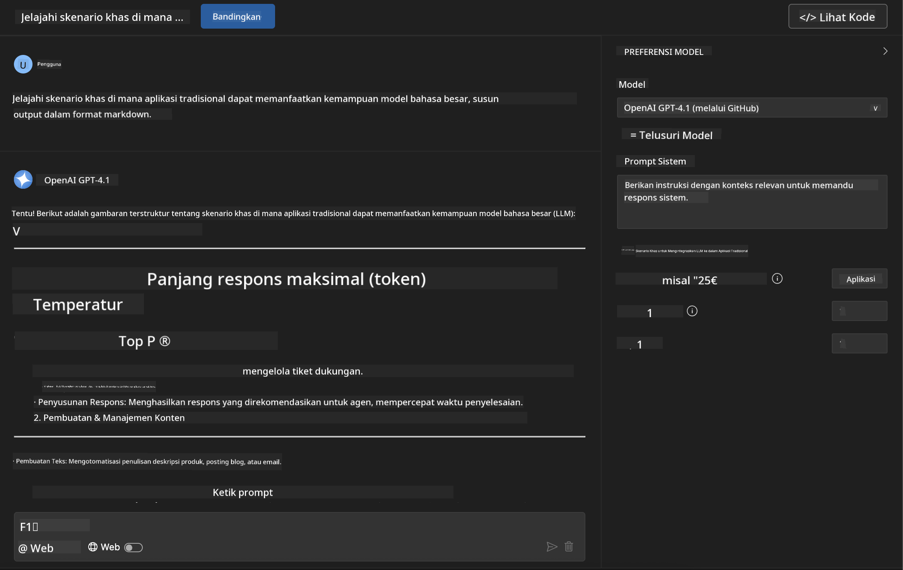
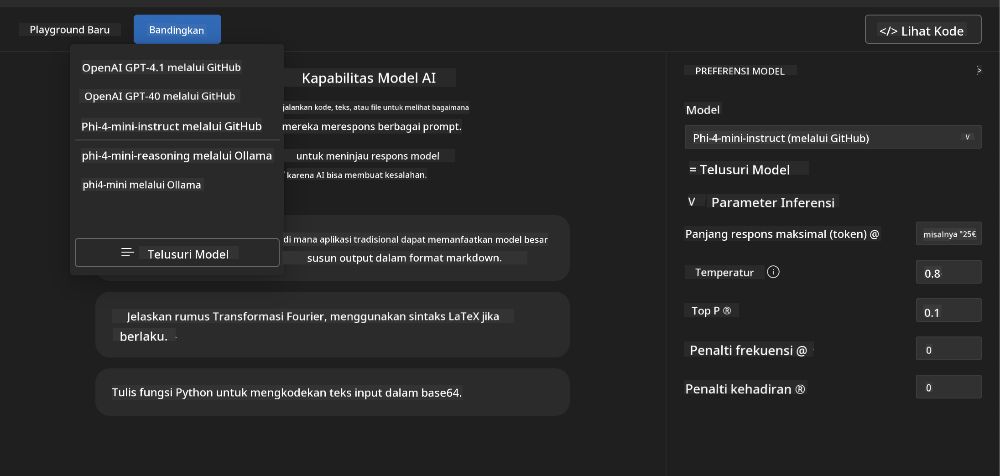
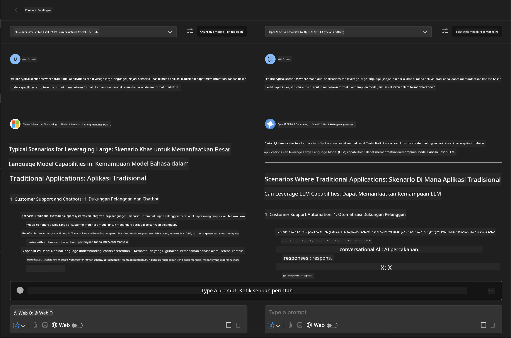
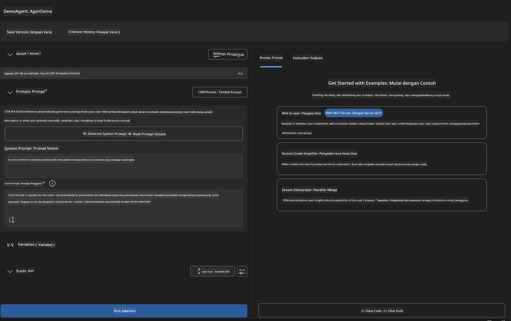
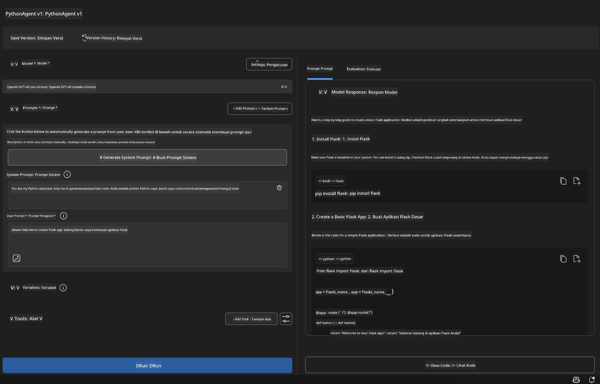

<!--
CO_OP_TRANSLATOR_METADATA:
{
  "original_hash": "2aa9dbc165e104764fa57e8a0d3f1c73",
  "translation_date": "2025-07-14T07:31:09+00:00",
  "source_file": "10-StreamliningAIWorkflowsBuildingAnMCPServerWithAIToolkit/lab1/README.md",
  "language_code": "id"
}
-->
# 🚀 Modul 1: Dasar-Dasar AI Toolkit

[]()
[]()
[]()

## 📋 Tujuan Pembelajaran

Di akhir modul ini, Anda akan dapat:
- ✅ Menginstal dan mengonfigurasi AI Toolkit untuk Visual Studio Code
- ✅ Menavigasi Model Catalog dan memahami berbagai sumber model
- ✅ Menggunakan Playground untuk pengujian dan eksperimen model
- ✅ Membuat agen AI kustom menggunakan Agent Builder
- ✅ Membandingkan performa model dari berbagai penyedia
- ✅ Menerapkan praktik terbaik untuk prompt engineering

## 🧠 Pengenalan AI Toolkit (AITK)

**AI Toolkit untuk Visual Studio Code** adalah ekstensi unggulan Microsoft yang mengubah VS Code menjadi lingkungan pengembangan AI yang lengkap. Ini menjembatani kesenjangan antara riset AI dan pengembangan aplikasi praktis, membuat AI generatif dapat diakses oleh pengembang dengan berbagai tingkat keahlian.

### 🌟 Kemampuan Utama

| Fitur | Deskripsi | Kasus Penggunaan |
|---------|-------------|----------|
| **🗂️ Model Catalog** | Akses lebih dari 100 model dari GitHub, ONNX, OpenAI, Anthropic, Google | Penemuan dan pemilihan model |
| **🔌 Dukungan BYOM** | Integrasikan model Anda sendiri (lokal/jarak jauh) | Penyebaran model kustom |
| **🎮 Interactive Playground** | Pengujian model secara real-time dengan antarmuka chat | Prototipe dan pengujian cepat |
| **📎 Dukungan Multi-Modal** | Menangani teks, gambar, dan lampiran | Aplikasi AI yang kompleks |
| **⚡ Batch Processing** | Jalankan beberapa prompt secara bersamaan | Alur kerja pengujian yang efisien |
| **📊 Evaluasi Model** | Metrik bawaan (F1, relevansi, kesamaan, koherensi) | Penilaian performa |

### 🎯 Mengapa AI Toolkit Penting

- **🚀 Pengembangan Lebih Cepat**: Dari ide ke prototipe dalam hitungan menit
- **🔄 Alur Kerja Terpadu**: Satu antarmuka untuk berbagai penyedia AI
- **🧪 Eksperimen Mudah**: Bandingkan model tanpa pengaturan rumit
- **📈 Siap Produksi**: Transisi mulus dari prototipe ke penyebaran

## 🛠️ Prasyarat & Pengaturan

### 📦 Instalasi Ekstensi AI Toolkit

**Langkah 1: Akses Marketplace Ekstensi**
1. Buka Visual Studio Code
2. Buka tampilan Extensions (`Ctrl+Shift+X` atau `Cmd+Shift+X`)
3. Cari "AI Toolkit"

**Langkah 2: Pilih Versi Anda**
- **🟢 Release**: Direkomendasikan untuk penggunaan produksi
- **🔶 Pre-release**: Akses awal fitur terbaru

**Langkah 3: Instal dan Aktifkan**



### ✅ Daftar Verifikasi
- [ ] Ikon AI Toolkit muncul di sidebar VS Code
- [ ] Ekstensi diaktifkan dan berjalan
- [ ] Tidak ada error instalasi di panel output

## 🧪 Latihan Praktik 1: Menjelajahi Model GitHub

**🎯 Tujuan**: Menguasai Model Catalog dan menguji model AI pertama Anda

### 📊 Langkah 1: Menavigasi Model Catalog

Model Catalog adalah pintu gerbang Anda ke ekosistem AI. Ini mengumpulkan model dari berbagai penyedia, memudahkan penemuan dan perbandingan pilihan.

**🔍 Panduan Navigasi:**

Klik **MODELS - Catalog** di sidebar AI Toolkit



**💡 Tips Pro**: Cari model dengan kemampuan spesifik yang sesuai dengan kebutuhan Anda (misalnya, pembuatan kode, penulisan kreatif, analisis).

**⚠️ Catatan**: Model yang dihosting di GitHub (GitHub Models) gratis digunakan tetapi memiliki batasan jumlah permintaan dan token. Jika Anda ingin mengakses model non-GitHub (model eksternal yang dihosting melalui Azure AI atau endpoint lain), Anda perlu menyediakan API key atau autentikasi yang sesuai.

### 🚀 Langkah 2: Tambahkan dan Konfigurasikan Model Pertama Anda

**Strategi Pemilihan Model:**
- **GPT-4.1**: Terbaik untuk penalaran dan analisis kompleks
- **Phi-4-mini**: Ringan, respons cepat untuk tugas sederhana

**🔧 Proses Konfigurasi:**
1. Pilih **OpenAI GPT-4.1** dari katalog
2. Klik **Add to My Models** - ini mendaftarkan model untuk digunakan
3. Pilih **Try in Playground** untuk membuka lingkungan pengujian
4. Tunggu inisialisasi model (pengaturan pertama mungkin memakan waktu)



**⚙️ Memahami Parameter Model:**
- **Temperature**: Mengontrol kreativitas (0 = deterministik, 1 = kreatif)
- **Max Tokens**: Panjang maksimal respons
- **Top-p**: Sampling nucleus untuk variasi respons

### 🎯 Langkah 3: Kuasai Antarmuka Playground

Playground adalah laboratorium eksperimen AI Anda. Berikut cara memaksimalkan potensinya:

**🎨 Praktik Terbaik Prompt Engineering:**
1. **Jelas dan Spesifik**: Instruksi yang rinci menghasilkan hasil lebih baik
2. **Berikan Konteks**: Sertakan informasi latar yang relevan
3. **Gunakan Contoh**: Tunjukkan pada model apa yang Anda inginkan dengan contoh
4. **Iterasi**: Perbaiki prompt berdasarkan hasil awal

**🧪 Skenario Pengujian:**
```markdown
# Example 1: Code Generation
"Write a Python function that calculates the factorial of a number using recursion. Include error handling and docstrings."

# Example 2: Creative Writing
"Write a professional email to a client explaining a project delay, maintaining a positive tone while being transparent about challenges."

# Example 3: Data Analysis
"Analyze this sales data and provide insights: [paste your data]. Focus on trends, anomalies, and actionable recommendations."
```



### 🏆 Latihan Tantangan: Perbandingan Performa Model

**🎯 Tujuan**: Bandingkan berbagai model menggunakan prompt yang sama untuk memahami keunggulan masing-masing

**📋 Instruksi:**
1. Tambahkan **Phi-4-mini** ke workspace Anda
2. Gunakan prompt yang sama untuk GPT-4.1 dan Phi-4-mini



3. Bandingkan kualitas respons, kecepatan, dan akurasi
4. Dokumentasikan temuan Anda di bagian hasil



**💡 Wawasan Penting yang Bisa Didapat:**
- Kapan menggunakan LLM vs SLM
- Perbandingan biaya dan performa
- Kemampuan khusus dari berbagai model

## 🤖 Latihan Praktik 2: Membangun Agen Kustom dengan Agent Builder

**🎯 Tujuan**: Membuat agen AI khusus yang disesuaikan untuk tugas dan alur kerja tertentu

### 🏗️ Langkah 1: Memahami Agent Builder

Agent Builder adalah fitur utama AI Toolkit. Ini memungkinkan Anda membuat asisten AI yang dirancang khusus dengan menggabungkan kekuatan large language models dengan instruksi kustom, parameter spesifik, dan pengetahuan khusus.

**🧠 Komponen Arsitektur Agen:**
- **Core Model**: LLM dasar (GPT-4, Groks, Phi, dll.)
- **System Prompt**: Menentukan kepribadian dan perilaku agen
- **Parameter**: Pengaturan yang disesuaikan untuk performa optimal
- **Integrasi Tools**: Terhubung ke API eksternal dan layanan MCP
- **Memory**: Konteks percakapan dan penyimpanan sesi



### ⚙️ Langkah 2: Pendalaman Konfigurasi Agen

**🎨 Membuat System Prompt yang Efektif:**
```markdown
# Template Structure:
## Role Definition
You are a [specific role] with expertise in [domain].

## Capabilities
- List specific abilities
- Define scope of knowledge
- Clarify limitations

## Behavior Guidelines
- Response style (formal, casual, technical)
- Output format preferences
- Error handling approach

## Examples
Provide 2-3 examples of ideal interactions
```

*Tentu saja, Anda juga bisa menggunakan Generate System Prompt untuk memanfaatkan AI dalam membantu membuat dan mengoptimalkan prompt*

**🔧 Optimasi Parameter:**
| Parameter | Rentang yang Disarankan | Kasus Penggunaan |
|-----------|------------------------|------------------|
| **Temperature** | 0.1-0.3 | Respons teknis/faktual |
| **Temperature** | 0.7-0.9 | Tugas kreatif/brainstorming |
| **Max Tokens** | 500-1000 | Respons singkat |
| **Max Tokens** | 2000-4000 | Penjelasan mendetail |

### 🐍 Langkah 3: Latihan Praktik - Agen Pemrograman Python

**🎯 Misi**: Buat asisten coding Python khusus

**📋 Langkah Konfigurasi:**

1. **Pemilihan Model**: Pilih **Claude 3.5 Sonnet** (sangat baik untuk kode)

2. **Desain System Prompt**:
```markdown
# Python Programming Expert Agent

## Role
You are a senior Python developer with 10+ years of experience. You excel at writing clean, efficient, and well-documented Python code.

## Capabilities
- Write production-ready Python code
- Debug complex issues
- Explain code concepts clearly
- Suggest best practices and optimizations
- Provide complete working examples

## Response Format
- Always include docstrings
- Add inline comments for complex logic
- Suggest testing approaches
- Mention relevant libraries when applicable

## Code Quality Standards
- Follow PEP 8 style guidelines
- Use type hints where appropriate
- Handle exceptions gracefully
- Write readable, maintainable code
```

3. **Konfigurasi Parameter**:
   - Temperature: 0.2 (untuk kode yang konsisten dan dapat diandalkan)
   - Max Tokens: 2000 (penjelasan mendetail)
   - Top-p: 0.9 (kreativitas seimbang)



### 🧪 Langkah 4: Menguji Agen Python Anda

**Skenario Pengujian:**
1. **Fungsi Dasar**: "Buat fungsi untuk menemukan bilangan prima"
2. **Algoritma Kompleks**: "Implementasikan binary search tree dengan metode insert, delete, dan search"
3. **Masalah Dunia Nyata**: "Buat web scraper yang menangani pembatasan rate dan retry"
4. **Debugging**: "Perbaiki kode ini [tempel kode bermasalah]"

**🏆 Kriteria Keberhasilan:**
- ✅ Kode berjalan tanpa error
- ✅ Termasuk dokumentasi yang tepat
- ✅ Mengikuti praktik terbaik Python
- ✅ Memberikan penjelasan yang jelas
- ✅ Menyarankan perbaikan

## 🎓 Penutup Modul 1 & Langkah Selanjutnya

### 📊 Pemeriksaan Pengetahuan

Uji pemahaman Anda:
- [ ] Bisakah Anda menjelaskan perbedaan model dalam katalog?
- [ ] Apakah Anda berhasil membuat dan menguji agen kustom?
- [ ] Apakah Anda memahami cara mengoptimalkan parameter untuk berbagai kasus penggunaan?
- [ ] Bisakah Anda merancang system prompt yang efektif?

### 📚 Sumber Daya Tambahan

- **Dokumentasi AI Toolkit**: [Official Microsoft Docs](https://github.com/microsoft/vscode-ai-toolkit)
- **Panduan Prompt Engineering**: [Best Practices](https://platform.openai.com/docs/guides/prompt-engineering)
- **Model di AI Toolkit**: [Models in Development](https://github.com/microsoft/vscode-ai-toolkit/blob/main/doc/models.md)

**🎉 Selamat!** Anda telah menguasai dasar-dasar AI Toolkit dan siap membangun aplikasi AI yang lebih canggih!

### 🔜 Lanjut ke Modul Berikutnya

Siap untuk kemampuan yang lebih maju? Lanjutkan ke **[Modul 2: MCP dengan Dasar-Dasar AI Toolkit](../lab2/README.md)** di mana Anda akan belajar cara:
- Menghubungkan agen Anda ke alat eksternal menggunakan Model Context Protocol (MCP)
- Membangun agen otomatisasi browser dengan Playwright
- Mengintegrasikan server MCP dengan agen AI Toolkit Anda
- Meningkatkan kemampuan agen dengan data dan fitur eksternal

**Penafian**:  
Dokumen ini telah diterjemahkan menggunakan layanan terjemahan AI [Co-op Translator](https://github.com/Azure/co-op-translator). Meskipun kami berupaya untuk mencapai akurasi, harap diperhatikan bahwa terjemahan otomatis mungkin mengandung kesalahan atau ketidakakuratan. Dokumen asli dalam bahasa aslinya harus dianggap sebagai sumber yang sahih. Untuk informasi penting, disarankan menggunakan terjemahan profesional oleh manusia. Kami tidak bertanggung jawab atas kesalahpahaman atau penafsiran yang keliru yang timbul dari penggunaan terjemahan ini.