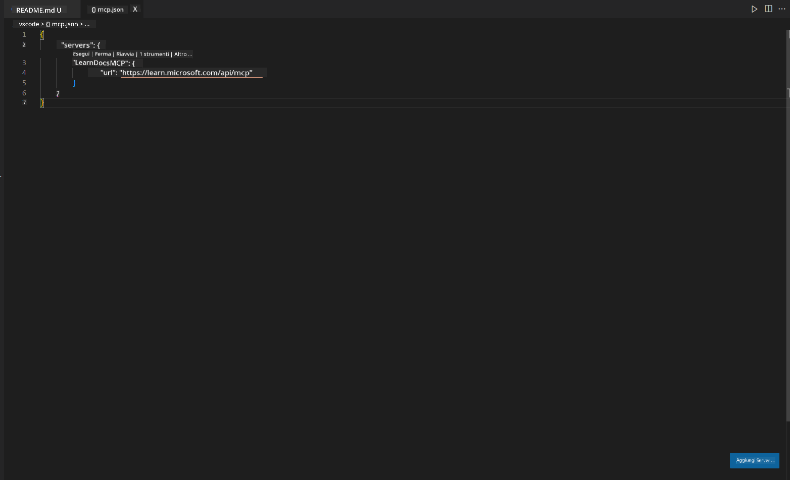
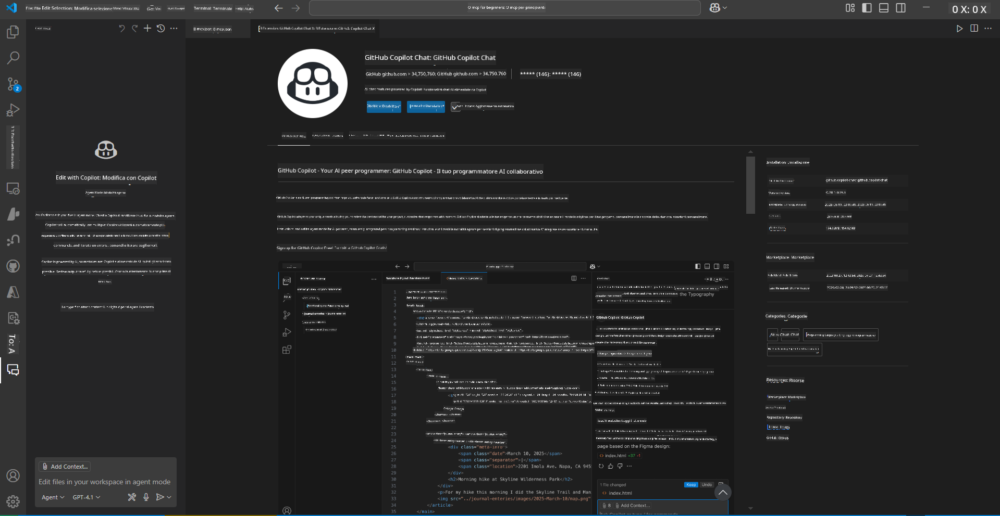
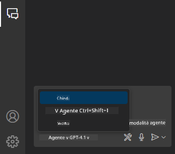
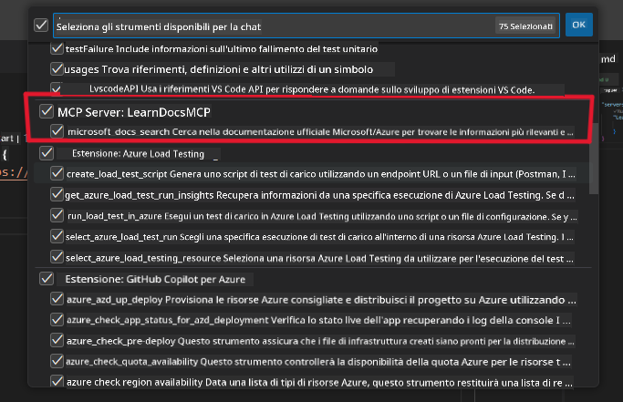
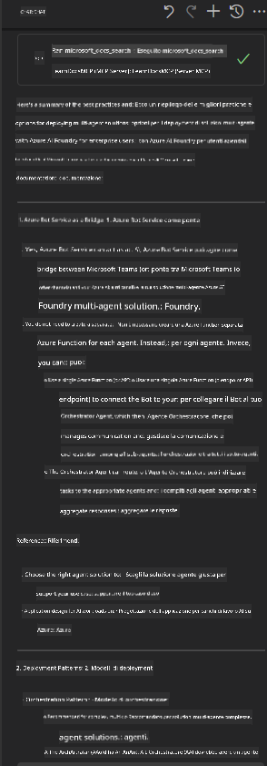

<!--
CO_OP_TRANSLATOR_METADATA:
{
  "original_hash": "db532b1ec386c9ce38c791653dc3c881",
  "translation_date": "2025-07-14T06:50:53+00:00",
  "source_file": "09-CaseStudy/docs-mcp/solution/scenario3/README.md",
  "language_code": "it"
}
-->
# Scenario 3: Documentazione in-Editor con MCP Server in VS Code

## Panoramica

In questo scenario, imparerai come integrare Microsoft Learn Docs direttamente nel tuo ambiente Visual Studio Code utilizzando il server MCP. Invece di passare continuamente da una scheda del browser all’altra per cercare documentazione, potrai accedere, cercare e consultare la documentazione ufficiale direttamente all’interno del tuo editor. Questo approccio semplifica il flusso di lavoro, ti mantiene concentrato e consente un’integrazione fluida con strumenti come GitHub Copilot.

- Cerca e leggi la documentazione all’interno di VS Code senza uscire dall’ambiente di sviluppo.
- Inserisci riferimenti e link alla documentazione direttamente nei tuoi file README o nei materiali del corso.
- Usa GitHub Copilot e MCP insieme per un flusso di lavoro documentale potenziato dall’IA.

## Obiettivi di apprendimento

Al termine di questo capitolo, saprai come configurare e utilizzare il server MCP all’interno di VS Code per migliorare il tuo flusso di lavoro di documentazione e sviluppo. Sarai in grado di:

- Configurare il workspace per utilizzare il server MCP nella ricerca della documentazione.
- Cercare e inserire documentazione direttamente da VS Code.
- Combinare la potenza di GitHub Copilot e MCP per un flusso di lavoro più produttivo e supportato dall’IA.

Queste competenze ti aiuteranno a mantenere la concentrazione, migliorare la qualità della documentazione e aumentare la produttività come sviluppatore o technical writer.

## Soluzione

Per ottenere l’accesso alla documentazione direttamente nell’editor, seguirai una serie di passaggi che integrano il server MCP con VS Code e GitHub Copilot. Questa soluzione è ideale per autori di corsi, redattori di documentazione e sviluppatori che vogliono rimanere concentrati nell’editor mentre lavorano con la documentazione e Copilot.

- Aggiungi rapidamente link di riferimento a un README mentre scrivi la documentazione di un corso o progetto.
- Usa Copilot per generare codice e MCP per trovare e citare istantaneamente la documentazione rilevante.
- Rimani concentrato nel tuo editor e aumenta la produttività.

### Guida passo-passo

Per iniziare, segui questi passaggi. Per ogni passaggio, puoi aggiungere uno screenshot dalla cartella assets per illustrare visivamente il processo.

1. **Aggiungi la configurazione MCP:**  
   Nella root del tuo progetto, crea un file `.vscode/mcp.json` e aggiungi la seguente configurazione:  
   ```json
   {
     "servers": {
       "LearnDocsMCP": {
         "url": "https://learn.microsoft.com/api/mcp"
       }
     }
   }
   ```  
   Questa configurazione indica a VS Code come connettersi al [`Microsoft Learn Docs MCP server`](https://github.com/MicrosoftDocs/mcp).
   
   
    
2. **Apri il pannello GitHub Copilot Chat:**  
   Se non hai ancora installato l’estensione GitHub Copilot, vai nella vista Estensioni di VS Code e installala. Puoi scaricarla direttamente dal [Visual Studio Code Marketplace](https://marketplace.visualstudio.com/items?itemName=GitHub.copilot-chat). Poi, apri il pannello Copilot Chat dalla barra laterale.

   

3. **Abilita la modalità agent e verifica gli strumenti:**  
   Nel pannello Copilot Chat, abilita la modalità agent.

   

   Dopo aver abilitato la modalità agent, verifica che il server MCP sia elencato tra gli strumenti disponibili. Questo garantisce che l’agente Copilot possa accedere al server di documentazione per recuperare informazioni rilevanti.
   
   

4. **Avvia una nuova chat e interroga l’agente:**  
   Apri una nuova chat nel pannello Copilot Chat. Ora puoi porre domande all’agente riguardo la documentazione. L’agente utilizzerà il server MCP per recuperare e mostrare la documentazione Microsoft Learn pertinente direttamente nel tuo editor.

   - *"Sto cercando di scrivere un piano di studio per l’argomento X. Lo studierò per 8 settimane, per ogni settimana suggeriscimi i contenuti da affrontare."*

   

5. **Query in tempo reale:**

   > Prendiamo una query in tempo reale dalla sezione [#get-help](https://discord.gg/D6cRhjHWSC) nel Discord di Azure AI Foundry ([vedi messaggio originale](https://discord.com/channels/1113626258182504448/1385498306720829572)):
   
   *"Sto cercando risposte su come distribuire una soluzione multi-agente con agenti AI sviluppati su Azure AI Foundry. Ho notato che non esiste un metodo di distribuzione diretto, come i canali di Copilot Studio. Quali sono quindi i diversi modi per effettuare questa distribuzione affinché gli utenti enterprise possano interagire e portare a termine il lavoro?  
   Ci sono numerosi articoli/blog che dicono che possiamo usare il servizio Azure Bot per questo compito, che può fungere da ponte tra MS Teams e gli agenti Azure AI Foundry. Funzionerebbe se configurassi un bot Azure che si collega all’Orchestrator Agent su Azure AI Foundry tramite Azure Function per gestire l’orchestrazione, oppure devo creare una Azure Function per ciascuno degli agenti AI della soluzione multi-agente per fare l’orchestrazione nel Bot Framework? Altri suggerimenti sono ben accetti."*

   

   L’agente risponderà con link e riepiloghi della documentazione rilevante, che potrai inserire direttamente nei tuoi file markdown o usare come riferimento nel codice.
   
### Esempi di query

Ecco alcune query di esempio che puoi provare. Queste dimostreranno come il server MCP e Copilot possano lavorare insieme per fornire documentazione e riferimenti contestuali e immediati senza uscire da VS Code:

- "Mostrami come usare i trigger di Azure Functions."
- "Inserisci un link alla documentazione ufficiale di Azure Key Vault."
- "Quali sono le best practice per la sicurezza delle risorse Azure?"
- "Trova un quickstart per i servizi Azure AI."

Queste query dimostreranno come il server MCP e Copilot possano collaborare per offrire documentazione e riferimenti contestuali e immediati senza uscire da VS Code.

---

**Disclaimer**:  
Questo documento è stato tradotto utilizzando il servizio di traduzione automatica [Co-op Translator](https://github.com/Azure/co-op-translator). Pur impegnandoci per garantire accuratezza, si prega di notare che le traduzioni automatiche possono contenere errori o imprecisioni. Il documento originale nella sua lingua nativa deve essere considerato la fonte autorevole. Per informazioni critiche, si raccomanda una traduzione professionale effettuata da un umano. Non ci assumiamo alcuna responsabilità per eventuali malintesi o interpretazioni errate derivanti dall’uso di questa traduzione.