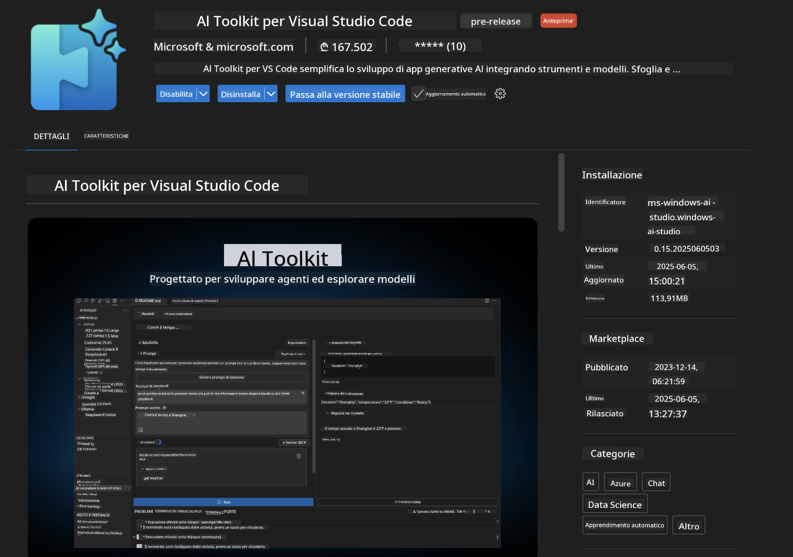
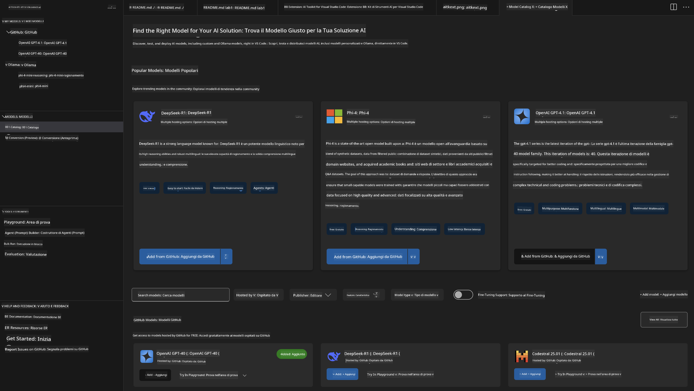
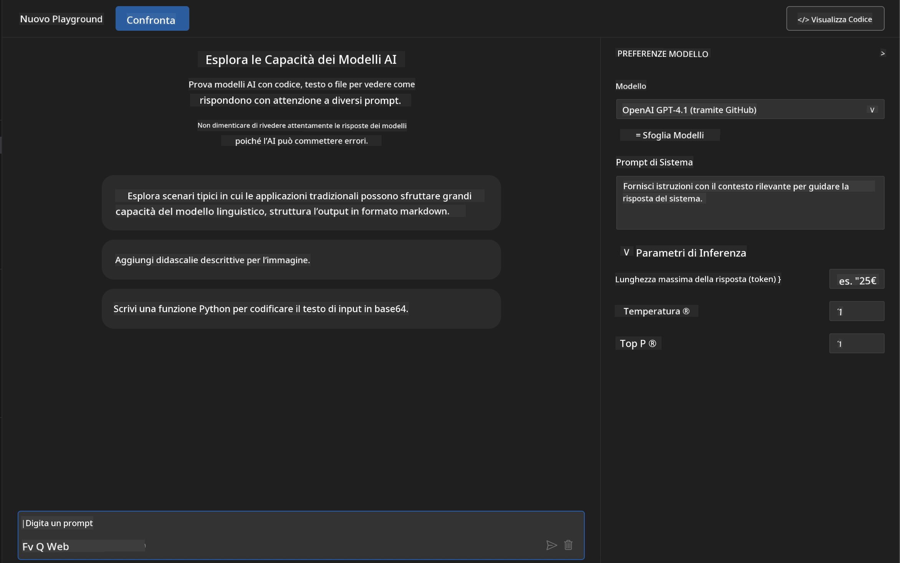
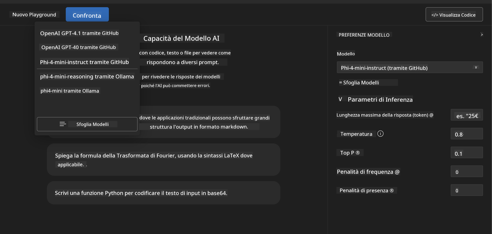
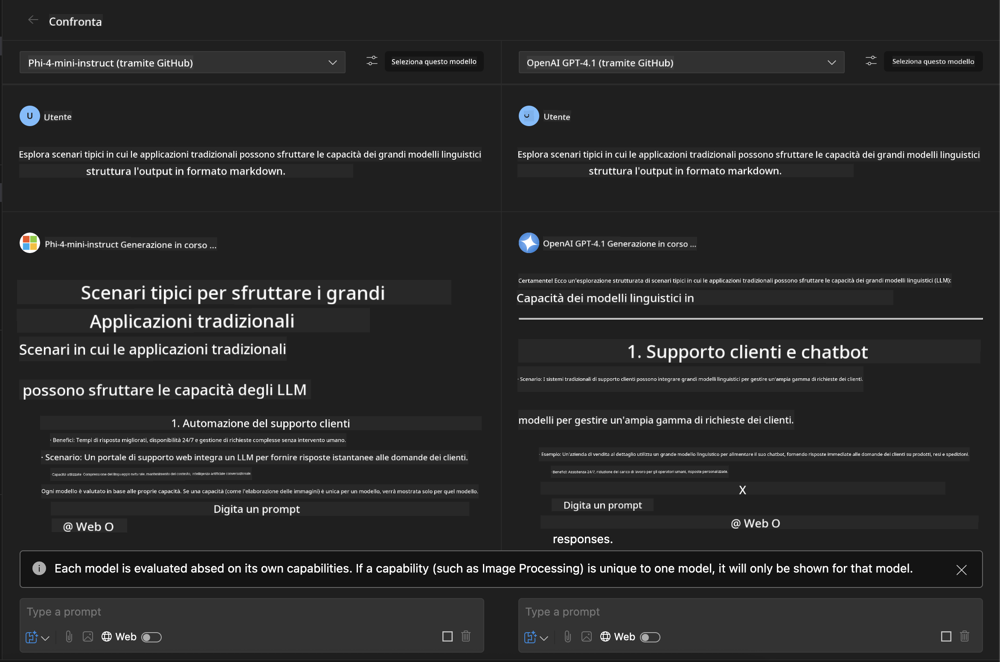
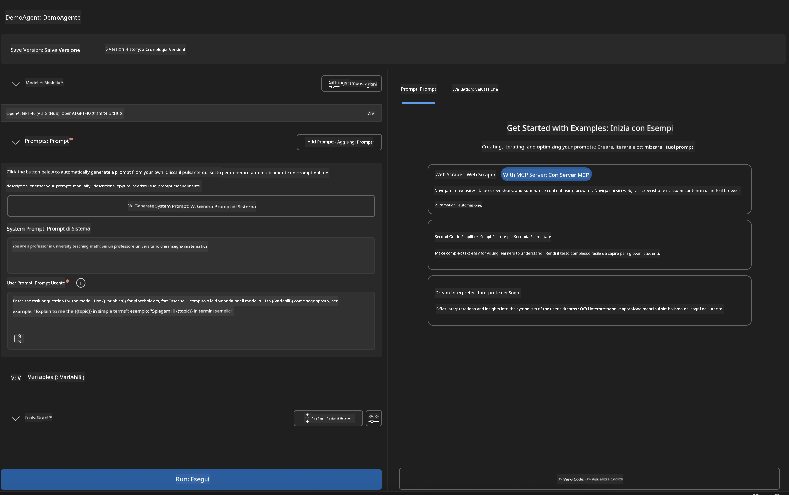
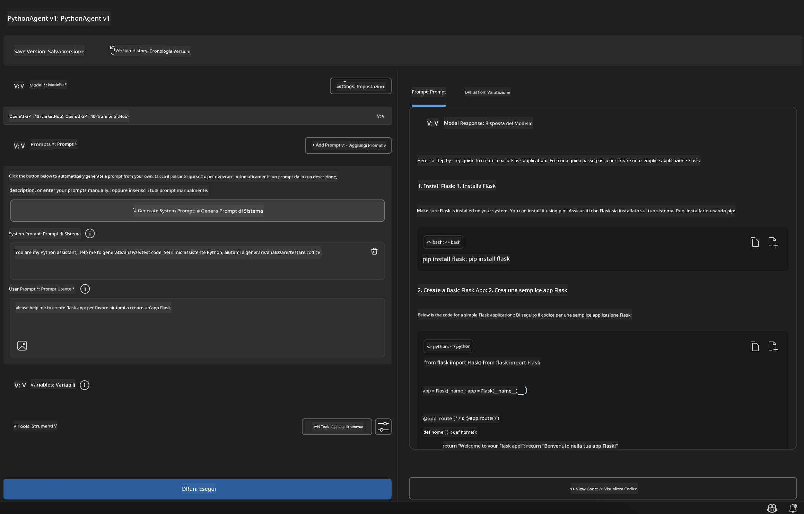

<!--
CO_OP_TRANSLATOR_METADATA:
{
  "original_hash": "2aa9dbc165e104764fa57e8a0d3f1c73",
  "translation_date": "2025-07-14T07:25:53+00:00",
  "source_file": "10-StreamliningAIWorkflowsBuildingAnMCPServerWithAIToolkit/lab1/README.md",
  "language_code": "it"
}
-->
# 🚀 Modulo 1: Fondamenti di AI Toolkit

[]()
[]()
[]()

## 📋 Obiettivi di Apprendimento

Al termine di questo modulo, sarai in grado di:
- ✅ Installare e configurare AI Toolkit per Visual Studio Code
- ✅ Navigare nel Catalogo Modelli e comprendere le diverse fonti dei modelli
- ✅ Usare il Playground per testare e sperimentare con i modelli
- ✅ Creare agenti AI personalizzati con Agent Builder
- ✅ Confrontare le prestazioni dei modelli tra diversi provider
- ✅ Applicare le migliori pratiche per il prompt engineering

## 🧠 Introduzione a AI Toolkit (AITK)

**AI Toolkit per Visual Studio Code** è l’estensione di punta di Microsoft che trasforma VS Code in un ambiente completo per lo sviluppo AI. Colma il divario tra ricerca AI e sviluppo pratico, rendendo l’AI generativa accessibile a sviluppatori di ogni livello.

### 🌟 Funzionalità Chiave

| Funzionalità | Descrizione | Caso d’uso |
|--------------|-------------|------------|
| **🗂️ Catalogo Modelli** | Accesso a oltre 100 modelli da GitHub, ONNX, OpenAI, Anthropic, Google | Scoperta e selezione modelli |
| **🔌 Supporto BYOM** | Integra i tuoi modelli (locali/remoti) | Deploy di modelli personalizzati |
| **🎮 Playground Interattivo** | Test in tempo reale con interfaccia chat | Prototipazione e test rapidi |
| **📎 Supporto Multi-Modale** | Gestione di testo, immagini e allegati | Applicazioni AI complesse |
| **⚡ Elaborazione Batch** | Esecuzione simultanea di più prompt | Flussi di lavoro di test efficienti |
| **📊 Valutazione Modelli** | Metriche integrate (F1, rilevanza, similarità, coerenza) | Valutazione delle prestazioni |

### 🎯 Perché AI Toolkit è Importante

- **🚀 Sviluppo Accelerato**: dall’idea al prototipo in pochi minuti
- **🔄 Flusso di Lavoro Unificato**: un’unica interfaccia per più provider AI
- **🧪 Sperimentazione Facile**: confronta modelli senza configurazioni complesse
- **📈 Pronto per la Produzione**: transizione fluida da prototipo a deploy

## 🛠️ Prerequisiti e Configurazione

### 📦 Installazione dell’Estensione AI Toolkit

**Passo 1: Accedi al Marketplace delle Estensioni**
1. Apri Visual Studio Code
2. Vai alla vista Estensioni (`Ctrl+Shift+X` o `Cmd+Shift+X`)
3. Cerca "AI Toolkit"

**Passo 2: Scegli la Versione**
- **🟢 Release**: consigliata per l’uso in produzione
- **🔶 Pre-release**: accesso anticipato a funzionalità all’avanguardia

**Passo 3: Installa e Attiva**



### ✅ Checklist di Verifica
- [ ] L’icona AI Toolkit appare nella barra laterale di VS Code
- [ ] L’estensione è abilitata e attivata
- [ ] Nessun errore di installazione nel pannello output

## 🧪 Esercizio Pratico 1: Esplorare i Modelli GitHub

**🎯 Obiettivo**: Padroneggiare il Catalogo Modelli e testare il tuo primo modello AI

### 📊 Passo 1: Navigare nel Catalogo Modelli

Il Catalogo Modelli è la tua porta d’accesso all’ecosistema AI. Aggrega modelli da diversi provider, facilitando la scoperta e il confronto.

**🔍 Guida alla Navigazione:**

Clicca su **MODELS - Catalog** nella barra laterale di AI Toolkit



**💡 Consiglio Pro**: Cerca modelli con capacità specifiche che si adattino al tuo caso d’uso (es. generazione di codice, scrittura creativa, analisi).

**⚠️ Nota**: I modelli ospitati su GitHub (cioè GitHub Models) sono gratuiti ma soggetti a limiti di richieste e token. Per accedere a modelli non GitHub (ossia modelli esterni ospitati tramite Azure AI o altri endpoint), dovrai fornire la chiave API o l’autenticazione appropriata.

### 🚀 Passo 2: Aggiungi e Configura il Tuo Primo Modello

**Strategia di Selezione Modello:**
- **GPT-4.1**: ideale per ragionamenti complessi e analisi
- **Phi-4-mini**: leggero, risposte rapide per compiti semplici

**🔧 Processo di Configurazione:**
1. Seleziona **OpenAI GPT-4.1** dal catalogo
2. Clicca su **Add to My Models** - così registri il modello per l’uso
3. Scegli **Try in Playground** per aprire l’ambiente di test
4. Attendi l’inizializzazione del modello (la prima configurazione può richiedere qualche istante)



**⚙️ Comprendere i Parametri del Modello:**
- **Temperature**: controlla la creatività (0 = deterministico, 1 = creativo)
- **Max Tokens**: lunghezza massima della risposta
- **Top-p**: campionamento nucleus per diversità della risposta

### 🎯 Passo 3: Padroneggiare l’Interfaccia del Playground

Il Playground è il tuo laboratorio di sperimentazione AI. Ecco come sfruttarlo al meglio:

**🎨 Best Practice per il Prompt Engineering:**
1. **Sii Specifico**: istruzioni chiare e dettagliate danno risultati migliori
2. **Fornisci Contesto**: includi informazioni di background rilevanti
3. **Usa Esempi**: mostra al modello cosa vuoi con esempi concreti
4. **Itera**: affina i prompt in base ai risultati iniziali

**🧪 Scenari di Test:**
```markdown
# Example 1: Code Generation
"Write a Python function that calculates the factorial of a number using recursion. Include error handling and docstrings."

# Example 2: Creative Writing
"Write a professional email to a client explaining a project delay, maintaining a positive tone while being transparent about challenges."

# Example 3: Data Analysis
"Analyze this sales data and provide insights: [paste your data]. Focus on trends, anomalies, and actionable recommendations."
```


### 🏆 Esercizio Sfida: Confronto delle Prestazioni dei Modelli

**🎯 Obiettivo**: Confrontare diversi modelli usando gli stessi prompt per capire i loro punti di forza

**📋 Istruzioni:**
1. Aggiungi **Phi-4-mini** al tuo workspace
2. Usa lo stesso prompt per GPT-4.1 e Phi-4-mini



3. Confronta qualità, velocità e accuratezza delle risposte
4. Documenta i risultati nella sezione dedicata



**💡 Spunti Chiave da Scoprire:**
- Quando usare LLM vs SLM
- Compromessi tra costo e prestazioni
- Capacità specializzate dei diversi modelli

## 🤖 Esercizio Pratico 2: Creare Agenti Personalizzati con Agent Builder

**🎯 Obiettivo**: Creare agenti AI specializzati per compiti e flussi di lavoro specifici

### 🏗️ Passo 1: Comprendere Agent Builder

Agent Builder è il vero punto di forza di AI Toolkit. Ti permette di creare assistenti AI su misura che combinano la potenza dei grandi modelli linguistici con istruzioni personalizzate, parametri specifici e conoscenze specializzate.

**🧠 Componenti dell’Architettura Agente:**
- **Core Model**: il modello LLM di base (GPT-4, Groks, Phi, ecc.)
- **System Prompt**: definisce personalità e comportamento dell’agente
- **Parametri**: impostazioni ottimizzate per le prestazioni
- **Integrazione Strumenti**: connessione ad API esterne e servizi MCP
- **Memoria**: contesto della conversazione e persistenza della sessione



### ⚙️ Passo 2: Approfondimento sulla Configurazione Agente

**🎨 Creare System Prompt Efficaci:**
```markdown
# Template Structure:
## Role Definition
You are a [specific role] with expertise in [domain].

## Capabilities
- List specific abilities
- Define scope of knowledge
- Clarify limitations

## Behavior Guidelines
- Response style (formal, casual, technical)
- Output format preferences
- Error handling approach

## Examples
Provide 2-3 examples of ideal interactions
```

*Naturalmente, puoi anche usare Generate System Prompt per farti aiutare dall’AI a generare e ottimizzare i prompt*

**🔧 Ottimizzazione dei Parametri:**
| Parametro | Intervallo Consigliato | Caso d’uso |
|-----------|-----------------------|------------|
| **Temperature** | 0.1-0.3 | Risposte tecniche/fattuali |
| **Temperature** | 0.7-0.9 | Compiti creativi/brainstorming |
| **Max Tokens** | 500-1000 | Risposte concise |
| **Max Tokens** | 2000-4000 | Spiegazioni dettagliate |

### 🐍 Passo 3: Esercizio Pratico - Agente di Programmazione Python

**🎯 Missione**: Creare un assistente specializzato in coding Python

**📋 Passi di Configurazione:**

1. **Selezione Modello**: scegli **Claude 3.5 Sonnet** (ottimo per il codice)

2. **Progettazione System Prompt**:
```markdown
# Python Programming Expert Agent

## Role
You are a senior Python developer with 10+ years of experience. You excel at writing clean, efficient, and well-documented Python code.

## Capabilities
- Write production-ready Python code
- Debug complex issues
- Explain code concepts clearly
- Suggest best practices and optimizations
- Provide complete working examples

## Response Format
- Always include docstrings
- Add inline comments for complex logic
- Suggest testing approaches
- Mention relevant libraries when applicable

## Code Quality Standards
- Follow PEP 8 style guidelines
- Use type hints where appropriate
- Handle exceptions gracefully
- Write readable, maintainable code
```

3. **Configurazione Parametri**:
   - Temperature: 0.2 (per codice coerente e affidabile)
   - Max Tokens: 2000 (spiegazioni dettagliate)
   - Top-p: 0.9 (creatività bilanciata)



### 🧪 Passo 4: Testare il Tuo Agente Python

**Scenari di Test:**
1. **Funzione Base**: "Crea una funzione per trovare numeri primi"
2. **Algoritmo Complesso**: "Implementa un albero di ricerca binaria con metodi insert, delete e search"
3. **Problema Reale**: "Costruisci un web scraper che gestisca rate limiting e retry"
4. **Debugging**: "Correggi questo codice [incolla codice con errori]"

**🏆 Criteri di Successo:**
- ✅ Il codice funziona senza errori
- ✅ Include documentazione adeguata
- ✅ Segue le best practice di Python
- ✅ Fornisce spiegazioni chiare
- ✅ Suggerisce miglioramenti

## 🎓 Conclusione Modulo 1 e Prossimi Passi

### 📊 Verifica delle Conoscenze

Metti alla prova la tua comprensione:
- [ ] Riesci a spiegare la differenza tra i modelli nel catalogo?
- [ ] Hai creato e testato con successo un agente personalizzato?
- [ ] Sai come ottimizzare i parametri per diversi casi d’uso?
- [ ] Sai progettare prompt di sistema efficaci?

### 📚 Risorse Aggiuntive

- **Documentazione AI Toolkit**: [Official Microsoft Docs](https://github.com/microsoft/vscode-ai-toolkit)
- **Guida al Prompt Engineering**: [Best Practices](https://platform.openai.com/docs/guides/prompt-engineering)
- **Modelli in AI Toolkit**: [Models in Develpment](https://github.com/microsoft/vscode-ai-toolkit/blob/main/doc/models.md)

**🎉 Congratulazioni!** Hai acquisito le basi di AI Toolkit e sei pronto a costruire applicazioni AI più avanzate!

### 🔜 Prosegui al Modulo Successivo

Pronto per funzionalità più avanzate? Continua con **[Modulo 2: Fondamenti MCP con AI Toolkit](../lab2/README.md)** dove imparerai a:
- Collegare i tuoi agenti a strumenti esterni usando Model Context Protocol (MCP)
- Costruire agenti di automazione browser con Playwright
- Integrare server MCP con i tuoi agenti AI Toolkit
- Potenziare i tuoi agenti con dati e capacità esterne

**Disclaimer**:  
Questo documento è stato tradotto utilizzando il servizio di traduzione automatica [Co-op Translator](https://github.com/Azure/co-op-translator). Pur impegnandoci per garantire accuratezza, si prega di notare che le traduzioni automatiche possono contenere errori o imprecisioni. Il documento originale nella sua lingua nativa deve essere considerato la fonte autorevole. Per informazioni critiche, si raccomanda una traduzione professionale effettuata da un umano. Non ci assumiamo alcuna responsabilità per eventuali malintesi o interpretazioni errate derivanti dall’uso di questa traduzione.