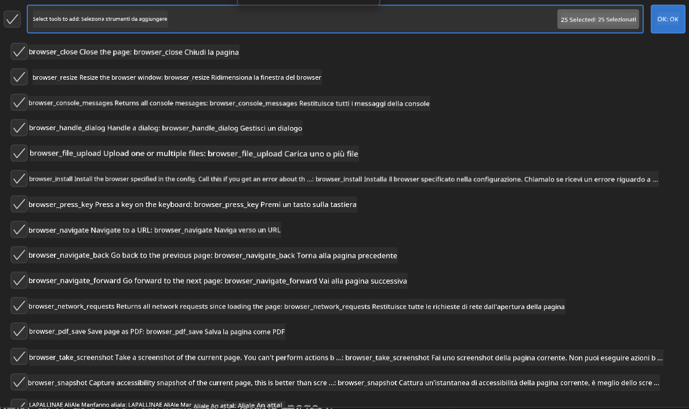
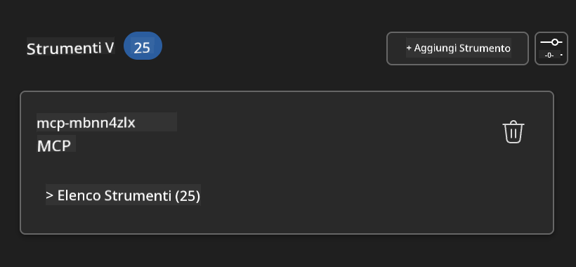
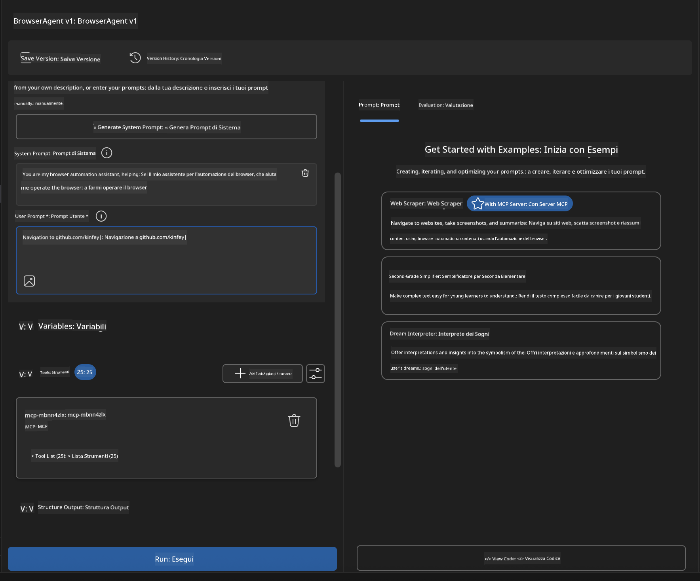
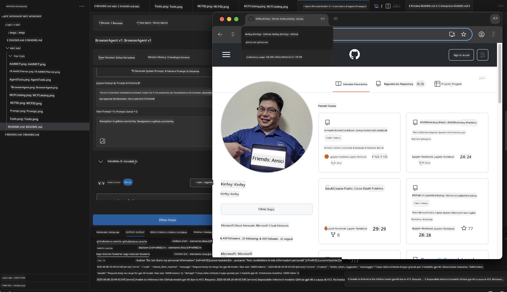
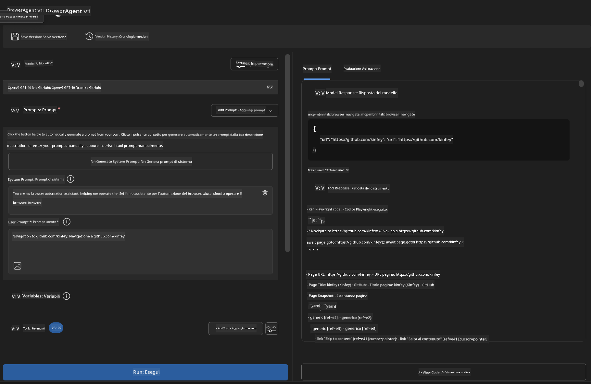

<!--
CO_OP_TRANSLATOR_METADATA:
{
  "original_hash": "a22b7dd11cd7690f99f9195877cafdc3",
  "translation_date": "2025-07-14T07:50:31+00:00",
  "source_file": "10-StreamliningAIWorkflowsBuildingAnMCPServerWithAIToolkit/lab2/README.md",
  "language_code": "it"
}
-->
# 🌐 Modulo 2: Fondamenti di MCP con AI Toolkit

[]()
[]()
[]()

## 📋 Obiettivi di Apprendimento

Al termine di questo modulo, sarai in grado di:
- ✅ Comprendere l'architettura e i vantaggi del Model Context Protocol (MCP)
- ✅ Esplorare l'ecosistema dei server MCP di Microsoft
- ✅ Integrare i server MCP con AI Toolkit Agent Builder
- ✅ Costruire un agente di automazione browser funzionale usando Playwright MCP
- ✅ Configurare e testare gli strumenti MCP all'interno dei tuoi agenti
- ✅ Esportare e distribuire agenti potenziati da MCP per l'uso in produzione

## 🎯 Costruire sulle Basi del Modulo 1

Nel Modulo 1 abbiamo imparato le basi di AI Toolkit e creato il nostro primo agente Python. Ora **potenzieremo** i tuoi agenti collegandoli a strumenti e servizi esterni tramite il rivoluzionario **Model Context Protocol (MCP)**.

Pensalo come un upgrade da una semplice calcolatrice a un computer completo: i tuoi agenti AI acquisiranno la capacità di:
- 🌐 Navigare e interagire con siti web
- 📁 Accedere e manipolare file
- 🔧 Integrarsi con sistemi aziendali
- 📊 Elaborare dati in tempo reale da API

## 🧠 Comprendere il Model Context Protocol (MCP)

### 🔍 Cos’è MCP?

Model Context Protocol (MCP) è il **"USB-C per le applicazioni AI"** - uno standard aperto rivoluzionario che collega i Large Language Models (LLM) a strumenti esterni, fonti di dati e servizi. Proprio come USB-C ha eliminato il caos dei cavi fornendo un connettore universale, MCP elimina la complessità dell’integrazione AI con un protocollo standardizzato.

### 🎯 Il Problema che MCP Risolve

**Prima di MCP:**
- 🔧 Integrazioni personalizzate per ogni strumento
- 🔄 Lock-in con soluzioni proprietarie  
- 🔒 Vulnerabilità di sicurezza da connessioni ad hoc
- ⏱️ Mesi di sviluppo per integrazioni di base

**Con MCP:**
- ⚡ Integrazione plug-and-play degli strumenti
- 🔄 Architettura indipendente dal fornitore
- 🛡️ Best practice di sicurezza integrate
- 🚀 Minuti per aggiungere nuove funzionalità

### 🏗️ Approfondimento sull’Architettura MCP

MCP segue un’**architettura client-server** che crea un ecosistema sicuro e scalabile:

```mermaid
graph TB
    A[AI Application/Agent] --> B[MCP Client]
    B --> C[MCP Server 1: Files]
    B --> D[MCP Server 2: Web APIs]
    B --> E[MCP Server 3: Database]
    B --> F[MCP Server N: Custom Tools]
    
    C --> G[Local File System]
    D --> H[External APIs]
    E --> I[Database Systems]
    F --> J[Enterprise Systems]
```

**🔧 Componenti Principali:**

| Componente | Ruolo | Esempi |
|------------|-------|--------|
| **MCP Hosts** | Applicazioni che consumano servizi MCP | Claude Desktop, VS Code, AI Toolkit |
| **MCP Clients** | Gestori del protocollo (1:1 con i server) | Integrati nelle applicazioni host |
| **MCP Servers** | Espongono funzionalità tramite protocollo standard | Playwright, Files, Azure, GitHub |
| **Transport Layer** | Metodi di comunicazione | stdio, HTTP, WebSockets |


## 🏢 Ecosistema dei Server MCP di Microsoft

Microsoft guida l’ecosistema MCP con una suite completa di server enterprise che rispondono a esigenze aziendali reali.

### 🌟 Server MCP Microsoft in Evidenza

#### 1. ☁️ Azure MCP Server
**🔗 Repository**: [azure/azure-mcp](https://github.com/azure/azure-mcp)  
**🎯 Scopo**: Gestione completa delle risorse Azure con integrazione AI

**✨ Caratteristiche principali:**
- Provisioning infrastrutturale dichiarativo
- Monitoraggio risorse in tempo reale
- Raccomandazioni per ottimizzazione costi
- Verifica conformità sicurezza

**🚀 Casi d’uso:**
- Infrastructure-as-Code con assistenza AI
- Scalabilità automatica delle risorse
- Ottimizzazione dei costi cloud
- Automazione dei workflow DevOps

#### 2. 📊 Microsoft Dataverse MCP
**📚 Documentazione**: [Microsoft Dataverse Integration](https://go.microsoft.com/fwlink/?linkid=2320176)  
**🎯 Scopo**: Interfaccia in linguaggio naturale per dati aziendali

**✨ Caratteristiche principali:**
- Query database in linguaggio naturale
- Comprensione del contesto aziendale
- Template di prompt personalizzati
- Governance dei dati enterprise

**🚀 Casi d’uso:**
- Reportistica business intelligence
- Analisi dati clienti
- Insight sul pipeline di vendita
- Query per dati di conformità

#### 3. 🌐 Playwright MCP Server
**🔗 Repository**: [microsoft/playwright-mcp](https://github.com/microsoft/playwright-mcp)  
**🎯 Scopo**: Automazione browser e interazione web

**✨ Caratteristiche principali:**
- Automazione cross-browser (Chrome, Firefox, Safari)
- Rilevamento intelligente degli elementi
- Generazione screenshot e PDF
- Monitoraggio traffico di rete

**🚀 Casi d’uso:**
- Workflow di test automatizzati
- Web scraping e estrazione dati
- Monitoraggio UI/UX
- Automazione analisi competitiva

#### 4. 📁 Files MCP Server
**🔗 Repository**: [microsoft/files-mcp-server](https://github.com/microsoft/files-mcp-server)  
**🎯 Scopo**: Operazioni intelligenti sul file system

**✨ Caratteristiche principali:**
- Gestione file dichiarativa
- Sincronizzazione contenuti
- Integrazione controllo versioni
- Estrazione metadati

**🚀 Casi d’uso:**
- Gestione documentazione
- Organizzazione repository codice
- Workflow di pubblicazione contenuti
- Gestione file pipeline dati

#### 5. 📝 MarkItDown MCP Server
**🔗 Repository**: [microsoft/markitdown](https://github.com/microsoft/markitdown)  
**🎯 Scopo**: Elaborazione e manipolazione avanzata di Markdown

**✨ Caratteristiche principali:**
- Parsing avanzato di Markdown
- Conversione formati (MD ↔ HTML ↔ PDF)
- Analisi struttura contenuti
- Elaborazione template

**🚀 Casi d’uso:**
- Workflow documentazione tecnica
- Sistemi di gestione contenuti
- Generazione report
- Automazione knowledge base

#### 6. 📈 Clarity MCP Server
**📦 Package**: [@microsoft/clarity-mcp-server](https://www.npmjs.com/package/@microsoft/clarity-mcp-server)  
**🎯 Scopo**: Analisi web e insight sul comportamento utente

**✨ Caratteristiche principali:**
- Analisi dati heatmap
- Registrazioni sessioni utente
- Metriche di performance
- Analisi funnel di conversione

**🚀 Casi d’uso:**
- Ottimizzazione siti web
- Ricerca esperienza utente
- Analisi A/B testing
- Dashboard business intelligence

### 🌍 Ecosistema della Community

Oltre ai server Microsoft, l’ecosistema MCP include:
- **🐙 GitHub MCP**: Gestione repository e analisi codice
- **🗄️ Database MCPs**: Integrazioni PostgreSQL, MySQL, MongoDB
- **☁️ Cloud Provider MCPs**: Strumenti AWS, GCP, Digital Ocean
- **📧 Communication MCPs**: Integrazioni Slack, Teams, Email

## 🛠️ Laboratorio Pratico: Costruire un Agente di Automazione Browser

**🎯 Obiettivo del Progetto**: Creare un agente intelligente di automazione browser usando il server Playwright MCP che possa navigare siti web, estrarre informazioni ed eseguire interazioni web complesse.

### 🚀 Fase 1: Configurazione Base dell’Agente

#### Passo 1: Inizializza il Tuo Agente
1. **Apri AI Toolkit Agent Builder**  
2. **Crea un Nuovo Agente** con la seguente configurazione:  
   - **Nome**: `BrowserAgent`  
   - **Modello**: Scegli GPT-4o  


### 🔧 Fase 2: Workflow di Integrazione MCP

#### Passo 3: Aggiungi l’Integrazione del Server MCP
1. **Vai alla sezione Tools** in Agent Builder  
2. **Clicca su "Add Tool"** per aprire il menu di integrazione  
3. **Seleziona "MCP Server"** tra le opzioni disponibili  


**🔍 Tipi di Strumenti:**
- **Built-in Tools**: Funzioni preconfigurate di AI Toolkit  
- **MCP Servers**: Integrazioni con servizi esterni  
- **Custom APIs**: Endpoint di servizi personalizzati  
- **Function Calling**: Accesso diretto a funzioni del modello  

#### Passo 4: Selezione del Server MCP
1. **Scegli l’opzione "MCP Server"** per procedere  


2. **Esplora il Catalogo MCP** per vedere le integrazioni disponibili  


### 🎮 Fase 3: Configurazione Playwright MCP

#### Passo 5: Seleziona e Configura Playwright
1. **Clicca su "Use Featured MCP Servers"** per accedere ai server verificati da Microsoft  
2. **Seleziona "Playwright"** dalla lista in evidenza  
3. **Accetta l’ID MCP predefinito** o personalizzalo per il tuo ambiente  


#### Passo 6: Abilita le Funzionalità di Playwright
**🔑 Passo Critico**: Seleziona **TUTTI** i metodi Playwright disponibili per massimizzare le funzionalità  



**🛠️ Strumenti Essenziali di Playwright:**
- **Navigazione**: `goto`, `goBack`, `goForward`, `reload`  
- **Interazione**: `click`, `fill`, `press`, `hover`, `drag`  
- **Estrazione**: `textContent`, `innerHTML`, `getAttribute`  
- **Validazione**: `isVisible`, `isEnabled`, `waitForSelector`  
- **Cattura**: `screenshot`, `pdf`, `video`  
- **Rete**: `setExtraHTTPHeaders`, `route`, `waitForResponse`  

#### Passo 7: Verifica il Successo dell’Integrazione
**✅ Indicatori di Successo:**
- Tutti gli strumenti appaiono nell’interfaccia di Agent Builder  
- Nessun messaggio di errore nel pannello di integrazione  
- Stato del server Playwright mostra "Connected"  



**🔧 Risoluzione Problemi Comuni:**
- **Connessione Fallita**: Controlla la connessione internet e le impostazioni del firewall  
- **Strumenti Mancanti**: Assicurati di aver selezionato tutte le funzionalità durante la configurazione  
- **Errori di Permessi**: Verifica che VS Code abbia i permessi di sistema necessari  

### 🎯 Fase 4: Prompt Engineering Avanzato

#### Passo 8: Progetta Prompt di Sistema Intelligenti
Crea prompt sofisticati che sfruttino appieno le capacità di Playwright:

```markdown
# Web Automation Expert System Prompt

## Core Identity
You are an advanced web automation specialist with deep expertise in browser automation, web scraping, and user experience analysis. You have access to Playwright tools for comprehensive browser control.

## Capabilities & Approach
### Navigation Strategy
- Always start with screenshots to understand page layout
- Use semantic selectors (text content, labels) when possible
- Implement wait strategies for dynamic content
- Handle single-page applications (SPAs) effectively

### Error Handling
- Retry failed operations with exponential backoff
- Provide clear error descriptions and solutions
- Suggest alternative approaches when primary methods fail
- Always capture diagnostic screenshots on errors

### Data Extraction
- Extract structured data in JSON format when possible
- Provide confidence scores for extracted information
- Validate data completeness and accuracy
- Handle pagination and infinite scroll scenarios

### Reporting
- Include step-by-step execution logs
- Provide before/after screenshots for verification
- Suggest optimizations and alternative approaches
- Document any limitations or edge cases encountered

## Ethical Guidelines
- Respect robots.txt and rate limiting
- Avoid overloading target servers
- Only extract publicly available information
- Follow website terms of service
```

#### Passo 9: Crea Prompt Dinamici per l’Utente
Progetta prompt che dimostrino varie funzionalità:

**🌐 Esempio di Analisi Web:**
```markdown
Navigate to github.com/kinfey and provide a comprehensive analysis including:
1. Repository structure and organization
2. Recent activity and contribution patterns  
3. Documentation quality assessment
4. Technology stack identification
5. Community engagement metrics
6. Notable projects and their purposes

Include screenshots at key steps and provide actionable insights.
```



### 🚀 Fase 5: Esecuzione e Test

#### Passo 10: Esegui la Tua Prima Automazione
1. **Clicca su "Run"** per avviare la sequenza di automazione  
2. **Monitora l’Esecuzione in Tempo Reale**:  
   - Il browser Chrome si avvia automaticamente  
   - L’agente naviga sul sito target  
   - Vengono catturati screenshot ad ogni passaggio importante  
   - I risultati dell’analisi vengono mostrati in streaming  



#### Passo 11: Analizza Risultati e Insight
Rivedi l’analisi completa nell’interfaccia di Agent Builder:



### 🌟 Fase 6: Funzionalità Avanzate e Distribuzione

#### Passo 12: Esporta e Distribuisci in Produzione
Agent Builder supporta diverse opzioni di distribuzione:


## 🎓 Riepilogo Modulo 2 & Prossimi Passi

### 🏆 Obiettivo Raggiunto: Maestro dell’Integrazione MCP

**✅ Competenze Acquisite:**
- [ ] Comprensione dell’architettura e dei vantaggi MCP  
- [ ] Navigazione nell’ecosistema dei server MCP Microsoft  
- [ ] Integrazione di Playwright MCP con AI Toolkit  
- [ ] Costruzione di agenti di automazione browser sofisticati  
- [ ] Prompt engineering avanzato per automazione web  

### 📚 Risorse Aggiuntive

- **🔗 Specifica MCP**: [Documentazione Ufficiale del Protocollo](https://modelcontextprotocol.io/)  
- **🛠️ Playwright API**: [Riferimento Completo Metodi](https://playwright.dev/docs/api/class-playwright)  
- **🏢 Server MCP Microsoft**: [Guida all’Integrazione Enterprise](https://github.com/microsoft/mcp-servers)  
- **🌍 Esempi dalla Community**: [Galleria Server MCP](https://github.com/modelcontextprotocol/servers)  

**🎉 Congratulazioni!** Hai padroneggiato con successo l’integrazione MCP e ora puoi costruire agenti AI pronti per la produzione con capacità di strumenti esterni!

### 🔜 Continua al Prossimo Modulo

Pronto a portare le tue competenze MCP al livello successivo? Procedi a **[Modulo 3: Sviluppo Avanzato MCP con AI Toolkit](../lab3/README.md)** dove imparerai a:
- Creare i tuoi server MCP personalizzati  
- Configurare e utilizzare l’ultimo MCP Python SDK  
- Impostare MCP Inspector per il debugging  
- Padroneggiare i workflow avanzati di sviluppo server MCP
- Costruire un Weather MCP Server da zero

**Disclaimer**:  
Questo documento è stato tradotto utilizzando il servizio di traduzione automatica [Co-op Translator](https://github.com/Azure/co-op-translator). Pur impegnandoci per garantire l’accuratezza, si prega di notare che le traduzioni automatiche possono contenere errori o imprecisioni. Il documento originale nella sua lingua nativa deve essere considerato la fonte autorevole. Per informazioni critiche, si raccomanda una traduzione professionale effettuata da un umano. Non ci assumiamo alcuna responsabilità per eventuali malintesi o interpretazioni errate derivanti dall’uso di questa traduzione.