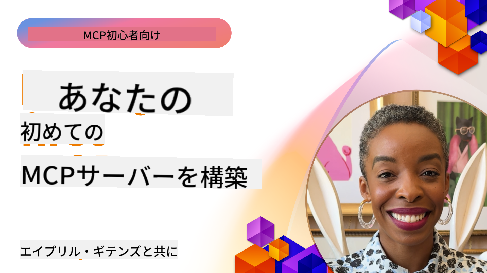

<!--
CO_OP_TRANSLATOR_METADATA:
{
  "original_hash": "f400d87053221363769113c24f117248",
  "translation_date": "2025-10-06T22:25:51+00:00",
  "source_file": "03-GettingStarted/README.md",
  "language_code": "ja"
}
-->
## はじめに  

_(上の画像をクリックすると、このレッスンの動画が視聴できます)_

このセクションは以下のレッスンで構成されています：

- **1 最初のサーバー**: 最初のレッスンでは、初めてのサーバーを作成し、インスペクターツールを使って検査する方法を学びます。これはサーバーをテストしデバッグするための貴重な方法です。[レッスンへ](01-first-server/README.md)

- **2 クライアント**: このレッスンでは、サーバーに接続できるクライアントを作成する方法を学びます。[レッスンへ](02-client/README.md)

- **3 LLMを使用したクライアント**: クライアントをさらに良くする方法として、LLMを追加してサーバーと「交渉」できるようにする方法を学びます。[レッスンへ](03-llm-client/README.md)

- **4 Visual Studio CodeでGitHub Copilot Agentモードのサーバーを利用する**: MCPサーバーをVisual Studio Code内で実行する方法を学びます。[レッスンへ](04-vscode/README.md)

- **5 stdioトランスポートサーバー**: 現行の仕様では、MCPサーバーとクライアント間の通信に推奨される標準であるstdioトランスポートについて学びます。安全なサブプロセスベースの通信を提供します。[レッスンへ](05-stdio-server/README.md)

- **6 MCPを使用したHTTPストリーミング (Streamable HTTP)**: 最新のHTTPストリーミング、進捗通知、Streamable HTTPを使用したスケーラブルでリアルタイムなMCPサーバーとクライアントの実装方法を学びます。[レッスンへ](06-http-streaming/README.md)

- **7 VSCode用AIツールキットの活用**: MCPクライアントとサーバーを利用しテストする方法を学びます。[レッスンへ](07-aitk/README.md)

- **8 テスト**: このレッスンでは、サーバーとクライアントをさまざまな方法でテストする方法に焦点を当てます。[レッスンへ](08-testing/README.md)

- **9 デプロイ**: この章では、MCPソリューションをデプロイするさまざまな方法を検討します。[レッスンへ](09-deployment/README.md)

- **10 高度なサーバー使用法**: この章では、高度なサーバー使用法について説明します。[レッスンへ](./10-advanced/README.md)

- **11 認証**: この章では、Basic AuthからJWTやRBACを使用した簡単な認証を追加する方法を説明します。ここから始めて、第5章の高度なトピックを確認し、第2章の推奨事項を通じて追加のセキュリティ強化を行うことをお勧めします。[レッスンへ](./11-simple-auth/README.md)

Model Context Protocol (MCP)は、アプリケーションがLLMにコンテキストを提供する方法を標準化するオープンプロトコルです。MCPはAIアプリケーションのUSB-Cポートのようなもので、AIモデルをさまざまなデータソースやツールに接続する標準的な方法を提供します。

## 学習目標

このレッスンの終了時には、以下ができるようになります：

- C#、Java、Python、TypeScript、JavaScriptでMCPの開発環境をセットアップする
- カスタム機能（リソース、プロンプト、ツール）を備えた基本的なMCPサーバーを構築しデプロイする
- MCPサーバーに接続するホストアプリケーションを作成する
- MCPの実装をテストしデバッグする
- 一般的なセットアップの課題とその解決策を理解する
- MCPの実装を人気のあるLLMサービスに接続する

## MCP環境のセットアップ

MCPを使用する前に、開発環境を準備し基本的なワークフローを理解することが重要です。このセクションでは、MCPをスムーズに開始するための初期設定手順を案内します。

### 前提条件

MCP開発に取り組む前に、以下を確認してください：

- **開発環境**: 選択した言語（C#、Java、Python、TypeScript、JavaScript）に対応する環境
- **IDE/エディター**: Visual Studio、Visual Studio Code、IntelliJ、Eclipse、PyCharm、または最新のコードエディター
- **パッケージマネージャー**: NuGet、Maven/Gradle、pip、またはnpm/yarn
- **APIキー**: ホストアプリケーションで使用する予定のAIサービス用

### 公式SDK

次の章では、Python、TypeScript、Java、.NETを使用して構築されたソリューションを紹介します。以下は公式にサポートされているSDKです。

MCPは複数の言語向けに公式SDKを提供しています：
- [C# SDK](https://github.com/modelcontextprotocol/csharp-sdk) - Microsoftとの共同で管理
- [Java SDK](https://github.com/modelcontextprotocol/java-sdk) - Spring AIとの共同で管理
- [TypeScript SDK](https://github.com/modelcontextprotocol/typescript-sdk) - 公式TypeScript実装
- [Python SDK](https://github.com/modelcontextprotocol/python-sdk) - 公式Python実装
- [Kotlin SDK](https://github.com/modelcontextprotocol/kotlin-sdk) - 公式Kotlin実装
- [Swift SDK](https://github.com/modelcontextprotocol/swift-sdk) - Loopwork AIとの共同で管理
- [Rust SDK](https://github.com/modelcontextprotocol/rust-sdk) - 公式Rust実装

## 重要なポイント

- MCP開発環境のセットアップは、言語固有のSDKを使用することで簡単に行えます
- MCPサーバーの構築には、明確なスキーマを持つツールの作成と登録が含まれます
- MCPクライアントはサーバーやモデルに接続し、拡張機能を活用します
- 信頼性の高いMCP実装にはテストとデバッグが不可欠です
- デプロイメントオプションは、ローカル開発からクラウドベースのソリューションまで幅広く対応しています

## 実践

このセクションのすべての章で紹介される演習を補完するサンプルセットを用意しています。さらに、各章には独自の演習と課題も含まれています。

- [Java電卓](./samples/java/calculator/README.md)
- [.Net電卓](../../../03-GettingStarted/samples/csharp)
- [JavaScript電卓](./samples/javascript/README.md)
- [TypeScript電卓](./samples/typescript/README.md)
- [Python電卓](../../../03-GettingStarted/samples/python)

## 追加リソース

- [AzureでModel Context Protocolを使用してエージェントを構築する](https://learn.microsoft.com/azure/developer/ai/intro-agents-mcp)
- [Azure Container AppsでリモートMCP (Node.js/TypeScript/JavaScript)](https://learn.microsoft.com/samples/azure-samples/mcp-container-ts/mcp-container-ts/)
- [.NET OpenAI MCPエージェント](https://learn.microsoft.com/samples/azure-samples/openai-mcp-agent-dotnet/openai-mcp-agent-dotnet/)

## 次のステップ

次へ: [最初のMCPサーバーを作成する](01-first-server/README.md)

---

**免責事項**:  
この文書は、AI翻訳サービス[Co-op Translator](https://github.com/Azure/co-op-translator)を使用して翻訳されています。正確性を追求しておりますが、自動翻訳には誤りや不正確な部分が含まれる可能性があることをご承知ください。元の言語で記載された文書が正式な情報源とみなされるべきです。重要な情報については、専門の人間による翻訳を推奨します。この翻訳の使用に起因する誤解や誤解釈について、当方は責任を負いません。