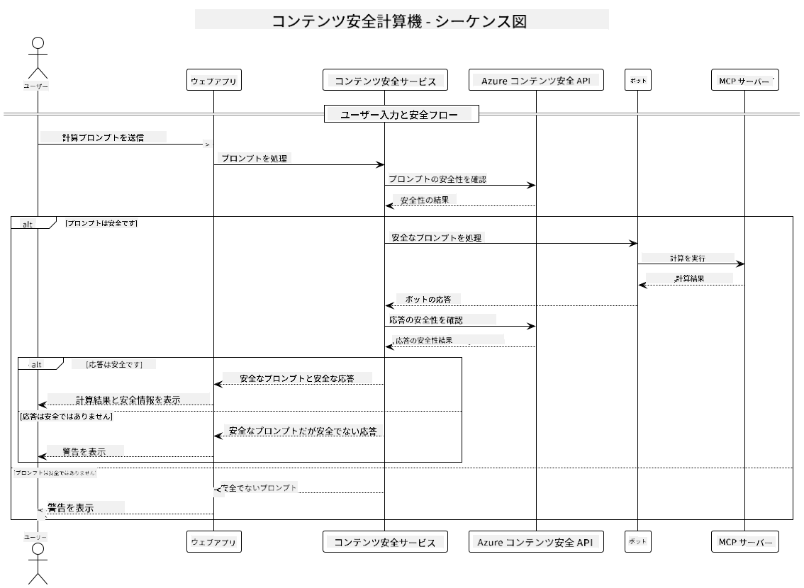

<!--
CO_OP_TRANSLATOR_METADATA:
{
  "original_hash": "e5ea5e7582f70008ea9bec3b3820f20a",
  "translation_date": "2025-07-13T23:13:28+00:00",
  "source_file": "04-PracticalImplementation/samples/java/containerapp/README.md",
  "language_code": "ja"
}
-->
## システムアーキテクチャ

このプロジェクトは、ユーザーのプロンプトを計算サービスに渡す前にコンテンツの安全性チェックを行うウェブアプリケーションを示しています。通信はModel Context Protocol（MCP）を使用しています。



### 動作の仕組み

1. **ユーザー入力**: ユーザーがウェブインターフェースで計算プロンプトを入力します  
2. **コンテンツ安全性スクリーニング（入力）**: プロンプトはAzure Content Safety APIで解析されます  
3. **安全性判定（入力）**:  
   - すべてのカテゴリで重大度が2未満の場合は計算機へ進みます  
   - 潜在的に有害と判定された場合は処理が停止し、警告が返されます  
4. **計算機連携**: 安全と判断された内容はLangChain4jで処理され、MCP計算機サーバーと通信します  
5. **コンテンツ安全性スクリーニング（出力）**: ボットの応答はAzure Content Safety APIで解析されます  
6. **安全性判定（出力）**:  
   - ボットの応答が安全ならユーザーに表示されます  
   - 有害の可能性がある場合は警告に置き換えられます  
7. **応答**: 結果（安全な場合）は、両方の安全性解析結果とともにユーザーに表示されます  

## Model Context Protocol（MCP）を使った計算サービスの利用

このプロジェクトは、LangChain4jから計算機MCPサービスを呼び出す方法を示しています。実装では、ローカルのポート8080で動作するMCPサーバーを使って計算操作を提供しています。

### Azure Content Safetyサービスの設定

コンテンツ安全機能を使う前に、Azure Content Safetyサービスのリソースを作成する必要があります：

1. [Azure Portal](https://portal.azure.com)にサインイン  
2. 「リソースの作成」をクリックし、「Content Safety」を検索  
3. 「Content Safety」を選択し、「作成」をクリック  
4. リソースの一意の名前を入力  
5. サブスクリプションとリソースグループを選択（または新規作成）  
6. 対応リージョンを選択（詳細は[リージョンの可用性](https://azure.microsoft.com/en-us/global-infrastructure/services/?products=cognitive-services)を参照）  
7. 適切な料金プランを選択  
8. 「作成」をクリックしてリソースを展開  
9. 展開完了後、「リソースに移動」をクリック  
10. 左側の「リソース管理」から「キーとエンドポイント」を選択  
11. 次のステップで使用するため、キーのいずれかとエンドポイントURLをコピー  

### 環境変数の設定

GitHubモデル認証用に`GITHUB_TOKEN`環境変数を設定してください：  
```sh
export GITHUB_TOKEN=<your_github_token>
```

コンテンツ安全機能用には以下を設定します：  
```sh
export CONTENT_SAFETY_ENDPOINT=<your_content_safety_endpoint>
export CONTENT_SAFETY_KEY=<your_content_safety_key>
```

これらの環境変数はアプリケーションがAzure Content Safetyサービスに認証するために使用します。設定されていない場合、デモ用のプレースホルダー値が使われますが、コンテンツ安全機能は正しく動作しません。

### 計算機MCPサーバーの起動

クライアントを実行する前に、localhost:8080でSSEモードの計算機MCPサーバーを起動してください。

## プロジェクト概要

このプロジェクトは、Model Context Protocol（MCP）をLangChain4jと連携させて計算機サービスを呼び出す例を示しています。主な特徴は以下の通りです：

- MCPを使って基本的な数学演算の計算機サービスに接続  
- ユーザープロンプトとボット応答の両方に対する二重のコンテンツ安全性チェック  
- LangChain4j経由でGitHubのgpt-4.1-nanoモデルと統合  
- MCP通信にServer-Sent Events（SSE）を使用  

## コンテンツ安全性の統合

このプロジェクトには、ユーザー入力とシステム応答の両方が有害な内容を含まないようにする包括的なコンテンツ安全機能が含まれています：

1. **入力スクリーニング**: すべてのユーザープロンプトは、ヘイトスピーチ、暴力、自傷行為、性的内容などの有害カテゴリについて処理前に解析されます。  

2. **出力スクリーニング**: 潜在的に検閲されていないモデルを使用する場合でも、生成されたすべての応答は同じコンテンツ安全フィルターでチェックされ、ユーザーに表示されます。  

この二重のアプローチにより、使用するAIモデルに関わらずシステムの安全性が保たれ、ユーザーを有害な入力や問題のあるAI生成出力から守ります。

## ウェブクライアント

アプリケーションには、ユーザーがContent Safety Calculatorシステムとやり取りできる使いやすいウェブインターフェースが含まれています：

### ウェブインターフェースの特徴

- 計算プロンプトを入力するシンプルで直感的なフォーム  
- 入力と出力の二重のコンテンツ安全性検証  
- プロンプトと応答の安全性に関するリアルタイムフィードバック  
- 視覚的にわかりやすい色分けされた安全性インジケーター  
- 多様なデバイスで動作するクリーンでレスポンシブなデザイン  
- ユーザーを導く安全なプロンプトの例  

### ウェブクライアントの使い方

1. アプリケーションを起動：  
   ```sh
   mvn spring-boot:run
   ```

2. ブラウザで`http://localhost:8087`にアクセス  

3. テキストエリアに計算プロンプトを入力（例：「24.5と17.3の合計を計算してください」）  

4. 「Submit」をクリックしてリクエストを処理  

5. 結果を確認：  
   - プロンプトのコンテンツ安全性解析  
   - 計算結果（プロンプトが安全な場合）  
   - ボット応答のコンテンツ安全性解析  
   - 入力または出力がフラグ付けされた場合の安全警告  

ウェブクライアントは両方のコンテンツ安全性検証を自動的に処理し、使用するAIモデルに関わらずすべてのやり取りが安全かつ適切であることを保証します。

**免責事項**：  
本書類はAI翻訳サービス「[Co-op Translator](https://github.com/Azure/co-op-translator)」を使用して翻訳されました。正確性の向上に努めておりますが、自動翻訳には誤りや不正確な部分が含まれる可能性があります。原文の言語によるオリジナル文書が正式な情報源とみなされるべきです。重要な情報については、専門の人間による翻訳を推奨します。本翻訳の利用により生じたいかなる誤解や誤訳についても、当方は一切の責任を負いかねます。