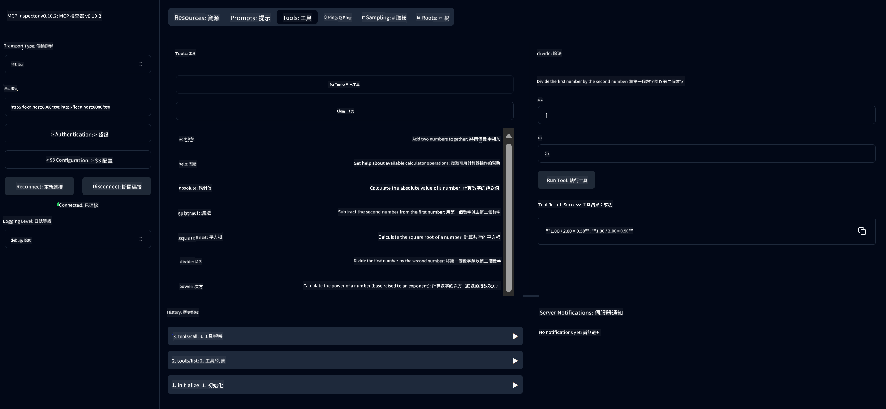

<!--
CO_OP_TRANSLATOR_METADATA:
{
  "original_hash": "13231e9951b68efd9df8c56bd5cdb27e",
  "translation_date": "2025-07-13T22:22:30+00:00",
  "source_file": "03-GettingStarted/samples/java/calculator/README.md",
  "language_code": "mo"
}
-->
# Basic Calculator MCP Service

此服務透過 Model Context Protocol (MCP) 並使用 Spring Boot 搭配 WebFlux 傳輸，提供基本計算機運算功能。它設計為初學者學習 MCP 實作的簡單範例。

更多資訊請參考 [MCP Server Boot Starter](https://docs.spring.io/spring-ai/reference/api/mcp/mcp-server-boot-starter-docs.html) 參考文件。

## 概覽

此服務展示了：
- 支援 SSE（Server-Sent Events）
- 使用 Spring AI 的 `@Tool` 註解自動註冊工具
- 基本計算機功能：
  - 加法、減法、乘法、除法
  - 次方計算與平方根
  - 取餘數與絕對值
  - 提供操作說明的幫助功能

## 功能特色

此計算機服務提供以下功能：

1. **基本算術運算**：
   - 兩數相加
   - 一數減去另一數
   - 兩數相乘
   - 一數除以另一數（含除以零檢查）

2. **進階運算**：
   - 次方計算（底數的指數次方）
   - 平方根計算（含負數檢查）
   - 取餘數計算
   - 絕對值計算

3. **幫助系統**：
   - 內建幫助函式，說明所有可用操作

## 使用服務

此服務透過 MCP 協定公開以下 API 端點：

- `add(a, b)`：將兩數相加
- `subtract(a, b)`：將第二個數從第一個數中減去
- `multiply(a, b)`：將兩數相乘
- `divide(a, b)`：將第一個數除以第二個數（含除以零檢查）
- `power(base, exponent)`：計算次方
- `squareRoot(number)`：計算平方根（含負數檢查）
- `modulus(a, b)`：計算除法餘數
- `absolute(number)`：計算絕對值
- `help()`：取得可用操作的說明資訊

## 測試用戶端

在 `com.microsoft.mcp.sample.client` 套件中包含一個簡單的測試用戶端。`SampleCalculatorClient` 類別展示了計算機服務的可用操作。

## 使用 LangChain4j 用戶端

專案中包含一個 LangChain4j 範例用戶端，位於 `com.microsoft.mcp.sample.client.LangChain4jClient`，示範如何將計算機服務與 LangChain4j 及 GitHub 模型整合：

### 前置條件

1. **GitHub Token 設定**：

   若要使用 GitHub 的 AI 模型（如 phi-4），需要 GitHub 個人存取權杖：

   a. 前往 GitHub 帳號設定頁面：https://github.com/settings/tokens

   b. 點選「Generate new token」→「Generate new token (classic)」

   c. 為權杖命名以便識別

   d. 選擇以下權限範圍：
      - `repo`（私有倉庫完整控制權）
      - `read:org`（讀取組織與團隊成員資格、讀取組織專案）
      - `gist`（建立 gist）
      - `user:email`（讀取使用者電子郵件地址（唯讀））

   e. 點選「Generate token」並複製新權杖

   f. 設定為環境變數：

      Windows 系統：
      ```
      set GITHUB_TOKEN=your-github-token
      ```

      macOS/Linux 系統：
      ```bash
      export GITHUB_TOKEN=your-github-token
      ```

   g. 若需永久設定，請透過系統設定將其加入環境變數

2. 將 LangChain4j GitHub 依賴加入專案（已包含於 pom.xml）：
   ```xml
   <dependency>
       <groupId>dev.langchain4j</groupId>
       <artifactId>langchain4j-github</artifactId>
       <version>${langchain4j.version}</version>
   </dependency>
   ```

3. 確保計算機伺服器正在 `localhost:8080` 運行

### 執行 LangChain4j 用戶端

此範例示範：
- 透過 SSE 傳輸連接計算機 MCP 伺服器
- 使用 LangChain4j 建立聊天機器人，利用計算機功能
- 整合 GitHub AI 模型（目前使用 phi-4 模型）

用戶端會發送以下範例查詢以展示功能：
1. 計算兩數和
2. 計算數字平方根
3. 取得計算機可用操作的幫助資訊

執行範例並查看主控台輸出，了解 AI 模型如何使用計算機工具回應查詢。

### GitHub 模型設定

LangChain4j 用戶端設定使用 GitHub 的 phi-4 模型，設定如下：

```java
ChatLanguageModel model = GitHubChatModel.builder()
    .apiKey(System.getenv("GITHUB_TOKEN"))
    .timeout(Duration.ofSeconds(60))
    .modelName("phi-4")
    .logRequests(true)
    .logResponses(true)
    .build();
```

若要使用其他 GitHub 模型，只需將 `modelName` 參數改為其他支援的模型（例如 "claude-3-haiku-20240307"、"llama-3-70b-8192" 等）。

## 依賴項目

專案需要以下主要依賴：

```xml
<!-- For MCP Server -->
<dependency>
    <groupId>org.springframework.ai</groupId>
    <artifactId>spring-ai-starter-mcp-server-webflux</artifactId>
</dependency>

<!-- For LangChain4j integration -->
<dependency>
    <groupId>dev.langchain4j</groupId>
    <artifactId>langchain4j-mcp</artifactId>
    <version>${langchain4j.version}</version>
</dependency>

<!-- For GitHub models support -->
<dependency>
    <groupId>dev.langchain4j</groupId>
    <artifactId>langchain4j-github</artifactId>
    <version>${langchain4j.version}</version>
</dependency>
```

## 專案建置

使用 Maven 建置專案：
```bash
./mvnw clean install -DskipTests
```

## 啟動伺服器

### 使用 Java

```bash
java -jar target/calculator-server-0.0.1-SNAPSHOT.jar
```

### 使用 MCP Inspector

MCP Inspector 是一個方便與 MCP 服務互動的工具。使用此計算機服務時：

1. **安裝並啟動 MCP Inspector**，在新終端視窗執行：
   ```bash
   npx @modelcontextprotocol/inspector
   ```

2. **透過瀏覽器開啟網頁介面**，點擊應用程式顯示的 URL（通常是 http://localhost:6274）

3. **設定連線**：
   - 傳輸類型選擇「SSE」
   - URL 設為正在運行伺服器的 SSE 端點：`http://localhost:8080/sse`
   - 點擊「Connect」

4. **使用工具**：
   - 點擊「List Tools」查看可用的計算機操作
   - 選擇工具後點擊「Run Tool」執行操作



### 使用 Docker

專案包含 Dockerfile 以便容器化部署：

1. **建置 Docker 映像檔**：
   ```bash
   docker build -t calculator-mcp-service .
   ```

2. **執行 Docker 容器**：
   ```bash
   docker run -p 8080:8080 calculator-mcp-service
   ```

此操作將：
- 使用 Maven 3.9.9 與 Eclipse Temurin 24 JDK 建置多階段 Docker 映像
- 建立優化的容器映像
- 開放服務於 8080 埠口
- 在容器內啟動 MCP 計算機服務

容器啟動後，可透過 `http://localhost:8080` 存取服務。

## 疑難排解

### GitHub Token 常見問題

1. **權杖權限問題**：若遇到 403 Forbidden 錯誤，請確認權杖擁有前述正確權限。

2. **找不到權杖**：若出現「No API key found」錯誤，請確認 GITHUB_TOKEN 環境變數已正確設定。

3. **速率限制**：GitHub API 有速率限制，若遇到 429 錯誤，請稍候幾分鐘後再試。

4. **權杖過期**：GitHub 權杖可能會過期，若一段時間後出現認證錯誤，請重新產生權杖並更新環境變數。

如需進一步協助，請參考 [LangChain4j 文件](https://github.com/langchain4j/langchain4j) 或 [GitHub API 文件](https://docs.github.com/en/rest)。

**免責聲明**：  
本文件係使用 AI 翻譯服務 [Co-op Translator](https://github.com/Azure/co-op-translator) 進行翻譯。雖然我們致力於確保準確性，但請注意，自動翻譯可能包含錯誤或不準確之處。原始文件的母語版本應視為權威來源。對於重要資訊，建議採用專業人工翻譯。我們不對因使用本翻譯而產生的任何誤解或誤釋負責。