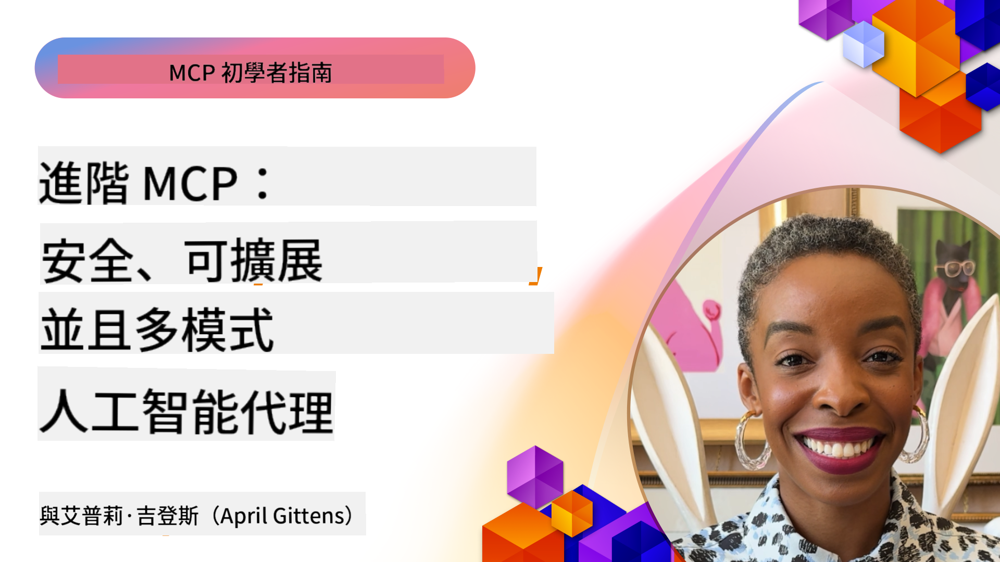

<!--
CO_OP_TRANSLATOR_METADATA:
{
  "original_hash": "d204bc94ea6027d06a703b21b711ca57",
  "translation_date": "2025-08-18T14:33:44+00:00",
  "source_file": "05-AdvancedTopics/README.md",
  "language_code": "mo"
}
-->
# MCP 高級主題

_（點擊上方圖片觀看本課程影片）_

本章節涵蓋了模型上下文協議（MCP）實現中的一系列高級主題，包括多模態整合、可擴展性、安全最佳實踐以及企業整合。這些主題對於構建穩健且可投入生產的 MCP 應用至關重要，以滿足現代 AI 系統的需求。

## 概述

本課程探討了模型上下文協議實現中的高級概念，重點包括多模態整合、可擴展性、安全最佳實踐以及企業整合。這些主題對於構建能夠應對企業環境中複雜需求的生產級 MCP 應用至關重要。

## 學習目標

完成本課程後，您將能夠：

- 在 MCP 框架中實現多模態功能
- 設計可應對高需求場景的可擴展 MCP 架構
- 應用符合 MCP 安全原則的安全最佳實踐
- 將 MCP 整合到企業 AI 系統和框架中
- 在生產環境中優化性能和可靠性

## 課程與範例項目

| 連結 | 標題 | 描述 |
|------|-------|-------------|
| [5.1 與 Azure 整合](./mcp-integration/README.md) | 與 Azure 整合 | 學習如何在 Azure 上整合您的 MCP 伺服器 |
| [5.2 多模態範例](./mcp-multi-modality/README.md) | MCP 多模態範例 | 提供音頻、圖像和多模態回應的範例 |
| [5.3 MCP OAuth2 範例](../../../05-AdvancedTopics/mcp-oauth2-demo) | MCP OAuth2 範例 | 最小化的 Spring Boot 應用展示 MCP 的 OAuth2，作為授權伺服器和資源伺服器。展示安全令牌發行、受保護端點、Azure 容器應用部署以及 API 管理整合。 |
| [5.4 根上下文](./mcp-root-contexts/README.md) | 根上下文 | 了解根上下文及其實現方式 |
| [5.5 路由](./mcp-routing/README.md) | 路由 | 學習不同類型的路由 |
| [5.6 抽樣](./mcp-sampling/README.md) | 抽樣 | 學習如何進行抽樣 |
| [5.7 擴展性](./mcp-scaling/README.md) | 擴展性 | 了解擴展性 |
| [5.8 安全性](./mcp-security/README.md) | 安全性 | 保護您的 MCP 伺服器 |
| [5.9 網頁搜索範例](./web-search-mcp/README.md) | 網頁搜索 MCP | Python MCP 伺服器和客戶端整合 SerpAPI，提供即時網頁、新聞、產品搜索及問答。展示多工具協作、外部 API 整合及穩健的錯誤處理。 |
| [5.10 即時流式傳輸](./mcp-realtimestreaming/README.md) | 流式傳輸 | 即時數據流式傳輸在當今數據驅動的世界中至關重要，企業和應用需要即時訪問信息以做出及時決策。 |
| [5.11 即時網頁搜索](./mcp-realtimesearch/README.md) | 網頁搜索 | MCP 如何通過標準化的上下文管理方法改變即時網頁搜索，涵蓋 AI 模型、搜索引擎和應用。 |
| [5.12 MCP 伺服器的 Entra ID 驗證](./mcp-security-entra/README.md) | Entra ID 驗證 | Microsoft Entra ID 提供強大的雲端身份和訪問管理解決方案，確保只有授權的用戶和應用能與您的 MCP 伺服器互動。 |
| [5.13 Azure AI Foundry 代理整合](./mcp-foundry-agent-integration/README.md) | Azure AI Foundry 整合 | 學習如何將 MCP 伺服器與 Azure AI Foundry 代理整合，實現強大的工具協作和企業 AI 功能，並標準化外部數據源連接。 |
| [5.14 上下文工程](./mcp-contextengineering/README.md) | 上下文工程 | MCP 伺服器的上下文工程技術未來機遇，包括上下文優化、動態上下文管理，以及 MCP 框架中有效提示工程的策略。 |

## 其他參考資料

欲了解 MCP 高級主題的最新資訊，請參考：
- [MCP 文件](https://modelcontextprotocol.io/)
- [MCP 規範](https://spec.modelcontextprotocol.io/)
- [GitHub 儲存庫](https://github.com/modelcontextprotocol)

## 關鍵要點

- 多模態 MCP 實現擴展了 AI 的能力，超越了文本處理
- 可擴展性對企業部署至關重要，可通過水平和垂直擴展來實現
- 全面的安全措施保護數據並確保適當的訪問控制
- 與 Azure OpenAI 和 Microsoft AI Foundry 等平台的企業整合增強了 MCP 的功能
- 高級 MCP 實現受益於優化的架構和謹慎的資源管理

## 練習

設計一個針對特定用例的企業級 MCP 實現：

1. 確定您的用例的多模態需求
2. 列出保護敏感數據所需的安全控制
3. 設計能夠應對不同負載的可擴展架構
4. 計劃與企業 AI 系統的整合點
5. 記錄潛在的性能瓶頸及其緩解策略

## 其他資源

- [Azure OpenAI 文件](https://learn.microsoft.com/en-us/azure/ai-services/openai/)
- [Microsoft AI Foundry 文件](https://learn.microsoft.com/en-us/ai-services/)

---

## 下一步

- [5.1 MCP 整合](./mcp-integration/README.md)

**免責聲明**：  
本文件使用 AI 翻譯服務 [Co-op Translator](https://github.com/Azure/co-op-translator) 進行翻譯。我們致力於提供準確的翻譯，但請注意，自動翻譯可能包含錯誤或不準確之處。應以原始語言的文件作為權威來源。對於關鍵資訊，建議尋求專業人工翻譯。我們對因使用此翻譯而引起的任何誤解或錯誤解讀概不負責。