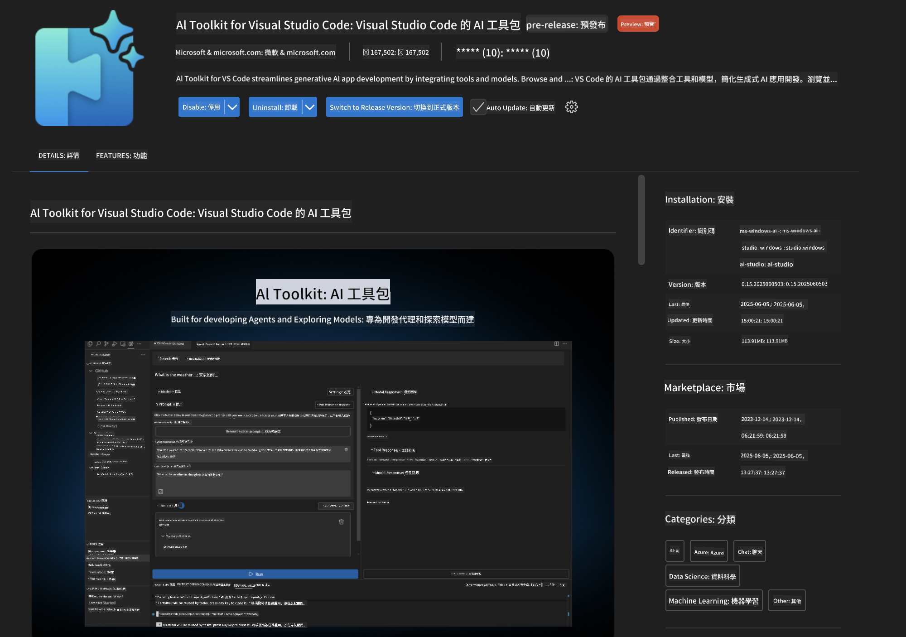
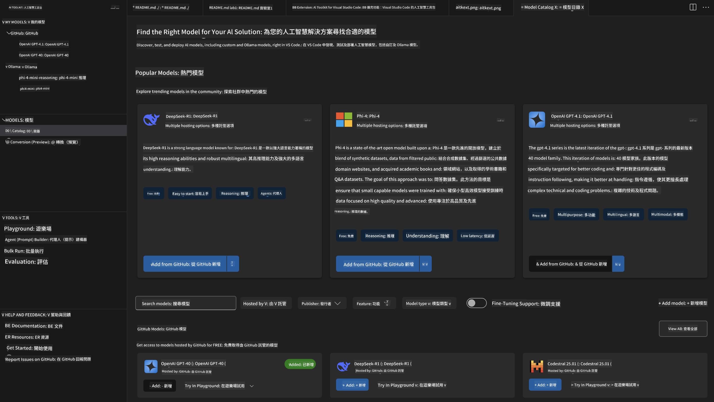
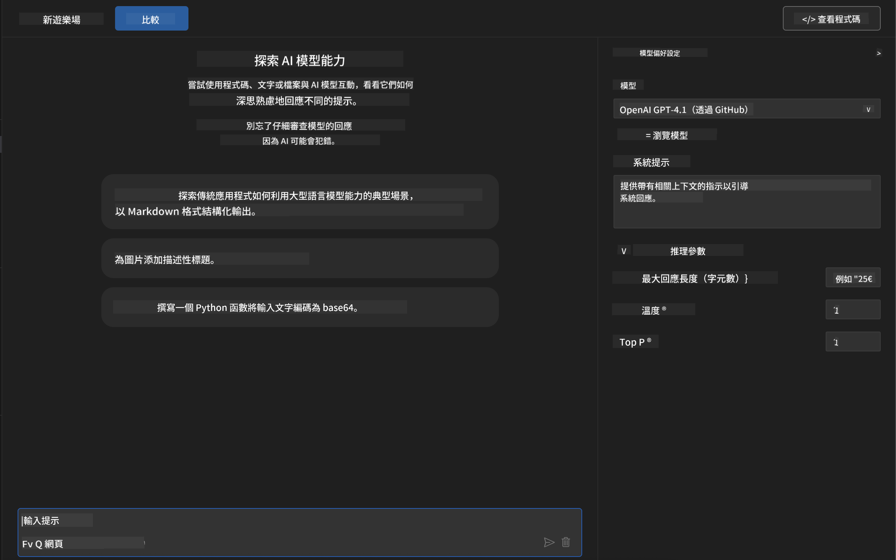
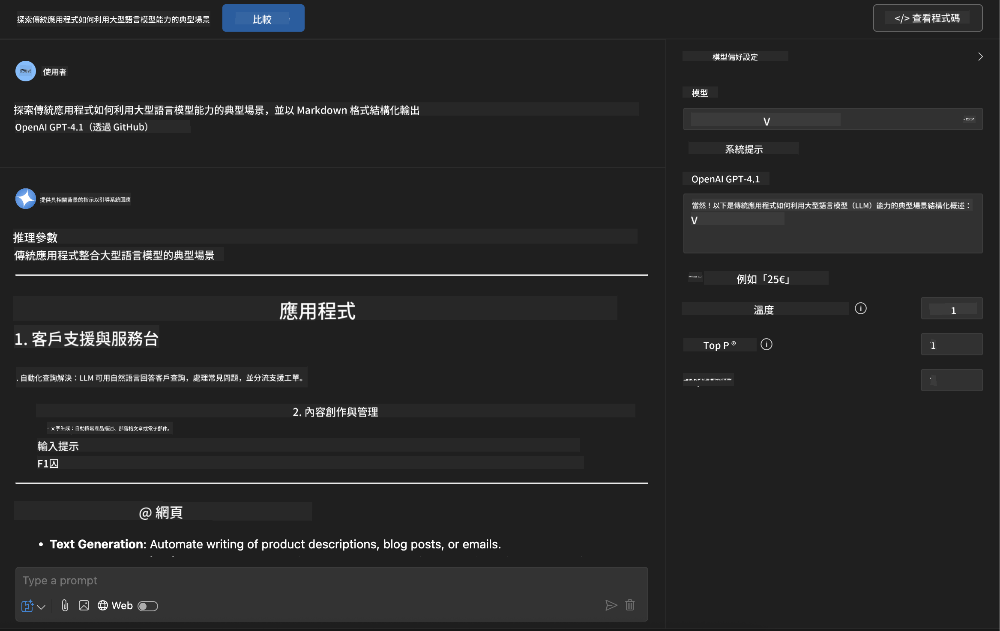
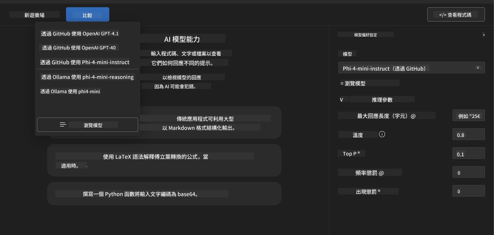
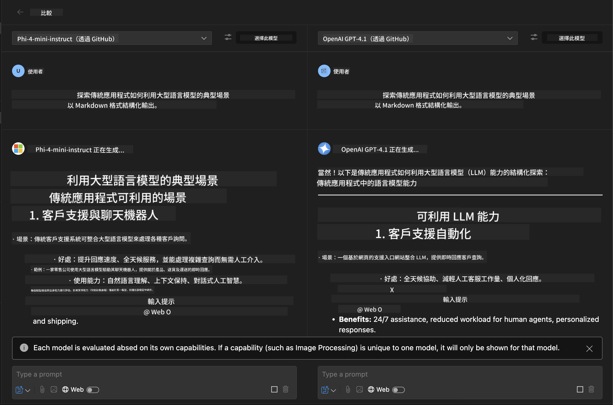
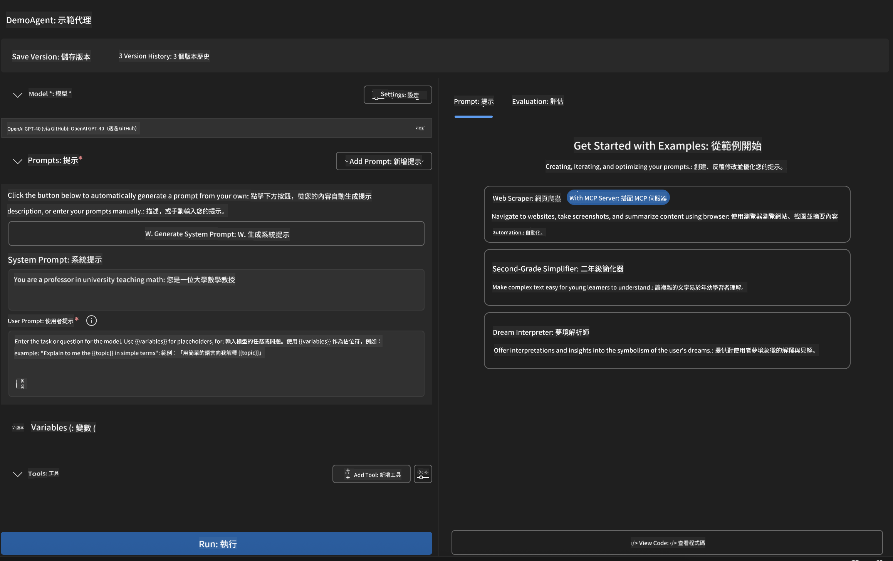

<!--
CO_OP_TRANSLATOR_METADATA:
{
  "original_hash": "2aa9dbc165e104764fa57e8a0d3f1c73",
  "translation_date": "2025-07-14T07:20:37+00:00",
  "source_file": "10-StreamliningAIWorkflowsBuildingAnMCPServerWithAIToolkit/lab1/README.md",
  "language_code": "mo"
}
-->
# 🚀 模組 1：AI 工具組基礎

[]()
[]()
[]()

## 📋 學習目標

完成本模組後，您將能夠：
- ✅ 安裝並設定 Visual Studio Code 的 AI 工具組
- ✅ 瀏覽模型目錄並了解不同模型來源
- ✅ 使用 Playground 進行模型測試與實驗
- ✅ 利用 Agent Builder 創建自訂 AI 代理
- ✅ 比較不同供應商的模型效能
- ✅ 應用提示工程的最佳實務

## 🧠 AI 工具組 (AITK) 簡介

**Visual Studio Code 的 AI 工具組** 是微軟的旗艦擴充功能，將 VS Code 轉變為完整的 AI 開發環境。它架起 AI 研究與實務應用開發之間的橋樑，讓各種技能層級的開發者都能輕鬆使用生成式 AI。

### 🌟 主要功能

| 功能 | 說明 | 使用情境 |
|---------|-------------|----------|
| **🗂️ 模型目錄** | 存取來自 GitHub、ONNX、OpenAI、Anthropic、Google 的 100 多款模型 | 模型探索與選擇 |
| **🔌 BYOM 支援** | 整合您自己的模型（本地或遠端） | 自訂模型部署 |
| **🎮 互動式 Playground** | 透過聊天介面即時測試模型 | 快速原型與測試 |
| **📎 多模態支援** | 處理文字、圖片與附件 | 複雜 AI 應用 |
| **⚡ 批次處理** | 同時執行多個提示 | 高效測試流程 |
| **📊 模型評估** | 內建指標（F1、相關性、相似度、一致性） | 效能評估 |

### 🎯 為什麼 AI 工具組很重要

- **🚀 加速開發**：從構想到原型只需數分鐘
- **🔄 統一工作流程**：一個介面管理多個 AI 供應商
- **🧪 簡易實驗**：無需複雜設定即可比較模型
- **📈 生產就緒**：從原型無縫過渡到部署

## 🛠️ 前置條件與設定

### 📦 安裝 AI 工具組擴充功能

**步驟 1：進入擴充功能市集**
1. 開啟 Visual Studio Code
2. 前往擴充功能視窗（`Ctrl+Shift+X` 或 `Cmd+Shift+X`）
3. 搜尋「AI Toolkit」

**步驟 2：選擇版本**
- **🟢 正式版**：建議用於生產環境
- **🔶 預覽版**：搶先體驗最新功能

**步驟 3：安裝並啟用**



### ✅ 驗證清單
- [ ] AI Toolkit 圖示出現在 VS Code 側邊欄
- [ ] 擴充功能已啟用並激活
- [ ] 輸出面板無安裝錯誤

## 🧪 實作練習 1：探索 GitHub 模型

**🎯 目標**：熟悉模型目錄並測試您的第一個 AI 模型

### 📊 步驟 1：瀏覽模型目錄

模型目錄是您進入 AI 生態系的入口。它整合多個供應商的模型，方便您發現並比較選項。

**🔍 導覽指南：**

點擊 AI Toolkit 側邊欄的 **MODELS - Catalog**



**💡 專家提示**：尋找具備符合您需求的特定功能的模型（例如程式碼生成、創意寫作、分析）。

**⚠️ 注意**：GitHub 托管的模型（即 GitHub Models）免費使用，但請注意請求與令牌的速率限制。若要使用非 GitHub 模型（例如透過 Azure AI 或其他端點托管的外部模型），您需要提供相應的 API 金鑰或認證。

### 🚀 步驟 2：新增並設定您的第一個模型

**模型選擇策略：**
- **GPT-4.1**：適合複雜推理與分析
- **Phi-4-mini**：輕量且快速回應，適合簡單任務

**🔧 設定流程：**
1. 從目錄中選擇 **OpenAI GPT-4.1**
2. 點擊 **Add to My Models**，將模型註冊至您的清單
3. 選擇 **Try in Playground** 啟動測試環境
4. 等待模型初始化（首次設定可能需稍候）



**⚙️ 了解模型參數：**
- **Temperature**：控制創意程度（0 = 確定性，1 = 創意）
- **Max Tokens**：最大回應長度
- **Top-p**：核取樣，提升回應多樣性

### 🎯 步驟 3：掌握 Playground 介面

Playground 是您的 AI 實驗室。以下是最大化其效能的方法：

**🎨 提示工程最佳實務：**
1. **具體明確**：清楚且詳盡的指令效果更佳
2. **提供背景**：包含相關背景資訊
3. **使用範例**：用範例示範您想要的結果
4. **反覆調整**：根據初步結果優化提示

**🧪 測試情境：**
```markdown
# Example 1: Code Generation
"Write a Python function that calculates the factorial of a number using recursion. Include error handling and docstrings."

# Example 2: Creative Writing
"Write a professional email to a client explaining a project delay, maintaining a positive tone while being transparent about challenges."

# Example 3: Data Analysis
"Analyze this sales data and provide insights: [paste your data]. Focus on trends, anomalies, and actionable recommendations."
```



### 🏆 挑戰練習：模型效能比較

**🎯 目標**：使用相同提示比較不同模型，了解各自優勢

**📋 操作說明：**
1. 將 **Phi-4-mini** 新增至您的工作區
2. 對 GPT-4.1 與 Phi-4-mini 使用相同提示



3. 比較回應品質、速度與準確度
4. 將結果記錄於成果區



**💡 重要洞見：**
- 何時使用大型語言模型 (LLM) 與小型語言模型 (SLM)
- 成本與效能的權衡
- 不同模型的專長功能

## 🤖 實作練習 2：使用 Agent Builder 建立自訂代理

**🎯 目標**：打造專門針對特定任務與工作流程的 AI 代理

### 🏗️ 步驟 1：認識 Agent Builder

Agent Builder 是 AI 工具組的核心亮點。它讓您能創建具備大型語言模型能力，並結合自訂指令、特定參數與專業知識的專用 AI 助手。

**🧠 代理架構組件：**
- **核心模型**：基礎大型語言模型（GPT-4、Groks、Phi 等）
- **系統提示**：定義代理的個性與行為
- **參數**：微調設定以達最佳效能
- **工具整合**：連接外部 API 與 MCP 服務
- **記憶體**：對話上下文與會話持續性



### ⚙️ 步驟 2：深入代理設定

**🎨 創建有效的系統提示：**
```markdown
# Template Structure:
## Role Definition
You are a [specific role] with expertise in [domain].

## Capabilities
- List specific abilities
- Define scope of knowledge
- Clarify limitations

## Behavior Guidelines
- Response style (formal, casual, technical)
- Output format preferences
- Error handling approach

## Examples
Provide 2-3 examples of ideal interactions
```

*當然，您也可以使用 Generate System Prompt 功能，讓 AI 協助您生成與優化提示*

**🔧 參數優化：**
| 參數 | 建議範圍 | 使用情境 |
|-----------|------------------|----------|
| **Temperature** | 0.1-0.3 | 技術性/事實性回應 |
| **Temperature** | 0.7-0.9 | 創意/腦力激盪任務 |
| **Max Tokens** | 500-1000 | 簡潔回應 |
| **Max Tokens** | 2000-4000 | 詳細說明 |

### 🐍 步驟 3：實作練習 - Python 程式代理

**🎯 任務**：打造專門的 Python 程式助理

**📋 設定步驟：**

1. **模型選擇**：選擇 **Claude 3.5 Sonnet**（擅長程式碼）

2. **系統提示設計**：
```markdown
# Python Programming Expert Agent

## Role
You are a senior Python developer with 10+ years of experience. You excel at writing clean, efficient, and well-documented Python code.

## Capabilities
- Write production-ready Python code
- Debug complex issues
- Explain code concepts clearly
- Suggest best practices and optimizations
- Provide complete working examples

## Response Format
- Always include docstrings
- Add inline comments for complex logic
- Suggest testing approaches
- Mention relevant libraries when applicable

## Code Quality Standards
- Follow PEP 8 style guidelines
- Use type hints where appropriate
- Handle exceptions gracefully
- Write readable, maintainable code
```

3. **參數設定**：
   - Temperature：0.2（保持一致且可靠的程式碼）
   - Max Tokens：2000（詳細說明）
   - Top-p：0.9（平衡創意）


### 🧪 步驟 4：測試您的 Python 代理

**測試情境：**
1. **基本功能**：「建立一個尋找質數的函式」
2. **複雜演算法**：「實作包含插入、刪除與搜尋方法的二元搜尋樹」
3. **實務問題**：「建立一個能處理速率限制與重試的網頁爬蟲」
4. **除錯**：「修正這段程式碼 [貼上有錯誤的程式碼]」

**🏆 成功標準：**
- ✅ 程式碼能正常執行
- ✅ 包含適當文件說明
- ✅ 遵循 Python 最佳實務
- ✅ 提供清楚解釋
- ✅ 建議改進方案

## 🎓 模組 1 總結與後續步驟

### 📊 知識檢核

測試您的理解：
- [ ] 能否說明目錄中模型的差異？
- [ ] 是否成功建立並測試自訂代理？
- [ ] 是否了解如何針對不同使用情境優化參數？
- [ ] 是否能設計有效的系統提示？

### 📚 其他資源

- **AI 工具組文件**：[官方微軟文件](https://github.com/microsoft/vscode-ai-toolkit)
- **提示工程指南**：[最佳實務](https://platform.openai.com/docs/guides/prompt-engineering)
- **AI 工具組中的模型**：[開發中的模型](https://github.com/microsoft/vscode-ai-toolkit/blob/main/doc/models.md)

**🎉 恭喜！** 您已掌握 AI 工具組的基礎，準備好打造更進階的 AI 應用！

### 🔜 繼續下一模組

準備好學習更進階功能了嗎？請繼續前往 **[模組 2：MCP 與 AI 工具組基礎](../lab2/README.md)**，您將學習如何：
- 使用 Model Context Protocol (MCP) 連接代理與外部工具
- 建立 Playwright 瀏覽器自動化代理
- 將 MCP 伺服器整合至您的 AI 工具組代理
- 利用外部資料與功能強化您的代理

**免責聲明**：  
本文件係使用 AI 翻譯服務 [Co-op Translator](https://github.com/Azure/co-op-translator) 進行翻譯。雖然我們致力於確保準確性，但請注意，自動翻譯可能包含錯誤或不準確之處。原始文件的母語版本應視為權威來源。對於重要資訊，建議採用專業人工翻譯。我們不對因使用本翻譯而產生的任何誤解或誤釋負責。