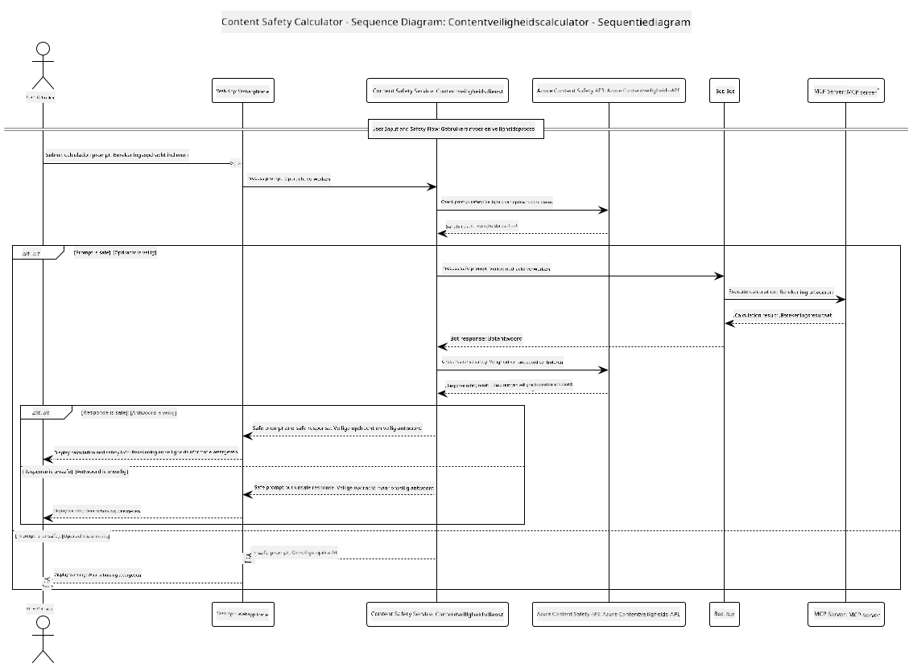

<!--
CO_OP_TRANSLATOR_METADATA:
{
  "original_hash": "e5ea5e7582f70008ea9bec3b3820f20a",
  "translation_date": "2025-07-13T23:17:49+00:00",
  "source_file": "04-PracticalImplementation/samples/java/containerapp/README.md",
  "language_code": "nl"
}
-->
## Systeemarchitectuur

Dit project toont een webapplicatie die contentveiligheid controleert voordat gebruikersprompts via het Model Context Protocol (MCP) naar een rekenmachine-service worden gestuurd.



### Hoe Het Werkt

1. **Gebruikersinvoer**: De gebruiker voert een rekenprompt in via de webinterface  
2. **Contentveiligheid Screening (Invoer)**: De prompt wordt geanalyseerd door de Azure Content Safety API  
3. **Veiligheidsbeslissing (Invoer)**:  
   - Als de inhoud veilig is (ernst < 2 in alle categorieën), gaat het door naar de rekenmachine  
   - Als de inhoud als mogelijk schadelijk wordt gemarkeerd, stopt het proces en wordt een waarschuwing teruggegeven  
4. **Integratie met de Rekenmachine**: Veilige inhoud wordt verwerkt door LangChain4j, dat communiceert met de MCP rekenmachine-server  
5. **Contentveiligheid Screening (Uitvoer)**: De reactie van de bot wordt geanalyseerd door de Azure Content Safety API  
6. **Veiligheidsbeslissing (Uitvoer)**:  
   - Als de botreactie veilig is, wordt deze aan de gebruiker getoond  
   - Als de botreactie als mogelijk schadelijk wordt gemarkeerd, wordt deze vervangen door een waarschuwing  
7. **Reactie**: Resultaten (indien veilig) worden aan de gebruiker getoond, samen met beide veiligheidsanalyses

## Gebruik van Model Context Protocol (MCP) met Rekenmachine Services

Dit project laat zien hoe je Model Context Protocol (MCP) gebruikt om rekenmachine MCP-services aan te roepen vanuit LangChain4j. De implementatie gebruikt een lokale MCP-server die draait op poort 8080 om rekenmachinebewerkingen te leveren.

### Azure Content Safety Service Instellen

Voordat je de contentveiligheidsfuncties gebruikt, moet je een Azure Content Safety service resource aanmaken:

1. Meld je aan bij de [Azure Portal](https://portal.azure.com)  
2. Klik op "Create a resource" en zoek naar "Content Safety"  
3. Selecteer "Content Safety" en klik op "Create"  
4. Voer een unieke naam in voor je resource  
5. Selecteer je abonnement en resourcegroep (of maak een nieuwe aan)  
6. Kies een ondersteunde regio (bekijk [Region availability](https://azure.microsoft.com/en-us/global-infrastructure/services/?products=cognitive-services) voor details)  
7. Selecteer een passend prijsniveau  
8. Klik op "Create" om de resource te implementeren  
9. Zodra de implementatie voltooid is, klik op "Go to resource"  
10. Selecteer in het linker menu onder "Resource Management" de optie "Keys and Endpoint"  
11. Kopieer een van de sleutels en de endpoint-URL voor gebruik in de volgende stap

### Omgevingsvariabelen Configureren

Stel de `GITHUB_TOKEN` omgevingsvariabele in voor authenticatie van GitHub-modellen:  
```sh
export GITHUB_TOKEN=<your_github_token>
```

Voor contentveiligheidsfuncties stel je in:  
```sh
export CONTENT_SAFETY_ENDPOINT=<your_content_safety_endpoint>
export CONTENT_SAFETY_KEY=<your_content_safety_key>
```

Deze omgevingsvariabelen worden door de applicatie gebruikt om te authenticeren bij de Azure Content Safety service. Als deze variabelen niet zijn ingesteld, gebruikt de applicatie voorbeeldwaarden voor demonstratiedoeleinden, maar zullen de contentveiligheidsfuncties niet correct werken.

### De Calculator MCP Server Starten

Voordat je de client start, moet je de calculator MCP-server in SSE-modus starten op localhost:8080.

## Projectbeschrijving

Dit project demonstreert de integratie van Model Context Protocol (MCP) met LangChain4j om rekenmachineservices aan te roepen. Belangrijke kenmerken zijn:

- Gebruik van MCP om verbinding te maken met een rekenmachineservice voor basis wiskundige bewerkingen  
- Dubbele contentveiligheidscontrole op zowel gebruikersprompts als botreacties  
- Integratie met GitHub’s gpt-4.1-nano model via LangChain4j  
- Gebruik van Server-Sent Events (SSE) voor MCP-transport

## Contentveiligheidsintegratie

Het project bevat uitgebreide contentveiligheidsfuncties om te waarborgen dat zowel gebruikersinvoer als systeemreacties vrij zijn van schadelijke inhoud:

1. **Invoer Screening**: Alle gebruikersprompts worden geanalyseerd op schadelijke inhoudscategorieën zoals haatspraak, geweld, zelfbeschadiging en seksuele inhoud voordat ze worden verwerkt.  

2. **Uitvoer Screening**: Zelfs bij het gebruik van mogelijk ongecensureerde modellen controleert het systeem alle gegenereerde reacties via dezelfde contentveiligheidsfilters voordat ze aan de gebruiker worden getoond.

Deze dubbele aanpak zorgt ervoor dat het systeem veilig blijft, ongeacht welk AI-model wordt gebruikt, en beschermt gebruikers tegen zowel schadelijke invoer als potentieel problematische AI-uitvoer.

## Webclient

De applicatie bevat een gebruiksvriendelijke webinterface waarmee gebruikers kunnen communiceren met het Content Safety Calculator-systeem:

### Kenmerken van de Webinterface

- Eenvoudig en intuïtief formulier voor het invoeren van rekenprompts  
- Dubbele contentveiligheidsvalidatie (invoer en uitvoer)  
- Real-time feedback over de veiligheid van prompt en reactie  
- Kleurgecodeerde veiligheidsindicatoren voor eenvoudige interpretatie  
- Strak, responsief ontwerp dat op verschillende apparaten werkt  
- Voorbeelden van veilige prompts ter begeleiding van gebruikers

### Gebruik van de Webclient

1. Start de applicatie:  
   ```sh
   mvn spring-boot:run
   ```

2. Open je browser en ga naar `http://localhost:8087`

3. Voer een rekenprompt in het tekstvak in (bijv. "Bereken de som van 24.5 en 17.3")

4. Klik op "Submit" om je verzoek te verwerken

5. Bekijk de resultaten, die het volgende bevatten:  
   - Contentveiligheidsanalyse van je prompt  
   - Het berekende resultaat (als de prompt veilig was)  
   - Contentveiligheidsanalyse van de botreactie  
   - Eventuele veiligheidswaarschuwingen als invoer of uitvoer werd gemarkeerd

De webclient verzorgt automatisch beide contentveiligheidscontroles, zodat alle interacties veilig en passend zijn, ongeacht welk AI-model wordt gebruikt.

**Disclaimer**:  
Dit document is vertaald met behulp van de AI-vertalingsdienst [Co-op Translator](https://github.com/Azure/co-op-translator). Hoewel we streven naar nauwkeurigheid, dient u er rekening mee te houden dat geautomatiseerde vertalingen fouten of onnauwkeurigheden kunnen bevatten. Het originele document in de oorspronkelijke taal moet als de gezaghebbende bron worden beschouwd. Voor cruciale informatie wordt professionele menselijke vertaling aanbevolen. Wij zijn niet aansprakelijk voor eventuele misverstanden of verkeerde interpretaties die voortvloeien uit het gebruik van deze vertaling.