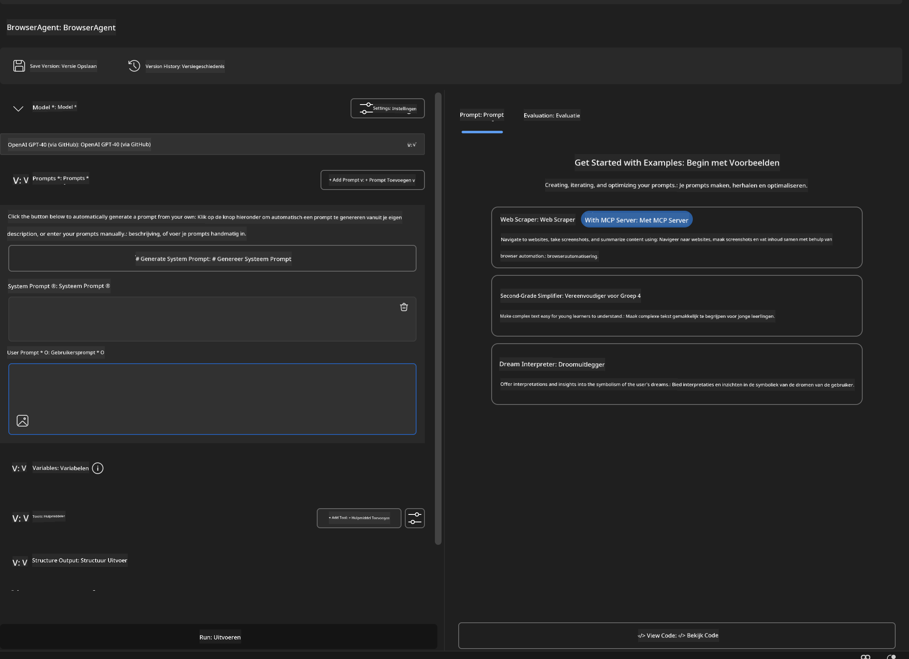
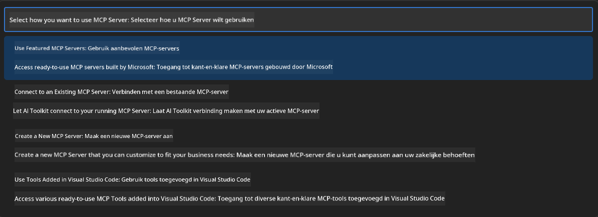
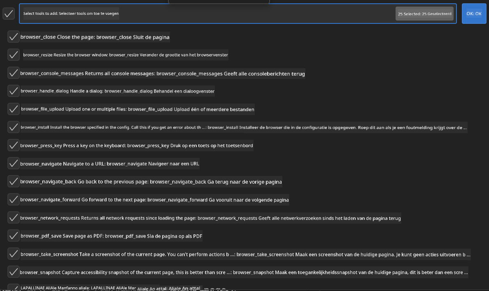
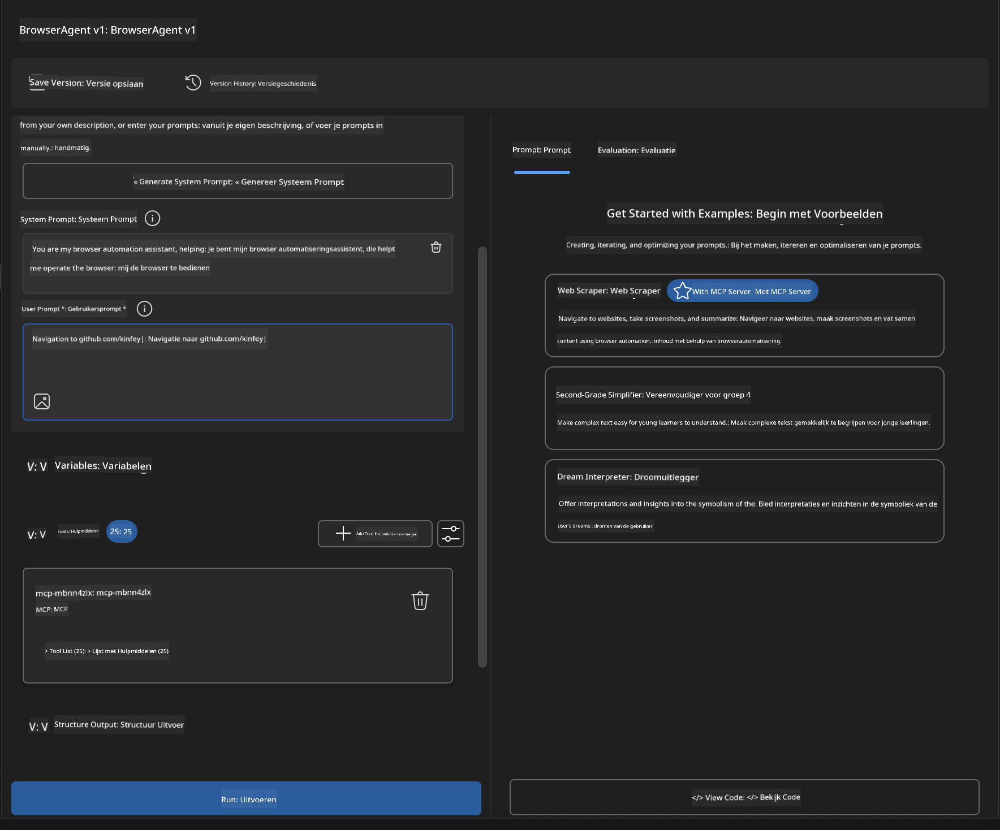
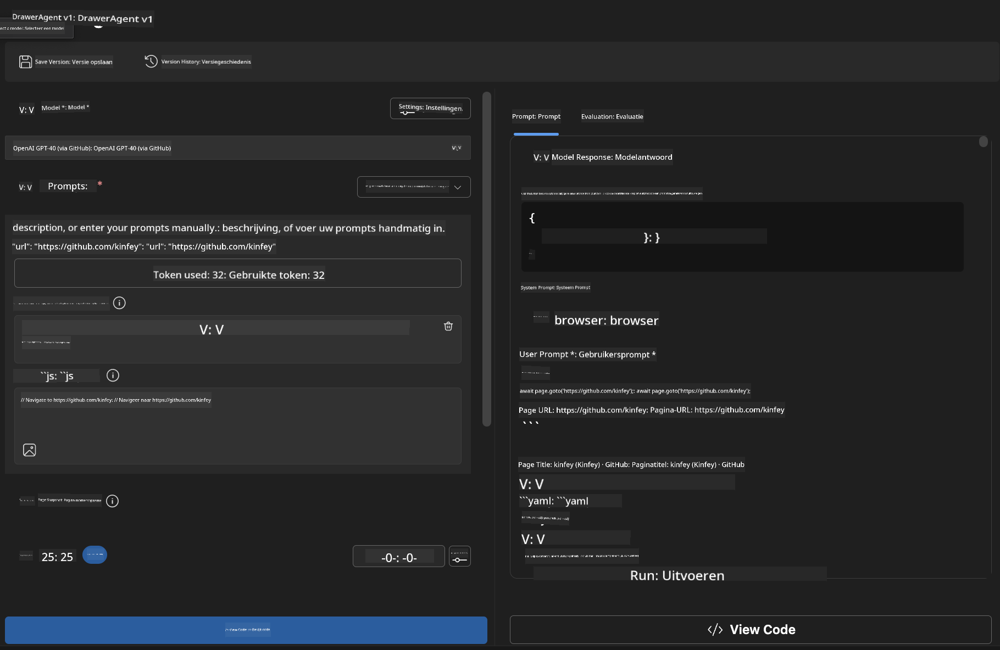
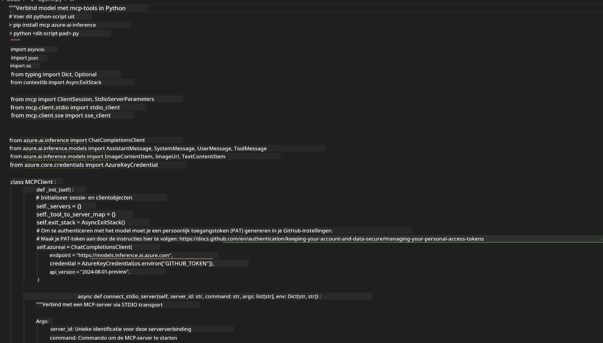

<!--
CO_OP_TRANSLATOR_METADATA:
{
  "original_hash": "a22b7dd11cd7690f99f9195877cafdc3",
  "translation_date": "2025-07-14T07:56:01+00:00",
  "source_file": "10-StreamliningAIWorkflowsBuildingAnMCPServerWithAIToolkit/lab2/README.md",
  "language_code": "nl"
}
-->
# 🌐 Module 2: MCP met AI Toolkit Fundamentals

[]()
[]()
[]()

## 📋 Leerdoelen

Aan het einde van deze module kun je:
- ✅ De Model Context Protocol (MCP) architectuur en voordelen begrijpen
- ✅ Het MCP server-ecosysteem van Microsoft verkennen
- ✅ MCP-servers integreren met AI Toolkit Agent Builder
- ✅ Een functionele browserautomatiseringsagent bouwen met Playwright MCP
- ✅ MCP-tools binnen je agents configureren en testen
- ✅ MCP-gestuurde agents exporteren en inzetten voor productie

## 🎯 Voortbouwen op Module 1

In Module 1 hebben we de basis van AI Toolkit onder de knie gekregen en onze eerste Python Agent gemaakt. Nu gaan we je agents **superkrachtig** maken door ze te verbinden met externe tools en diensten via het revolutionaire **Model Context Protocol (MCP)**.

Zie het als een upgrade van een simpele rekenmachine naar een volledige computer – je AI agents krijgen de mogelijkheid om:
- 🌐 Websites te browsen en ermee te interacteren
- 📁 Bestanden te openen en te bewerken
- 🔧 Te integreren met bedrijfsystemen
- 📊 Real-time data van API’s te verwerken

## 🧠 Begrijpen van Model Context Protocol (MCP)

### 🔍 Wat is MCP?

Model Context Protocol (MCP) is de **"USB-C voor AI-toepassingen"** – een revolutionaire open standaard die Large Language Models (LLM’s) verbindt met externe tools, databronnen en diensten. Net zoals USB-C de wirwar aan kabels wegneemt door één universele aansluiting te bieden, vereenvoudigt MCP AI-integraties met één gestandaardiseerd protocol.

### 🎯 Het probleem dat MCP oplost

**Voor MCP:**
- 🔧 Maatwerk integraties voor elke tool
- 🔄 Vendor lock-in met propriëtaire oplossingen  
- 🔒 Beveiligingsrisico’s door ad-hoc verbindingen
- ⏱️ Maanden ontwikkelingstijd voor basisintegraties

**Met MCP:**
- ⚡ Plug-and-play toolintegratie
- 🔄 Vendor-neutrale architectuur
- 🛡️ Ingebouwde beveiligingspraktijken
- 🚀 Minuten om nieuwe functionaliteiten toe te voegen

### 🏗️ Diepgaande MCP Architectuur

MCP volgt een **client-server architectuur** die een veilige, schaalbare ecosysteem creëert:

```mermaid
graph TB
    A[AI Application/Agent] --> B[MCP Client]
    B --> C[MCP Server 1: Files]
    B --> D[MCP Server 2: Web APIs]
    B --> E[MCP Server 3: Database]
    B --> F[MCP Server N: Custom Tools]
    
    C --> G[Local File System]
    D --> H[External APIs]
    E --> I[Database Systems]
    F --> J[Enterprise Systems]
```

**🔧 Kerncomponenten:**

| Component | Rol | Voorbeelden |
|-----------|------|-------------|
| **MCP Hosts** | Applicaties die MCP-diensten gebruiken | Claude Desktop, VS Code, AI Toolkit |
| **MCP Clients** | Protocol handlers (1:1 met servers) | Ingebouwd in host applicaties |
| **MCP Servers** | Bieden functionaliteiten via standaard protocol | Playwright, Files, Azure, GitHub |
| **Transportlaag** | Communicatiemethoden | stdio, HTTP, WebSockets |

## 🏢 Het MCP Server Ecosysteem van Microsoft

Microsoft leidt het MCP-ecosysteem met een uitgebreide set enterprise-grade servers die echte zakelijke behoeften adresseren.

### 🌟 Uitgelichte Microsoft MCP Servers

#### 1. ☁️ Azure MCP Server  
**🔗 Repository**: [azure/azure-mcp](https://github.com/azure/azure-mcp)  
**🎯 Doel**: Uitgebreid beheer van Azure resources met AI-integratie

**✨ Belangrijkste kenmerken:**
- Declaratieve infrastructuur provisioning
- Real-time monitoring van resources
- Aanbevelingen voor kostenoptimalisatie
- Controle op beveiligingscompliance

**🚀 Gebruiksscenario’s:**
- Infrastructure-as-Code met AI-ondersteuning
- Geautomatiseerde resource-scaling
- Cloudkosten optimaliseren
- DevOps workflow automatisering

#### 2. 📊 Microsoft Dataverse MCP  
**📚 Documentatie**: [Microsoft Dataverse Integration](https://go.microsoft.com/fwlink/?linkid=2320176)  
**🎯 Doel**: Natuurlijke taalinterface voor zakelijke data

**✨ Belangrijkste kenmerken:**
- Database queries in natuurlijke taal
- Begrip van zakelijke context
- Aangepaste prompt templates
- Enterprise data governance

**🚀 Gebruiksscenario’s:**
- Business intelligence rapportages
- Analyse van klantgegevens
- Inzichten in sales pipelines
- Compliance data queries

#### 3. 🌐 Playwright MCP Server  
**🔗 Repository**: [microsoft/playwright-mcp](https://github.com/microsoft/playwright-mcp)  
**🎯 Doel**: Browserautomatisering en webinteractie

**✨ Belangrijkste kenmerken:**
- Cross-browser automatisering (Chrome, Firefox, Safari)
- Intelligente elementdetectie
- Screenshot- en PDF-generatie
- Netwerkverkeer monitoring

**🚀 Gebruiksscenario’s:**
- Geautomatiseerde testworkflows
- Web scraping en data-extractie
- UI/UX monitoring
- Automatisering van concurrentieanalyse

#### 4. 📁 Files MCP Server  
**🔗 Repository**: [microsoft/files-mcp-server](https://github.com/microsoft/files-mcp-server)  
**🎯 Doel**: Intelligente bestandsbeheeroperaties

**✨ Belangrijkste kenmerken:**
- Declaratief bestandsbeheer
- Content synchronisatie
- Integratie met versiebeheer
- Metadata extractie

**🚀 Gebruiksscenario’s:**
- Documentatiebeheer
- Organisatie van code repositories
- Workflows voor content publicatie
- Bestandsbeheer in datapijplijnen

#### 5. 📝 MarkItDown MCP Server  
**🔗 Repository**: [microsoft/markitdown](https://github.com/microsoft/markitdown)  
**🎯 Doel**: Geavanceerde Markdown verwerking en manipulatie

**✨ Belangrijkste kenmerken:**
- Uitgebreide Markdown parsing
- Formaatconversie (MD ↔ HTML ↔ PDF)
- Analyse van contentstructuur
- Template verwerking

**🚀 Gebruiksscenario’s:**
- Workflows voor technische documentatie
- Content management systemen
- Rapportagegeneratie
- Automatisering van kennisbanken

#### 6. 📈 Clarity MCP Server  
**📦 Package**: [@microsoft/clarity-mcp-server](https://www.npmjs.com/package/@microsoft/clarity-mcp-server)  
**🎯 Doel**: Webanalyse en inzicht in gebruikersgedrag

**✨ Belangrijkste kenmerken:**
- Heatmap data-analyse
- Opnames van gebruikerssessies
- Prestatiestatistieken
- Analyse van conversietrechters

**🚀 Gebruiksscenario’s:**
- Website optimalisatie
- Onderzoek naar gebruikerservaring
- A/B-testanalyse
- Business intelligence dashboards

### 🌍 Community Ecosysteem

Naast Microsoft’s servers omvat het MCP-ecosysteem ook:  
- **🐙 GitHub MCP**: Repositorybeheer en code-analyse  
- **🗄️ Database MCP’s**: Integraties met PostgreSQL, MySQL, MongoDB  
- **☁️ Cloud Provider MCP’s**: Tools voor AWS, GCP, Digital Ocean  
- **📧 Communicatie MCP’s**: Integraties met Slack, Teams, Email  

## 🛠️ Praktijkopdracht: Een Browserautomatiseringsagent Bouwen

**🎯 Projectdoel**: Maak een intelligente browserautomatiseringsagent met Playwright MCP-server die websites kan navigeren, informatie kan extraheren en complexe webinteracties kan uitvoeren.

### 🚀 Fase 1: Agent Basisconfiguratie

#### Stap 1: Initialiseer je Agent  
1. **Open AI Toolkit Agent Builder**  
2. **Maak een Nieuwe Agent aan** met de volgende configuratie:  
   - **Naam**: `BrowserAgent`  
   - **Model**: Kies GPT-4o  



### 🔧 Fase 2: MCP Integratieworkflow

#### Stap 3: Voeg MCP Server Integratie toe  
1. **Ga naar het Tools-gedeelte** in Agent Builder  
2. **Klik op "Add Tool"** om het integratiemenu te openen  
3. **Selecteer "MCP Server"** uit de beschikbare opties  


**🔍 Begrip van Tooltypes:**  
- **Built-in Tools**: Vooraf geconfigureerde AI Toolkit functies  
- **MCP Servers**: Integraties met externe diensten  
- **Custom APIs**: Je eigen service endpoints  
- **Function Calling**: Directe toegang tot model functies  

#### Stap 4: MCP Server Selectie  
1. **Kies de optie "MCP Server"** om door te gaan  


2. **Blader door de MCP Catalogus** om beschikbare integraties te verkennen  


### 🎮 Fase 3: Playwright MCP Configuratie

#### Stap 5: Selecteer en Configureer Playwright  
1. **Klik op "Use Featured MCP Servers"** om toegang te krijgen tot Microsoft’s geverifieerde servers  
2. **Selecteer "Playwright"** uit de uitgelichte lijst  
3. **Accepteer de standaard MCP ID** of pas deze aan voor jouw omgeving  


#### Stap 6: Schakel Playwright Functionaliteiten in  
**🔑 Kritieke stap**: Selecteer **ALLE** beschikbare Playwright-methoden voor maximale functionaliteit  



**🛠️ Essentiële Playwright Tools:**  
- **Navigatie**: `goto`, `goBack`, `goForward`, `reload`  
- **Interactie**: `click`, `fill`, `press`, `hover`, `drag`  
- **Extractie**: `textContent`, `innerHTML`, `getAttribute`  
- **Validatie**: `isVisible`, `isEnabled`, `waitForSelector`  
- **Vastleggen**: `screenshot`, `pdf`, `video`  
- **Netwerk**: `setExtraHTTPHeaders`, `route`, `waitForResponse`  

#### Stap 7: Controleer of de Integratie Gelukt is  
**✅ Succesindicatoren:**  
- Alle tools verschijnen in de Agent Builder interface  
- Geen foutmeldingen in het integratiepaneel  
- Playwright server status toont "Connected"  


**🔧 Veelvoorkomende problemen oplossen:**  
- **Verbinding mislukt**: Controleer internetverbinding en firewall-instellingen  
- **Ontbrekende tools**: Zorg dat alle functionaliteiten geselecteerd zijn tijdens setup  
- **Toestemmingsfouten**: Controleer of VS Code de benodigde systeemrechten heeft  

### 🎯 Fase 4: Geavanceerde Prompt Engineering

#### Stap 8: Ontwerp Intelligente Systeem Prompts  
Maak geavanceerde prompts die de volledige mogelijkheden van Playwright benutten:  

```markdown
# Web Automation Expert System Prompt

## Core Identity
You are an advanced web automation specialist with deep expertise in browser automation, web scraping, and user experience analysis. You have access to Playwright tools for comprehensive browser control.

## Capabilities & Approach
### Navigation Strategy
- Always start with screenshots to understand page layout
- Use semantic selectors (text content, labels) when possible
- Implement wait strategies for dynamic content
- Handle single-page applications (SPAs) effectively

### Error Handling
- Retry failed operations with exponential backoff
- Provide clear error descriptions and solutions
- Suggest alternative approaches when primary methods fail
- Always capture diagnostic screenshots on errors

### Data Extraction
- Extract structured data in JSON format when possible
- Provide confidence scores for extracted information
- Validate data completeness and accuracy
- Handle pagination and infinite scroll scenarios

### Reporting
- Include step-by-step execution logs
- Provide before/after screenshots for verification
- Suggest optimizations and alternative approaches
- Document any limitations or edge cases encountered

## Ethical Guidelines
- Respect robots.txt and rate limiting
- Avoid overloading target servers
- Only extract publicly available information
- Follow website terms of service
```

#### Stap 9: Maak Dynamische Gebruikersprompts  
Ontwerp prompts die verschillende functionaliteiten demonstreren:  

**🌐 Voorbeeld Webanalyse:**  
```markdown
Navigate to github.com/kinfey and provide a comprehensive analysis including:
1. Repository structure and organization
2. Recent activity and contribution patterns  
3. Documentation quality assessment
4. Technology stack identification
5. Community engagement metrics
6. Notable projects and their purposes

Include screenshots at key steps and provide actionable insights.
```



### 🚀 Fase 5: Uitvoering en Testen

#### Stap 10: Voer je Eerste Automatisering uit  
1. **Klik op "Run"** om de automatiseringsreeks te starten  
2. **Volg de uitvoering in real-time**:  
   - Chrome browser start automatisch  
   - Agent navigeert naar de doelwebsite  
   - Screenshots worden gemaakt bij elke belangrijke stap  
   - Analyse resultaten worden real-time weergegeven  


#### Stap 11: Analyseer Resultaten en Inzichten  
Bekijk de uitgebreide analyse in de interface van Agent Builder:  



### 🌟 Fase 6: Geavanceerde Functionaliteiten en Deployment

#### Stap 12: Exporteren en Productie-implementatie  
Agent Builder ondersteunt meerdere deployment-opties:  



## 🎓 Samenvatting Module 2 & Volgende Stappen

### 🏆 Behaald: MCP Integratie Expert

**✅ Beheerde vaardigheden:**  
- [ ] MCP architectuur en voordelen begrijpen  
- [ ] Navigeren door Microsoft’s MCP server ecosysteem  
- [ ] Playwright MCP integreren met AI Toolkit  
- [ ] Geavanceerde browserautomatiseringsagents bouwen  
- [ ] Geavanceerde prompt engineering voor webautomatisering  

### 📚 Aanvullende bronnen

- **🔗 MCP Specificatie**: [Officiële Protocoldocumentatie](https://modelcontextprotocol.io/)  
- **🛠️ Playwright API**: [Volledige methodereferentie](https://playwright.dev/docs/api/class-playwright)  
- **🏢 Microsoft MCP Servers**: [Enterprise Integratiehandleiding](https://github.com/microsoft/mcp-servers)  
- **🌍 Community Voorbeelden**: [MCP Server Galerij](https://github.com/modelcontextprotocol/servers)  

**🎉 Gefeliciteerd!** Je hebt MCP-integratie succesvol onder de knie en kunt nu productieklare AI agents bouwen met externe toolmogelijkheden!

### 🔜 Ga door naar de volgende module

Klaar om je MCP-vaardigheden naar een hoger niveau te tillen? Ga verder naar **[Module 3: Geavanceerde MCP-ontwikkeling met AI Toolkit](../lab3/README.md)** waar je leert hoe je:  
- Je eigen custom MCP-servers maakt  
- De nieuwste MCP Python SDK configureert en gebruikt  
- De MCP Inspector instelt voor debugging  
- Geavanceerde MCP server ontwikkelworkflows beheerst
- Bouw een Weather MCP Server vanaf nul

**Disclaimer**:  
Dit document is vertaald met behulp van de AI-vertalingsdienst [Co-op Translator](https://github.com/Azure/co-op-translator). Hoewel we streven naar nauwkeurigheid, dient u er rekening mee te houden dat geautomatiseerde vertalingen fouten of onnauwkeurigheden kunnen bevatten. Het originele document in de oorspronkelijke taal moet als de gezaghebbende bron worden beschouwd. Voor cruciale informatie wordt professionele menselijke vertaling aanbevolen. Wij zijn niet aansprakelijk voor eventuele misverstanden of verkeerde interpretaties die voortvloeien uit het gebruik van deze vertaling.