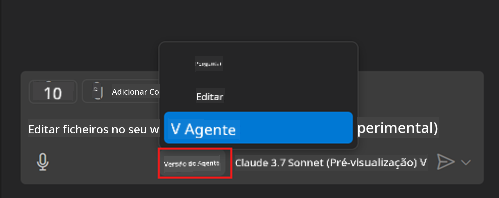

<!--
CO_OP_TRANSLATOR_METADATA:
{
  "original_hash": "d940b5e0af75e3a3a4d1c3179120d1d9",
  "translation_date": "2025-08-26T17:36:44+00:00",
  "source_file": "03-GettingStarted/04-vscode/README.md",
  "language_code": "pt"
}
-->
# Consumir um servidor no modo Agente do GitHub Copilot

O Visual Studio Code e o GitHub Copilot podem atuar como clientes e consumir um MCP Server. Por que faríamos isso, você pode perguntar? Bem, isso significa que qualquer funcionalidade que o MCP Server tenha agora pode ser usada diretamente no seu IDE. Imagine, por exemplo, adicionar o MCP Server do GitHub, permitindo controlar o GitHub através de prompts em vez de digitar comandos específicos no terminal. Ou imagine qualquer coisa que possa melhorar a sua experiência como desenvolvedor, tudo controlado por linguagem natural. Agora começa a perceber as vantagens, certo?

## Visão Geral

Esta lição aborda como usar o Visual Studio Code e o modo Agente do GitHub Copilot como cliente para o seu MCP Server.

## Objetivos de Aprendizagem

Ao final desta lição, você será capaz de:

- Consumir um MCP Server através do Visual Studio Code.
- Executar funcionalidades como ferramentas via GitHub Copilot.
- Configurar o Visual Studio Code para localizar e gerenciar o seu MCP Server.

## Utilização

Você pode controlar o seu MCP Server de duas maneiras diferentes:

- Interface de utilizador, veremos como isso é feito mais adiante neste capítulo.
- Terminal, é possível controlar as coisas a partir do terminal usando o executável `code`:

  Para adicionar um MCP Server ao seu perfil de utilizador, use a opção de linha de comando --add-mcp e forneça a configuração do servidor JSON no formato {\"name\":\"server-name\",\"command\":...}.

  ```
  code --add-mcp "{\"name\":\"my-server\",\"command\": \"uvx\",\"args\": [\"mcp-server-fetch\"]}"
  ```

### Capturas de Tela




Vamos falar mais sobre como usar a interface visual nas próximas seções.

## Abordagem

Aqui está como devemos abordar isso em alto nível:

- Configurar um ficheiro para localizar o nosso MCP Server.
- Iniciar/Conectar ao servidor para listar as suas funcionalidades.
- Usar essas funcionalidades através da interface de chat do GitHub Copilot.

Ótimo, agora que entendemos o fluxo, vamos tentar usar um MCP Server no Visual Studio Code através de um exercício.

## Exercício: Consumir um servidor

Neste exercício, vamos configurar o Visual Studio Code para localizar o seu MCP Server para que ele possa ser usado através da interface de chat do GitHub Copilot.

### -0- Pré-passo, ativar descoberta de MCP Server

Pode ser necessário ativar a descoberta de MCP Servers.

1. Vá para `File -> Preferences -> Settings` no Visual Studio Code.

1. Procure por "MCP" e ative `chat.mcp.discovery.enabled` no ficheiro settings.json.

### -1- Criar ficheiro de configuração

Comece criando um ficheiro de configuração na raiz do seu projeto. Você precisará de um ficheiro chamado MCP.json e colocá-lo numa pasta chamada .vscode. Deve ficar assim:

```text
.vscode
|-- mcp.json
```

Em seguida, vamos ver como adicionar uma entrada de servidor.

### -2- Configurar um servidor

Adicione o seguinte conteúdo ao ficheiro *mcp.json*:

```json
{
    "inputs": [],
    "servers": {
       "hello-mcp": {
           "command": "node",
           "args": [
               "build/index.js"
           ]
       }
    }
}
```

Aqui está um exemplo simples de como iniciar um servidor escrito em Node.js. Para outros runtimes, indique o comando apropriado para iniciar o servidor usando `command` e `args`.

### -3- Iniciar o servidor

Agora que você adicionou uma entrada, vamos iniciar o servidor:

1. Localize a sua entrada no ficheiro *mcp.json* e certifique-se de encontrar o ícone "play":

    

1. Clique no ícone "play". Você deve ver o ícone de ferramentas no GitHub Copilot Chat aumentar o número de ferramentas disponíveis. Se clicar nesse ícone de ferramentas, verá uma lista de ferramentas registadas. Pode marcar/desmarcar cada ferramenta dependendo se deseja que o GitHub Copilot as use como contexto:

  

1. Para executar uma ferramenta, digite um prompt que corresponda à descrição de uma das suas ferramentas, por exemplo, um prompt como "adicionar 22 a 1":

  

  Você deve ver uma resposta dizendo 23.

## Tarefa

Tente adicionar uma entrada de servidor ao seu ficheiro *mcp.json* e certifique-se de que pode iniciar/parar o servidor. Certifique-se também de que pode comunicar com as ferramentas no seu servidor através da interface de chat do GitHub Copilot.

## Solução

[Solution](./solution/README.md)

## Principais Conclusões

As conclusões deste capítulo são as seguintes:

- O Visual Studio Code é um excelente cliente que permite consumir vários MCP Servers e suas ferramentas.
- A interface de chat do GitHub Copilot é como você interage com os servidores.
- Pode solicitar ao utilizador entradas como chaves de API que podem ser passadas ao MCP Server ao configurar a entrada do servidor no ficheiro *mcp.json*.

## Exemplos

- [Calculadora em Java](../samples/java/calculator/README.md)
- [Calculadora em .Net](../../../../03-GettingStarted/samples/csharp)
- [Calculadora em JavaScript](../samples/javascript/README.md)
- [Calculadora em TypeScript](../samples/typescript/README.md)
- [Calculadora em Python](../../../../03-GettingStarted/samples/python)

## Recursos Adicionais

- [Documentação do Visual Studio](https://code.visualstudio.com/docs/copilot/chat/mcp-servers)

## O que vem a seguir

- Próximo: [Criar um servidor stdio](../05-stdio-server/README.md)

---

**Aviso Legal**:  
Este documento foi traduzido utilizando o serviço de tradução por IA [Co-op Translator](https://github.com/Azure/co-op-translator). Embora nos esforcemos para garantir a precisão, é importante ter em conta que traduções automáticas podem conter erros ou imprecisões. O documento original na sua língua nativa deve ser considerado a fonte autoritária. Para informações críticas, recomenda-se a tradução profissional realizada por humanos. Não nos responsabilizamos por quaisquer mal-entendidos ou interpretações incorretas decorrentes da utilização desta tradução.