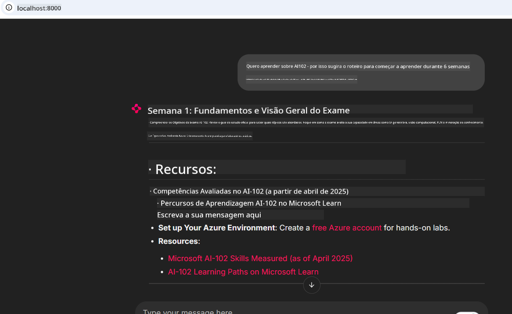
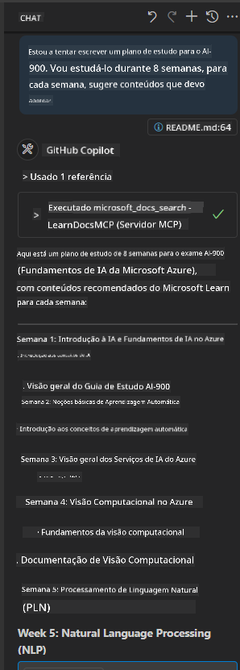

<!--
CO_OP_TRANSLATOR_METADATA:
{
  "original_hash": "4319d291c9d124ecafea52b3d04bfa0e",
  "translation_date": "2025-07-14T06:22:57+00:00",
  "source_file": "09-CaseStudy/docs-mcp/README.md",
  "language_code": "pt"
}
-->
# Estudo de Caso: Ligação ao Servidor Microsoft Learn Docs MCP a partir de um Cliente

Alguma vez se viu a alternar entre sites de documentação, Stack Overflow e inúmeras abas do motor de busca, tudo enquanto tenta resolver um problema no seu código? Talvez tenha um segundo monitor só para a documentação, ou esteja constantemente a alternar entre o seu IDE e um navegador. Não seria melhor se pudesse trazer a documentação diretamente para o seu fluxo de trabalho — integrada nas suas aplicações, no seu IDE, ou até nas suas próprias ferramentas personalizadas? Neste estudo de caso, vamos explorar exatamente como fazer isso, ligando-se diretamente ao servidor Microsoft Learn Docs MCP a partir da sua própria aplicação cliente.

## Visão Geral

O desenvolvimento moderno é mais do que apenas escrever código — trata-se de encontrar a informação certa no momento certo. A documentação está por todo o lado, mas raramente onde mais precisa: dentro das suas ferramentas e fluxos de trabalho. Ao integrar a obtenção de documentação diretamente nas suas aplicações, pode poupar tempo, reduzir a troca de contexto e aumentar a produtividade. Nesta secção, vamos mostrar-lhe como ligar um cliente ao servidor Microsoft Learn Docs MCP, para que possa aceder a documentação em tempo real e contextualizada sem sair da sua aplicação.

Vamos percorrer o processo de estabelecer uma ligação, enviar um pedido e tratar respostas em streaming de forma eficiente. Esta abordagem não só simplifica o seu fluxo de trabalho, como também abre a porta para construir ferramentas de desenvolvimento mais inteligentes e úteis.

## Objetivos de Aprendizagem

Porque é que estamos a fazer isto? Porque as melhores experiências para programadores são aquelas que eliminam obstáculos. Imagine um mundo onde o seu editor de código, chatbot ou aplicação web pode responder às suas dúvidas de documentação instantaneamente, usando o conteúdo mais recente do Microsoft Learn. No final deste capítulo, saberá como:

- Compreender os fundamentos da comunicação cliente-servidor MCP para documentação
- Implementar uma aplicação de consola ou web para ligar ao servidor Microsoft Learn Docs MCP
- Usar clientes HTTP em streaming para obter documentação em tempo real
- Registar e interpretar as respostas de documentação na sua aplicação

Vai perceber como estas competências o podem ajudar a criar ferramentas que não são apenas reativas, mas verdadeiramente interativas e conscientes do contexto.

## Cenário 1 - Obtenção de Documentação em Tempo Real com MCP

Neste cenário, vamos mostrar-lhe como ligar um cliente ao servidor Microsoft Learn Docs MCP, para que possa aceder a documentação em tempo real e contextualizada sem sair da sua aplicação.

Vamos pôr isto em prática. A sua tarefa é escrever uma aplicação que se ligue ao servidor Microsoft Learn Docs MCP, invoque a ferramenta `microsoft_docs_search` e registe a resposta em streaming na consola.

### Porque esta abordagem?
Porque é a base para construir integrações mais avançadas — quer queira alimentar um chatbot, uma extensão de IDE ou um painel web.

Vai encontrar o código e as instruções para este cenário na pasta [`solution`](./solution/README.md) dentro deste estudo de caso. Os passos vão guiá-lo na configuração da ligação:
- Usar o SDK oficial MCP e um cliente HTTP com suporte a streaming para a ligação
- Chamar a ferramenta `microsoft_docs_search` com um parâmetro de consulta para obter documentação
- Implementar registo adequado e tratamento de erros
- Criar uma interface de consola interativa para permitir que os utilizadores façam múltiplas pesquisas

Este cenário demonstra como:
- Ligar ao servidor Docs MCP
- Enviar uma consulta
- Analisar e imprimir os resultados

Aqui está um exemplo de como executar a solução pode parecer:

```
Prompt> What is Azure Key Vault?
Answer> Azure Key Vault is a cloud service for securely storing and accessing secrets. ...
```

Abaixo está uma solução mínima de exemplo. O código completo e detalhes estão disponíveis na pasta da solução.

<details>
<summary>Python</summary>

```python
import asyncio
from mcp.client.streamable_http import streamablehttp_client
from mcp import ClientSession

async def main():
    async with streamablehttp_client("https://learn.microsoft.com/api/mcp") as (read_stream, write_stream, _):
        async with ClientSession(read_stream, write_stream) as session:
            await session.initialize()
            result = await session.call_tool("microsoft_docs_search", {"query": "Azure Functions best practices"})
            print(result.content)

if __name__ == "__main__":
    asyncio.run(main())
```

- Para a implementação completa e registo, veja [`scenario1.py`](../../../../09-CaseStudy/docs-mcp/solution/python/scenario1.py).
- Para instruções de instalação e uso, consulte o ficheiro [`README.md`](./solution/python/README.md) na mesma pasta.
</details>

## Cenário 2 - Aplicação Web Interativa para Gerar Plano de Estudo com MCP

Neste cenário, vai aprender a integrar o Docs MCP num projeto de desenvolvimento web. O objetivo é permitir que os utilizadores pesquisem a documentação do Microsoft Learn diretamente a partir de uma interface web, tornando a documentação instantaneamente acessível dentro da sua aplicação ou site.

Vai ver como:
- Configurar uma aplicação web
- Ligar ao servidor Docs MCP
- Tratar a entrada do utilizador e mostrar os resultados

Aqui está um exemplo de como executar a solução pode parecer:

```
User> I want to learn about AI102 - so suggest the roadmap to get it started from learn for 6 weeks

Assistant> Here’s a detailed 6-week roadmap to start your preparation for the AI-102: Designing and Implementing a Microsoft Azure AI Solution certification, using official Microsoft resources and focusing on exam skills areas:

---
## Week 1: Introduction & Fundamentals
- **Understand the Exam**: Review the [AI-102 exam skills outline](https://learn.microsoft.com/en-us/credentials/certifications/exams/ai-102/).
- **Set up Azure**: Sign up for a free Azure account if you don't have one.
- **Learning Path**: [Introduction to Azure AI services](https://learn.microsoft.com/en-us/training/modules/intro-to-azure-ai/)
- **Focus**: Get familiar with Azure portal, AI capabilities, and necessary tools.

....more weeks of the roadmap...

Let me know if you want module-specific recommendations or need more customized weekly tasks!
```

Abaixo está uma solução mínima de exemplo. O código completo e detalhes estão disponíveis na pasta da solução.



<details>
<summary>Python (Chainlit)</summary>

Chainlit é um framework para construir aplicações web de IA conversacional. Facilita a criação de chatbots interativos e assistentes que podem chamar ferramentas MCP e mostrar resultados em tempo real. É ideal para prototipagem rápida e interfaces amigáveis.

```python
import chainlit as cl
import requests

MCP_URL = "https://learn.microsoft.com/api/mcp"

@cl.on_message
def handle_message(message):
    query = {"question": message}
    response = requests.post(MCP_URL, json=query)
    if response.ok:
        result = response.json()
        cl.Message(content=result.get("answer", "No answer found.")).send()
    else:
        cl.Message(content="Error: " + response.text).send()
```

- Para a implementação completa, veja [`scenario2.py`](../../../../09-CaseStudy/docs-mcp/solution/python/scenario2.py).
- Para instruções de configuração e execução, consulte o [`README.md`](./solution/python/README.md).
</details>

## Cenário 3: Documentação no Editor com o Servidor MCP no VS Code

Se quiser ter o Microsoft Learn Docs diretamente dentro do seu VS Code (em vez de alternar entre abas do navegador), pode usar o servidor MCP no seu editor. Isto permite-lhe:
- Pesquisar e ler documentação no VS Code sem sair do seu ambiente de codificação.
- Referenciar documentação e inserir links diretamente nos seus ficheiros README ou de curso.
- Aproveitar o GitHub Copilot e o MCP em conjunto para um fluxo de trabalho de documentação alimentado por IA, fluido.

**Vai aprender a:**
- Adicionar um ficheiro válido `.vscode/mcp.json` na raiz do seu workspace (veja o exemplo abaixo).
- Abrir o painel MCP ou usar a paleta de comandos no VS Code para pesquisar e inserir documentação.
- Referenciar documentação diretamente nos seus ficheiros markdown enquanto trabalha.
- Combinar este fluxo de trabalho com o GitHub Copilot para ainda mais produtividade.

Aqui está um exemplo de como configurar o servidor MCP no VS Code:

```json
{
  "servers": {
    "LearnDocsMCP": {
      "url": "https://learn.microsoft.com/api/mcp"
    }
  }
}
```

</details>

> Para um guia detalhado com capturas de ecrã e passo a passo, consulte [`README.md`](./solution/scenario3/README.md).



Esta abordagem é ideal para quem cria cursos técnicos, escreve documentação ou desenvolve código com necessidades frequentes de referência.

## Principais Conclusões

Integrar a documentação diretamente nas suas ferramentas não é apenas uma comodidade — é uma revolução para a produtividade. Ao ligar-se ao servidor Microsoft Learn Docs MCP a partir do seu cliente, pode:

- Eliminar a troca de contexto entre o seu código e a documentação
- Obter documentação atualizada e contextualizada em tempo real
- Construir ferramentas de desenvolvimento mais inteligentes e interativas

Estas competências vão ajudá-lo a criar soluções que são não só eficientes, mas também agradáveis de usar.

## Recursos Adicionais

Para aprofundar o seu conhecimento, explore estes recursos oficiais:

- [Microsoft Learn Docs MCP Server (GitHub)](https://github.com/MicrosoftDocs/mcp)
- [Começar com o Azure MCP Server (mcp-python)](https://learn.microsoft.com/en-us/azure/developer/azure-mcp-server/get-started#create-the-python-app)
- [O que é o Azure MCP Server?](https://learn.microsoft.com/en-us/azure/developer/azure-mcp-server/)
- [Introdução ao Model Context Protocol (MCP)](https://modelcontextprotocol.io/introduction)
- [Adicionar plugins a partir de um MCP Server (Python)](https://learn.microsoft.com/en-us/semantic-kernel/concepts/plugins/adding-mcp-plugins)

**Aviso Legal**:  
Este documento foi traduzido utilizando o serviço de tradução automática [Co-op Translator](https://github.com/Azure/co-op-translator). Embora nos esforcemos pela precisão, por favor tenha em conta que traduções automáticas podem conter erros ou imprecisões. O documento original na sua língua nativa deve ser considerado a fonte autorizada. Para informações críticas, recomenda-se tradução profissional humana. Não nos responsabilizamos por quaisquer mal-entendidos ou interpretações incorretas decorrentes da utilização desta tradução.