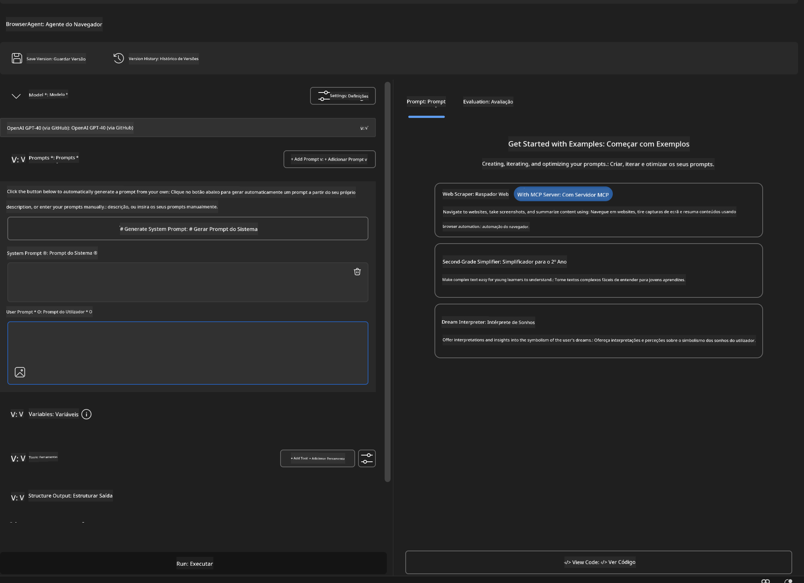
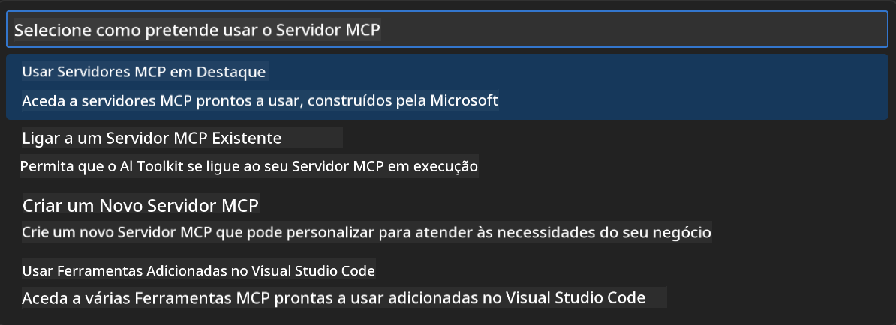
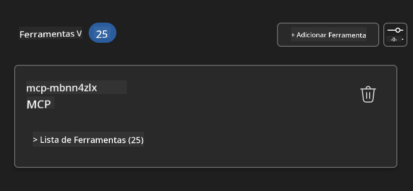
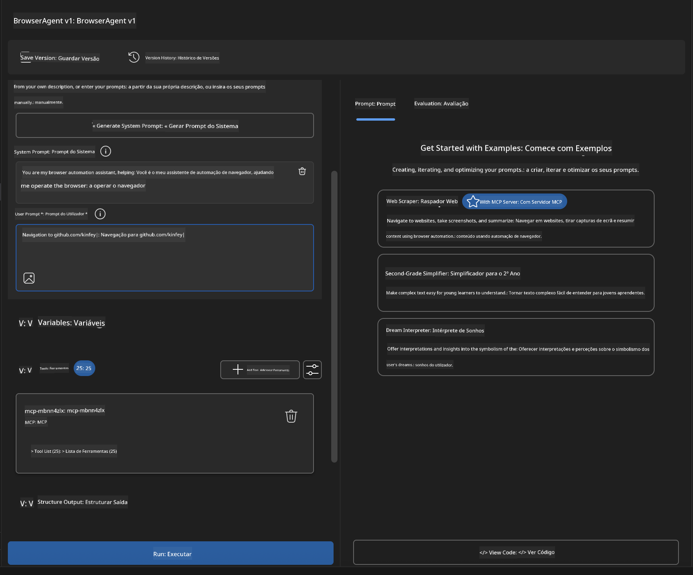
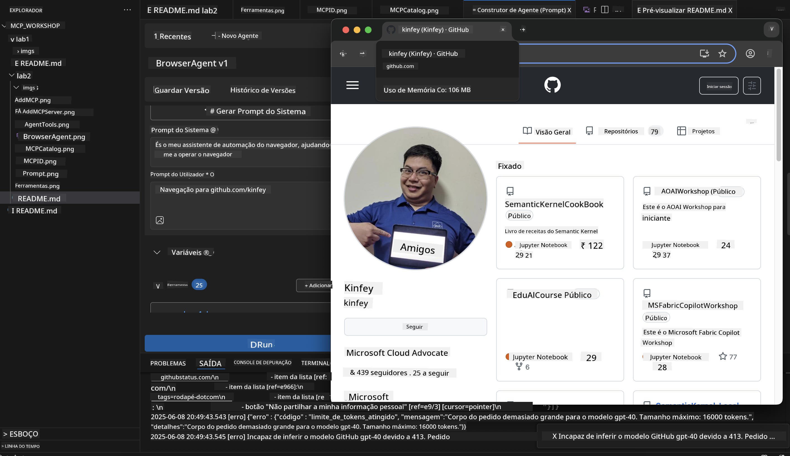
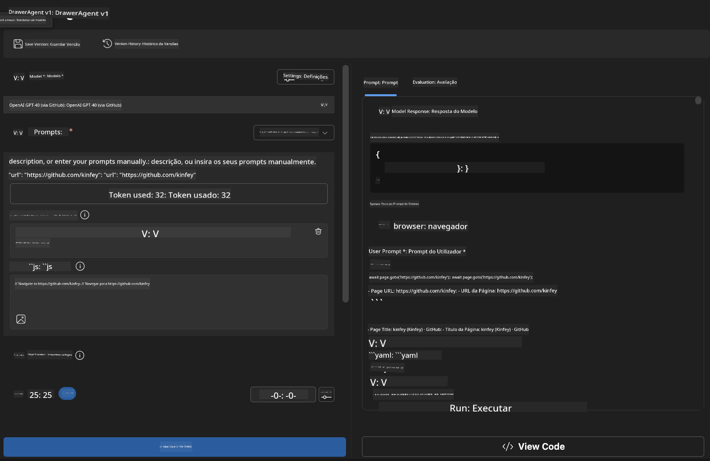

<!--
CO_OP_TRANSLATOR_METADATA:
{
  "original_hash": "a22b7dd11cd7690f99f9195877cafdc3",
  "translation_date": "2025-07-14T07:49:27+00:00",
  "source_file": "10-StreamliningAIWorkflowsBuildingAnMCPServerWithAIToolkit/lab2/README.md",
  "language_code": "pt"
}
-->
# 🌐 Módulo 2: Fundamentos do MCP com AI Toolkit

[]()
[]()
[]()

## 📋 Objetivos de Aprendizagem

No final deste módulo, serás capaz de:
- ✅ Compreender a arquitetura e os benefícios do Model Context Protocol (MCP)
- ✅ Explorar o ecossistema de servidores MCP da Microsoft
- ✅ Integrar servidores MCP com o AI Toolkit Agent Builder
- ✅ Construir um agente funcional de automação de browser usando Playwright MCP
- ✅ Configurar e testar ferramentas MCP dentro dos teus agentes
- ✅ Exportar e implementar agentes potenciados por MCP para uso em produção

## 🎯 Continuação do Módulo 1

No Módulo 1, dominámos os fundamentos do AI Toolkit e criámos o nosso primeiro Agente Python. Agora vamos **potenciar** os teus agentes ao ligá-los a ferramentas e serviços externos através do revolucionário **Model Context Protocol (MCP)**.

Pensa nisto como uma atualização de uma calculadora básica para um computador completo – os teus agentes de IA vão ganhar a capacidade de:
- 🌐 Navegar e interagir com websites
- 📁 Aceder e manipular ficheiros
- 🔧 Integrar com sistemas empresariais
- 📊 Processar dados em tempo real a partir de APIs

## 🧠 Compreender o Model Context Protocol (MCP)

### 🔍 O que é o MCP?

O Model Context Protocol (MCP) é o **"USB-C para aplicações de IA"** – um padrão aberto revolucionário que liga Large Language Models (LLMs) a ferramentas externas, fontes de dados e serviços. Tal como o USB-C eliminou o caos dos cabos ao fornecer um conector universal, o MCP elimina a complexidade da integração de IA com um protocolo padronizado.

### 🎯 O Problema que o MCP Resolve

**Antes do MCP:**
- 🔧 Integrações personalizadas para cada ferramenta
- 🔄 Dependência de fornecedores com soluções proprietárias  
- 🔒 Vulnerabilidades de segurança devido a ligações improvisadas
- ⏱️ Meses de desenvolvimento para integrações básicas

**Com o MCP:**
- ⚡ Integração de ferramentas plug-and-play
- 🔄 Arquitetura independente de fornecedores
- 🛡️ Melhores práticas de segurança incorporadas
- 🚀 Minutos para adicionar novas funcionalidades

### 🏗️ Análise Profunda da Arquitetura MCP

O MCP segue uma **arquitetura cliente-servidor** que cria um ecossistema seguro e escalável:

```mermaid
graph TB
    A[AI Application/Agent] --> B[MCP Client]
    B --> C[MCP Server 1: Files]
    B --> D[MCP Server 2: Web APIs]
    B --> E[MCP Server 3: Database]
    B --> F[MCP Server N: Custom Tools]
    
    C --> G[Local File System]
    D --> H[External APIs]
    E --> I[Database Systems]
    F --> J[Enterprise Systems]
```

**🔧 Componentes Principais:**

| Componente | Função | Exemplos |
|------------|--------|----------|
| **MCP Hosts** | Aplicações que consomem serviços MCP | Claude Desktop, VS Code, AI Toolkit |
| **MCP Clients** | Gestores do protocolo (1:1 com servidores) | Integrados nas aplicações host |
| **MCP Servers** | Exposição de funcionalidades via protocolo padrão | Playwright, Files, Azure, GitHub |
| **Camada de Transporte** | Métodos de comunicação | stdio, HTTP, WebSockets |

## 🏢 Ecossistema de Servidores MCP da Microsoft

A Microsoft lidera o ecossistema MCP com uma suíte abrangente de servidores empresariais que respondem a necessidades reais de negócio.

### 🌟 Servidores MCP em Destaque da Microsoft

#### 1. ☁️ Azure MCP Server  
**🔗 Repositório**: [azure/azure-mcp](https://github.com/azure/azure-mcp)  
**🎯 Objetivo**: Gestão abrangente de recursos Azure com integração de IA

**✨ Funcionalidades Principais:**
- Provisionamento declarativo de infraestrutura
- Monitorização de recursos em tempo real
- Recomendações para otimização de custos
- Verificação de conformidade de segurança

**🚀 Casos de Uso:**
- Infrastructure-as-Code com assistência de IA
- Escalonamento automático de recursos
- Otimização de custos na cloud
- Automação de fluxos DevOps

#### 2. 📊 Microsoft Dataverse MCP  
**📚 Documentação**: [Microsoft Dataverse Integration](https://go.microsoft.com/fwlink/?linkid=2320176)  
**🎯 Objetivo**: Interface em linguagem natural para dados empresariais

**✨ Funcionalidades Principais:**
- Consultas a bases de dados em linguagem natural
- Compreensão do contexto empresarial
- Templates personalizados para prompts
- Governança de dados empresariais

**🚀 Casos de Uso:**
- Relatórios de business intelligence
- Análise de dados de clientes
- Insights sobre pipeline de vendas
- Consultas de dados para conformidade

#### 3. 🌐 Playwright MCP Server  
**🔗 Repositório**: [microsoft/playwright-mcp](https://github.com/microsoft/playwright-mcp)  
**🎯 Objetivo**: Automação de browser e capacidades de interação web

**✨ Funcionalidades Principais:**
- Automação cross-browser (Chrome, Firefox, Safari)
- Detecção inteligente de elementos
- Geração de screenshots e PDFs
- Monitorização do tráfego de rede

**🚀 Casos de Uso:**
- Fluxos de testes automatizados
- Web scraping e extração de dados
- Monitorização de UI/UX
- Automação de análise competitiva

#### 4. 📁 Files MCP Server  
**🔗 Repositório**: [microsoft/files-mcp-server](https://github.com/microsoft/files-mcp-server)  
**🎯 Objetivo**: Operações inteligentes no sistema de ficheiros

**✨ Funcionalidades Principais:**
- Gestão declarativa de ficheiros
- Sincronização de conteúdos
- Integração com controlo de versões
- Extração de metadados

**🚀 Casos de Uso:**
- Gestão de documentação
- Organização de repositórios de código
- Fluxos de publicação de conteúdos
- Manipulação de ficheiros em pipelines de dados

#### 5. 📝 MarkItDown MCP Server  
**🔗 Repositório**: [microsoft/markitdown](https://github.com/microsoft/markitdown)  
**🎯 Objetivo**: Processamento e manipulação avançada de Markdown

**✨ Funcionalidades Principais:**
- Parsing avançado de Markdown
- Conversão de formatos (MD ↔ HTML ↔ PDF)
- Análise da estrutura do conteúdo
- Processamento de templates

**🚀 Casos de Uso:**
- Fluxos de documentação técnica
- Sistemas de gestão de conteúdos
- Geração de relatórios
- Automação de bases de conhecimento

#### 6. 📈 Clarity MCP Server  
**📦 Package**: [@microsoft/clarity-mcp-server](https://www.npmjs.com/package/@microsoft/clarity-mcp-server)  
**🎯 Objetivo**: Análise web e insights sobre comportamento do utilizador

**✨ Funcionalidades Principais:**
- Análise de mapas de calor
- Gravação de sessões de utilizador
- Métricas de desempenho
- Análise de funis de conversão

**🚀 Casos de Uso:**
- Otimização de websites
- Pesquisa de experiência do utilizador
- Análise de testes A/B
- Dashboards de business intelligence

### 🌍 Ecossistema Comunitário

Para além dos servidores da Microsoft, o ecossistema MCP inclui:
- **🐙 GitHub MCP**: Gestão de repositórios e análise de código
- **🗄️ MCPs para Bases de Dados**: Integrações com PostgreSQL, MySQL, MongoDB
- **☁️ MCPs para Provedores Cloud**: Ferramentas AWS, GCP, Digital Ocean
- **📧 MCPs de Comunicação**: Integrações Slack, Teams, Email

## 🛠️ Laboratório Prático: Construir um Agente de Automação de Browser

**🎯 Objetivo do Projeto**: Criar um agente inteligente de automação de browser usando o servidor Playwright MCP que consiga navegar em websites, extrair informação e realizar interações web complexas.

### 🚀 Fase 1: Configuração da Base do Agente

#### Passo 1: Inicializar o Teu Agente
1. **Abre o AI Toolkit Agent Builder**  
2. **Cria um Novo Agente** com a seguinte configuração:  
   - **Nome**: `BrowserAgent`  
   - **Modelo**: Escolhe GPT-4o  



### 🔧 Fase 2: Fluxo de Integração MCP

#### Passo 3: Adicionar Integração de Servidor MCP
1. **Navega para a Secção de Ferramentas** no Agent Builder  
2. **Clica em "Add Tool"** para abrir o menu de integrações  
3. **Seleciona "MCP Server"** entre as opções disponíveis  


**🔍 Compreender os Tipos de Ferramentas:**  
- **Ferramentas Integradas**: Funções pré-configuradas do AI Toolkit  
- **Servidores MCP**: Integrações com serviços externos  
- **APIs Personalizadas**: Os teus próprios endpoints de serviço  
- **Chamada de Funções**: Acesso direto a funções do modelo  

#### Passo 4: Seleção do Servidor MCP
1. **Escolhe a opção "MCP Server"** para continuar  


2. **Explora o Catálogo MCP** para ver as integrações disponíveis  


### 🎮 Fase 3: Configuração do Playwright MCP

#### Passo 5: Selecionar e Configurar o Playwright
1. **Clica em "Use Featured MCP Servers"** para aceder aos servidores verificados pela Microsoft  
2. **Seleciona "Playwright"** da lista em destaque  
3. **Aceita o MCP ID padrão** ou personaliza para o teu ambiente  


#### Passo 6: Ativar as Capacidades do Playwright
**🔑 Passo Crítico**: Seleciona **TODOS** os métodos Playwright disponíveis para máxima funcionalidade  


**🛠️ Ferramentas Essenciais do Playwright:**  
- **Navegação**: `goto`, `goBack`, `goForward`, `reload`  
- **Interação**: `click`, `fill`, `press`, `hover`, `drag`  
- **Extração**: `textContent`, `innerHTML`, `getAttribute`  
- **Validação**: `isVisible`, `isEnabled`, `waitForSelector`  
- **Captura**: `screenshot`, `pdf`, `video`  
- **Rede**: `setExtraHTTPHeaders`, `route`, `waitForResponse`  

#### Passo 7: Verificar Sucesso da Integração
**✅ Indicadores de Sucesso:**  
- Todas as ferramentas aparecem na interface do Agent Builder  
- Nenhuma mensagem de erro no painel de integração  
- Estado do servidor Playwright mostra "Connected"  



**🔧 Resolução de Problemas Comuns:**  
- **Falha na Conexão**: Verifica a ligação à internet e configurações de firewall  
- **Ferramentas em Falta**: Confirma que todas as capacidades foram selecionadas durante a configuração  
- **Erros de Permissão**: Assegura que o VS Code tem as permissões necessárias no sistema  

### 🎯 Fase 4: Engenharia Avançada de Prompts

#### Passo 8: Criar Prompts Inteligentes para o Sistema  
Desenvolve prompts sofisticados que aproveitem todas as capacidades do Playwright:

```markdown
# Web Automation Expert System Prompt

## Core Identity
You are an advanced web automation specialist with deep expertise in browser automation, web scraping, and user experience analysis. You have access to Playwright tools for comprehensive browser control.

## Capabilities & Approach
### Navigation Strategy
- Always start with screenshots to understand page layout
- Use semantic selectors (text content, labels) when possible
- Implement wait strategies for dynamic content
- Handle single-page applications (SPAs) effectively

### Error Handling
- Retry failed operations with exponential backoff
- Provide clear error descriptions and solutions
- Suggest alternative approaches when primary methods fail
- Always capture diagnostic screenshots on errors

### Data Extraction
- Extract structured data in JSON format when possible
- Provide confidence scores for extracted information
- Validate data completeness and accuracy
- Handle pagination and infinite scroll scenarios

### Reporting
- Include step-by-step execution logs
- Provide before/after screenshots for verification
- Suggest optimizations and alternative approaches
- Document any limitations or edge cases encountered

## Ethical Guidelines
- Respect robots.txt and rate limiting
- Avoid overloading target servers
- Only extract publicly available information
- Follow website terms of service
```

#### Passo 9: Criar Prompts Dinâmicos para o Utilizador  
Desenha prompts que demonstrem várias funcionalidades:

**🌐 Exemplo de Análise Web:**  
```markdown
Navigate to github.com/kinfey and provide a comprehensive analysis including:
1. Repository structure and organization
2. Recent activity and contribution patterns  
3. Documentation quality assessment
4. Technology stack identification
5. Community engagement metrics
6. Notable projects and their purposes

Include screenshots at key steps and provide actionable insights.
```



### 🚀 Fase 5: Execução e Testes

#### Passo 10: Executar a Primeira Automação
1. **Clica em "Run"** para iniciar a sequência de automação  
2. **Monitoriza a Execução em Tempo Real**:  
   - O browser Chrome abre automaticamente  
   - O agente navega para o website alvo  
   - Screenshots capturam cada passo importante  
   - Resultados da análise são transmitidos em tempo real  



#### Passo 11: Analisar Resultados e Insights  
Revê a análise detalhada na interface do Agent Builder:



### 🌟 Fase 6: Capacidades Avançadas e Implementação

#### Passo 12: Exportar e Implementar em Produção  
O Agent Builder suporta várias opções de implementação:


## 🎓 Resumo do Módulo 2 & Próximos Passos

### 🏆 Conquista Desbloqueada: Mestre da Integração MCP

**✅ Competências Dominadas:**  
- [ ] Compreensão da arquitetura e benefícios do MCP  
- [ ] Navegação pelo ecossistema de servidores MCP da Microsoft  
- [ ] Integração do Playwright MCP com AI Toolkit  
- [ ] Construção de agentes sofisticados de automação de browser  
- [ ] Engenharia avançada de prompts para automação web  

### 📚 Recursos Adicionais

- **🔗 Especificação MCP**: [Documentação Oficial do Protocolo](https://modelcontextprotocol.io/)  
- **🛠️ API Playwright**: [Referência Completa de Métodos](https://playwright.dev/docs/api/class-playwright)  
- **🏢 Servidores MCP Microsoft**: [Guia de Integração Empresarial](https://github.com/microsoft/mcp-servers)  
- **🌍 Exemplos Comunitários**: [Galeria de Servidores MCP](https://github.com/modelcontextprotocol/servers)  

**🎉 Parabéns!** Dominaste com sucesso a integração MCP e agora podes construir agentes de IA prontos para produção com capacidades de ferramentas externas!

### 🔜 Continua para o Próximo Módulo

Pronto para levar as tuas competências MCP ao próximo nível? Avança para **[Módulo 3: Desenvolvimento Avançado MCP com AI Toolkit](../lab3/README.md)** onde vais aprender a:  
- Criar os teus próprios servidores MCP personalizados  
- Configurar e usar o mais recente SDK MCP para Python  
- Configurar o MCP Inspector para debugging  
- Dominar fluxos de trabalho avançados de desenvolvimento de servidores MCP
- Construir um Servidor Weather MCP do zero

**Aviso Legal**:  
Este documento foi traduzido utilizando o serviço de tradução automática [Co-op Translator](https://github.com/Azure/co-op-translator). Embora nos esforcemos pela precisão, por favor tenha em conta que traduções automáticas podem conter erros ou imprecisões. O documento original na sua língua nativa deve ser considerado a fonte autorizada. Para informações críticas, recomenda-se tradução profissional humana. Não nos responsabilizamos por quaisquer mal-entendidos ou interpretações incorretas decorrentes da utilização desta tradução.