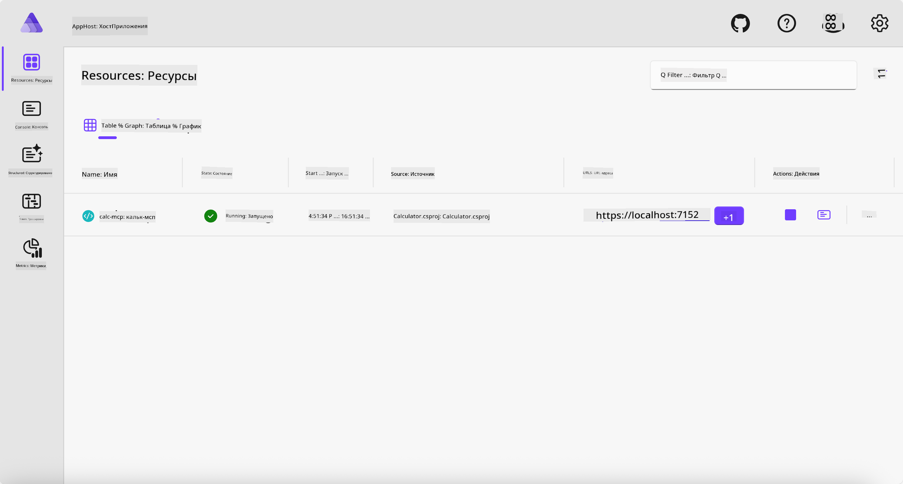
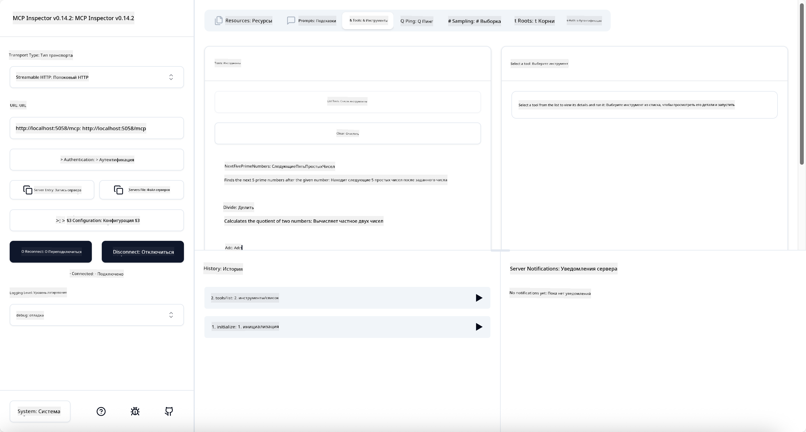

<!--
CO_OP_TRANSLATOR_METADATA:
{
  "original_hash": "0bc7bd48f55f1565f1d95ccb2c16f728",
  "translation_date": "2025-07-13T23:03:35+00:00",
  "source_file": "04-PracticalImplementation/samples/csharp/README.md",
  "language_code": "ru"
}
-->
# Пример

В предыдущем примере показано, как использовать локальный .NET проект с типом `stdio` и как запустить сервер локально в контейнере. Это хорошее решение во многих случаях. Однако иногда полезно запускать сервер удалённо, например, в облачной среде. Для этого и предназначен тип `http`.

Если посмотреть на решение в папке `04-PracticalImplementation`, оно может показаться гораздо сложнее предыдущего. Но на самом деле это не так. Если внимательно изучить проект `src/Calculator`, вы увидите, что код в основном такой же, как и в предыдущем примере. Единственное отличие — мы используем другую библиотеку `ModelContextProtocol.AspNetCore` для обработки HTTP-запросов. Также мы изменили метод `IsPrime`, сделав его приватным, чтобы показать, что в вашем коде могут быть приватные методы. Остальной код остался прежним.

Остальные проекты взяты из [.NET Aspire](https://learn.microsoft.com/dotnet/aspire/get-started/aspire-overview). Наличие .NET Aspire в решении улучшает опыт разработчика при разработке и тестировании, а также помогает с наблюдаемостью. Для запуска сервера это не обязательно, но хорошая практика иметь его в вашем решении.

## Запуск сервера локально

1. В VS Code (с расширением C# DevKit) перейдите в каталог `04-PracticalImplementation/samples/csharp`.
1. Выполните следующую команду для запуска сервера:

   ```bash
    dotnet watch run --project ./src/AppHost
   ```

1. Когда в веб-браузере откроется панель управления .NET Aspire, обратите внимание на URL с протоколом `http`. Он должен выглядеть примерно так: `http://localhost:5058/`.

   

## Тестирование Streamable HTTP с помощью MCP Inspector

Если у вас установлен Node.js версии 22.7.5 или выше, вы можете использовать MCP Inspector для тестирования сервера.

Запустите сервер и выполните следующую команду в терминале:

```bash
npx @modelcontextprotocol/inspector http://localhost:5058
```



- Выберите `Streamable HTTP` в качестве типа транспорта.
- В поле Url введите ранее отмеченный URL сервера и добавьте `/mcp`. Это должен быть `http` (не `https`), например, `http://localhost:5058/mcp`.
- Нажмите кнопку Connect.

Удобство Inspector в том, что он предоставляет хорошую видимость происходящего.

- Попробуйте вывести список доступных инструментов.
- Попробуйте использовать некоторые из них — всё должно работать так же, как и раньше.

## Тестирование MCP Server с GitHub Copilot Chat в VS Code

Чтобы использовать транспорт Streamable HTTP с GitHub Copilot Chat, измените конфигурацию сервера `calc-mcp`, созданного ранее, следующим образом:

```jsonc
// .vscode/mcp.json
{
  "servers": {
    "calc-mcp": {
      "type": "http",
      "url": "http://localhost:5058/mcp"
    }
  }
}
```

Проведите несколько тестов:

- Попросите "3 простых числа после 6780". Обратите внимание, что Copilot использует новые инструменты `NextFivePrimeNumbers` и возвращает только первые 3 простых числа.
- Попросите "7 простых чисел после 111", чтобы посмотреть, что произойдет.
- Попросите "У Джона 24 леденца, и он хочет распределить их поровну между своими 3 детьми. Сколько леденцов получит каждый ребенок?", чтобы посмотреть результат.

## Развёртывание сервера в Azure

Давайте развернем сервер в Azure, чтобы им могли пользоваться больше людей.

В терминале перейдите в папку `04-PracticalImplementation/samples/csharp` и выполните следующую команду:

```bash
azd up
```

После завершения развертывания вы увидите сообщение примерно такого вида:


Скопируйте URL и используйте его в MCP Inspector и GitHub Copilot Chat.

```jsonc
// .vscode/mcp.json
{
  "servers": {
    "calc-mcp": {
      "type": "http",
      "url": "https://calc-mcp.gentleriver-3977fbcf.australiaeast.azurecontainerapps.io/mcp"
    }
  }
}
```

## Что дальше?

Мы попробовали разные типы транспорта и инструменты тестирования. Также развернули MCP сервер в Azure. Но что если наш сервер должен иметь доступ к приватным ресурсам? Например, к базе данных или приватному API? В следующей главе мы рассмотрим, как повысить безопасность нашего сервера.

**Отказ от ответственности**:  
Этот документ был переведен с помощью сервиса автоматического перевода [Co-op Translator](https://github.com/Azure/co-op-translator). Несмотря на наши усилия по обеспечению точности, просим учитывать, что автоматические переводы могут содержать ошибки или неточности. Оригинальный документ на его исходном языке следует считать авторитетным источником. Для получения критически важной информации рекомендуется обращаться к профессиональному человеческому переводу. Мы не несем ответственности за любые недоразумения или неправильные толкования, возникшие в результате использования данного перевода.