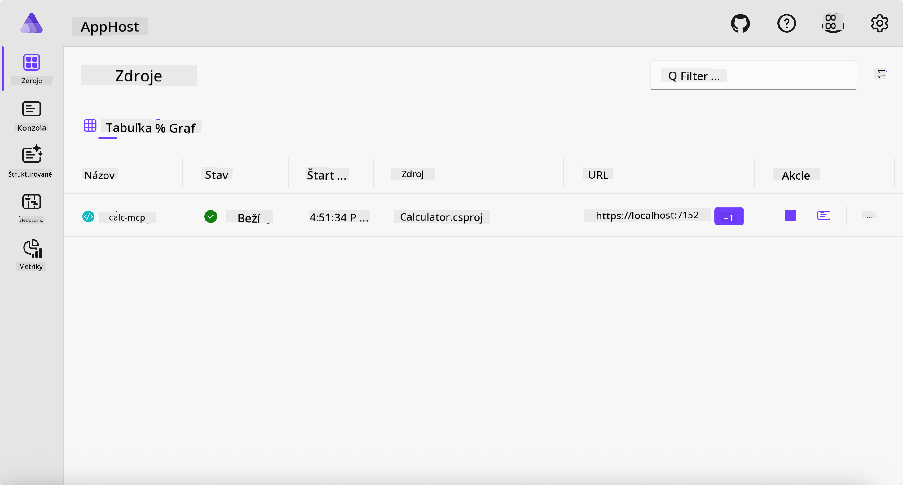

<!--
CO_OP_TRANSLATOR_METADATA:
{
  "original_hash": "0bc7bd48f55f1565f1d95ccb2c16f728",
  "translation_date": "2025-07-13T23:09:31+00:00",
  "source_file": "04-PracticalImplementation/samples/csharp/README.md",
  "language_code": "sk"
}
-->
# Príklad

Predchádzajúci príklad ukazuje, ako použiť lokálny .NET projekt s typom `stdio`. A ako spustiť server lokálne v kontejnery. Toto je dobré riešenie v mnohých situáciách. Avšak môže byť užitočné mať server bežiaci vzdialene, napríklad v cloudovom prostredí. Práve tu prichádza na rad typ `http`.

Ak sa pozriete na riešenie v priečinku `04-PracticalImplementation`, môže sa zdať oveľa zložitejšie ako predchádzajúce. Ale v skutočnosti to tak nie je. Ak sa pozriete bližšie na projekt `src/Calculator`, uvidíte, že ide väčšinou o rovnaký kód ako v predchádzajúcom príklade. Jediný rozdiel je, že používame inú knižnicu `ModelContextProtocol.AspNetCore` na spracovanie HTTP požiadaviek. A zmeníme metódu `IsPrime` na súkromnú, len aby sme ukázali, že vo vašom kóde môžete mať súkromné metódy. Zvyšok kódu je rovnaký ako predtým.

Ostatné projekty sú z [.NET Aspire](https://learn.microsoft.com/dotnet/aspire/get-started/aspire-overview). Mať .NET Aspire v riešení zlepší skúsenosť vývojára počas vývoja a testovania a pomôže s pozorovateľnosťou. Nie je to povinné na spustenie servera, ale je to dobrá prax mať to vo vašom riešení.

## Spustenie servera lokálne

1. Vo VS Code (s rozšírením C# DevKit) prejdite do adresára `04-PracticalImplementation/samples/csharp`.
1. Spustite nasledujúci príkaz na spustenie servera:

   ```bash
    dotnet watch run --project ./src/AppHost
   ```

1. Keď sa v prehliadači otvorí dashboard .NET Aspire, všimnite si `http` URL. Malo by to byť niečo ako `http://localhost:5058/`.

   

## Testovanie Streamable HTTP pomocou MCP Inspector

Ak máte Node.js verzie 22.7.5 alebo vyššej, môžete použiť MCP Inspector na testovanie vášho servera.

Spustite server a v termináli spustite nasledujúci príkaz:

```bash
npx @modelcontextprotocol/inspector http://localhost:5058
```


- Vyberte `Streamable HTTP` ako typ transportu.
- Do poľa Url zadajte URL servera, ktorú ste si poznamenali, a pridajte `/mcp`. Malo by to byť `http` (nie `https`), napríklad `http://localhost:5058/mcp`.
- Kliknite na tlačidlo Connect.

Výhodou Inspektora je, že poskytuje dobrý prehľad o tom, čo sa deje.

- Skúste zobraziť zoznam dostupných nástrojov
- Vyskúšajte niektoré z nich, mali by fungovať rovnako ako predtým.

## Testovanie MCP Servera s GitHub Copilot Chat vo VS Code

Ak chcete použiť Streamable HTTP transport s GitHub Copilot Chat, zmeňte konfiguráciu servera `calc-mcp`, ktorý ste vytvorili predtým, takto:

```jsonc
// .vscode/mcp.json
{
  "servers": {
    "calc-mcp": {
      "type": "http",
      "url": "http://localhost:5058/mcp"
    }
  }
}
```

Vykonajte niekoľko testov:

- Požiadajte o „3 prvočísla po 6780“. Všimnite si, že Copilot použije nové nástroje `NextFivePrimeNumbers` a vráti len prvé 3 prvočísla.
- Požiadajte o „7 prvočísel po 111“, aby ste videli, čo sa stane.
- Požiadajte o „John má 24 lízaniek a chce ich rozdeliť medzi svoje 3 deti. Koľko lízaniek dostane každé dieťa?“, aby ste videli, čo sa stane.

## Nasadenie servera do Azure

Nasadíme server do Azure, aby ho mohlo používať viac ľudí.

V termináli prejdite do priečinka `04-PracticalImplementation/samples/csharp` a spustite nasledujúci príkaz:

```bash
azd up
```

Po dokončení nasadenia by ste mali vidieť správu ako táto:


Skopírujte URL a použite ju v MCP Inspector a v GitHub Copilot Chat.

```jsonc
// .vscode/mcp.json
{
  "servers": {
    "calc-mcp": {
      "type": "http",
      "url": "https://calc-mcp.gentleriver-3977fbcf.australiaeast.azurecontainerapps.io/mcp"
    }
  }
}
```

## Čo ďalej?

Vyskúšali sme rôzne typy transportu a testovacie nástroje. Tiež sme nasadili váš MCP server do Azure. Ale čo ak náš server potrebuje prístup k súkromným zdrojom? Napríklad databáze alebo súkromnému API? V ďalšej kapitole uvidíme, ako môžeme zlepšiť bezpečnosť nášho servera.

**Vyhlásenie o zodpovednosti**:  
Tento dokument bol preložený pomocou AI prekladateľskej služby [Co-op Translator](https://github.com/Azure/co-op-translator). Aj keď sa snažíme o presnosť, prosím, majte na pamäti, že automatizované preklady môžu obsahovať chyby alebo nepresnosti. Originálny dokument v jeho pôvodnom jazyku by mal byť považovaný za autoritatívny zdroj. Pre kritické informácie sa odporúča profesionálny ľudský preklad. Nie sme zodpovední za akékoľvek nedorozumenia alebo nesprávne interpretácie vyplývajúce z použitia tohto prekladu.