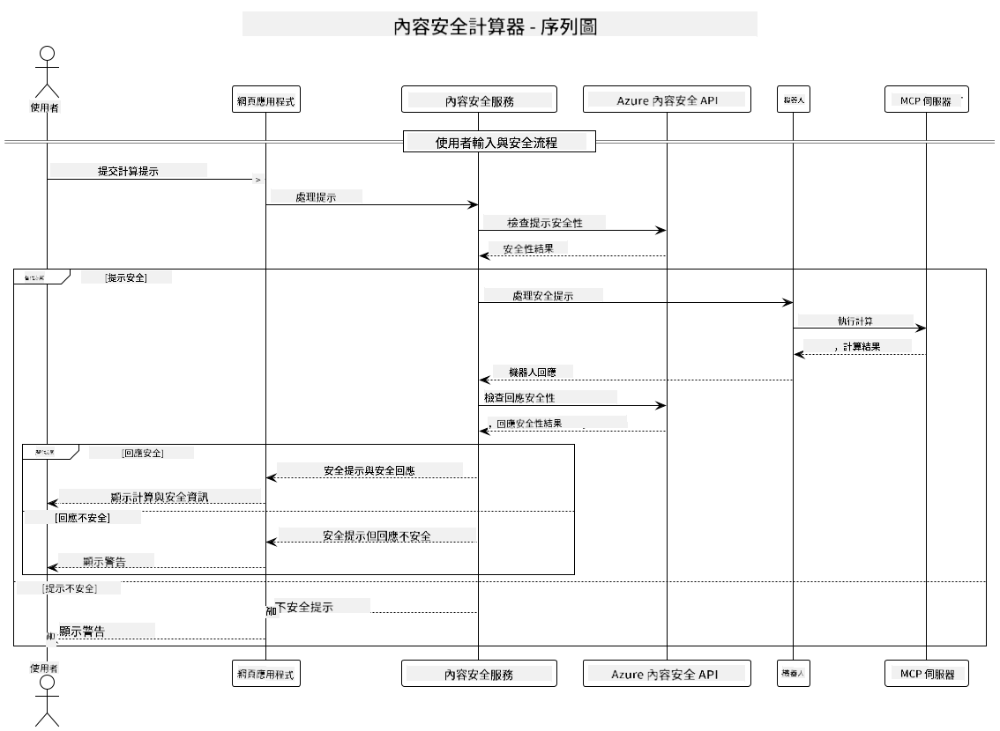

<!--
CO_OP_TRANSLATOR_METADATA:
{
  "original_hash": "e5ea5e7582f70008ea9bec3b3820f20a",
  "translation_date": "2025-07-13T23:13:17+00:00",
  "source_file": "04-PracticalImplementation/samples/java/containerapp/README.md",
  "language_code": "tw"
}
-->
## 系統架構

此專案展示了一個網頁應用程式，會在將使用者輸入的提示傳送給計算服務（透過 Model Context Protocol，MCP）之前，先進行內容安全檢查。



### 運作方式

1. **使用者輸入**：使用者在網頁介面輸入計算提示  
2. **內容安全篩檢（輸入）**：提示會由 Azure Content Safety API 進行分析  
3. **安全判斷（輸入）**：  
   - 若內容安全（所有類別的嚴重程度均低於 2），則繼續傳送給計算器  
   - 若內容被標記為可能有害，流程會停止並回傳警告  
4. **計算器整合**：安全的內容由 LangChain4j 處理，並與 MCP 計算器伺服器通訊  
5. **內容安全篩檢（輸出）**：機器人回應會由 Azure Content Safety API 進行分析  
6. **安全判斷（輸出）**：  
   - 若機器人回應安全，則顯示給使用者  
   - 若機器人回應被標記為可能有害，則以警告取代  
7. **回應**：結果（若安全）會顯示給使用者，並附上雙重安全分析結果

## 使用 Model Context Protocol (MCP) 與計算服務

此專案示範如何使用 Model Context Protocol (MCP) 從 LangChain4j 呼叫計算器 MCP 服務。實作中使用本地 MCP 伺服器（埠號 8080）來提供計算功能。

### 設定 Azure Content Safety 服務

在使用內容安全功能前，您需要建立 Azure Content Safety 服務資源：

1. 登入 [Azure Portal](https://portal.azure.com)  
2. 點選「建立資源」，搜尋「Content Safety」  
3. 選擇「Content Safety」並點擊「建立」  
4. 輸入資源的唯一名稱  
5. 選擇訂閱與資源群組（或建立新的）  
6. 選擇支援的區域（詳情請參考 [區域可用性](https://azure.microsoft.com/en-us/global-infrastructure/services/?products=cognitive-services)）  
7. 選擇適合的定價方案  
8. 點擊「建立」部署資源  
9. 部署完成後，點擊「前往資源」  
10. 在左側面板「資源管理」下，選擇「金鑰與端點」  
11. 複製任一金鑰與端點 URL，供下一步使用

### 設定環境變數

設定 `GITHUB_TOKEN` 環境變數以驗證 GitHub 模型：  
```sh
export GITHUB_TOKEN=<your_github_token>
```

針對內容安全功能，設定：  
```sh
export CONTENT_SAFETY_ENDPOINT=<your_content_safety_endpoint>
export CONTENT_SAFETY_KEY=<your_content_safety_key>
```

這些環境變數用於應用程式與 Azure Content Safety 服務的驗證。若未設定，應用程式會使用示範用的預設值，但內容安全功能將無法正常運作。

### 啟動計算器 MCP 伺服器

在執行客戶端前，需先以 SSE 模式啟動本機的計算器 MCP 伺服器，監聽 localhost:8080。

## 專案說明

此專案展示了 Model Context Protocol (MCP) 與 LangChain4j 整合呼叫計算器服務的範例。主要特色包括：

- 使用 MCP 連接計算器服務，執行基本數學運算  
- 對使用者提示與機器人回應進行雙層內容安全檢查  
- 透過 LangChain4j 整合 GitHub 的 gpt-4.1-nano 模型  
- 使用 Server-Sent Events (SSE) 作為 MCP 傳輸協定

## 內容安全整合

專案包含完整的內容安全功能，確保使用者輸入與系統回應皆無有害內容：

1. **輸入篩檢**：所有使用者提示在處理前，會針對仇恨言論、暴力、自殘及性內容等有害類別進行分析。  

2. **輸出篩檢**：即使使用可能未經審查的模型，系統仍會對所有生成的回應進行相同的內容安全過濾，才顯示給使用者。

此雙層機制確保系統無論使用何種 AI 模型，都能保障使用者免受有害輸入及可能問題的 AI 輸出影響。

## 網頁客戶端

應用程式包含一個使用者友善的網頁介面，讓使用者能與內容安全計算器系統互動：

### 網頁介面特色

- 簡單直覺的計算提示輸入表單  
- 雙層內容安全驗證（輸入與輸出）  
- 即時提示輸入與回應的安全狀態  
- 色彩標示的安全指示，方便辨識  
- 簡潔且響應式設計，適用多種裝置  
- 範例安全提示，協助使用者操作

### 使用網頁客戶端

1. 啟動應用程式：  
   ```sh
   mvn spring-boot:run
   ```

2. 開啟瀏覽器並前往 `http://localhost:8087`

3. 在提供的文字區輸入計算提示（例如：「計算 24.5 與 17.3 的總和」）

4. 點擊「提交」以處理請求

5. 查看結果，內容包含：  
   - 您提示的內容安全分析  
   - 計算結果（若提示安全）  
   - 機器人回應的內容安全分析  
   - 若輸入或輸出被標記，會顯示相關安全警告

網頁客戶端會自動處理雙重內容安全驗證，確保所有互動皆安全且適當，無論使用何種 AI 模型。

**免責聲明**：  
本文件係使用 AI 翻譯服務 [Co-op Translator](https://github.com/Azure/co-op-translator) 進行翻譯。雖然我們力求準確，但請注意自動翻譯可能包含錯誤或不準確之處。原始文件的母語版本應視為權威來源。對於重要資訊，建議採用專業人工翻譯。我們不對因使用本翻譯而產生的任何誤解或誤釋負責。