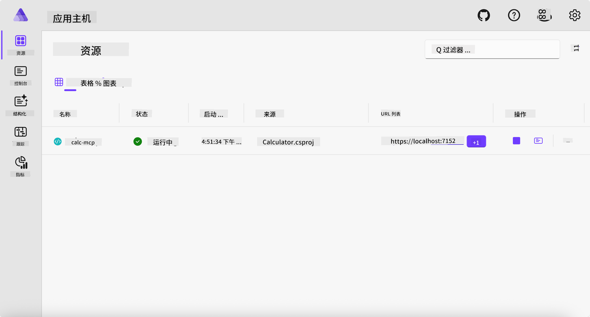
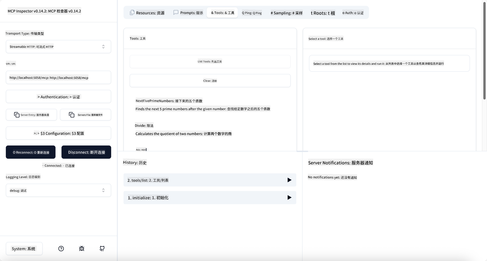

<!--
CO_OP_TRANSLATOR_METADATA:
{
  "original_hash": "0bc7bd48f55f1565f1d95ccb2c16f728",
  "translation_date": "2025-07-13T23:04:15+00:00",
  "source_file": "04-PracticalImplementation/samples/csharp/README.md",
  "language_code": "zh"
}
-->
# 示例

前面的例子展示了如何使用本地的 .NET 项目和 `stdio` 类型，以及如何在容器中本地运行服务器。这在很多情况下都是一个不错的解决方案。不过，有时让服务器远程运行，比如在云环境中，会更有用。这时就用到了 `http` 类型。

看看 `04-PracticalImplementation` 文件夹中的解决方案，可能看起来比之前复杂得多。但实际上并非如此。如果仔细查看项目 `src/Calculator`，你会发现它和之前的代码大致相同。唯一的区别是我们使用了不同的库 `ModelContextProtocol.AspNetCore` 来处理 HTTP 请求。并且我们将方法 `IsPrime` 改成了私有方法，仅仅是为了展示代码中也可以有私有方法。其余代码和之前一样。

其他项目来自 [.NET Aspire](https://learn.microsoft.com/dotnet/aspire/get-started/aspire-overview)。在解决方案中加入 .NET Aspire 可以提升开发和测试时的体验，并有助于可观测性。虽然运行服务器不强制要求，但在解决方案中包含它是个好习惯。

## 本地启动服务器

1. 在 VS Code（安装了 C# DevKit 扩展）中，导航到 `04-PracticalImplementation/samples/csharp` 目录。
1. 执行以下命令启动服务器：

   ```bash
    dotnet watch run --project ./src/AppHost
   ```

1. 当浏览器打开 .NET Aspire 仪表盘时，注意 `http` URL，应该类似于 `http://localhost:5058/`。

   

## 使用 MCP Inspector 测试 Streamable HTTP

如果你安装了 Node.js 22.7.5 及以上版本，可以使用 MCP Inspector 测试服务器。

启动服务器后，在终端运行以下命令：

```bash
npx @modelcontextprotocol/inspector http://localhost:5058
```



- 选择 `Streamable HTTP` 作为传输类型。
- 在 Url 字段输入之前记录的服务器地址，并在后面加上 `/mcp`。地址应为 `http`（非 `https`），类似 `http://localhost:5058/mcp`。
- 点击 Connect 按钮。

Inspector 的一个优点是能清晰地展示正在发生的事情。

- 尝试列出可用工具
- 试用其中一些工具，应该和之前一样正常工作。

## 在 VS Code 中使用 GitHub Copilot Chat 测试 MCP 服务器

要在 GitHub Copilot Chat 中使用 Streamable HTTP 传输，需要将之前创建的 `calc-mcp` 服务器配置改成如下：

```jsonc
// .vscode/mcp.json
{
  "servers": {
    "calc-mcp": {
      "type": "http",
      "url": "http://localhost:5058/mcp"
    }
  }
}
```

进行一些测试：

- 询问“6780 之后的 3 个质数”。注意 Copilot 会使用新工具 `NextFivePrimeNumbers`，并只返回前三个质数。
- 询问“111 之后的 7 个质数”，看看结果。
- 询问“John 有 24 个棒棒糖，要分给他的 3 个孩子。每个孩子有多少个？”，看看结果。

## 将服务器部署到 Azure

我们把服务器部署到 Azure，让更多人可以使用。

在终端中，导航到 `04-PracticalImplementation/samples/csharp` 文件夹，运行以下命令：

```bash
azd up
```

部署完成后，你应该会看到类似这样的提示：


复制 URL，在 MCP Inspector 和 GitHub Copilot Chat 中使用。

```jsonc
// .vscode/mcp.json
{
  "servers": {
    "calc-mcp": {
      "type": "http",
      "url": "https://calc-mcp.gentleriver-3977fbcf.australiaeast.azurecontainerapps.io/mcp"
    }
  }
}
```

## 接下来做什么？

我们尝试了不同的传输类型和测试工具，也将 MCP 服务器部署到了 Azure。但如果服务器需要访问私有资源呢？比如数据库或私有 API？下一章我们将探讨如何提升服务器的安全性。

**免责声明**：  
本文件使用 AI 翻译服务 [Co-op Translator](https://github.com/Azure/co-op-translator) 进行翻译。虽然我们力求准确，但请注意自动翻译可能包含错误或不准确之处。原始文件的母语版本应被视为权威来源。对于重要信息，建议使用专业人工翻译。对于因使用本翻译而产生的任何误解或误释，我们不承担任何责任。