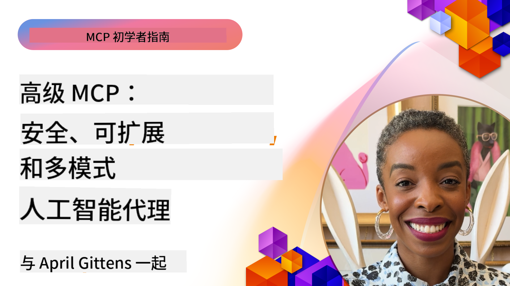

<!--
CO_OP_TRANSLATOR_METADATA:
{
  "original_hash": "d204bc94ea6027d06a703b21b711ca57",
  "translation_date": "2025-07-28T23:21:17+00:00",
  "source_file": "05-AdvancedTopics/README.md",
  "language_code": "zh"
}
-->
# MCP 高级主题

_（点击上方图片观看本课视频）_

本章涵盖了模型上下文协议（MCP）实现中的一系列高级主题，包括多模态集成、可扩展性、安全性最佳实践以及企业集成。这些主题对于构建稳健且可投入生产的 MCP 应用至关重要，以满足现代 AI 系统的需求。

## 概述

本课探讨了模型上下文协议实现中的高级概念，重点关注多模态集成、可扩展性、安全性最佳实践以及企业集成。这些主题对于构建能够应对企业环境复杂需求的生产级 MCP 应用至关重要。

## 学习目标

完成本课后，您将能够：

- 在 MCP 框架中实现多模态功能
- 为高需求场景设计可扩展的 MCP 架构
- 应用符合 MCP 安全原则的安全性最佳实践
- 将 MCP 集成到企业 AI 系统和框架中
- 优化生产环境中的性能和可靠性

## 课程和示例项目

| 链接 | 标题 | 描述 |
|------|-------|-------------|
| [5.1 与 Azure 集成](./mcp-integration/README.md) | 与 Azure 集成 | 学习如何在 Azure 上集成您的 MCP 服务器 |
| [5.2 多模态示例](./mcp-multi-modality/README.md) | MCP 多模态示例 | 提供音频、图像和多模态响应的示例 |
| [5.3 MCP OAuth2 示例](../../../05-AdvancedTopics/mcp-oauth2-demo) | MCP OAuth2 演示 | 一个最小化的 Spring Boot 应用，展示了 MCP 中的 OAuth2，既作为授权服务器又作为资源服务器。演示了安全令牌签发、受保护端点、Azure 容器应用部署以及 API 管理集成。 |
| [5.4 根上下文](./mcp-root-contexts/README.md) | 根上下文 | 了解更多关于根上下文及其实现方法 |
| [5.5 路由](./mcp-routing/README.md) | 路由 | 学习不同类型的路由 |
| [5.6 采样](./mcp-sampling/README.md) | 采样 | 学习如何处理采样 |
| [5.7 扩展](./mcp-scaling/README.md) | 扩展 | 学习关于扩展的内容 |
| [5.8 安全性](./mcp-security/README.md) | 安全性 | 保护您的 MCP 服务器 |
| [5.9 网络搜索示例](./web-search-mcp/README.md) | 网络搜索 MCP | 一个 Python MCP 服务器和客户端，集成了 SerpAPI，用于实时网络、新闻、产品搜索和问答。展示了多工具编排、外部 API 集成以及强大的错误处理。 |
| [5.10 实时流处理](./mcp-realtimestreaming/README.md) | 流处理 | 在当今数据驱动的世界中，实时数据流处理已成为必需，企业和应用需要即时获取信息以做出及时决策。 |
| [5.11 实时网络搜索](./mcp-realtimesearch/README.md) | 网络搜索 | MCP 如何通过提供跨 AI 模型、搜索引擎和应用的标准化上下文管理方法，变革实时网络搜索。 |
| [5.12 Model Context Protocol 服务器的 Entra ID 身份验证](./mcp-security-entra/README.md) | Entra ID 身份验证 | Microsoft Entra ID 提供了一个强大的基于云的身份和访问管理解决方案，确保只有授权用户和应用能够与您的 MCP 服务器交互。 |
| [5.13 Azure AI Foundry 代理集成](./mcp-foundry-agent-integration/README.md) | Azure AI Foundry 集成 | 学习如何将模型上下文协议服务器与 Azure AI Foundry 代理集成，实现强大的工具编排和企业 AI 功能，并支持标准化的外部数据源连接。 |
| [5.14 上下文工程](./mcp-contextengineering/README.md) | 上下文工程 | 探讨 MCP 服务器上下文工程技术的未来机会，包括上下文优化、动态上下文管理以及在 MCP 框架中有效提示工程的策略。 |

## 附加参考

有关 MCP 高级主题的最新信息，请参考：
- [MCP 文档](https://modelcontextprotocol.io/)
- [MCP 规范](https://spec.modelcontextprotocol.io/)
- [GitHub 仓库](https://github.com/modelcontextprotocol)

## 关键要点

- 多模态 MCP 实现扩展了 AI 的能力，不仅限于文本处理
- 可扩展性对于企业部署至关重要，可通过水平和垂直扩展来实现
- 全面的安全措施保护数据并确保适当的访问控制
- 与 Azure OpenAI 和 Microsoft AI Foundry 等平台的企业集成增强了 MCP 的功能
- 高级 MCP 实现受益于优化的架构和精心的资源管理

## 练习

为特定用例设计一个企业级 MCP 实现：

1. 确定用例的多模态需求
2. 列出保护敏感数据所需的安全控制
3. 设计一个可处理不同负载的可扩展架构
4. 规划与企业 AI 系统的集成点
5. 记录潜在的性能瓶颈及其缓解策略

## 附加资源

- [Azure OpenAI 文档](https://learn.microsoft.com/en-us/azure/ai-services/openai/)
- [Microsoft AI Foundry 文档](https://learn.microsoft.com/en-us/ai-services/)

---

## 下一步

- [5.1 MCP 集成](./mcp-integration/README.md)

**免责声明**：  
本文档使用AI翻译服务[Co-op Translator](https://github.com/Azure/co-op-translator)进行翻译。尽管我们努力确保翻译的准确性，但请注意，自动翻译可能包含错误或不准确之处。原始语言的文档应被视为权威来源。对于关键信息，建议使用专业人工翻译。我们对因使用此翻译而产生的任何误解或误读不承担责任。