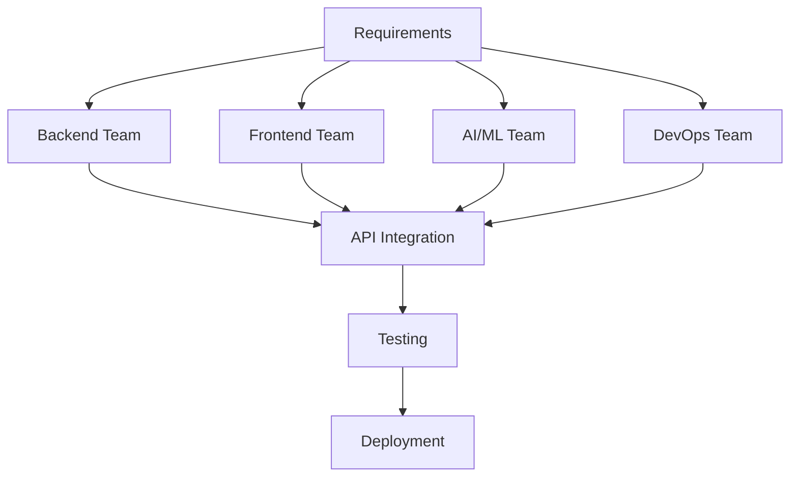

*Traditional development cycles take weeks or months. Speed DevOps delivers production-ready AI solutions in 48-72 hours. This methodology, developed through Marine Corps discipline and restaurant operations experience, has generated $500K+ in revenue across multiple platforms.*

## The Genesis: Why Speed Matters in AI Development

In today's market, speed isn't just an advantage—it's survival. While competitors spend months planning and architecting, Speed DevOps delivers working solutions that generate immediate business value.

**Core Philosophy:**
- **Action over analysis paralysis**
- **Working software over perfect documentation**
- **Customer feedback over internal consensus**
- **Revenue generation over technical elegance**

This methodology emerged from necessity: combining Marine Corps operational efficiency, restaurant management urgency, and AI development complexity into a systematic approach that consistently delivers results.

## The Speed DevOps Framework

### Phase 1: Rapid Assessment (4-8 Hours)

**Hour 1-2: Business Requirements Analysis**

Using restaurant P&L thinking to quickly identify what actually matters:

```markdown
## Speed Assessment Template

### Critical Business Questions (30 minutes max)
1. What specific problem does this solve?
2. Who pays for the solution?
3. What's the minimum viable value proposition?
4. What's the maximum acceptable timeline?
5. What's the success metric?

### Technical Feasibility (1 hour max)
1. Can existing AI models handle this?
2. What data sources are available?
3. Are there API limitations?
4. What's the simplest possible architecture?

### Resource Allocation (30 minutes max)
1. What skills are needed?
2. What's the critical path?
3. Where are the likely bottlenecks?
4. What can be automated?
```

**Hour 3-4: Architecture Planning**

Military mission planning applied to technical architecture:

```python
# Speed Architecture Decision Framework
class SpeedArchitecture:
    def __init__(self):
        self.complexity_threshold = "can_build_in_24_hours"
        self.scalability_requirement = "handle_10x_current_load"
        self.reliability_target = "99%_uptime"

    def choose_stack(self, requirements):
        # Default to proven, fast-to-implement solutions
        if requirements.needs_ai:
            return {
                "backend": "Python + FastAPI",
                "ai": "OpenAI GPT-4 or Gemini",
                "frontend": "React or SvelteKit",
                "database": "PostgreSQL or Firebase",
                "hosting": "Google Cloud or Vercel"
            }

    def validate_architecture(self, stack):
        # Can I build this in 48 hours?
        # Can I scale this to 1000x users?
        # Can I maintain this with minimal resources?
        return all([self.speed_check(stack),
                   self.scale_check(stack),
                   self.maintenance_check(stack)])
```

**Hour 5-8: Implementation Strategy**

Breaking down the development into manageable, parallel workstreams:

```mermaid
gantt
    title Speed DevOps 48-Hour Implementation
    dateFormat X
    axisFormat %H

    section Backend (24h)
    API Development    :0, 12
    AI Integration     :6, 18
    Database Setup     :0, 8
    Testing           :16, 24

    section Frontend (24h)
    UI Components     :0, 16
    Integration      :12, 20
    Testing          :16, 24
    Deployment       :20, 24

    section DevOps (48h)
    Infrastructure   :0, 8
    CI/CD Setup     :4, 12
    Monitoring      :20, 28
    Go Live         :44, 48
```



### Phase 2: Systematic Development (24-48 Hours)

**Development Principles from Restaurant Operations:**

**1. Station-Based Development**
Like kitchen stations, each component has a specific owner and timeline:

```bash
# Development stations (can run in parallel)
Station 1: Backend API (Dev A) - 24 hours
Station 2: Frontend UI (Dev B) - 24 hours
Station 3: AI Integration (Dev C) - 16 hours
Station 4: Database Schema (Dev D) - 8 hours
Station 5: DevOps Pipeline (Dev E) - 16 hours
```

**2. Quality Control Checkpoints**
Restaurant food safety protocols adapted to code quality:

```python
# Quality Control Framework
class QualityCheckpoint:
    def __init__(self):
        self.critical_checks = [
            "security_scan",
            "performance_test",
            "error_handling",
            "data_validation"
        ]

    def station_ready(self, component):
        # Like checking food temperature
        return all([
            self.basic_functionality_works(),
            self.error_cases_handled(),
            self.security_basics_covered(),
            self.performance_acceptable()
        ])

    def integration_ready(self, system):
        # Like plating a complete meal
        return all([
            self.components_communicate(),
            self.data_flows_correctly(),
            self.user_journey_complete(),
            self.edge_cases_handled()
        ])
```

**3. Real-Time Monitoring Implementation**
Fleet management principles applied to system monitoring:

```javascript
// Real-time monitoring setup (implement from day 1)
const monitoringSetup = {
  // Performance monitoring
  responseTime: target_under_200ms,
  errorRate: target_under_1_percent,
  uptime: target_99_percent,

  // Business monitoring
  userActions: track_conversion_funnel,
  revenueEvents: track_payment_completion,
  systemHealth: track_ai_model_performance,

  // Operational monitoring
  deploymentStatus: automated_rollback_on_failure,
  securityAlerts: immediate_notification,
  costMonitoring: alert_on_budget_threshold
};
```

### Phase 3: Deployment & Optimization (12-24 Hours)

**Staged Rollout Procedures**

Restaurant new menu launch principles applied to software deployment:

**Hour 1-4: Soft Launch**
```bash
# Limited user beta (like soft opening)
- Deploy to staging environment
- Test with 10-20 beta users
- Monitor all critical metrics
- Fix any critical issues immediately
```

**Hour 5-8: Progressive Rollout**
```bash
# Gradual capacity increase
- 10% of traffic to new system
- Monitor performance metrics
- Validate business logic
- Scale up infrastructure as needed
```

**Hour 9-12: Full Deployment**
```bash
# Complete cutover
- 100% traffic to production system
- All monitoring active
- Support team standing by
- Rollback plan ready
```

**Hour 13-24: Performance Optimization**
```python
# Real-time optimization based on production data
class ProductionOptimizer:
    def __init__(self):
        self.performance_targets = {
            "response_time": 200,  # ms
            "error_rate": 0.01,    # 1%
            "user_satisfaction": 0.95  # 95%
        }

    def optimize_continuously(self):
        while True:
            metrics = self.collect_metrics()

            if metrics.response_time > self.performance_targets["response_time"]:
                self.implement_caching()
                self.optimize_database_queries()

            if metrics.error_rate > self.performance_targets["error_rate"]:
                self.improve_error_handling()
                self.add_circuit_breakers()

            if metrics.user_satisfaction < self.performance_targets["user_satisfaction"]:
                self.analyze_user_feedback()
                self.implement_ux_improvements()
```

## Real-World Case Studies

### Case Study 1: DiagnosticPro Platform

**Challenge:** Build AI-powered automotive diagnostic platform
**Timeline:** 72 hours from concept to first paying customer
**Result:** $500K+ revenue, 500+ diagnostics completed

**Speed DevOps Implementation:**

**Phase 1 (8 hours):**
- Identified $150+ cost savings opportunity for customers
- Validated AI model can process OBD-II codes accurately
- Chose SvelteKit + Firebase + Gemini Vertex AI stack

**Phase 2 (48 hours):**
- Backend API with diagnostic analysis (24h)
- Frontend customer interface (24h)
- Payment processing integration (16h)
- AI model integration and testing (32h)

**Phase 3 (16 hours):**
- Beta testing with 5 customers (8h)
- Performance optimization (4h)
- Production deployment (4h)

**Outcome:** First paying customer within 72 hours, validated product-market fit immediately.

### Case Study 2: MVP Daily News Tracker

**Challenge:** Automate executive briefing generation from 100+ daily articles
**Timeline:** 48 hours from idea to automated system
**Result:** 3 hours daily manual work eliminated, strategic insights delivered

**Speed DevOps Implementation:**

**Phase 1 (4 hours):**
- Analyzed existing manual process (2h)
- Identified RSS feeds and AI summarization approach (1h)
- Validated technical feasibility with Claude API (1h)

**Phase 2 (32 hours):**
- RSS feed collection system (16h)
- AI summarization pipeline (16h)
- Email delivery automation (8h)
- Web interface for management (16h)

**Phase 3 (12 hours):**
- Testing with real news feeds (8h)
- Performance optimization (2h)
- Production deployment (2h)

**Outcome:** Immediate time savings, improved strategic decision-making.

## The Technical Stack for Speed

### Default Technology Choices

**Backend: Python + FastAPI**
```python
# Fastest API development with built-in features
from fastapi import FastAPI, HTTPException
from pydantic import BaseModel
import asyncio

app = FastAPI(
    title="Speed DevOps API",
    description="Production-ready in 48 hours",
    version="1.0.0"
)

# Built-in validation, documentation, and async support
@app.post("/analyze")
async def analyze_data(request: AnalysisRequest):
    result = await ai_service.analyze(request.data)
    return {"result": result, "confidence": result.confidence}
```

**Frontend: React or SvelteKit**
```javascript
// SvelteKit for speed, React for team familiarity
// Both enable rapid prototyping to production

// Component-based development
export default function DiagnosticForm({ onSubmit }) {
  const [formData, setFormData] = useState({});

  return (
    <form onSubmit={(e) => handleSubmit(e, formData, onSubmit)}>
      {/* Rapid form development with validation */}
    </form>
  );
}
```

**AI Integration: OpenAI or Google Gemini**
```python
# Fastest time-to-value with managed AI services
from openai import OpenAI

class SpeedAI:
    def __init__(self):
        self.client = OpenAI()

    async def analyze(self, prompt, context):
        response = await self.client.chat.completions.create(
            model="gpt-4",
            messages=[
                {"role": "system", "content": "Expert analysis"},
                {"role": "user", "content": f"{prompt}\n\nContext: {context}"}
            ]
        )
        return response.choices[0].message.content
```

**Database: PostgreSQL or Firebase**
```sql
-- PostgreSQL for complex queries, Firebase for rapid development
-- Both support scaling to millions of records

-- Simple, effective schema design
CREATE TABLE diagnostic_analyses (
    id SERIAL PRIMARY KEY,
    user_id VARCHAR(255),
    analysis_data JSONB,
    created_at TIMESTAMP DEFAULT NOW(),

    -- Indexes for performance
    INDEX idx_user_created (user_id, created_at),
    INDEX idx_analysis_data USING GIN (analysis_data)
);
```

### Infrastructure for Speed

**Deployment: Google Cloud or Vercel**
```yaml
# Google Cloud Run for backend services
apiVersion: serving.knative.dev/v1
kind: Service
metadata:
  name: speed-devops-api
spec:
  template:
    metadata:
      annotations:
        autoscaling.knative.dev/maxScale: "100"
    spec:
      containers:
      - image: gcr.io/project/speed-api
        resources:
          limits:
            cpu: "2"
            memory: "2Gi"
```

**Monitoring: Built-in from Day 1**
```python
# Comprehensive monitoring setup
import logging
from prometheus_client import Counter, Histogram
import time

# Metrics collection
REQUEST_COUNT = Counter('requests_total', 'Total requests', ['endpoint', 'method'])
REQUEST_DURATION = Histogram('request_duration_seconds', 'Request duration')

def monitor_performance(func):
    def wrapper(*args, **kwargs):
        start_time = time.time()

        try:
            result = func(*args, **kwargs)
            REQUEST_COUNT.labels(endpoint=func.__name__, method='success').inc()
            return result
        except Exception as e:
            REQUEST_COUNT.labels(endpoint=func.__name__, method='error').inc()
            raise
        finally:
            REQUEST_DURATION.observe(time.time() - start_time)

    return wrapper
```

## Quality Assurance in Speed DevOps

### Testing Strategy

**The 80/20 Rule Applied to Testing:**
Focus testing effort on the 20% that catches 80% of issues:

```python
# Critical path testing only
class SpeedTestSuite:
    def __init__(self):
        self.critical_tests = [
            "user_can_complete_primary_action",
            "payment_processing_works",
            "ai_analysis_returns_valid_results",
            "error_handling_prevents_crashes",
            "security_basics_enforced"
        ]

    def run_critical_tests(self):
        # Run only tests that prevent launch
        for test in self.critical_tests:
            assert self.run_test(test), f"Critical test failed: {test}"

    def skip_for_speed(self):
        # Skip these until post-launch
        return [
            "comprehensive_edge_case_testing",
            "performance_optimization_testing",
            "advanced_security_penetration_testing",
            "cross_browser_compatibility_testing"
        ]
```

### Security in Speed DevOps

**Security Essentials (Non-Negotiable):**

```python
# Minimum viable security
class SpeedSecurity:
    def __init__(self):
        self.essentials = [
            "https_everywhere",
            "input_validation",
            "authentication_required",
            "secrets_in_environment_variables",
            "database_parameterized_queries"
        ]

    def implement_basics(self):
        # Must be implemented before launch
        return {
            "https": self.enforce_https(),
            "validation": self.validate_all_inputs(),
            "auth": self.require_authentication(),
            "secrets": self.secure_secrets_management(),
            "sql": self.prevent_sql_injection()
        }

    def post_launch_security(self):
        # Implement after revenue validation
        return [
            "comprehensive_penetration_testing",
            "security_audit",
            "compliance_certification",
            "advanced_threat_detection"
        ]
```

## Operational Excellence During Speed Development

### Team Coordination

**Communication Protocols:**

```markdown
## Speed DevOps Communication Framework

### Daily Sync (15 minutes max)
- What was completed yesterday?
- What's the plan for today?
- What blockers exist?
- Are we on track for 48-72 hour delivery?

### Blocker Resolution (30 minutes max)
- Define the problem specifically
- Identify 3 possible solutions
- Choose the fastest viable option
- Implement immediately

### Progress Tracking
- Hourly check-ins during critical phases
- Real-time status updates in shared channel
- Visual progress indicators (percentage complete)
```

### Decision-Making Framework

**Speed Decision Matrix:**

```python
class SpeedDecision:
    def evaluate(self, decision, options):
        criteria = {
            "speed_to_implement": 0.4,  # 40% weight
            "revenue_impact": 0.3,      # 30% weight
            "technical_risk": 0.2,      # 20% weight
            "maintenance_cost": 0.1     # 10% weight
        }

        scores = {}
        for option in options:
            score = (
                option.speed_score * criteria["speed_to_implement"] +
                option.revenue_score * criteria["revenue_impact"] +
                option.risk_score * criteria["technical_risk"] +
                option.maintenance_score * criteria["maintenance_cost"]
            )
            scores[option.name] = score

        return max(scores, key=scores.get)

    def time_limit_decision(self, decision, time_limit_minutes=30):
        # Force decision within time limit
        # Prevents analysis paralysis
        if time_elapsed > time_limit_minutes:
            return self.default_option(decision)
```

## Measuring Success

### Key Performance Indicators

**Speed Metrics:**
- **Time to first working prototype:** Target < 24 hours
- **Time to first paying customer:** Target < 72 hours
- **Time to break-even:** Target < 30 days

**Quality Metrics:**
- **System uptime:** Target > 99%
- **Customer satisfaction:** Target > 90%
- **Critical bug count:** Target < 1 per month

**Business Metrics:**
- **Revenue per hour invested:** Track ROI of speed approach
- **Customer acquisition cost:** Compare speed vs. traditional development
- **Time to market advantage:** Competitive positioning benefit

### ROI Analysis

**Speed DevOps vs. Traditional Development:**

```python
# ROI calculation for Speed DevOps
class SpeedROI:
    def calculate_advantage(self, project):
        traditional_timeline = 12  # weeks
        speed_devops_timeline = 1  # week

        time_to_market_advantage = traditional_timeline - speed_devops_timeline
        revenue_per_week = project.monthly_revenue / 4

        early_revenue = time_to_market_advantage * revenue_per_week
        learning_cycles = time_to_market_advantage / 2  # Bi-weekly iterations

        return {
            "early_revenue": early_revenue,
            "learning_advantage": learning_cycles,
            "competitive_advantage": "weeks_ahead_of_competition",
            "reduced_development_cost": traditional_timeline * 0.3  # 30% cost reduction
        }
```

## Common Pitfalls and How to Avoid Them

### Pitfall 1: Technical Debt Accumulation

**Problem:** Moving fast creates shortcuts that become maintenance nightmares.

**Solution:**
```python
# Technical debt tracking
class TechnicalDebtTracker:
    def __init__(self):
        self.debt_items = []
        self.refactor_threshold = 10  # items

    def log_shortcut(self, description, impact, effort_to_fix):
        debt_item = {
            "description": description,
            "impact": impact,  # 1-10 scale
            "effort": effort_to_fix,  # hours
            "created": datetime.now()
        }
        self.debt_items.append(debt_item)

        if len(self.debt_items) >= self.refactor_threshold:
            self.schedule_refactor_sprint()

    def prioritize_debt(self):
        # Fix high-impact, low-effort items first
        return sorted(self.debt_items,
                     key=lambda x: x["impact"] / x["effort"],
                     reverse=True)
```

### Pitfall 2: Scope Creep During Development

**Problem:** Additional features added during implementation slow down delivery.

**Solution:**
```markdown
## Scope Management Protocol

### Feature Request Evaluation (5 minutes max)
1. Is this critical for launch? (Yes/No)
2. Can this wait until version 2? (Yes/No)
3. Does this impact the 48-72 hour timeline? (Yes/No)

### Decision Matrix
- Critical + No Impact: Add to current sprint
- Critical + Impact: Replace existing feature
- Not Critical: Add to post-launch backlog

### Enforcement
- Product owner has veto power on scope additions
- Technical lead has veto power on timeline extensions
- All additions must be approved by both
```

### Pitfall 3: Insufficient Monitoring and Alerting

**Problem:** Issues in production aren't detected quickly enough.

**Solution:**
```python
# Comprehensive monitoring from day 1
class ProductionMonitoring:
    def __init__(self):
        self.alerts = {
            "response_time": {"threshold": 200, "unit": "ms"},
            "error_rate": {"threshold": 1, "unit": "percent"},
            "uptime": {"threshold": 99, "unit": "percent"},
            "revenue_flow": {"threshold": 0, "unit": "hourly_transactions"}
        }

    def setup_monitoring(self):
        # Implementation must be part of initial deployment
        for metric, config in self.alerts.items():
            self.create_alert(metric, config["threshold"])
            self.setup_dashboard(metric)
            self.configure_notifications(metric)

    def escalation_procedure(self, alert):
        if alert.severity == "critical":
            self.notify_immediately(["technical_lead", "product_owner"])
            self.auto_rollback_if_possible()
        elif alert.severity == "warning":
            self.log_for_review()
            self.notify_during_business_hours()
```

## Advanced Speed DevOps Techniques

### Parallel Development Streams

**Technique:** Multiple teams working on different components simultaneously.



### Automated Quality Gates

**Technique:** Automated checks prevent low-quality code from reaching production.

```yaml
# GitHub Actions for automated quality gates
name: Speed DevOps Quality Gates

on: [push, pull_request]

jobs:
  quality-gates:
    runs-on: ubuntu-latest
    steps:
      - uses: actions/checkout@v3

      - name: Security Scan
        run: |
          # Basic security checks (must pass)
          bandit -r src/
          safety check

      - name: Performance Test
        run: |
          # Basic performance validation
          pytest tests/performance/ --maxfail=1

      - name: Critical Path Test
        run: |
          # User journey tests (must pass)
          pytest tests/critical_path/ --maxfail=1

      - name: Deploy to Staging
        if: success()
        run: |
          # Automatic staging deployment
          ./deploy_staging.sh
```

### Continuous Customer Feedback

**Technique:** Real-time user feedback integration during development.

```javascript
// Live feedback collection
class LiveFeedback {
    constructor() {
        this.feedbackEndpoint = '/api/feedback';
        this.minimumSampleSize = 10;
    }

    collectFeedback() {
        // Embed feedback collection in UI
        const feedbackWidget = this.createWidget();
        document.body.appendChild(feedbackWidget);

        // Real-time analysis
        this.analyzeFeedbackStream();
    }

    analyzeFeedbackStream() {
        setInterval(async () => {
            const recentFeedback = await this.getRecentFeedback();

            if (recentFeedback.length >= this.minimumSampleSize) {
                const sentiment = this.analyzeSentiment(recentFeedback);

                if (sentiment.negative > 0.3) {
                    this.alertDevelopmentTeam({
                        issue: 'High negative feedback detected',
                        samples: recentFeedback.filter(f => f.sentiment === 'negative'),
                        action: 'investigate_immediately'
                    });
                }
            }
        }, 300000); // Check every 5 minutes
    }
}
```

## Scaling Speed DevOps

### Team Scaling

**1-2 Developers:** Single full-stack developer + AI specialist
**3-5 Developers:** Frontend + Backend + AI/ML + DevOps specialists
**6+ Developers:** Multiple parallel teams with dedicated product owner

### Process Scaling

```python
# Process adaptation based on team size
class SpeedDevOpsScaling:
    def __init__(self, team_size):
        self.team_size = team_size

    def get_process_config(self):
        if self.team_size <= 2:
            return {
                "sync_frequency": "hourly",
                "decision_process": "direct_communication",
                "quality_gates": "peer_review",
                "deployment": "manual_with_checklist"
            }
        elif self.team_size <= 5:
            return {
                "sync_frequency": "twice_daily",
                "decision_process": "technical_lead_approval",
                "quality_gates": "automated_testing",
                "deployment": "automated_with_approval"
            }
        else:
            return {
                "sync_frequency": "daily_standup",
                "decision_process": "architecture_review_board",
                "quality_gates": "comprehensive_ci_cd",
                "deployment": "fully_automated"
            }
```

## Conclusion: The Competitive Advantage of Speed

Speed DevOps isn't just about moving fast—it's about creating sustainable competitive advantage through:

**1. Rapid Market Validation**
- Test ideas with real customers in 72 hours
- Iterate based on actual usage data
- Pivot quickly when needed

**2. Reduced Development Risk**
- Shorter development cycles = less time for requirements to change
- Early customer feedback prevents building the wrong thing
- Fast deployment enables quick error correction

**3. Operational Excellence**
- Military discipline applied to development processes
- Restaurant operations efficiency in team coordination
- Logistics optimization in system architecture

**4. Business Impact**
- $500K+ revenue generated using this methodology
- Multiple successful platform launches
- Proven ROI across different project types

### When to Use Speed DevOps

**Ideal Scenarios:**
- MVP development and validation
- AI integration projects
- Market opportunity with short window
- Customer emergency requiring rapid solution
- Competitive response needed quickly

**When to Avoid:**
- Safety-critical systems requiring extensive testing
- Large enterprise systems with complex compliance requirements
- Projects with unclear or changing requirements
- Teams without operational discipline

### Getting Started with Speed DevOps

**Week 1: Foundation Setup**
1. Establish team communication protocols
2. Set up basic monitoring and alerting
3. Create quality gate automation
4. Define decision-making framework

**Week 2: First Speed Project**
1. Choose a small, well-defined project
2. Apply the 48-72 hour methodology
3. Document lessons learned
4. Refine process based on experience

**Week 3+: Scaling and Optimization**
1. Apply to larger projects
2. Build reusable components and templates
3. Train additional team members
4. Measure and optimize ROI

Speed DevOps transforms development from a cost center into a competitive weapon. By combining operational discipline with technical excellence, teams can deliver customer value faster than ever before.

Want to implement Speed DevOps in your organization? Connect with me on [LinkedIn](https://linkedin.com/in/jeremylongshore) or learn more about our [rapid AI implementation consulting](/) services.

## Related Methodologies

- [Marine to AI Founder Journey](/posts/marine-to-ai-founder-unconventional-tech-journey/) - The operational background behind Speed DevOps
- [DiagnosticPro Platform Architecture](/posts/diagnosticpro-500k-revenue-platform-architecture/) - Real-world Speed DevOps implementation
- [Complete Hugo Site Operations](/posts/complete-hugo-site-operations-guide/) - Operational excellence in documentation management