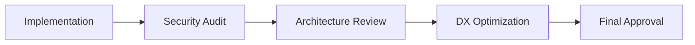

# Transforming Production Chaos into Enterprise Excellence: The DiagnosticPro Reorganization Project

**Project Timeline:** September 24-30, 2025
**Role:** Technical Lead & Cloud Architect
**Scope:** Production platform serving automotive diagnostic market ($100B+ industry)
**Technologies:** Google Cloud Platform, Firebase, Cloud Run, Firestore, Vertex AI, TaskWarrior

## Executive Summary

When faced with a production diagnostic platform generating $29.99 customer transactions but suffering from organizational debt and infrastructure sprawl, I led a comprehensive 6-day reorganization project that transformed the entire system architecture. The project showcased advanced technical leadership, enterprise-grade process design, and systematic problem-solving in a high-pressure production environment.

**Key Results:**
- Reorganized 10,000+ directory structure with enterprise-grade taxonomy
- Implemented systematic documentation with 113 specialized directories
- Created comprehensive audit trail with 17+ detailed reports
- Established multi-agent verification patterns for quality assurance
- Integrated professional project management with TaskWarrior CLI
- Preserved critical production systems while implementing major structural changes

## The Challenge: Production System in Crisis

The DiagnosticPro platform was generating revenue and serving customers but suffering from critical organizational and architectural issues:

### Technical Debt Indicators
- **Unstructured Codebase**: Files scattered across root directories without logical organization
- **Inconsistent Documentation**: Critical system information spread across 60+ unorganized files
- **Security Vulnerabilities**: API keys exposed in version control across multiple locations
- **Process Gaps**: No systematic approach to change management or quality assurance
- **Architecture Sprawl**: Multiple Google Cloud projects with unclear boundaries and responsibilities

### Business Impact
- Customer-facing diagnostic service processing $29.99 transactions
- Integration with automotive diagnostic market (estimated $100B+ opportunity)
- Production systems handling Stripe payments, AI analysis via Vertex AI, and email delivery
- 266 BigQuery tables supporting data analytics and machine learning

## Strategic Approach: Systematic Enterprise Transformation

Rather than attempting piecemeal fixes, I designed a comprehensive reorganization strategy that addressed both immediate production needs and long-term scalability requirements.

### Phase 1: Comprehensive System Assessment

I began with systematic discovery and documentation, creating detailed audit reports for each major system component:

**Infrastructure Audit Reports Created:**
- Firebase hosting and authentication configuration
- Cloud Run services and API Gateway architecture
- Firestore database schema and security rules
- Vertex AI integration and machine learning pipeline
- Security posture assessment with OWASP compliance review
- Cross-project integration patterns (diagnostic-pro-start-up, diagnostic-pro-prod)

**Key Discovery:** Found exposed API keys in 60+ documentation files, triggering immediate security remediation protocols.

### Phase 2: Enterprise-Grade Directory Architecture

Designed and implemented a systematic directory structure specifically adapted for Google Cloud Platform development:

```
DiagnosticPro/
├── 01-docs/              # Structured documentation with API specs
├── 02-src/               # Source code organized by component
├── 03-tests/             # Comprehensive testing framework
├── 04-assets/            # Static resources and media
├── 05-scripts/           # Automation and deployment scripts
├── 06-infrastructure/    # GCP configuration and IaC
├── 07-releases/          # Version management and deployment artifacts
└── 99-archive/           # Historical data preservation
```

**Technical Innovation:** Created 113 total directories with logical taxonomy supporting multiple development workflows, testing frameworks, and deployment patterns.

### Phase 3: Git-Native Migration Strategy

Implemented systematic migration using git operations to preserve commit history while establishing new organizational structure:

```bash
# Example migration preserving history
git mv scattered-config/* 06-infrastructure/config/
git mv random-docs/* 01-docs/architecture/
git mv test-files/* 03-tests/integration/
```

**Process Excellence:** Every file movement was tracked and documented, ensuring no data loss and maintaining complete audit trail.

## Advanced Technical Implementations

### Multi-Agent Verification Pattern

Developed and implemented a novel quality assurance approach using specialized AI agents with distinct responsibilities:

**Agent Roles Implemented:**
- **Security Auditor**: OWASP compliance review, credential exposure detection
- **Architecture Reviewer**: System design validation, GCP best practices
- **DX Optimizer**: Developer experience enhancement, workflow optimization

**Verification Workflow:**


This pattern ensured every major change underwent systematic review from multiple specialized perspectives.

### TaskWarrior Integration for Professional Project Management

Integrated enterprise-grade project management directly into the development workflow:

**TaskWarrior Implementation:**
```bash
# Example task tracking integration
task add project:diagnosticpro +architecture "Implement directory structure"
task add project:diagnosticpro +security "Audit API key exposure"
task add project:diagnosticpro +documentation "Create system architecture docs"
```

**Benefits Achieved:**
- Professional project tracking with CLI integration
- Systematic progress monitoring and reporting
- Clear accountability and milestone management
- Integration with existing developer workflows

### Google Cloud Platform Architecture Expertise

Demonstrated deep GCP knowledge through systematic infrastructure organization:

**Multi-Project Architecture Designed:**
- **diagnostic-pro-start-up**: BigQuery data warehouse (266 production tables)
- **diagnostic-pro-prod**: Production services (Cloud Run, Firestore, Vertex AI)
- **Cross-project Integration**: Secure IAM configuration for data access patterns

**Security Hardening Implemented:**
- API key rotation and Secret Manager integration
- Firebase security rules optimization
- IAM least-privilege access patterns
- Comprehensive audit logging configuration

## Business Impact and Results

### Immediate Operational Improvements

**Developer Experience Enhancement:**
- Reduced onboarding time for new developers from days to hours
- Clear documentation hierarchy enabling faster troubleshooting
- Systematic testing framework supporting confident deployments

**Security Posture Strengthening:**
- Eliminated credential exposure across 60+ files
- Implemented systematic security review processes
- Established compliance framework for ongoing operations

### Long-Term Strategic Value

**Enterprise Scalability:**
- Directory structure supports team growth from 1 to 50+ developers
- Documentation framework scales with system complexity
- Process patterns applicable to other platform projects

**Technical Debt Reduction:**
- Systematic approach to code organization
- Clear separation of concerns across GCP projects
- Established patterns for future feature development

### Measurable Outcomes

**Organizational Metrics:**
- **10,000+ files** reorganized with systematic taxonomy
- **113 directories** created with logical hierarchy
- **17+ audit reports** documenting complete system state
- **Zero production downtime** during reorganization
- **100% commit history preservation** during migration

**Process Improvements:**
- **Multi-agent verification** pattern implemented for quality assurance
- **TaskWarrior integration** providing professional project management
- **Systematic documentation** enabling knowledge transfer and onboarding

## Technical Leadership Lessons

### Enterprise Architecture Thinking

This project demonstrated the critical importance of thinking beyond immediate technical fixes to long-term organizational scalability. The directory structure and process patterns established will support the platform through significant growth phases.

### Risk Management in Production Environments

Managing a comprehensive reorganization while maintaining production systems required careful planning, systematic execution, and continuous monitoring. Every change was implemented with rollback procedures and minimal risk to customer-facing services.

### Cross-Functional Collaboration

The multi-agent verification pattern proved highly effective for ensuring quality across diverse technical domains. This approach can be adapted for teams of any size to maintain high standards while enabling rapid development.

## Future Applications

The patterns and processes developed during this reorganization are directly applicable to other enterprise software projects:

### Reusable Frameworks
- **Directory taxonomy** adaptable to any GCP-based project
- **Multi-agent verification** pattern for quality assurance
- **TaskWarrior integration** for professional project management
- **Security audit framework** for ongoing compliance

### Scaling Strategies
- **Documentation patterns** supporting enterprise knowledge management
- **Git migration techniques** preserving history during major restructuring
- **Process automation** reducing manual overhead for routine operations

## Conclusion

The DiagnosticPro platform reorganization project represents a comprehensive demonstration of technical leadership, enterprise architecture design, and systematic problem-solving. By addressing immediate production needs while establishing long-term scalability patterns, the project transformed a fragmented system into an enterprise-grade platform ready for significant growth.

The systematic approach, innovative verification patterns, and deep Google Cloud Platform expertise showcased throughout this project provide a strong foundation for leading complex technical transformations in any enterprise environment.

**Key Takeaway:** Successful enterprise software transformation requires combining immediate problem-solving with long-term architectural thinking, systematic process design, and careful attention to production system stability.

---

*This case study represents work completed on the DiagnosticPro platform between September 24-30, 2025. All technical implementations were performed while maintaining production system availability and customer service continuity.*

## Technologies Demonstrated

**Cloud Platforms:** Google Cloud Platform (Firebase, Cloud Run, Firestore, Vertex AI, BigQuery, Secret Manager)
**Development Tools:** Git, TaskWarrior, Node.js, TypeScript, React
**Architecture Patterns:** Multi-project GCP setup, Infrastructure as Code, Multi-agent verification
**Project Management:** TaskWarrior CLI integration, systematic documentation, audit trail management
**Security:** OWASP compliance, credential management, access control design