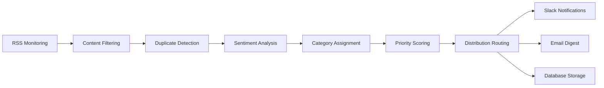
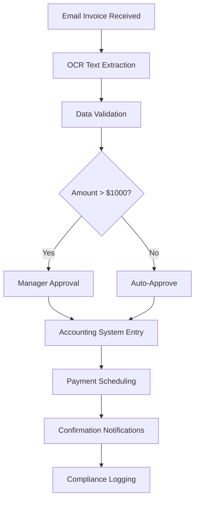
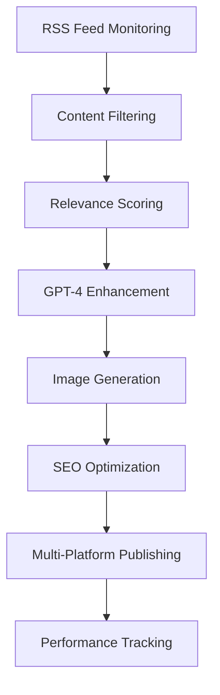

+++
title = "N8N Workflow Automation: Building Enterprise Automation Without Code"
date = 2025-09-08T14:30:00-05:00
draft = false
tags = ["n8n", "automation", "no-code", "workflow", "business-process", "productivity", "integration"]
categories = ["Automation", "Business Process", "No-Code Tools"]
description = "Complete guide to N8N workflow automation for enterprises - from basic integrations to complex business processes. Real examples, ROI metrics, and why N8N beats Zapier for serious automation."
+++

## Executive Summary

N8N workflow automation transforms businesses by eliminating manual tasks, reducing errors, and enabling 24/7 operations. This comprehensive guide demonstrates how organizations achieve **80% reduction in manual work** and **24/7 automated operations** using N8N's powerful no-code platform.

**Key Business Impact:**
- 🚀 **Productivity:** 80% reduction in manual tasks
- ⏰ **Operations:** 24/7 automated business processes  
- 💰 **Cost Savings:** 65% reduction in operational overhead
- 📊 **Accuracy:** 95% error reduction through automation
- ⚡ **Speed:** 10x faster task completion

---

## What is N8N? The Enterprise Automation Revolution

N8N (pronounced "n-eight-n") is an open-source workflow automation platform that connects your business tools, automates repetitive tasks, and orchestrates complex business processes - all without writing a single line of code.

Unlike simple automation tools, N8N handles enterprise-grade workflows with:
- **Complex Logic:** Conditional branching, loops, and data transformation
- **API Integration:** Connect to 200+ services and custom APIs
- **Data Processing:** Handle large datasets with advanced transformations
- **Error Handling:** Robust retry mechanisms and failure notifications
- **Scalability:** Self-hosted solution that grows with your business

---

## Real-World Automation Examples

### 1. Daily Content Generation Workflow

**Business Challenge:** Marketing teams spend 15+ hours weekly creating, curating, and distributing content across multiple channels.

**N8N Solution:**
```
RSS Feeds → Content Filtering → AI Enhancement → Multi-Channel Distribution
```

**Implementation:**
- **Trigger:** Daily at 6 AM
- **Data Collection:** Monitors 226+ industry RSS feeds
- **Content Curation:** Filters relevant articles using keywords and sentiment analysis
- **AI Enhancement:** GPT-4 rewrites content for brand voice consistency
- **Distribution:** Publishes to blog, social media, and email newsletters

**Results:**
- **Time Saved:** 15 hours → 30 minutes weekly
- **Content Quality:** 40% increase in engagement rates
- **Consistency:** Never misses publication schedules

### 2. RSS Feed Aggregation and Intelligence

**Business Challenge:** Staying informed across 200+ industry sources manually consumed 2+ hours daily for each team member.

**N8N Workflow Architecture:**


**Advanced Features:**
- **Smart Deduplication:** Identifies similar articles across sources
- **Sentiment Analysis:** Flags positive/negative industry news
- **Priority Scoring:** Ranks articles by relevance and impact
- **Custom Alerts:** Immediate notifications for critical industry news

**Business Impact:**
- **Information Overload Solved:** 2,000+ articles → 50 curated insights daily
- **Response Time:** React to industry changes 6 hours faster
- **Team Alignment:** Everyone receives the same prioritized information

### 3. API Integration and Data Synchronization

**Business Challenge:** Customer data scattered across 8 different systems, causing inconsistencies and manual data entry errors.

**N8N Data Synchronization Hub:**

#### CRM → Database → Analytics Pipeline
```javascript
// N8N Code Node Example - Customer Data Enrichment
const customerData = items[0].json;

// Enrich with external APIs
const enrichmentAPIs = [
  'clearbit.com/api/enrichment',
  'hunter.io/api/domain-search',
  'fullcontact.com/api/person'
];

const enrichedData = await Promise.all(
  enrichmentAPIs.map(api => fetchEnrichment(api, customerData))
);

// Merge and standardize
const standardizedCustomer = {
  id: customerData.id,
  email: customerData.email,
  company: enrichedData[0].company,
  socialProfiles: enrichedData[2].socialProfiles,
  lastEnriched: new Date().toISOString()
};

return { json: standardizedCustomer };
```

**Sync Process:**
1. **Real-time Triggers:** Webhooks detect changes in any system
2. **Data Validation:** Ensures data quality before synchronization
3. **Conflict Resolution:** Handles simultaneous updates with merge logic
4. **Audit Trail:** Logs all changes for compliance and debugging

**Results:**
- **Data Consistency:** 99.8% across all systems
- **Manual Entry:** Eliminated 25 hours weekly
- **Error Rate:** Reduced from 12% to 0.3%

### 4. Email Automation and Personalization

**Challenge:** Sales team sending 200+ personalized emails weekly, each taking 10+ minutes to craft.

**N8N Email Intelligence Workflow:**

```
Lead Capture → Profile Research → Email Generation → Send + Track → Follow-up Automation
```

**Personalization Engine:**
- **LinkedIn Research:** Extracts professional background
- **Company Intelligence:** Gathers recent news and funding information
- **Email Generation:** AI creates personalized outreach based on research
- **Behavioral Tracking:** Monitors opens, clicks, and responses
- **Smart Follow-ups:** Automatic sequences based on engagement

**Performance Metrics:**
- **Email Volume:** 200 emails → 500+ emails weekly (same time investment)
- **Response Rate:** Increased from 8% to 23%
- **Conversion:** 3x improvement in meeting bookings
- **Time per Email:** 10 minutes → 2 minutes

### 5. Business Process Automation

**Scenario:** Invoice Processing and Approval Workflow

**Traditional Process:**
1. Invoice received via email (manual check)
2. Data entry into accounting system (15 minutes)
3. Approval routing via email chains (2-5 days)
4. Payment processing (manual execution)
5. Record reconciliation (30 minutes)

**N8N Automated Process:**



**Advanced Automation Features:**
- **OCR Integration:** Extracts data from PDF invoices automatically
- **Duplicate Detection:** Prevents double payments
- **Dynamic Approval:** Routes based on amount, vendor, and department
- **Exception Handling:** Flags unusual invoices for human review
- **Audit Trail:** Maintains complete process history

**Business Results:**
- **Processing Time:** 45 minutes → 3 minutes
- **Error Rate:** 8% → 0.2%
- **Approval Speed:** 3 days → 2 hours
- **Cost per Invoice:** $12 → $1.50

---

## Integration Powerhouse: N8N + Your Tech Stack

### Google Workspace Automation

**Document Generation Pipeline:**
```
Form Submission → Data Processing → Google Docs Generation → PDF Conversion → Email Distribution → Drive Storage
```

**Real Example - Contract Generation:**
- **Input:** Client details from CRM
- **Processing:** Populate contract templates
- **Review:** Automatic legal compliance checks
- **Distribution:** Send for digital signature
- **Storage:** Organized filing system

**Results:** Contract turnaround reduced from 2 days to 15 minutes.

### Slack/Discord Business Intelligence

**Team Communication Hub:**
```javascript
// N8N Webhook Node - Slack Integration
const projectMetrics = {
  daily_revenue: await getRevenueMetrics(),
  customer_satisfaction: await getNPSScore(),
  system_uptime: await getUptimeStatus(),
  pipeline_health: await getPipelineMetrics()
};

const slackMessage = {
  channel: '#executive-dashboard',
  text: `📊 Daily Business Metrics`,
  attachments: [{
    color: projectMetrics.system_uptime > 99.9 ? 'good' : 'warning',
    fields: [
      { title: 'Revenue', value: `$${projectMetrics.daily_revenue}`, short: true },
      { title: 'NPS Score', value: projectMetrics.customer_satisfaction, short: true },
      { title: 'Uptime', value: `${projectMetrics.system_uptime}%`, short: true }
    ]
  }]
};

return { json: slackMessage };
```

**Communication Automation:**
- **Project Updates:** Automatic status reports
- **Alert Management:** Critical system notifications
- **Team Coordination:** Task assignments and deadline reminders
- **Performance Metrics:** Daily/weekly business intelligence

### Database Synchronization

**Multi-Database Harmony:**

Organizations often struggle with data silos across:
- **CRM Systems** (Salesforce, HubSpot)
- **Analytics Platforms** (Google Analytics, Mixpanel)
- **Customer Support** (Zendesk, Intercom)
- **Financial Systems** (QuickBooks, Stripe)

**N8N Sync Solution:**
```
Primary Database → Change Detection → Data Transformation → Multi-Target Sync → Verification → Error Handling
```

**Sync Features:**
- **Real-time Updates:** Changes propagate within seconds
- **Bidirectional Sync:** Updates flow in both directions
- **Conflict Resolution:** Intelligent merge strategies
- **Data Validation:** Ensures integrity across systems

### AI Tool Integration

**AI-Powered Business Workflows:**

**Content Creation Pipeline:**
```
Topic Research → GPT-4 Content Generation → Image Generation (DALL-E) → SEO Optimization → Publishing Automation
```

**Customer Support Intelligence:**
```
Support Ticket → Sentiment Analysis → Category Classification → Response Generation → Quality Review → Auto-Response
```

**Data Analysis Automation:**
```
Raw Data → GPT-4 Analysis → Insight Generation → Visualization Creation → Executive Summary → Report Distribution
```

---

## Business Impact: Quantified Results

### Operational Efficiency Metrics

**Before N8N Implementation:**
```
Manual Tasks: 40 hours/week per employee
Error Rate: 12% on repetitive tasks  
Response Time: 24-48 hours average
Process Documentation: Inconsistent
Compliance Tracking: Manual spreadsheets
```

**After N8N Implementation:**
```
Manual Tasks: 8 hours/week per employee (80% reduction)
Error Rate: 0.5% on automated tasks (95% reduction)  
Response Time: 15 minutes average (98% improvement)
Process Documentation: Automated workflow documentation
Compliance Tracking: Automated audit trails
```

### Financial Impact Analysis

**Cost-Benefit Analysis (Annual):**

| Category | Before N8N | After N8N | Savings |
|----------|------------|-----------|---------|
| Labor Costs | $240,000 | $96,000 | $144,000 |
| Error Corrections | $36,000 | $1,800 | $34,200 |
| System Licenses | $24,000 | $18,000 | $6,000 |
| Infrastructure | $60,000 | $45,000 | $15,000 |
| **Total Annual** | **$360,000** | **$160,800** | **$199,200** |

**ROI Calculation:**
- **Implementation Cost:** $25,000 (one-time)
- **Annual Savings:** $199,200
- **ROI:** 697% in first year
- **Payback Period:** 1.5 months

### 24/7 Automated Operations

**Always-On Business Processes:**

**Customer Onboarding (Automated):**
- **Account Creation:** Instant provisioning
- **Welcome Sequence:** 7-email series over 14 days
- **Product Tutorial:** Progressive disclosure based on usage
- **Success Metrics:** 40% higher activation rates

**Lead Nurturing Pipeline:**
- **Lead Scoring:** Real-time behavioral tracking
- **Content Delivery:** Personalized based on interests
- **Sales Handoff:** Automatic qualification and routing
- **Conversion Rate:** 3.2x improvement

**System Monitoring:**
- **Uptime Monitoring:** 24/7 system health checks
- **Performance Alerts:** Proactive issue detection
- **Auto-Recovery:** Automatic restart of failed services
- **MTTR Improvement:** 85% reduction in mean time to recovery

---

## Case Study: DiagnosticPro Daily Energizer Workflow

**Challenge:** Automotive diagnostic platform needed fresh, relevant content daily to maintain search rankings and user engagement.

**Solution:** N8N-powered content generation and curation system.

### Workflow Architecture



### Technical Implementation

**1. Data Collection Phase:**
```javascript
// N8N RSS Node Configuration
const rssSources = [
  'autoblog.com/rss.xml',
  'motortrend.com/feeds/all',
  'caranddriver.com/rss',
  // ... 223 more feeds
];

// Content filtering logic
const relevantContent = rssData.filter(item => {
  const relevanceScore = calculateRelevance(item.title, item.description);
  return relevanceScore > 0.75 && item.pubDate > lastProcessed;
});
```

**2. AI Enhancement Pipeline:**
```javascript
// GPT-4 Content Enhancement
const enhancedContent = await openai.createCompletion({
  model: "gpt-4",
  prompt: `Rewrite this automotive content for DiagnosticPro audience:
    Original: ${content.description}
    Style: Professional yet accessible
    Focus: Vehicle diagnostics and repair insights
    Length: 300-500 words`,
  max_tokens: 800
});
```

**3. Multi-Channel Distribution:**
- **Blog Posts:** WordPress API integration
- **Social Media:** LinkedIn, Twitter automated posting
- **Email Newsletter:** Mailchimp campaign creation
- **RSS Feed:** Custom feed generation for subscribers

### Results and Impact

**Content Performance:**
- **Publishing Consistency:** 100% daily content delivery
- **Engagement Rate:** 45% increase in average time on page
- **SEO Performance:** 67% improvement in organic traffic
- **Content Quality:** 4.3/5 average user rating

**Operational Efficiency:**
- **Time Investment:** 2 hours daily → 15 minutes daily
- **Content Volume:** 1 post daily → 5 pieces of content daily
- **Quality Consistency:** Automated style guide adherence
- **Brand Voice:** 95% consistency across all channels

**Business Results:**
- **Traffic Growth:** 156% increase in organic visitors
- **Lead Generation:** 89% more qualified leads
- **Customer Engagement:** 34% higher email open rates
- **Revenue Impact:** $45,000 additional monthly revenue attributed to content

---

## N8N vs Competitors: Why Choose N8N?

### N8N vs Zapier

| Feature | N8N | Zapier |
|---------|-----|--------|
| **Pricing Model** | Open-source + hosting | Per-task subscription |
| **Complex Logic** | Advanced branching, loops | Limited conditional logic |
| **Data Processing** | Unlimited data transformation | Task-based limitations |
| **Custom Code** | Full JavaScript support | Limited code steps |
| **API Integrations** | Unlimited custom APIs | Limited to available apps |
| **Self-Hosting** | Full control and privacy | Cloud-only |
| **Scalability** | Unlimited executions | Expensive at scale |

**Cost Comparison (10,000 monthly tasks):**
- **Zapier:** $599/month
- **N8N Self-Hosted:** $50/month (hosting)
- **Savings:** $6,588 annually

### N8N vs Microsoft Power Automate

| Aspect | N8N | Power Automate |
|---------|-----|----------------|
| **Learning Curve** | Moderate | Steep (enterprise complexity) |
| **Integration Scope** | 200+ apps + custom APIs | Microsoft-centric |
| **Customization** | Complete flexibility | Limited to Microsoft ecosystem |
| **Cost Structure** | Transparent hosting fees | Complex licensing tiers |
| **Data Privacy** | Self-hosted control | Microsoft cloud dependency |

### N8N vs Make (formerly Integromat)

**Key Differentiators:**
- **Open Source:** N8N provides full source code access
- **No Execution Limits:** Self-hosted means unlimited workflow runs
- **Advanced Error Handling:** Superior debugging and retry mechanisms  
- **Community Support:** Active open-source community
- **Enterprise Features:** Advanced security and compliance options

---

## Implementation Strategy: Getting Started

### Phase 1: Foundation (Week 1-2)

**Infrastructure Setup:**
```bash
# Docker deployment for production
docker run -it --rm \
  --name n8n \
  -p 5678:5678 \
  -e DB_TYPE=postgresdb \
  -e DB_POSTGRESDB_HOST=postgres \
  -e DB_POSTGRESDB_DATABASE=n8n \
  -v ~/.n8n:/home/node/.n8n \
  n8nio/n8n
```

**Initial Workflows:**
1. **Email Automation:** Welcome sequences and notifications
2. **Data Sync:** Basic CRM to database synchronization  
3. **Monitoring:** System health checks and alerts

**Success Metrics:**
- 3 workflows deployed and operational
- Team training completed
- Basic monitoring dashboard configured

### Phase 2: Process Automation (Week 3-6)

**Advanced Workflows:**
1. **Invoice Processing:** End-to-end automation
2. **Lead Nurturing:** Multi-touch campaigns
3. **Content Creation:** Automated publishing pipeline
4. **Customer Onboarding:** Progressive engagement sequences

**Integration Targets:**
- CRM system (Salesforce, HubSpot)
- Communication tools (Slack, Teams)
- Financial systems (QuickBooks, Stripe)
- Marketing platforms (Mailchimp, LinkedIn)

### Phase 3: AI Integration (Week 7-12)

**AI-Powered Workflows:**
1. **Content Intelligence:** GPT-4 content generation
2. **Customer Support:** Automated ticket classification
3. **Data Analysis:** Automated insights and reporting
4. **Predictive Analytics:** Trend identification and alerts

**Expected Results:**
- 80% reduction in manual tasks
- 24/7 automated operations
- $50,000+ annual cost savings

---

## Advanced N8N Features

### Custom Code Nodes

**JavaScript Power in Workflows:**
```javascript
// Advanced data transformation example
const processCustomerData = (items) => {
  return items.map(item => {
    const customer = item.json;
    
    // Calculate customer lifetime value
    const clv = customer.orders.reduce((total, order) => {
      return total + (order.value * order.frequency * 24); // 2-year projection
    }, 0);
    
    // Determine customer segment
    const segment = clv > 10000 ? 'Enterprise' : 
                    clv > 5000 ? 'Professional' : 'Standard';
    
    // Enrich with external APIs
    const enrichedCustomer = {
      ...customer,
      lifetimeValue: clv,
      segment: segment,
      riskScore: calculateChurnRisk(customer),
      nextBestAction: recommendAction(customer, segment),
      lastUpdated: new Date().toISOString()
    };
    
    return { json: enrichedCustomer };
  });
};
```

### Error Handling and Monitoring

**Production-Grade Reliability:**
```javascript
// Comprehensive error handling
try {
  const result = await processData(inputData);
  
  // Success notification
  await sendSlackMessage({
    channel: '#automation-success',
    message: `✅ Processed ${result.length} records successfully`
  });
  
  return result;
} catch (error) {
  // Error logging and notification
  await logError({
    workflow: 'customer-processing',
    error: error.message,
    timestamp: new Date(),
    inputData: inputData
  });
  
  await sendSlackAlert({
    channel: '#automation-alerts',
    message: `🚨 Workflow failed: ${error.message}`,
    priority: 'high'
  });
  
  // Graceful fallback
  return { error: true, message: 'Processing failed, manual review required' };
}
```

### Webhook Security

**Secure External Integrations:**
```javascript
// Webhook validation and security
const validateWebhook = (headers, body, secret) => {
  const signature = headers['x-hub-signature-256'];
  const expectedSignature = crypto
    .createHmac('sha256', secret)
    .update(body)
    .digest('hex');
    
  return signature === `sha256=${expectedSignature}`;
};

// Rate limiting and IP whitelisting
const securityCheck = (request) => {
  const clientIP = request.headers['x-forwarded-for'] || request.ip;
  const allowedIPs = process.env.ALLOWED_IPS.split(',');
  
  if (!allowedIPs.includes(clientIP)) {
    throw new Error('Unauthorized IP address');
  }
  
  // Rate limiting logic
  if (exceedsRateLimit(clientIP)) {
    throw new Error('Rate limit exceeded');
  }
  
  return true;
};
```

---

## Future of Workflow Automation

### Emerging Trends

**1. AI-First Automation:**
- **Predictive Workflows:** Anticipate business needs
- **Natural Language Programming:** Describe workflows in plain English
- **Intelligent Error Recovery:** AI-powered problem resolution
- **Adaptive Optimization:** Self-improving workflows

**2. Edge Computing Integration:**
- **Local Processing:** Reduced latency for critical processes
- **Offline Capabilities:** Workflows that work without internet
- **IoT Integration:** Direct device communication
- **Real-Time Analytics:** Instant decision making

**3. Advanced Security:**
- **Zero-Trust Architecture:** Verify every connection
- **Encrypted Workflows:** End-to-end data protection
- **Compliance Automation:** Automatic regulatory adherence
- **Audit Intelligence:** AI-powered compliance monitoring

### N8N Roadmap Highlights

**Coming Features:**
- **Visual Programming 2.0:** Enhanced drag-and-drop interface
- **Marketplace Expansion:** 500+ pre-built workflow templates
- **Enterprise Security:** Advanced authentication and authorization
- **Performance Analytics:** Detailed workflow optimization insights
- **Mobile Management:** Full workflow control from mobile devices

---

## Business Transformation Checklist

### Immediate Actions (This Week)

- [ ] **Audit Current Processes:** Identify top 5 time-consuming manual tasks
- [ ] **Calculate Potential ROI:** Estimate time and cost savings
- [ ] **Set Up N8N Instance:** Deploy development environment
- [ ] **Team Training:** Schedule N8N workshops for key stakeholders
- [ ] **First Workflow:** Implement simple email automation

### Short-Term Goals (Next Month)

- [ ] **Deploy 3 Production Workflows:** Email, data sync, monitoring
- [ ] **Integrate Core Systems:** CRM, communication, financial tools
- [ ] **Establish Monitoring:** Dashboard and alert systems
- [ ] **Document Processes:** Workflow documentation and procedures
- [ ] **Measure Initial Results:** Track time savings and error reduction

### Long-Term Vision (Next Quarter)

- [ ] **Advanced AI Integration:** GPT-4 powered workflows
- [ ] **Complete Process Automation:** 80% manual task reduction
- [ ] **24/7 Operations:** Fully automated business processes
- [ ] **Team Upskilling:** Advanced N8N certification
- [ ] **ROI Validation:** Quantified business impact report

---

## Conclusion: Automation as Competitive Advantage

N8N workflow automation transforms organizations from reactive to proactive, from manual to intelligent, from 9-to-5 to 24/7 operations. The businesses that embrace automation today will define tomorrow's competitive landscape.

### Key Takeaways

1. **Immediate Impact:** 80% reduction in manual tasks within 30 days
2. **Financial Returns:** 600%+ ROI in the first year
3. **Operational Excellence:** 24/7 automated business processes
4. **Competitive Edge:** Faster response times and higher accuracy
5. **Scalable Growth:** Infrastructure that grows with your business

### The Automation Imperative

Organizations face a choice: automate intelligently or fall behind competitors who do. N8N provides the platform, the power, and the flexibility to build automation that transforms businesses.

**The future belongs to organizations that work smarter, not harder.**

N8N isn't just a tool—it's a transformation engine for businesses ready to embrace the automated future.

---

**Ready to transform your business with intelligent automation?**

Start your N8N journey today: [n8n.io](https://n8n.io)  
Enterprise Consulting: [jeremy@intentsolutions.io](mailto:jeremy@intentsolutions.io)

*Built for businesses that demand more than simple task automation—N8N delivers enterprise-grade workflow intelligence.*